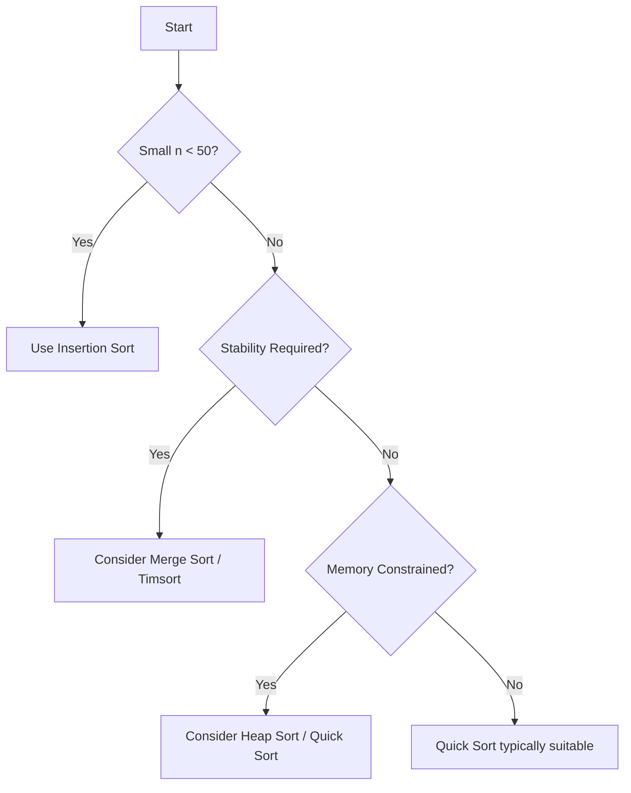

# Understanding Sorting Algorithm Tradeoffs: A Practical Perspective

## 1. Introduction

The study of sorting algorithms constitutes a fundamental component of computer science education. While modern software development frameworks and standard libraries abstract away the low-level implementation details of sorting routines, a comprehensive understanding of the underlying algorithms remains essential for engineering professionals. This document addresses the practical significance of sorting algorithm knowledge, emphasizing the critical tradeoffs that inform algorithm selection rather than the rote memorization of implementation specifics.

## 2. The Practical Importance of Sorting Algorithm Knowledge

### 2.1 Rationale for Studying Sorting Algorithms

In professional practice, engineers rarely encounter situations requiring the implementation of a sorting algorithm from first principles. Frameworks and language standard libraries provide robust, optimized sorting functions that suffice for the majority of common use cases. Nevertheless, two compelling reasons justify the investment of time in studying sorting algorithms:

1. **Technical Interview Preparedness:** Sorting-related questions are prevalent in technical interviews for software engineering positions. Candidates are frequently expected to articulate the characteristics, complexities, and appropriate use cases of various sorting algorithms.

2. **Enhanced Engineering Acumen:** A deep comprehension of algorithmic tradeoffs cultivates better design decisions when faced with performance-critical systems. Recognizing how input characteristics influence algorithm behavior enables engineers to select or configure sorting mechanisms optimally.

### 2.2 The Emphasis on Tradeoffs Over Implementation

The primary learning objective of this section is not the ability to reproduce sorting algorithm code verbatim. Rather, the focus lies in developing the analytical skills necessary to evaluate and compare algorithms based on their operational tradeoffs. This approach aligns with the broader methodology applied in data structure selection, where no single option universally outperforms all others.

## 3. Algorithmic Tradeoffs in Sorting

Sorting algorithms exhibit a spectrum of performance characteristics that vary according to the nature of the input data. Understanding these variations is crucial for making informed choices in software design.

### 3.1 Time Complexity Considerations

The asymptotic time complexity of sorting algorithms ranges from **O(n²)** for elementary algorithms (Bubble Sort, Selection Sort, Insertion Sort) to **O(n log n)** for more sophisticated approaches (Merge Sort, Heap Sort, Quick Sort). The notation **O(n log n)** represents a significant efficiency threshold; comparison-based sorting algorithms cannot achieve better average-case asymptotic complexity than this bound.

### 3.2 Space Complexity and Memory Usage

Algorithms differ substantially in their auxiliary memory requirements:

- **In-Place Algorithms:** Operate with **O(1)** additional space (e.g., Bubble Sort, Insertion Sort, Heap Sort). These are advantageous in memory-constrained environments.
- **Out-of-Place Algorithms:** Require **O(n)** auxiliary space (e.g., Merge Sort). The additional memory cost may be justified by performance gains or stability guarantees.

### 3.3 Input Data Sensitivity

The performance of certain sorting algorithms is highly dependent on the initial ordering of the input data. This adaptability is a critical factor in practical deployments.

| Input Data Scenario | Favorable Algorithms | Unfavorable Algorithms |
|---------------------|----------------------|------------------------|
| **Random Order** | Quick Sort (average case), Merge Sort | Bubble Sort, Selection Sort |
| **Nearly Sorted** | Insertion Sort (approaches O(n)), Timsort | Quick Sort (may degrade with poor pivot) |
| **Reversed Order** | Merge Sort, Heap Sort (consistent O(n log n)) | Quick Sort (worst-case O(n²) with naive pivot) |

### 3.4 Stability as a Selection Criterion

A sorting algorithm is termed **stable** if it preserves the relative order of elements with equal keys. Stability becomes essential when sorting composite data structures by multiple attributes in succession (e.g., sorting a list of employees first by department and then by name). Algorithms such as Merge Sort and Insertion Sort are inherently stable, whereas Quick Sort and Heap Sort are not.

## 4. Visualizing Sorting Algorithm Performance

Interactive visualization tools provide an intuitive means of observing the behavioral differences among sorting algorithms under varying input conditions. One such tool, referenced in the accompanying materials, permits side-by-side comparison of algorithm execution on distinct data profiles.

### 4.1 Observations Across Data Sets

The visualization demonstrates that no single algorithm dominates across all input types:

- **Random Data Set:** Advanced algorithms like Quick Sort and Merge Sort complete execution rapidly, while elementary algorithms exhibit noticeable delays as input size increases.

- **Nearly Sorted Data Set:** Insertion Sort excels, often outperforming more complex algorithms due to its adaptive nature and minimal overhead when encountering already ordered elements.

- **Reversed Data Set:** Algorithms with consistent worst-case guarantees (e.g., Merge Sort, Heap Sort) maintain predictable performance, whereas Quick Sort may deteriorate significantly if pivot selection is not optimized.

These empirical observations reinforce the principle that algorithm selection must be context-dependent, guided by a thorough understanding of both the data characteristics and the operational constraints of the target environment.

### 4.2 Decision Framework for Algorithm Selection

The following simplified decision tree illustrates a logical approach to selecting an appropriate sorting algorithm based on common criteria.



## 5. Code Illustration: Sorting with Awareness in Java

While the internal sorting algorithm remains opaque to the application developer, knowledge of sorting principles informs the proper use of comparator functions and the interpretation of performance behavior.

```java
import java.util.Arrays;
import java.util.Comparator;

public class SortingAwarenessExample {
    public static void main(String[] args) {
        Integer[] numbers = {2, 65, 34, 2, 1, 7, 8};
        
        // Default sorting: uses tuned QuickSort (Dual-Pivot) in modern JVMs
        Arrays.sort(numbers);
        System.out.println("Default sorted: " + Arrays.toString(numbers));
        
        // Custom comparator for descending order
        Arrays.sort(numbers, Comparator.reverseOrder());
        System.out.println("Descending order: " + Arrays.toString(numbers));
        
        // Sorting strings with locale-aware comparison
        String[] spanishWords = {"único", "árbol", "cosas", "fútbol"};
        Arrays.sort(spanishWords, (a, b) -> a.compareTo(b));
        System.out.println("Default string sort: " + Arrays.toString(spanishWords));
        
        // Correct locale-sensitive sorting
        Arrays.sort(spanishWords, (a, b) -> 
            a.toLowerCase().compareTo(b.toLowerCase()));
        // Note: For proper locale handling, use Collator.getInstance()
        System.out.println("Case-insensitive sort: " + Arrays.toString(spanishWords));
    }
}
```

The code above demonstrates that while the `Arrays.sort()` method encapsulates a highly optimized sorting algorithm (typically a variant of Quick Sort or Timsort in modern Java Virtual Machines), the developer retains control over the comparison semantics. Understanding that the underlying algorithm is comparison-based and operates with **O(n log n)** complexity allows the developer to anticipate performance characteristics when applying custom comparators to large datasets.

## 6. Conclusion

The study of sorting algorithms extends beyond the mere ability to reproduce code. It cultivates a mindset oriented toward evaluating tradeoffs in time complexity, space complexity, stability, and adaptability to input conditions. Such analytical capacity is indispensable for making sound engineering decisions in performance-sensitive applications and for navigating technical interviews with confidence. By internalizing the tradeoffs inherent in sorting algorithms, the practitioner is equipped to select the most appropriate tool for each unique computational task.