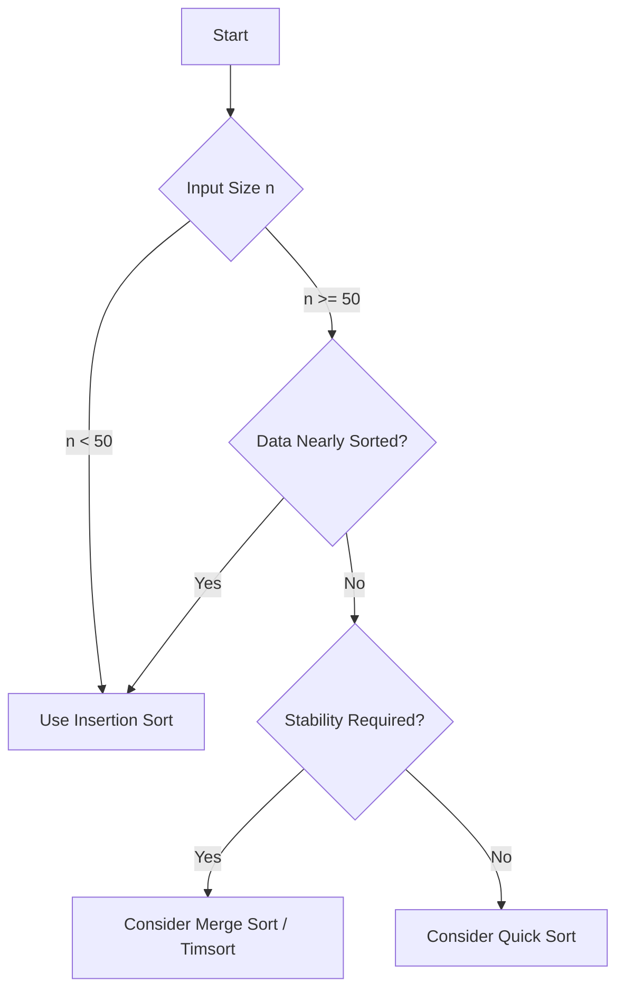

# Insertion Sort: Solution, Analysis, and Practical Applications

## 1. Introduction

This document presents the solution for the Insertion Sort algorithm implementation exercise and provides a detailed analysis of its performance characteristics. Insertion Sort distinguishes itself among elementary sorting algorithms through its adaptive nature, achieving linear time complexity on nearly sorted or small datasets. This property renders it valuable in both theoretical study and practical software engineering contexts, particularly as a subroutine within hybrid sorting algorithms.

## 2. Algorithmic Approach and Implementation

Insertion Sort constructs the sorted array incrementally by maintaining a sorted prefix and inserting each subsequent element into its correct position. The insertion process involves shifting larger elements one position to the right to create a vacancy, then placing the new element into that vacancy.

### 2.1 Step-by-Step Logic

1. Consider the first element as a sorted subarray of size one.
2. For each element from index `i = 1` to `n - 1`:
   - Store the current element as `key`.
   - Initialize `j = i - 1` (last index of the sorted prefix).
   - While `j >= 0` and `array[j] > key`, shift `array[j]` to `array[j + 1]` and decrement `j`.
   - Place `key` at `array[j + 1]`.
3. After processing all elements, the array is fully sorted.

### 2.2 Alternative Implementation Using Array Methods

The following JavaScript implementation employs built-in array methods (`unshift` and `splice`) to achieve the insertion logic. This approach mirrors the manual shifting process while leveraging higher-level abstractions.

```javascript
/**
 * Sorts an array of numbers in ascending order using Insertion Sort.
 * This implementation uses array methods for insertion.
 *
 * @param {number[]} array - The array to be sorted.
 * @returns {number[]} The sorted array (modified in place).
 */
function insertionSort(array) {
    const n = array.length;

    for (let i = 1; i < n; i++) {
        const current = array[i];

        // If current element is smaller than the first element of the sorted portion
        if (current < array[0]) {
            // Remove the element at index i and insert it at the beginning
            array.splice(i, 1);
            array.unshift(current);
        } else {
            // Find the correct position within the sorted portion
            for (let j = 0; j < i; j++) {
                if (current >= array[j] && current < array[j + 1]) {
                    // Remove the element and insert it at the correct position
                    array.splice(i, 1);
                    array.splice(j + 1, 0, current);
                    break;
                }
            }
        }
    }

    return array;
}

// Example usage
const numbers = [99, 44, 6, 2, 1, 5, 63, 87, 283, 4, 0];
console.log('Original array:', numbers);
insertionSort(numbers);
console.log('Sorted array:  ', numbers);
```

**Expected Output:**
```
Original array: [99, 44, 6, 2, 1, 5, 63, 87, 283, 4, 0]
Sorted array:   [0, 1, 2, 4, 5, 6, 44, 63, 87, 99, 283]
```

### 2.3 Standard In-Place Implementation (Without Array Methods)

For comparison, the standard in-place implementation that manually shifts elements is provided below. This version avoids the overhead of array method calls and is more commonly used in practice.

```javascript
function insertionSortStandard(array) {
    const n = array.length;
    for (let i = 1; i < n; i++) {
        let key = array[i];
        let j = i - 1;
        while (j >= 0 && array[j] > key) {
            array[j + 1] = array[j];
            j--;
        }
        array[j + 1] = key;
    }
    return array;
}
```

## 3. Complexity Analysis

The time complexity of Insertion Sort is input-dependent, exhibiting a wide range from linear to quadratic behavior.

### 3.1 Time Complexity Cases

| Case                     | Description                                                                 | Time Complexity |
|--------------------------|-----------------------------------------------------------------------------|-----------------|
| **Best Case**            | Array is already sorted. The inner loop condition fails immediately.         | O(n)            |
| **Average Case**         | Elements are in random order. Each insertion requires scanning half of the sorted prefix on average. | O(n²)           |
| **Worst Case**           | Array is sorted in reverse order. Each new element is smaller than all previous, requiring maximum shifts. | O(n²)           |

**Derivation of Average Case:**  
For the `i`-th element (1-indexed), the expected number of comparisons is `i/2`. Summing over `i = 1` to `n-1` yields approximately `n²/4` comparisons, which is **O(n²)**.

**Derivation of Worst Case:**  
In reverse order, the `i`-th element requires `i` comparisons. The total comparisons are `1 + 2 + ... + (n-1) = n(n-1)/2`, confirming **O(n²)**.

### 3.2 Space Complexity

Insertion Sort operates **in place**, requiring only a constant amount of auxiliary memory for the `key` variable and loop counters. Therefore, the space complexity is **O(1)**.

### 3.3 Summary Table

| Metric           | Best Case | Average Case | Worst Case |
|------------------|-----------|--------------|------------|
| Time Complexity  | O(n)      | O(n²)        | O(n²)      |
| Space Complexity | O(1)      | O(1)         | O(1)       |
| Stable           | Yes       | Yes          | Yes        |
| Adaptive         | Yes       | Yes          | Yes        |

## 4. Practical Performance and Use Cases

The adaptive nature of Insertion Sort makes it particularly efficient under specific conditions, which is critical in both theoretical analysis and practical engineering decisions.

### 4.1 Performance on Nearly Sorted Data

When the input array is already mostly ordered, Insertion Sort significantly outperforms other elementary algorithms and can rival more advanced sorts. Empirical observations from sorting visualizations demonstrate this advantage.

**Observation from Algorithm Visualization:**

| Algorithm      | Performance on Nearly Sorted Data |
|----------------|-----------------------------------|
| Insertion Sort | Completes fastest; minimal shifts |
| Bubble Sort    | Requires multiple passes           |
| Selection Sort | Always performs full comparisons   |
| Merge Sort     | Overhead of recursion and merging  |
| Quick Sort     | May degrade without careful pivot  |

Insertion Sort's linear best-case behavior is a direct consequence of the inner loop terminating after a single comparison for each element.

### 4.2 Performance on Small Datasets

For small input sizes (typically `n < 50`), the constant factors of asymptotically efficient algorithms (e.g., Quick Sort, Merge Sort) often outweigh their theoretical advantages. Insertion Sort's low overhead—simple loops, no recursion, and in-place operation—yields superior wall-clock performance on tiny arrays. This property is exploited in production-grade sorting implementations.

### 4.3 Hybrid Sorting Algorithms

Many modern programming language standard libraries employ hybrid sorting algorithms that switch to Insertion Sort for small subarrays. Notable examples include:

- **Timsort (Python, Java):** A hybrid of Merge Sort and Insertion Sort. Timsort partitions the array into runs of already sorted elements and uses Insertion Sort to extend short runs.
- **Introsort (C++ STL):** Begins with Quick Sort, switches to Heap Sort if recursion depth exceeds a threshold, and uses Insertion Sort for small partitions.

### 4.4 Decision Framework for Algorithm Selection

The following decision tree incorporates Insertion Sort's strengths:



## 5. Comparison with Other Elementary Sorting Algorithms

The following table summarizes key differences among elementary sorting algorithms.

| Feature                | Insertion Sort                | Bubble Sort (Optimized)        | Selection Sort                |
|------------------------|-------------------------------|--------------------------------|-------------------------------|
| Best Case Time         | O(n)                          | O(n)                           | O(n²)                         |
| Average/Worst Time     | O(n²)                         | O(n²)                          | O(n²)                         |
| Space Complexity       | O(1)                          | O(1)                           | O(1)                          |
| Stability              | Stable                        | Stable                         | Unstable                      |
| Adaptivity             | Highly adaptive               | Moderately adaptive            | Non-adaptive                  |
| Swaps / Writes         | O(n²) shifts (writes)         | O(n²) swaps                    | O(n) swaps                    |
| Online Capability      | Yes (insert as data arrives)  | No                             | No                            |

## 6. Additional Verification Tests

To ensure robustness, the implementation should be validated with diverse input scenarios.

```javascript
// Test case 1: Nearly sorted array
const nearlySorted = [2, 1, 3, 4, 5, 6, 7, 8, 9];
insertionSortStandard(nearlySorted);
console.log('Nearly sorted:', nearlySorted); // Expected: [1, 2, 3, 4, 5, 6, 7, 8, 9]

// Test case 2: Array with negative numbers
const negatives = [-3, -1, -7, 0, 2, -5];
insertionSortStandard(negatives);
console.log('With negatives:', negatives); // Expected: [-7, -5, -3, -1, 0, 2]

// Test case 3: Array of strings (lexicographic order)
const words = ['banana', 'apple', 'cherry', 'date'];
insertionSortStandard(words);
console.log('Words sorted:', words); // Expected: ['apple', 'banana', 'cherry', 'date']
```

## 7. Conclusion

Insertion Sort is a foundational sorting algorithm that bridges the gap between elementary methods and more advanced techniques. Its linear best-case performance and low overhead make it the algorithm of choice for small datasets and nearly sorted inputs. Understanding Insertion Sort is essential for appreciating the design of hybrid sorting algorithms and for making informed decisions in performance-critical software development. The implementation and analysis provided in this document equip the learner with both practical coding skills and a nuanced understanding of algorithmic tradeoffs.