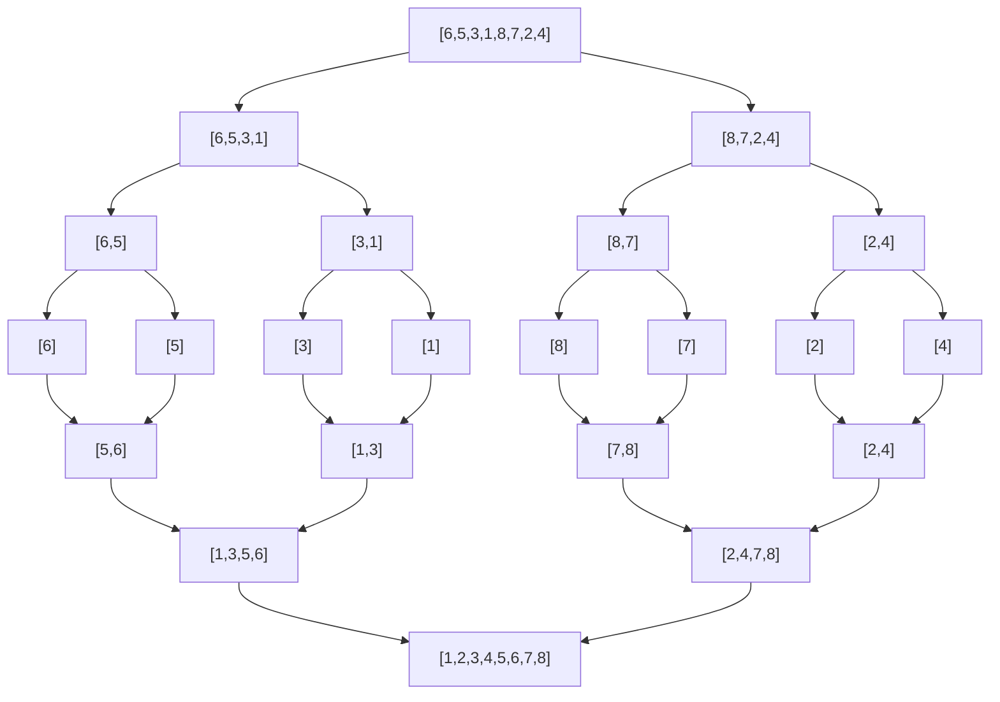

# Merge Sort: Divide and Conquer Sorting Algorithm

## 1. Introduction

Merge Sort is a highly efficient, comparison-based sorting algorithm that employs the divide-and-conquer paradigm. Unlike the elementary sorting algorithms—Bubble Sort, Selection Sort, and Insertion Sort—which exhibit quadratic time complexity, Merge Sort achieves a time complexity of **O(n log n)** in all cases. This asymptotic improvement renders Merge Sort suitable for sorting large datasets and forms the algorithmic foundation for many production-grade sorting implementations. The algorithm is also **stable**, preserving the relative order of equal elements, and operates reliably regardless of the initial arrangement of input data.

## 2. Algorithmic Paradigm: Divide and Conquer

The divide-and-conquer strategy decomposes a problem into smaller, self-similar subproblems, solves each subproblem recursively, and then combines the solutions to produce the final result. Merge Sort exemplifies this approach through three distinct phases:

1. **Divide:** Split the input array into two halves of approximately equal size.
2. **Conquer:** Recursively sort each half using Merge Sort.
3. **Combine:** Merge the two sorted halves into a single sorted array.

This recursive decomposition continues until the base case—a subarray of length zero or one—is reached, at which point the subarray is trivially sorted.

## 3. Algorithm Description

### 3.1 Step-by-Step Procedure

Given an unsorted array of `n` elements, Merge Sort proceeds as follows:

1. If the array contains one or zero elements, it is already sorted. Return the array.
2. Compute the middle index: `mid = floor(n / 2)`.
3. Recursively sort the left subarray `array[0 ... mid - 1]`.
4. Recursively sort the right subarray `array[mid ... n - 1]`.
5. Merge the two sorted subarrays into a single sorted array by comparing the smallest remaining elements from each and appending the smaller to the result.

### 3.2 Visual Representation

Consider the array `[6, 5, 3, 1, 8, 7, 2, 4]`. The following diagram illustrates the recursive division and subsequent merging process.



**Explanation of Merging Steps:**

- **Base Cases:** Single-element arrays `[6]`, `[5]`, `[3]`, `[1]`, `[8]`, `[7]`, `[2]`, `[4]` are trivially sorted.
- **First Level Merge:** `[6]` and `[5]` merge to `[5,6]`; `[3]` and `[1]` merge to `[1,3]`; `[8]` and `[7]` merge to `[7,8]`; `[2]` and `[4]` merge to `[2,4]`.
- **Second Level Merge:** `[5,6]` and `[1,3]` merge to `[1,3,5,6]`; `[7,8]` and `[2,4]` merge to `[2,4,7,8]`.
- **Final Merge:** `[1,3,5,6]` and `[2,4,7,8]` merge to produce the fully sorted array `[1,2,3,4,5,6,7,8]`.

### 3.3 Merging Process in Detail

The merge operation is the core of the algorithm. Given two sorted arrays `left` and `right`, a new array `result` is constructed as follows:

1. Initialize pointers `i = 0` (for `left`) and `j = 0` (for `right`).
2. While both `i < left.length` and `j < right.length`:
   - If `left[i] <= right[j]`, append `left[i]` to `result` and increment `i`.
   - Else, append `right[j]` to `result` and increment `j`.
3. After one array is exhausted, append all remaining elements from the other array to `result`.
4. Return `result`.

This linear-time merge process contributes the **O(n)** factor in the overall complexity.

## 4. Implementation in JavaScript

The following JavaScript code provides a complete implementation of the Merge Sort algorithm. The `mergeSort` function recursively divides the array, and the `merge` function combines sorted subarrays.

```javascript
/**
 * Merges two sorted arrays into a single sorted array.
 * @param {number[]} left - The left sorted subarray.
 * @param {number[]} right - The right sorted subarray.
 * @returns {number[]} A new sorted array containing all elements from left and right.
 */
function merge(left, right) {
    const result = [];
    let i = 0; // Pointer for left array
    let j = 0; // Pointer for right array

    // Compare elements from both arrays and append the smaller one
    while (i < left.length && j < right.length) {
        if (left[i] <= right[j]) {
            result.push(left[i]);
            i++;
        } else {
            result.push(right[j]);
            j++;
        }
    }

    // Append any remaining elements from the left array
    while (i < left.length) {
        result.push(left[i]);
        i++;
    }

    // Append any remaining elements from the right array
    while (j < right.length) {
        result.push(right[j]);
        j++;
    }

    return result;
}

/**
 * Sorts an array using the Merge Sort algorithm.
 * @param {number[]} array - The array to be sorted.
 * @returns {number[]} A new sorted array (original array remains unchanged).
 */
function mergeSort(array) {
    // Base case: an array of length 0 or 1 is already sorted
    if (array.length <= 1) {
        return array;
    }

    // Divide: find the middle index and split the array
    const mid = Math.floor(array.length / 2);
    const left = array.slice(0, mid);
    const right = array.slice(mid);

    // Conquer: recursively sort both halves and merge the results
    return merge(mergeSort(left), mergeSort(right));
}

// Example usage
const numbers = [6, 5, 3, 1, 8, 7, 2, 4];
console.log('Original array:', numbers);
const sorted = mergeSort(numbers);
console.log('Sorted array:  ', sorted);
```

**Expected Output:**
```
Original array: [6, 5, 3, 1, 8, 7, 2, 4]
Sorted array:   [1, 2, 3, 4, 5, 6, 7, 8]
```

### 4.1 Code Explanation

- **`merge(left, right)` Function:**  
  - Accepts two sorted arrays and returns a new merged sorted array.  
  - Uses two pointers to traverse the input arrays efficiently, ensuring linear time complexity **O(n)**.  
  - The condition `left[i] <= right[j]` guarantees stability by preserving the order of equal elements from the left array.

- **`mergeSort(array)` Function:**  
  - **Base Case:** An array with zero or one element is trivially sorted and returned as is.  
  - **Divide Step:** `Math.floor(array.length / 2)` calculates the midpoint. `slice()` creates new subarrays without modifying the original.  
  - **Recursive Calls:** `mergeSort(left)` and `mergeSort(right)` sort the halves independently.  
  - **Combine Step:** The `merge` function integrates the sorted halves.

- **Immutability:** This implementation returns a new sorted array, leaving the original array unchanged. While this increases space usage, it aligns with functional programming principles and avoids unintended side effects. An in-place variant of Merge Sort exists but is considerably more complex to implement.

## 5. Complexity Analysis

### 5.1 Time Complexity

Merge Sort exhibits consistent **O(n log n)** time complexity across all input scenarios—best, average, and worst cases.

**Derivation:**

- **Divide Step:** Splitting the array into halves takes **O(1)** time using index calculations. The number of divisions corresponds to the height of the recursion tree, which is **log₂ n**.
- **Merge Step:** At each level of the recursion tree, the merge operation processes all `n` elements exactly once. Therefore, each level contributes **O(n)** work.
- **Total Complexity:** `O(n) × O(log n) = O(n log n)`.

**Comparison with Quadratic Sorts:**

| Algorithm      | Best Case | Average Case | Worst Case |
|----------------|-----------|--------------|------------|
| Bubble Sort    | O(n)      | O(n²)        | O(n²)      |
| Selection Sort | O(n²)     | O(n²)        | O(n²)      |
| Insertion Sort | O(n)      | O(n²)        | O(n²)      |
| **Merge Sort** | O(n log n)| O(n log n)   | O(n log n) |

Merge Sort's consistent performance makes it a reliable choice when the input distribution is unknown or when worst-case guarantees are required.

### 5.2 Space Complexity

Merge Sort requires additional memory proportional to the input size. The auxiliary space complexity is **O(n)**.

**Reasons for O(n) Space:**

- The `merge` function creates a new `result` array of size equal to the combined length of `left` and `right`.
- The recursive calls generate new subarrays via `slice()`, which allocates memory.
- At the deepest level of recursion, the total auxiliary space across all active merge operations is **O(n)**.

This space overhead is the primary drawback of Merge Sort compared to in-place algorithms like Quick Sort or Heap Sort. However, the stability and guaranteed performance often justify the extra memory in environments where space is not severely constrained.

### 5.3 Summary Table

| Metric           | Complexity          |
|------------------|---------------------|
| Time (Best)      | O(n log n)          |
| Time (Average)   | O(n log n)          |
| Time (Worst)     | O(n log n)          |
| Space (Auxiliary)| O(n)                |
| Stable           | Yes                 |
| In-Place         | No (typical)        |
| Adaptive         | No                  |

## 6. Characteristics and Practical Considerations

### 6.1 Stability

Merge Sort is **stable** because the `merge` function uses the condition `left[i] <= right[j]`. When two elements are equal, the element from the left subarray (which originally appeared earlier) is placed into the result first, preserving the relative order.

Stability is essential when sorting objects by multiple keys. For example, sorting a list of employees first by department and then by name within each department.

### 6.2 Non-Adaptivity

Merge Sort does **not** adapt to the initial ordering of the input. Even if the array is already sorted, the algorithm still performs the full sequence of divisions and merges, resulting in **O(n log n)** operations. This predictability can be advantageous in real-time systems where consistent performance is required.

### 6.3 Suitability

Merge Sort is particularly well-suited for:

- **Large Datasets:** The O(n log n) complexity scales efficiently for substantial input sizes.
- **Linked Lists:** Merge Sort can be implemented on linked lists with **O(1)** extra space by adjusting pointers, avoiding the need for random access.
- **External Sorting:** When data exceeds available memory, Merge Sort's divide-and-conquer approach facilitates sorting data stored on disk (external merge sort).
- **Stable Sorting Requirements:** Applications requiring preservation of original order among equivalent keys.

### 6.4 Limitations

- **Memory Overhead:** The O(n) space requirement may be prohibitive in memory-constrained embedded systems.
- **Recursion Depth:** For extremely large arrays, recursion may cause stack overflow. An iterative bottom-up implementation can mitigate this issue.

## 7. Comparison with Other Divide-and-Conquer Sorts

| Feature                | Merge Sort                    | Quick Sort                     |
|------------------------|-------------------------------|--------------------------------|
| Time (Average)         | O(n log n)                    | O(n log n)                     |
| Time (Worst)           | O(n log n)                    | O(n²) (rare with good pivot)   |
| Space Complexity       | O(n)                          | O(log n) (in-place)            |
| Stability              | Stable                        | Unstable (typical)             |
| In-Place               | No (typical)                  | Yes                            |
| Cache Performance      | Good for external sorting     | Excellent for in-memory arrays |

Quick Sort often outperforms Merge Sort in practice due to lower constant factors and better cache locality, but Merge Sort provides a worst-case guarantee that Quick Sort lacks without careful pivot selection.

## 8. Additional Verification Tests

To ensure correctness, the implementation should be validated with diverse inputs.

```javascript
// Test case 1: Array with duplicate values
console.log(mergeSort([4, 2, 4, 1, 3, 2])); // Expected: [1, 2, 2, 3, 4, 4]

// Test case 2: Already sorted array
console.log(mergeSort([1, 2, 3, 4, 5]));    // Expected: [1, 2, 3, 4, 5]

// Test case 3: Reverse sorted array
console.log(mergeSort([5, 4, 3, 2, 1]));    // Expected: [1, 2, 3, 4, 5]

// Test case 4: Empty array
console.log(mergeSort([]));                 // Expected: []

// Test case 5: Single-element array
console.log(mergeSort([42]));               // Expected: [42]

// Test case 6: Array with negative numbers
console.log(mergeSort([-3, -1, -7, 0, 2])); // Expected: [-7, -3, -1, 0, 2]
```

## 9. Conclusion

Merge Sort represents a significant advancement over elementary sorting algorithms, achieving **O(n log n)** time complexity through the systematic application of the divide-and-conquer paradigm. Its stability and consistent performance make it a cornerstone of computer science and a reliable choice for sorting large datasets. While the **O(n)** space requirement and non-adaptive nature present tradeoffs, the algorithm's theoretical elegance and practical utility ensure its enduring relevance in both academic study and industrial applications. Understanding Merge Sort provides a foundation for exploring other divide-and-conquer algorithms and deepens one's appreciation for algorithmic efficiency.