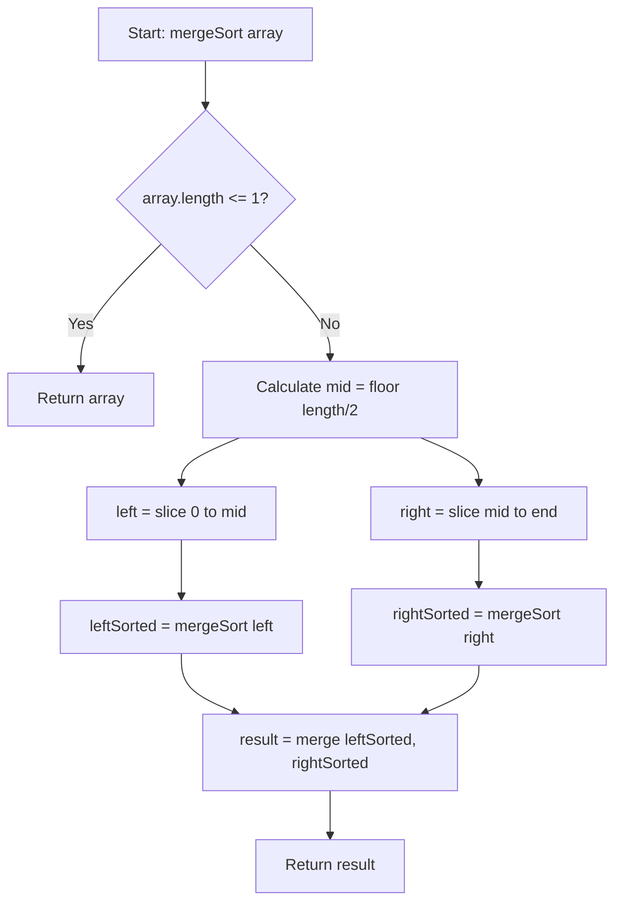

# Exercise: Merge Sort Implementation

## 1. Introduction

This document presents a structured exercise for implementing the Merge Sort algorithm based on the concepts introduced in the preceding discussion. Merge Sort is a highly efficient, comparison-based sorting algorithm that employs the divide-and-conquer paradigm. It achieves a time complexity of **O(n log n)** in all cases—best, average, and worst—making it substantially faster than elementary sorting algorithms for large datasets. This exercise aims to reinforce understanding of recursion, the divide-and-conquer strategy, and the merging of sorted arrays through hands-on implementation in JavaScript.

## 2. Exercise Objectives

Upon completing this exercise, the learner will be able to:

- Implement the Merge Sort algorithm using recursion in JavaScript.
- Apply the divide-and-conquer strategy to split an array into subarrays.
- Write a merge function that combines two sorted arrays into a single sorted array.
- Understand the time and space complexity tradeoffs of Merge Sort.
- Recognize the importance of base cases in recursive algorithms.

## 3. Problem Statement

Write a function named `mergeSort` that accepts an array of numbers as its argument and returns a **new array** sorted in ascending order. The function must **not** modify the original array. Additionally, implement a helper function named `merge` that takes two sorted arrays and returns a single merged sorted array.

### 3.1 Function Signatures

```javascript
/**
 * Merges two sorted arrays into a single sorted array.
 * @param {number[]} left - The left sorted subarray.
 * @param {number[]} right - The right sorted subarray.
 * @returns {number[]} A new sorted array containing all elements from left and right.
 */
function merge(left, right) {
    // Implementation goes here
}

/**
 * Sorts an array using the Merge Sort algorithm.
 * @param {number[]} array - The array to be sorted.
 * @returns {number[]} A new sorted array (original array remains unchanged).
 */
function mergeSort(array) {
    // Implementation goes here
}
```

### 3.2 Requirements

- **Algorithm:** The implementation must adhere to the Merge Sort logic: recursively divide the array into halves until subarrays of length 0 or 1 are reached, then merge the sorted subarrays.
- **Immutability:** The original array must not be modified. Return a new sorted array.
- **Recursion:** The `mergeSort` function must call itself recursively on the left and right halves.
- **Merge Function:** The `merge` function must correctly combine two sorted arrays in linear time.

## 4. Implementation Steps

### 4.1 Implement the Merge Function

The `merge` function is the core of the algorithm. Follow these steps:

1. Create an empty array `result` to hold the merged elements.
2. Initialize two pointers: `i = 0` (for `left` array) and `j = 0` (for `right` array).
3. While both pointers are within their respective array bounds:
   - Compare `left[i]` and `right[j]`.
   - Append the smaller element to `result` and increment its pointer.
   - If elements are equal, append from `left` first to maintain stability.
4. After one array is exhausted, append all remaining elements from the other array to `result`.
5. Return `result`.

### 4.2 Implement the Merge Sort Function

The `mergeSort` function follows the divide-and-conquer pattern:

1. **Base Case:** If the array length is 0 or 1, it is already sorted. Return a copy of the array.
2. **Divide:** Calculate the middle index: `mid = Math.floor(array.length / 2)`.
3. Create `left` and `right` subarrays using `slice()`.
4. **Conquer:** Recursively call `mergeSort` on `left` and `right`.
5. **Combine:** Return the result of calling `merge` on the sorted `left` and `right` subarrays.

### 4.3 Considerations

- Use `Math.floor()` to handle odd-length arrays correctly.
- The `slice()` method creates shallow copies, which is acceptable for primitive numbers.
- Ensure that the recursive calls eventually reach the base case to avoid infinite recursion.

## 5. Solution Code

The following JavaScript code provides a complete implementation of the Merge Sort algorithm. Critical sections are annotated with explanatory comments.

```javascript
/**
 * Merges two sorted arrays into a single sorted array.
 * @param {number[]} left - The left sorted subarray.
 * @param {number[]} right - The right sorted subarray.
 * @returns {number[]} A new sorted array containing all elements from left and right.
 */
function merge(left, right) {
    const result = [];
    let i = 0; // Pointer for left array
    let j = 0; // Pointer for right array

    // Compare elements from both arrays and append the smaller one
    while (i < left.length && j < right.length) {
        if (left[i] <= right[j]) {
            result.push(left[i]);
            i++;
        } else {
            result.push(right[j]);
            j++;
        }
    }

    // Append any remaining elements from the left array
    while (i < left.length) {
        result.push(left[i]);
        i++;
    }

    // Append any remaining elements from the right array
    while (j < right.length) {
        result.push(right[j]);
        j++;
    }

    return result;
}

/**
 * Sorts an array using the Merge Sort algorithm.
 * @param {number[]} array - The array to be sorted.
 * @returns {number[]} A new sorted array (original array remains unchanged).
 */
function mergeSort(array) {
    // Base case: an array of length 0 or 1 is already sorted
    if (array.length <= 1) {
        return array;
    }

    // Divide: find the middle index and split the array
    const mid = Math.floor(array.length / 2);
    const left = array.slice(0, mid);
    const right = array.slice(mid);

    // Conquer: recursively sort both halves and merge the results
    return merge(mergeSort(left), mergeSort(right));
}

// Example usage and verification
const numbers = [38, 27, 43, 3, 9, 82, 10];
console.log('Original array:', numbers);
const sorted = mergeSort(numbers);
console.log('Sorted array:  ', sorted);
console.log('Original unchanged:', numbers);
```

**Expected Output:**
```
Original array: [38, 27, 43, 3, 9, 82, 10]
Sorted array:   [3, 9, 10, 27, 38, 43, 82]
Original unchanged: [38, 27, 43, 3, 9, 82, 10]
```

### 5.1 Explanation of Key Code Segments

- **`merge(left, right)` Function:**  
  - The `while` loop continues as long as both arrays have unprocessed elements.  
  - The condition `left[i] <= right[j]` ensures stability by favoring the left element when values are equal.  
  - After the main loop, any leftover elements (which are already sorted) are appended directly.

- **`mergeSort(array)` Function:**  
  - **Base Case:** `array.length <= 1` stops the recursion and returns the array unchanged.  
  - **Divide Step:** `Math.floor(array.length / 2)` calculates the midpoint. `slice()` extracts subarrays without modifying the original.  
  - **Recursive Calls:** `mergeSort(left)` and `mergeSort(right)` sort each half independently.  
  - **Combine:** The `merge` function integrates the sorted halves into the final result.

## 6. Complexity Analysis

### 6.1 Time Complexity

Merge Sort exhibits consistent **O(n log n)** time complexity across all input scenarios.

| Case    | Time Complexity | Explanation |
|---------|-----------------|-------------|
| Best    | O(n log n)      | Even if the array is already sorted, all divisions and merges are performed. |
| Average | O(n log n)      | Randomly ordered data requires the same number of operations. |
| Worst   | O(n log n)      | Reverse sorted data also takes O(n log n) time. |

**Derivation:**
- The array is divided in half at each recursive step, creating a recursion tree of height **log₂ n**.
- At each level of the tree, the merge operation processes all **n** elements exactly once, contributing **O(n)** work.
- Total complexity: **O(n) × O(log n) = O(n log n)**.

### 6.2 Space Complexity

Merge Sort requires additional memory proportional to the input size.

- **Auxiliary Space:** **O(n)** because the `merge` function creates a new `result` array of size equal to the combined length of `left` and `right`, and the recursive calls generate new subarrays via `slice()`.
- **Total Space:** The maximum memory used at any point is proportional to **n** (the size of the original array plus the auxiliary arrays at the deepest level of recursion).

### 6.3 Summary Table

| Metric           | Complexity    |
|------------------|---------------|
| Time (All Cases) | O(n log n)    |
| Space (Auxiliary)| O(n)          |
| Stable           | Yes           |
| In-Place         | No            |
| Adaptive         | No            |

## 7. Visual Representation

A simplified flowchart depicting the Merge Sort algorithm is provided below.



## 8. Verification and Testing

To ensure the correctness of the implementation, test the function with various input scenarios.

```javascript
// Test case 1: Unsorted random numbers
console.log(mergeSort([38, 27, 43, 3, 9, 82, 10]));
// Expected: [3, 9, 10, 27, 38, 43, 82]

// Test case 2: Array with duplicate values
console.log(mergeSort([4, 2, 4, 1, 3, 2]));
// Expected: [1, 2, 2, 3, 4, 4]

// Test case 3: Already sorted array
console.log(mergeSort([1, 2, 3, 4, 5]));
// Expected: [1, 2, 3, 4, 5]

// Test case 4: Reverse sorted array
console.log(mergeSort([5, 4, 3, 2, 1]));
// Expected: [1, 2, 3, 4, 5]

// Test case 5: Single-element array
console.log(mergeSort([42]));
// Expected: [42]

// Test case 6: Empty array
console.log(mergeSort([]));
// Expected: []

// Test case 7: Array with negative numbers
console.log(mergeSort([-3, -1, -7, 0, 2, -5]));
// Expected: [-7, -5, -3, -1, 0, 2]
```

## 9. Additional Resources

The following resources provide further context and supplementary material for this exercise:

- **Replit Exercise:** The original interactive coding environment for this exercise can be accessed at the following URL:  
  [https://repl.it/@aneagoie/mergeSort-exercise](https://repl.it/@aneagoie/mergeSort-exercise)

  *Note: If the link is inaccessible, the code provided in this document may be executed in any JavaScript environment, such as a browser's developer console or a local Node.js installation.*

- **Algorithm Visualization:** To reinforce understanding, observe the behavior of Merge Sort using an online sorting visualization tool. Watching the recursive division and merging process helps build an intuitive mental model of the algorithm.

- **Course GitHub Repository:** Additional examples and related exercises are available in the course repository:  
  [Master the Coding Interview: Data Structures + Algorithms Code](https://github.com/aneagoie/ztm-master-the-coding-interview-ds-algo)

## 10. Conclusion

Implementing Merge Sort from scratch is a challenging but rewarding exercise that deepens understanding of recursion, the divide-and-conquer paradigm, and algorithm efficiency. While Merge Sort may be more complex to implement than elementary sorting algorithms, its **O(n log n)** time complexity and stability make it an essential tool in a programmer's algorithmic toolkit. Mastery of Merge Sort provides a solid foundation for tackling other divide-and-conquer algorithms and enhances overall problem-solving skills in computer science.