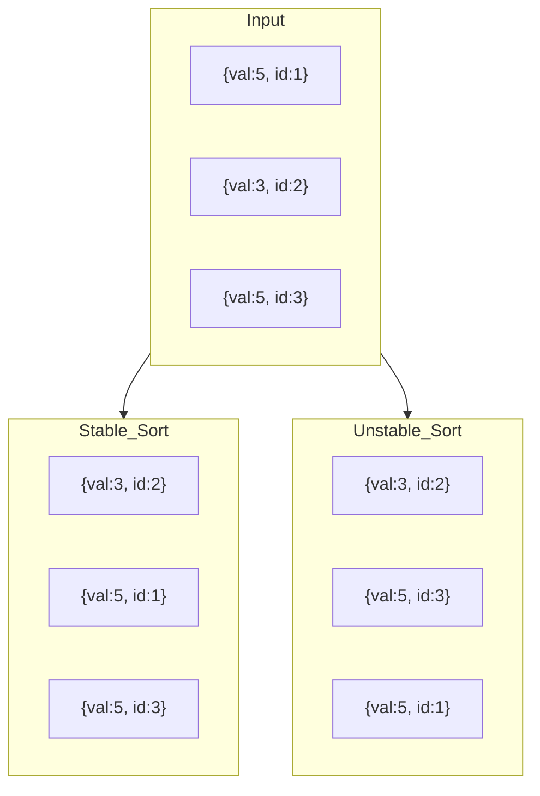

# Stability in Sorting Algorithms

## 1. Introduction

In the study of sorting algorithms, efficiency metrics such as time and space complexity often dominate discussions. However, an equally critical property that influences algorithm selection is **stability**. Stability refers to the preservation of the relative order of elements that compare as equal. While this property does not affect asymptotic complexity, it has profound implications for multi-key sorting, data integrity, and the composability of sorting operations in complex software systems.

## 2. Definition of Stability

A sorting algorithm is classified as **stable** if, for any two elements `A` and `B` that compare as equal according to the sorting criterion, the algorithm guarantees that `A` will appear before `B` in the sorted output if and only if `A` appeared before `B` in the original input. Conversely, an **unstable** sorting algorithm offers no such guarantee; the relative order of equal elements may be altered arbitrarily during the sorting process.

### 2.1 Formal Statement

Let `arr` be an input array containing elements `e₁, e₂, ..., eₙ`. Let `sort(arr)` produce an output array. If for any indices `i < j` such that `arr[i] == arr[j]`, the sorted output maintains the property that the element originally at `i` appears before the element originally at `j`, then the sorting algorithm is **stable**. Otherwise, it is **unstable**.

### 2.2 Illustrative Example

Consider a list of words to be sorted by their **first letter only**:

```
Input:  [peach, straw, apple, spork]
```

A stable sort produces:

```
Output: [apple, peach, straw, spork]
```

Observe that `straw` and `spork` both begin with the letter `s` and are therefore considered equal under the sorting criterion. In the input, `straw` appears before `spork`. A stable sort preserves this ordering. An unstable sort, by contrast, might produce `[apple, peach, spork, straw]`, reversing the original relative order of the two words.

## 3. Importance of Stability

The significance of stability becomes apparent when sorting operations are **composed**—that is, when a dataset is sorted multiple times according to different keys. Stability enables a technique known as **sorting by successive keys**, wherein a final ordering respecting a hierarchy of attributes can be achieved through a sequence of individual sorts.

### 3.1 Multi-Key Sorting (Radix Sort Principle)

Suppose a list of individuals must be sorted **by last name, and then by first name**. The following procedure leverages stability:

1. **First Pass:** Sort the entire list by **first name** using any algorithm (stable or unstable).
2. **Second Pass:** Sort the resulting list by **last name** using a **stable** algorithm.

After the second pass, the list is primarily ordered by last name. Crucially, for entries sharing the same last name, the relative order established during the first pass—i.e., alphabetical by first name—is preserved because the stable sort did not disturb the order of equal keys.

This method underlies the operation of **Radix Sort**, where elements are sorted digit by digit from the least significant digit to the most significant digit, relying on the stability of the underlying sort to maintain the ordering established in previous passes.

### 3.2 Practical Scenarios Requiring Stability

Stability is essential in numerous real-world applications:

- **Database Query Processing:** When a `SELECT` statement includes an `ORDER BY` clause with multiple columns, the database engine must preserve the ordering of preceding columns when sorting by subsequent columns. This is typically achieved using stable sorting algorithms internally.

- **Spreadsheet Applications:** Users frequently sort data by multiple columns (e.g., first by "Department," then by "Employee Name"). Stability ensures that the alphabetical ordering of names within each department is maintained after sorting by department.

- **E-Commerce Product Listings:** Sorting products by category, and then by price or rating, requires stability to ensure that the relative ordering of products within the same category reflects the secondary sorting criterion.

- **Event Log Analysis:** When sorting timestamped events that may share identical timestamps, stability preserves the original chronological order of arrival, which may be significant for debugging or auditing purposes.

- **Graphics and Rendering Pipelines:** In computer graphics, objects may be sorted by depth (z‑order). Stable sorting ensures that objects with the same depth retain their original draw order, preventing visual artifacts such as flickering.

### 3.3 Consequences of Unstable Sorting

If an unstable sorting algorithm were employed in the multi-key scenario described in Section 3.1, the final ordering would be unpredictable. The second sort (by last name) could scramble the first‑name ordering for individuals with the same last name, negating the intended hierarchical sort.

## 4. Classification of Common Sorting Algorithms by Stability

The stability property is inherent to the design of a sorting algorithm. The following table classifies widely studied algorithms based on whether they are stable or unstable.

| Stable Algorithms | Unstable Algorithms |
|-------------------|---------------------|
| Bubble Sort | Selection Sort |
| Insertion Sort | Heap Sort |
| Merge Sort | Quick Sort (typical implementations) |
| Timsort (Python, Java) | Shell Sort |
| Counting Sort | |
| Radix Sort (LSD) | |
| Bucket Sort | |

**Sources:**

### 4.1 Why Some Algorithms Are Stable and Others Are Not

- **Insertion Sort (Stable):** Elements are inserted into the sorted prefix only after shifting larger elements to the right. The comparison `array[j] > key` ensures that equal elements are not shifted past one another, preserving their relative order.

- **Merge Sort (Stable):** During the merge step, when the two elements being compared are equal, the algorithm selects the element from the left subarray first. Since the left subarray contains elements that appeared earlier in the original input, stability is maintained.

- **Quick Sort (Unstable):** The partitioning process swaps elements across the pivot without regard for their original relative order. Equal elements may be arbitrarily rearranged as they are moved to either side of the pivot. (Note: Stable variants of Quick Sort exist but require additional memory and are not commonly used in standard implementations.)

- **Selection Sort (Unstable):** When swapping the minimum element with the element at the boundary of the sorted portion, the relative order of equal elements may be disrupted. For example, consider `[5, 3, 5, 1]`. The first pass swaps `1` with the first `5`, moving that `5` after the second `5`, thereby altering their original order.

- **Heap Sort (Unstable):** The heap construction and repeated extraction of the maximum element involve swaps that can rearrange equal elements arbitrarily.

## 5. Visual Representation of Stable vs. Unstable Sorting

The following diagram illustrates the difference between stable and unstable sorting using a simple array of objects. Each object has a `value` (used for sorting) and an `id` (used to track original position).



**Explanation:** The two elements with `value = 5` are considered equal for sorting purposes. A stable sort preserves the order `id:1` before `id:3`. An unstable sort may reverse them.

## 6. Implementation Demonstration in JavaScript

The following JavaScript code contrasts the behavior of a stable sort (Merge Sort) with an unstable sort (Quick Sort) when sorting objects by a primary key where duplicates exist. The original array includes an `id` field to track each element's initial position.

```javascript
// Dataset: objects with 'value' (sort key) and 'id' (original position)
const data = [
    { value: 5, id: 1 },
    { value: 3, id: 2 },
    { value: 5, id: 3 },
    { value: 1, id: 4 },
    { value: 3, id: 5 }
];

// ---------- Stable Sort: Merge Sort ----------
function mergeSortStable(arr) {
    if (arr.length <= 1) return arr;
    const mid = Math.floor(arr.length / 2);
    const left = mergeSortStable(arr.slice(0, mid));
    const right = mergeSortStable(arr.slice(mid));
    return merge(left, right);
}

function merge(left, right) {
    const result = [];
    let i = 0, j = 0;
    while (i < left.length && j < right.length) {
        // '<=' ensures stability: left element taken first on equality
        if (left[i].value <= right[j].value) {
            result.push(left[i++]);
        } else {
            result.push(right[j++]);
        }
    }
    return result.concat(left.slice(i)).concat(right.slice(j));
}

// ---------- Unstable Sort: Quick Sort ----------
function quickSortUnstable(arr) {
    if (arr.length <= 1) return arr;
    const pivot = arr[0];
    const left = [];
    const right = [];
    for (let i = 1; i < arr.length; i++) {
        if (arr[i].value < pivot.value) {
            left.push(arr[i]);
        } else {
            // Equal elements go to 'right', potentially reversing order
            right.push(arr[i]);
        }
    }
    return [...quickSortUnstable(left), pivot, ...quickSortUnstable(right)];
}

// Execute and display results
console.log('Original Data:');
console.table(data);

console.log('\nStable Sort (Merge Sort) Result:');
console.table(mergeSortStable([...data]));

console.log('\nUnstable Sort (Quick Sort) Result:');
console.table(quickSortUnstable([...data]));
```

**Sample Output:**

```
Original Data:
┌─────────┬───────┬────┐
│ (index) │ value │ id │
├─────────┼───────┼────┤
│    0    │   5   │ 1  │
│    1    │   3   │ 2  │
│    2    │   5   │ 3  │
│    3    │   1   │ 4  │
│    4    │   3   │ 5  │
└─────────┴───────┴────┘

Stable Sort (Merge Sort) Result:
┌─────────┬───────┬────┐
│ (index) │ value │ id │
├─────────┼───────┼────┤
│    0    │   1   │ 4  │
│    1    │   3   │ 2  │   ← id:2 before id:5 (stable)
│    2    │   3   │ 5  │
│    3    │   5   │ 1  │   ← id:1 before id:3 (stable)
│    4    │   5   │ 3  │
└─────────┴───────┴────┘

Unstable Sort (Quick Sort) Result:
┌─────────┬───────┬────┐
│ (index) │ value │ id │
├─────────┼───────┼────┤
│    0    │   1   │ 4  │
│    1    │   3   │ 5  │   ← order may be reversed!
│    2    │   3   │ 2  │
│    3    │   5   │ 3  │   ← order may be reversed!
│    4    │   5   │ 1  │
└─────────┴───────┴────┘
```

**Analysis:** The stable Merge Sort preserves the original relative order of elements with equal `value` fields (`id:2` before `id:5`; `id:1` before `id:3`). The unstable Quick Sort may alter this order arbitrarily.

## 7. Tradeoffs and Considerations

### 7.1 Performance Implications

Stability often comes at a cost. Stable algorithms may require additional memory or exhibit higher constant-factor overhead compared to their unstable counterparts.

| Algorithm | Stable? | Time Complexity (Average) | Space Complexity |
|-----------|---------|---------------------------|------------------|
| Merge Sort | Yes | O(n log n) | O(n) |
| Quick Sort | No (typical) | O(n log n) | O(log n) |
| Heap Sort | No | O(n log n) | O(1) |
| Insertion Sort | Yes | O(n²) | O(1) |

When stability is required, **Merge Sort** is the preferred choice among efficient comparison-based algorithms. **Timsort**, a hybrid of Merge Sort and Insertion Sort used in Python and Java, provides both stability and excellent performance on real-world data.

### 7.2 When Stability Is Unnecessary

If the elements being sorted are primitive values (e.g., integers, floating-point numbers) and the application does not require multi-key sorting, stability is irrelevant. Equal primitive values are indistinguishable; their relative order has no semantic meaning. In such cases, algorithms like Quick Sort or Heap Sort—which are typically faster in practice due to lower constant factors and better cache locality—are preferable.

### 7.3 Decision Framework

The following decision tree guides the selection of a sorting algorithm based on stability requirements.

```mermaid
graph TD
    A[Start] --> B{Stability Required?}
    B -->|No| C{In-Place Required?}
    C -->|Yes| D[Heap Sort or Quick Sort]
    C -->|No| E[Quick Sort]
    B -->|Yes| F{Input Size}
    F -->|Small| G[Insertion Sort]
    F -->|Large| H{Memory Constraints?}
    H -->|Strict| I[In-Place Merge Sort (complex)]
    H -->|Relaxed| J[Merge Sort or Timsort]
```

## 8. Conclusion

Stability is a fundamental property of sorting algorithms that, while not affecting asymptotic time complexity, has decisive implications for the correctness and composability of sorting operations. A stable sort preserves the relative order of equal elements, enabling reliable multi-key sorting and ensuring predictable behavior in applications that process complex data records. Understanding the stability characteristics of various algorithms allows engineers to make informed choices that balance performance requirements with data integrity constraints. In practice, Merge Sort and its derivatives (e.g., Timsort) are the algorithms of choice when stability is essential, while Quick Sort and Heap Sort remain valuable when stability can be sacrificed for improved memory efficiency or raw speed.