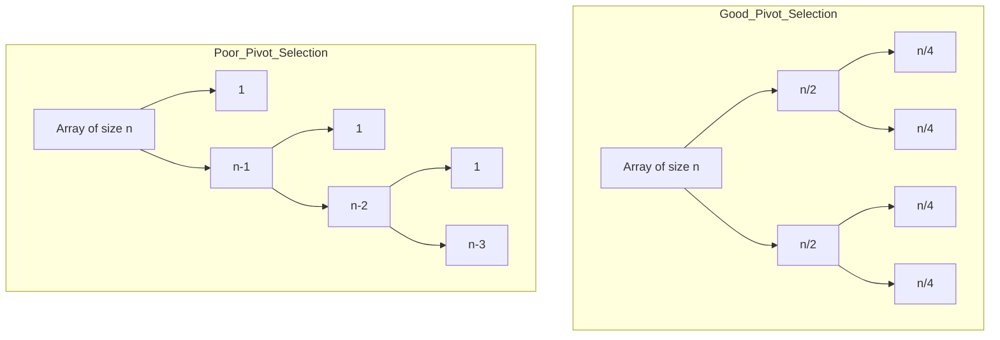
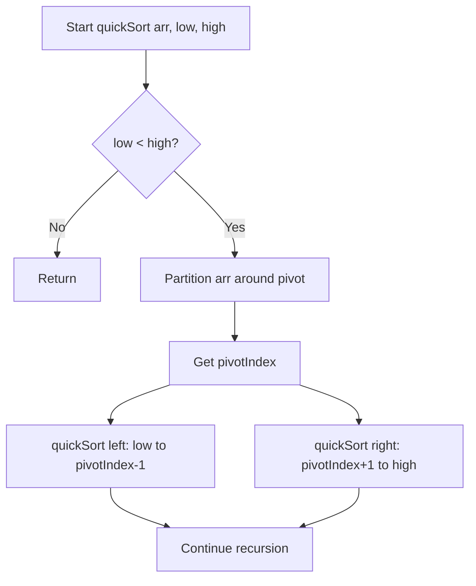

# Quick Sort: Efficient Divide-and-Conquer Sorting Algorithm

## 1. Introduction

Quick Sort is a highly efficient, comparison-based sorting algorithm that employs the divide-and-conquer paradigm. Its name derives from its superior average-case performance, which often surpasses that of other O(n log n) algorithms such as Merge Sort and Heap Sort due to favorable constant factors and excellent cache locality. Quick Sort operates by selecting a **pivot** element from the array and partitioning the remaining elements into two subsets: those less than the pivot and those greater than the pivot. This process is applied recursively to each subset until the entire array is sorted.

Despite its average-case efficiency, Quick Sort exhibits a worst-case time complexity of **O(n²)** under adverse pivot selections. Understanding the conditions that lead to this degradation and the techniques to mitigate it is essential for informed algorithm selection in practical applications.

## 2. Algorithmic Paradigm: Divide and Conquer with Partitioning

Quick Sort adheres to the divide-and-conquer strategy through a three-step recursive procedure:

1. **Divide:** Choose a pivot element and partition the array such that all elements less than or equal to the pivot are placed to its left, and all elements greater than the pivot are placed to its right. After partitioning, the pivot resides in its final sorted position.
2. **Conquer:** Recursively apply Quick Sort to the left and right subarrays (excluding the pivot, which is already correctly placed).
3. **Combine:** Since the subarrays are sorted in place and the pivot is correctly positioned, no explicit combination step is required.

### 2.1 The Partitioning Process

The partitioning step is the core of Quick Sort. A typical implementation (Lomuto partition scheme) proceeds as follows:

1. Select a pivot element. A common choice is the last element of the current subarray.
2. Initialize a pointer `i` to track the boundary between elements less than or equal to the pivot and those greater than the pivot. Initially, `i = low - 1`.
3. Iterate through the subarray from `low` to `high - 1` with a pointer `j`. For each element:
   - If `array[j] <= pivot`, increment `i` and swap `array[i]` with `array[j]`.
4. After the loop, swap the pivot (at `array[high]`) with `array[i + 1]` so that the pivot is placed between the two partitions.
5. Return the new pivot index `i + 1`.

### 2.2 Visual Representation of Partitioning

Consider the array `[3, 7, 8, 5, 2, 1, 9, 5, 4]` with the last element `4` chosen as the pivot.

```
Initial: [3, 7, 8, 5, 2, 1, 9, 5, 4]   pivot = 4
          ↑                          ↑
          i=-1                      pivot

j=0: 3 ≤ 4 → swap(arr[0], arr[0]) → [3, 7, 8, 5, 2, 1, 9, 5, 4], i=0
j=1: 7 > 4 → no swap
j=2: 8 > 4 → no swap
j=3: 5 > 4 → no swap
j=4: 2 ≤ 4 → i=1, swap(arr[1], arr[4]) → [3, 2, 8, 5, 7, 1, 9, 5, 4]
j=5: 1 ≤ 4 → i=2, swap(arr[2], arr[5]) → [3, 2, 1, 5, 7, 8, 9, 5, 4]
j=6: 9 > 4 → no swap
j=7: 5 > 4 → no swap

End of loop: i=2. Swap pivot with arr[i+1] (index 3).
Result: [3, 2, 1, 4, 7, 8, 9, 5, 5]
                ↑
            pivot at final position
```

After this pass, all elements to the left of `4` are less than or equal to `4`, and all elements to the right are greater. The pivot `4` is now in its correct sorted position.

### 2.3 Recursive Application

The process is then applied recursively to the subarrays `[3, 2, 1]` and `[7, 8, 9, 5, 5]` until the base case of subarrays of length zero or one is reached.

## 3. Pivot Selection Strategies

The choice of pivot profoundly influences Quick Sort's performance. An ideal pivot divides the array into two roughly equal halves, yielding **O(n log n)** complexity. Conversely, consistently poor pivot choices can degrade performance to **O(n²)**.

### 3.1 Common Pivot Selection Methods

| Strategy | Description | Advantages | Disadvantages |
|----------|-------------|------------|---------------|
| **Last Element** | Always choose the rightmost element as pivot. | Simple to implement. | Worst-case on already sorted or reverse sorted arrays. |
| **First Element** | Always choose the leftmost element as pivot. | Simple. | Same worst-case as last element. |
| **Random Pivot** | Select a random index as pivot and swap it to the end. | Reduces probability of worst-case; robust. | Overhead of random number generation. |
| **Median-of-Three** | Choose median of first, middle, and last elements. | Good approximation of true median; improves average case. | Slightly more comparisons per partition. |
| **Median-of-Medians** | Recursively compute approximate median. | Guarantees O(n log n) worst-case. | High constant factor; rarely used in practice. |

In practice, the **median-of-three** strategy is widely adopted in standard library implementations (e.g., C++ `std::sort`, Java's `Arrays.sort()` for primitives) as it balances simplicity and robustness.

### 3.2 Impact of Pivot Quality on Recursion Tree

The following diagram contrasts the recursion tree resulting from good versus poor pivot selection.



**Good Pivot:** Tree height is **O(log n)**; total work **O(n log n)**.  
**Poor Pivot:** Tree height is **O(n)**; total work **O(n²)**.

## 4. Implementation in JavaScript

The following JavaScript code implements Quick Sort using the **Lomuto partition scheme** with the **last element** as pivot. The function sorts the array in place and includes detailed comments.

```javascript
/**
 * Partitions the array segment [low, high] using the last element as pivot.
 * After partitioning, all elements <= pivot are to the left,
 * and all elements > pivot are to the right.
 * 
 * @param {number[]} arr - The array to partition.
 * @param {number} low - Starting index of the segment.
 * @param {number} high - Ending index of the segment.
 * @returns {number} The final index of the pivot.
 */
function partition(arr, low, high) {
    const pivot = arr[high];          // Choose the last element as pivot
    let i = low - 1;                  // Index of smaller element boundary

    for (let j = low; j < high; j++) {
        // If current element is less than or equal to pivot
        if (arr[j] <= pivot) {
            i++;
            // Swap arr[i] and arr[j]
            [arr[i], arr[j]] = [arr[j], arr[i]];
        }
    }
    // Place pivot in its correct position
    [arr[i + 1], arr[high]] = [arr[high], arr[i + 1]];
    return i + 1;                     // Return the pivot index
}

/**
 * Sorts an array in place using the Quick Sort algorithm.
 * 
 * @param {number[]} arr - The array to be sorted.
 * @param {number} low - Starting index (default 0).
 * @param {number} high - Ending index (default arr.length - 1).
 * @returns {number[]} The sorted array (sorted in place).
 */
function quickSort(arr, low = 0, high = arr.length - 1) {
    if (low < high) {
        // Partition the array and get the pivot index
        const pivotIndex = partition(arr, low, high);

        // Recursively sort elements before and after partition
        quickSort(arr, low, pivotIndex - 1);
        quickSort(arr, pivotIndex + 1, high);
    }
    return arr;
}

// Example usage and verification
const numbers = [3, 7, 8, 5, 2, 1, 9, 5, 4];
console.log('Original array:', numbers);
quickSort(numbers);
console.log('Sorted array:  ', numbers);
```

**Expected Output:**
```
Original array: [3, 7, 8, 5, 2, 1, 9, 5, 4]
Sorted array:   [1, 2, 3, 4, 5, 5, 7, 8, 9]
```

### 4.1 Code Explanation

- **`partition(arr, low, high)`:**  
  - Selects the last element `arr[high]` as pivot.  
  - Maintains index `i` such that all elements up to `i` are ≤ pivot.  
  - Iterates through the segment with `j`; whenever an element ≤ pivot is found, `i` is incremented and `arr[i]` is swapped with `arr[j]`.  
  - Finally, the pivot is swapped into position `i + 1`, ensuring correct placement.

- **`quickSort(arr, low, high)`:**  
  - Base case: when `low >= high`, the segment is trivially sorted.  
  - Calls `partition` to place one element in its final position.  
  - Recursively sorts the left and right subarrays.

- **In-Place Sorting:** The array is modified directly; no additional arrays are allocated for the subproblems.

## 5. Complexity Analysis

### 5.1 Time Complexity

The time complexity of Quick Sort is determined by the balance of the partitions.

| Case          | Condition                                       | Time Complexity |
|---------------|-------------------------------------------------|-----------------|
| **Best**      | Pivot always splits array into two equal halves. | O(n log n)      |
| **Average**   | Pivot splits array into reasonably balanced parts.| O(n log n)      |
| **Worst**     | Pivot is always the smallest or largest element. | O(n²)           |

**Derivation of Best/Average Case:**  
- Each level of recursion processes **n** elements across all partitions.  
- Balanced partitions yield a recursion tree height of **log₂ n**.  
- Total work = **O(n) × O(log n) = O(n log n)**.

**Derivation of Worst Case:**  
- If the pivot is consistently the extreme (e.g., smallest element in an already sorted array), one subarray contains `n-1` elements and the other contains `0`.  
- Recursion depth becomes **n**, and the total work is `n + (n-1) + ... + 1 = n(n+1)/2 = O(n²)`.

### 5.2 Space Complexity

Quick Sort is an **in-place** algorithm, requiring only a constant amount of additional memory for variables during partitioning. However, the recursive implementation consumes stack space proportional to the depth of recursion.

| Case          | Space Complexity (Auxiliary) | Notes                                      |
|---------------|------------------------------|--------------------------------------------|
| Best/Average  | O(log n)                     | Recursion stack depth for balanced tree.   |
| Worst         | O(n)                         | Recursion stack depth for unbalanced tree. |

**Mitigation:** Tail recursion optimization or converting the recursion to an iterative form using an explicit stack can reduce worst-case space to **O(log n)** by always recursing on the smaller partition first.

### 5.3 Summary Table

| Metric                | Best Case   | Average Case | Worst Case  |
|-----------------------|-------------|--------------|-------------|
| Time Complexity       | O(n log n)  | O(n log n)   | O(n²)       |
| Space Complexity      | O(log n)    | O(log n)     | O(n)        |
| Stable                | No          | No           | No          |
| In-Place              | Yes         | Yes          | Yes         |
| Adaptive              | No          | No           | No          |

## 6. Characteristics and Practical Considerations

### 6.1 Stability

Quick Sort is **unstable**. During partitioning, elements equal to the pivot may be swapped across the pivot, disrupting their relative order. Stability can be achieved through stable partitioning schemes, but these incur additional space overhead and are seldom used in standard implementations.

### 6.2 Cache Performance

Quick Sort exhibits excellent **cache locality** because it operates on contiguous segments of the array. Once a partition is loaded into the cache, the algorithm accesses nearby memory locations repeatedly, resulting in fewer cache misses compared to algorithms like Merge Sort that require auxiliary arrays or Heap Sort that jumps across the array.

### 6.3 Suitability

Quick Sort is the algorithm of choice in many scenarios:

- **General-Purpose In-Memory Sorting:** Most standard library implementations (e.g., C++ `std::sort`, Java's `Arrays.sort()` for primitives) use variants of Quick Sort due to its average-case speed.
- **Large Datasets:** The O(n log n) average time and low constant factors make it suitable for large arrays.
- **Memory-Constrained Environments:** Its O(log n) space complexity (with tail recursion optimization) is advantageous.

### 6.4 Limitations and Mitigations

| Limitation                          | Mitigation Strategy                                                                 |
|-------------------------------------|-------------------------------------------------------------------------------------|
| Worst-case O(n²) on sorted data     | Use median-of-three pivot selection or random pivot.                                 |
| Recursion depth may cause stack overflow | Implement tail recursion optimization or use an iterative approach with explicit stack. |
| Unstable                            | If stability is required, use Merge Sort or Timsort.                                 |

## 7. Comparison with Merge Sort

Both Quick Sort and Merge Sort are divide-and-conquer algorithms with O(n log n) average-case time complexity, yet they differ in crucial aspects.

| Feature                | Quick Sort                         | Merge Sort                         |
|------------------------|------------------------------------|------------------------------------|
| **Time (Average)**     | O(n log n)                         | O(n log n)                         |
| **Time (Worst)**       | O(n²) (rare with good pivot)       | O(n log n)                         |
| **Space Complexity**   | O(log n) (in-place)                | O(n) (auxiliary array)             |
| **Stability**          | Unstable                           | Stable                             |
| **Cache Performance**  | Excellent                          | Good (but requires extra array)    |
| **Practical Speed**    | Often faster due to lower constants| Consistent but slower in practice  |

**Selection Guideline:**

- If **stability** is required, choose **Merge Sort** (or Timsort).
- If **worst-case guarantees** are paramount, **Merge Sort** or **Heap Sort** are safer.
- For **average-case performance** and **memory efficiency**, **Quick Sort** is typically preferred.

## 8. Visualization of Quick Sort Execution

The following flowchart outlines the recursive Quick Sort process.



## 9. Conclusion

Quick Sort is a quintessential divide-and-conquer sorting algorithm celebrated for its average-case efficiency and in-place operation. Its performance hinges critically on the quality of pivot selection; with prudent strategies like median-of-three, the likelihood of worst-case behavior is minimized. While Quick Sort lacks stability and suffers from a theoretical O(n²) worst-case scenario, its practical speed, low memory footprint, and excellent cache utilization cement its status as the default sorting algorithm in numerous programming language standard libraries. A thorough understanding of Quick Sort equips the engineer with the knowledge to make informed tradeoffs between performance, memory, and stability in diverse computational contexts.