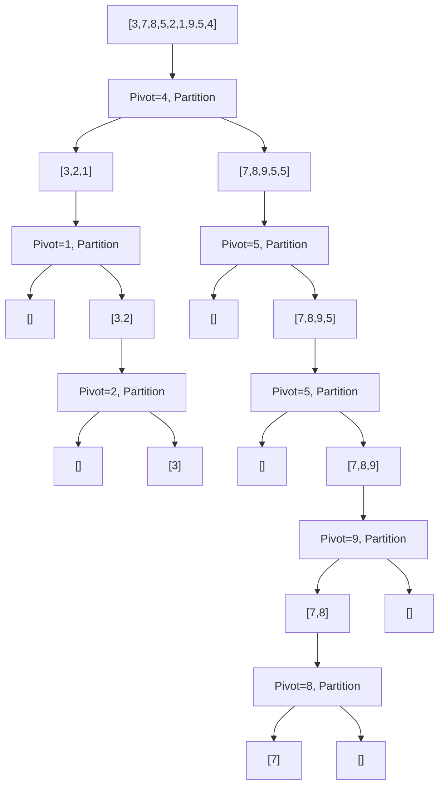

# Optional Exercise: Quick Sort Implementation and Analysis

## 1. Introduction

Quick Sort is a highly efficient, comparison-based sorting algorithm that employs the divide-and-conquer paradigm. It is widely regarded as one of the fastest sorting algorithms in practice for in-memory arrays, owing to its favorable constant factors and excellent cache locality. Quick Sort operates by selecting a **pivot** element from the array and partitioning the remaining elements into two subsets: those less than the pivot and those greater than the pivot. This process is applied recursively to each subset until the entire array is sorted. This document presents an optional exercise for implementing Quick Sort, accompanied by a comprehensive analysis of the algorithm's mechanics, variations, and performance characteristics.

## 2. Algorithmic Paradigm: Divide and Conquer with Partitioning

Quick Sort adheres to the divide-and-conquer strategy through a three-step recursive procedure:

1. **Choose a Pivot:** Select an element from the array to serve as the pivot. The choice of pivot profoundly influences the algorithm's efficiency.
2. **Partition:** Rearrange the array such that all elements less than the pivot are placed to its left, and all elements greater than the pivot are placed to its right. After partitioning, the pivot resides in its final sorted position.
3. **Recurse:** Recursively apply Quick Sort to the left and right subarrays (excluding the pivot, which is already correctly placed).

The base case for recursion occurs when the subarray contains zero or one element, at which point it is trivially sorted.

## 3. Visual Representation

The following diagram illustrates the recursive partitioning process of Quick Sort on an unsorted array.



**Explanation:** The pivot element (chosen as the last element in this illustration) partitions the array into left (smaller) and right (larger) subarrays. This partitioning continues recursively until all subarrays are of length zero or one, at which point the array is fully sorted.

## 4. Implementation Approaches in JavaScript

Quick Sort can be implemented in multiple ways, each with distinct tradeoffs regarding memory usage, readability, and performance. Two principal implementation styles are discussed below.

### 4.1 Functional (Non‑In‑Place) Quick Sort

The functional approach creates new arrays for the left and right partitions, resulting in a clean, declarative implementation that is easy to understand and explain.

```javascript
/**
 * Sorts an array using the functional (non‑in‑place) Quick Sort algorithm.
 * This implementation creates new arrays during recursion and does not modify the original.
 *
 * @param {number[]} arr - The array to be sorted.
 * @returns {number[]} A new sorted array.
 */
function quickSortFunctional(arr) {
    // Base case: an array of length 0 or 1 is already sorted
    if (arr.length <= 1) {
        return arr;
    }

    // Choose the first element as the pivot
    const pivot = arr[0];
    const left = [];
    const right = [];

    // Partition: distribute elements into left (smaller) and right (larger) arrays
    for (let i = 1; i < arr.length; i++) {
        if (arr[i] < pivot) {
            left.push(arr[i]);
        } else {
            right.push(arr[i]);
        }
    }

    // Recursively sort subarrays and combine with the pivot
    return [...quickSortFunctional(left), pivot, ...quickSortFunctional(right)];
}

// Example usage
const numbers = [3, 7, 8, 5, 2, 1, 9, 5, 4];
console.log('Functional Quick Sort:', quickSortFunctional(numbers));
// Expected output: [1, 2, 3, 4, 5, 5, 7, 8, 9]
```

**Characteristics of Functional Quick Sort:**

| Aspect | Description |
|--------|-------------|
| **Readability** | Very high; code closely mirrors the algorithmic description. |
| **Memory Usage** | O(n log n) average, as new arrays are allocated at each recursive level. |
| **Stability** | Not stable; equal elements may be reordered. |
| **Suitability** | Excellent for learning, teaching, and interviews where clarity is prioritized over memory efficiency. |

### 4.2 In‑Place Quick Sort (Lomuto Partition Scheme)

The in‑place implementation modifies the array directly, requiring only O(log n) additional stack space for recursion. The **Lomuto partition scheme** is commonly used for its simplicity.

```javascript
/**
 * Partitions the array segment [low, high] using the Lomuto scheme.
 * The last element is chosen as the pivot. After partitioning, all elements
 * less than or equal to the pivot are to the left, and all greater elements are to the right.
 *
 * @param {number[]} arr - The array to partition.
 * @param {number} low - Starting index of the segment.
 * @param {number} high - Ending index of the segment.
 * @returns {number} The final index of the pivot.
 */
function lomutoPartition(arr, low, high) {
    const pivot = arr[high];        // Choose the last element as pivot
    let i = low - 1;                // Index of the smaller element boundary

    for (let j = low; j < high; j++) {
        // If current element is less than or equal to pivot
        if (arr[j] <= pivot) {
            i++;
            // Swap arr[i] and arr[j]
            [arr[i], arr[j]] = [arr[j], arr[i]];
        }
    }
    // Place pivot in its correct position
    [arr[i + 1], arr[high]] = [arr[high], arr[i + 1]];
    return i + 1;                   // Return the pivot index
}

/**
 * Sorts an array in place using the Quick Sort algorithm (Lomuto partition).
 *
 * @param {number[]} arr - The array to be sorted.
 * @param {number} low - Starting index (default 0).
 * @param {number} high - Ending index (default arr.length - 1).
 * @returns {number[]} The sorted array (sorted in place).
 */
function quickSortInPlace(arr, low = 0, high = arr.length - 1) {
    if (low < high) {
        // Partition the array and get the pivot index
        const pivotIndex = lomutoPartition(arr, low, high);

        // Recursively sort elements before and after partition
        quickSortInPlace(arr, low, pivotIndex - 1);
        quickSortInPlace(arr, pivotIndex + 1, high);
    }
    return arr;
}

// Example usage
const arr = [3, 7, 8, 5, 2, 1, 9, 5, 4];
quickSortInPlace(arr);
console.log('In‑Place Quick Sort:', arr);
// Expected output: [1, 2, 3, 4, 5, 5, 7, 8, 9]
```

### 4.3 Hoare Partition Scheme (Alternative)

The **Hoare partition scheme** is an alternative in‑place partitioning method that generally performs fewer swaps than Lomuto. It uses two pointers moving toward each other from opposite ends of the segment.

```javascript
/**
 * Partitions the array using the Hoare scheme.
 * The first element is chosen as the pivot.
 *
 * @param {number[]} arr - The array to partition.
 * @param {number} low - Starting index.
 * @param {number} high - Ending index.
 * @returns {number} The partition index.
 */
function hoarePartition(arr, low, high) {
    const pivot = arr[low];
    let i = low - 1;
    let j = high + 1;

    while (true) {
        // Move i right while elements are less than pivot
        do {
            i++;
        } while (arr[i] < pivot);

        // Move j left while elements are greater than pivot
        do {
            j--;
        } while (arr[j] > pivot);

        // If pointers cross, return the partition index
        if (i >= j) {
            return j;
        }

        // Swap elements on the wrong side
        [arr[i], arr[j]] = [arr[j], arr[i]];
    }
}

/**
 * Quick Sort using Hoare partition scheme.
 */
function quickSortHoare(arr, low = 0, high = arr.length - 1) {
    if (low < high) {
        const partitionIndex = hoarePartition(arr, low, high);
        quickSortHoare(arr, low, partitionIndex);
        quickSortHoare(arr, partitionIndex + 1, high);
    }
    return arr;
}
```

**Comparison of Partition Schemes:**

| Scheme | Pivot Choice | Pointer Movement | Swaps | Pivot Final Position |
|--------|--------------|------------------|-------|----------------------|
| **Lomuto** | Last element | Single pointer `j` scans left to right | More | Pivot placed correctly |
| **Hoare** | First element | Two pointers `i` and `j` move toward center | Fewer | Pivot may not end in final position |

Hoare's scheme is generally faster due to fewer swaps but is more complex to implement and reason about. Lomuto's scheme is simpler and preferred for educational purposes.

## 5. Pivot Selection Strategies

The choice of pivot profoundly influences Quick Sort's performance. An ideal pivot divides the array into two roughly equal halves, yielding O(n log n) complexity. Consistently poor pivot choices can degrade performance to O(n²).

### 5.1 Common Pivot Selection Methods

| Strategy | Description | Advantages | Disadvantages |
|----------|-------------|------------|---------------|
| **First Element** | Always choose the leftmost element. | Simple to implement. | Worst‑case O(n²) on already sorted or reverse sorted arrays. |
| **Last Element** | Always choose the rightmost element. | Simple. | Same worst‑case as first element. |
| **Random Pivot** | Select a random index as pivot and swap it to the end. | Reduces probability of worst‑case; robust against malicious input. | Overhead of random number generation. |
| **Median‑of‑Three** | Choose median of first, middle, and last elements. | Good approximation of true median; improves average case. | Slightly more comparisons per partition. |
| **Median‑of‑Medians** | Recursively compute approximate median. | Guarantees O(n log n) worst‑case. | High constant factor; rarely used in practice. |

### 5.2 Median-of-Three Implementation

```javascript
/**
 * Selects the median of the first, middle, and last elements as pivot.
 * Places the pivot at the end of the segment for use with Lomuto partition.
 *
 * @param {number[]} arr - The array.
 * @param {number} low - Starting index.
 * @param {number} high - Ending index.
 */
function medianOfThree(arr, low, high) {
    const mid = Math.floor((low + high) / 2);

    // Compare and swap to place the median value at the end (index high)
    if (arr[mid] < arr[low]) {
        [arr[mid], arr[low]] = [arr[low], arr[mid]];
    }
    if (arr[high] < arr[low]) {
        [arr[high], arr[low]] = [arr[low], arr[high]];
    }
    if (arr[mid] < arr[high]) {
        [arr[mid], arr[high]] = [arr[high], arr[mid]];
    }
    // Now arr[high] contains the median of the three
}
```

In practice, the **median-of-three** strategy is widely adopted in standard library implementations (e.g., C++ `std::sort`, Java's `Arrays.sort()` for primitives) as it balances simplicity and robustness.

## 6. Complexity Analysis

### 6.1 Time Complexity

The time complexity of Quick Sort is determined by the balance of the partitions.

| Case | Condition | Time Complexity |
|------|-----------|-----------------|
| **Best** | Pivot always splits array into two equal halves. | O(n log n) |
| **Average** | Pivot splits array into reasonably balanced parts. | O(n log n) |
| **Worst** | Pivot is always the smallest or largest element. | O(n²) |

**Derivation of Best/Average Case:** Each level of recursion processes n elements across all partitions. Balanced partitions yield a recursion tree height of log₂ n. Total work = O(n) × O(log n) = O(n log n).

**Derivation of Worst Case:** If the pivot is consistently the extreme (e.g., smallest element in an already sorted array), one subarray contains n‑1 elements and the other contains 0. Recursion depth becomes n, and the total work is n + (n‑1) + ... + 1 = n(n+1)/2 = O(n²).

### 6.2 Space Complexity

Quick Sort is an **in‑place** algorithm, requiring only a constant amount of additional memory for variables during partitioning. However, the recursive implementation consumes stack space proportional to the depth of recursion.

| Case | Space Complexity | Notes |
|------|------------------|-------|
| Best/Average | O(log n) | Recursion stack depth for balanced tree. |
| Worst | O(n) | Recursion stack depth for unbalanced tree. |

**Mitigation:** Tail recursion optimization—always recursing on the smaller partition first—can reduce worst‑case stack space to O(log n).

### 6.3 Summary Table

| Metric | Best Case | Average Case | Worst Case |
|--------|-----------|--------------|------------|
| Time Complexity | O(n log n) | O(n log n) | O(n²) |
| Space Complexity | O(log n) | O(log n) | O(n) |
| Stable | No | No | No |
| In‑Place | Yes | Yes | Yes |
| Adaptive | No | No | No |

## 7. Characteristics and Practical Considerations

### 7.1 Stability

Quick Sort is **unstable**. During partitioning, elements equal to the pivot may be swapped across the pivot, disrupting their relative order. Stability can be achieved through stable partitioning schemes, but these incur additional space overhead and are seldom used in standard implementations.

### 7.2 Cache Performance

Quick Sort exhibits excellent **cache locality** because it operates on contiguous segments of the array. Once a partition is loaded into the cache, the algorithm accesses nearby memory locations repeatedly, resulting in fewer cache misses compared to algorithms like Merge Sort that require auxiliary arrays or Heap Sort that jumps across the array.

### 7.3 Suitability

Quick Sort is the algorithm of choice in many scenarios:

- **General‑Purpose In‑Memory Sorting:** Most standard library implementations (e.g., C++ `std::sort`, Java's `Arrays.sort()` for primitives) use variants of Quick Sort due to its average‑case speed.
- **Large Datasets:** The O(n log n) average time and low constant factors make it suitable for large arrays.
- **Memory‑Constrained Environments:** Its O(log n) space complexity (with tail recursion optimization) is advantageous.

### 7.4 Limitations and Mitigations

| Limitation | Mitigation Strategy |
|------------|---------------------|
| Worst‑case O(n²) on sorted data | Use median‑of‑three pivot selection or random pivot. |
| Recursion depth may cause stack overflow | Implement tail recursion optimization or use an iterative approach with explicit stack. |
| Unstable | If stability is required, use Merge Sort or Timsort. |

## 8. Comparison with Merge Sort

Both Quick Sort and Merge Sort are divide‑and‑conquer algorithms with O(n log n) average‑case time complexity, yet they differ in crucial aspects.

| Feature | Quick Sort | Merge Sort |
|---------|------------|------------|
| **Time (Average)** | O(n log n) | O(n log n) |
| **Time (Worst)** | O(n²) (rare with good pivot) | O(n log n) |
| **Space Complexity** | O(log n) (in‑place) | O(n) (auxiliary array) |
| **Stability** | Unstable | Stable |
| **Cache Performance** | Excellent | Good (but requires extra array) |
| **Practical Speed** | Often faster due to lower constants | Consistent but slower in practice |

**Selection Guideline:**

- If **stability** is required, choose **Merge Sort** (or Timsort).
- If **worst‑case guarantees** are paramount, **Merge Sort** or **Heap Sort** are safer.
- For **average‑case performance** and **memory efficiency**, **Quick Sort** is typically preferred.

## 9. Verification and Testing

To ensure correctness, the implementation should be validated with diverse input scenarios.

```javascript
// Test suite for Quick Sort implementations
function testQuickSort(sortFunction, name) {
    console.log(`\nTesting ${name}:`);

    const tests = [
        { input: [3, 7, 8, 5, 2, 1, 9, 5, 4], expected: [1, 2, 3, 4, 5, 5, 7, 8, 9] },
        { input: [4, 2, 4, 1, 3, 2], expected: [1, 2, 2, 3, 4, 4] },
        { input: [1, 2, 3, 4, 5], expected: [1, 2, 3, 4, 5] },
        { input: [5, 4, 3, 2, 1], expected: [1, 2, 3, 4, 5] },
        { input: [42], expected: [42] },
        { input: [], expected: [] },
        { input: [-3, -1, -7, 0, 2, -5], expected: [-7, -5, -3, -1, 0, 2] }
    ];

    tests.forEach((test, i) => {
        const arr = [...test.input];
        sortFunction(arr);
        const passed = JSON.stringify(arr) === JSON.stringify(test.expected);
        console.log(`  Test ${i + 1}: ${passed ? '✓ PASS' : '✗ FAIL'}`);
        if (!passed) {
            console.log(`    Input:    ${test.input}`);
            console.log(`    Expected: ${test.expected}`);
            console.log(`    Got:      ${arr}`);
        }
    });
}

// Test both implementations
testQuickSort(quickSortFunctional, 'Functional Quick Sort');
testQuickSort(quickSortInPlace, 'In‑Place Quick Sort');
testQuickSort(quickSortHoare, 'Hoare Quick Sort');
```

## 10. Exercise Resources

The following resources accompany this optional exercise:

- **Replit Exercise (Quick Sort):**  
  An interactive coding environment for implementing Quick Sort is available at:  
  [https://repl.it/@aneagoie/quickSort-exercise](https://repl.it/@aneagoie/quickSort-exercise)

- **Replit Solution (Quick Sort):**  
  A reference solution demonstrating the in‑place implementation can be accessed at:  
  [https://repl.it/@aneagoie/quickSort](https://repl.it/@aneagoie/quickSort)

*Note: If the links are inaccessible, the code provided in this document may be executed in any JavaScript environment, such as a browser's developer console or a local Node.js installation.*

## 11. Conclusion

Quick Sort is a quintessential divide‑and‑conquer sorting algorithm celebrated for its average‑case efficiency and in‑place operation. Its performance hinges critically on the quality of pivot selection; with prudent strategies like median‑of‑three, the likelihood of worst‑case behavior is minimized. While Quick Sort lacks stability and suffers from a theoretical O(n²) worst‑case scenario, its practical speed, low memory footprint, and excellent cache utilization cement its status as the default sorting algorithm in numerous programming language standard libraries. A thorough understanding of Quick Sort—including its various implementation approaches and tradeoffs—equips the engineer with the knowledge to make informed decisions in performance‑critical software development and technical interviews.