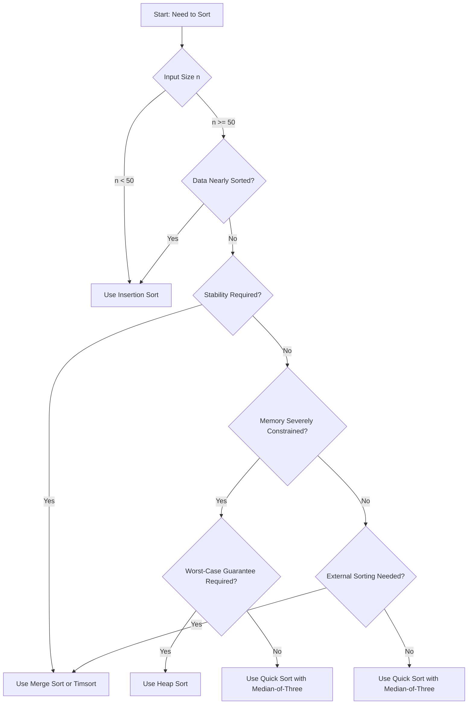

# Sorting Algorithm Selection Guide: Practical Decision Framework

## 1. Introduction

The preceding sections have examined a spectrum of sorting algorithms, each characterized by distinct time complexities, space requirements, stability properties, and behavioral nuances under varying input conditions. While theoretical knowledge of these algorithms is foundational, the ability to select the most appropriate algorithm for a given practical scenario is the hallmark of engineering proficiency. This document synthesizes the comparative analysis of elementary and advanced sorting algorithms into a coherent decision framework, addressing the critical question: **"Which sorting algorithm should be employed under specific constraints?"**

## 2. Overview of Sorting Algorithm Characteristics

The following table summarizes the key performance metrics and attributes of the principal sorting algorithms discussed. This summary serves as a reference for the subsequent decision guidelines.

| Algorithm      | Time (Best) | Time (Average) | Time (Worst) | Space Complexity | Stable | In-Place | Adaptive |
|----------------|-------------|----------------|--------------|------------------|--------|----------|----------|
| Bubble Sort    | O(n)        | O(n²)          | O(n²)        | O(1)             | Yes    | Yes      | Yes      |
| Selection Sort | O(n²)       | O(n²)          | O(n²)        | O(1)             | No     | Yes      | No       |
| Insertion Sort | O(n)        | O(n²)          | O(n²)        | O(1)             | Yes    | Yes      | Yes      |
| Merge Sort     | O(n log n)  | O(n log n)     | O(n log n)   | O(n)             | Yes    | No       | No       |
| Quick Sort     | O(n log n)  | O(n log n)     | O(n²)        | O(log n)         | No     | Yes      | No       |
| Heap Sort      | O(n log n)  | O(n log n)     | O(n log n)   | O(1)             | No     | Yes      | No       |

## 3. Algorithm Selection Guidelines

### 3.1 Insertion Sort: The Specialized Tool for Small and Nearly Sorted Data

**Primary Use Case:** Sorting very small datasets or data that is already substantially ordered.

**Rationale for Selection:**
- **Small Input Size (n < 50):** For trivially small arrays, the constant-factor overhead of more sophisticated algorithms (e.g., recursive function calls, auxiliary array allocation) often exceeds the cost of Insertion Sort's quadratic comparisons. Insertion Sort's tight loops and in-place operation yield superior wall-clock performance on tiny datasets.
- **Nearly Sorted Data:** Insertion Sort is **adaptive**, achieving O(n) time complexity when the input is already sorted or requires only minimal rearrangement. This makes it ideal for online algorithms where new elements are appended to a sorted list and require insertion.
- **Memory Constraints:** With O(1) auxiliary space, Insertion Sort is appropriate for memory-limited embedded systems.
- **Implementation Simplicity:** The algorithm is trivial to code and reason about, reducing the risk of implementation errors.

**Example Scenario:** Maintaining a high-score table in a video game where new scores are inserted into an already sorted list of top scores. The list is small (e.g., top 10) and mostly sorted.

**Code Illustration:**
```javascript
// Insertion Sort for small, nearly sorted array
function insertionSort(arr) {
    for (let i = 1; i < arr.length; i++) {
        let key = arr[i];
        let j = i - 1;
        while (j >= 0 && arr[j] > key) {
            arr[j + 1] = arr[j];
            j--;
        }
        arr[j + 1] = key;
    }
    return arr;
}
```

### 3.2 Bubble Sort and Selection Sort: Educational Artifacts

**Primary Use Case:** Pedagogy and conceptual illustration. Neither algorithm is recommended for production use.

**Justification for Avoidance:**
- **Bubble Sort:** Even with early-termination optimization, Bubble Sort performs poorly on average. Its only redeeming quality—simplicity—is outweighed by Insertion Sort, which is equally simple and significantly more efficient.
- **Selection Sort:** The algorithm's quadratic time complexity is invariant to input order. While it minimizes the number of swaps (O(n) swaps total), this advantage is rarely decisive in modern computing environments where memory writes are not prohibitively expensive.

**Conclusion:** Bubble Sort and Selection Sort are retained solely for teaching fundamental algorithmic concepts such as nested loops, swapping, and complexity analysis. They should not be deployed in any performance-sensitive or production context.

### 3.3 Merge Sort: The Guaranteed Performer

**Primary Use Case:** Scenarios requiring **stable** sorting, **worst-case time guarantees**, or **external sorting** of data exceeding main memory.

**Rationale for Selection:**
- **Predictable Performance:** Merge Sort's O(n log n) time complexity is consistent across best, average, and worst cases. This predictability is invaluable in real-time systems and applications where worst-case latency must be bounded.
- **Stability:** Merge Sort is inherently stable, preserving the relative order of equal elements. This property is essential when sorting composite records by multiple keys in succession (e.g., sorting by department, then by name).
- **External Sorting:** Merge Sort's divide-and-conquer strategy naturally extends to external sorting, where data resides on disk and cannot be fully loaded into memory. The algorithm sorts chunks in memory and merges them from disk.
- **Linked List Sorting:** Merge Sort can sort linked lists with O(1) extra space (by rearranging pointers), achieving O(n log n) time without the random-access requirement of Quick Sort.

**Drawback and Mitigation:**
- **Space Overhead:** Merge Sort requires O(n) auxiliary space. This is acceptable when memory is abundant or when external sorting is employed. If memory is severely constrained, alternative algorithms should be considered.

**Example Scenario:** Sorting a list of 100 million customer records retrieved from a database, where stability is required to maintain the original order of entries with identical join dates.

**Code Illustration:**
```javascript
function mergeSort(arr) {
    if (arr.length <= 1) return arr;
    const mid = Math.floor(arr.length / 2);
    const left = mergeSort(arr.slice(0, mid));
    const right = mergeSort(arr.slice(mid));
    return merge(left, right);
}

function merge(left, right) {
    const result = [];
    let i = 0, j = 0;
    while (i < left.length && j < right.length) {
        if (left[i] <= right[j]) result.push(left[i++]);
        else result.push(right[j++]);
    }
    return result.concat(left.slice(i)).concat(right.slice(j));
}
```

### 3.4 Quick Sort: The General-Purpose Workhorse

**Primary Use Case:** In-memory sorting of large datasets where average-case performance and memory efficiency are paramount.

**Rationale for Selection:**
- **Superior Average-Case Performance:** Quick Sort's O(n log n) average-case time complexity is accompanied by very low constant factors. The in-place partitioning and excellent cache locality make it the fastest sorting algorithm in practice for random data.
- **Space Efficiency:** Quick Sort requires only O(log n) additional space for the recursion stack (and can be optimized to O(log n) worst-case via tail recursion). This makes it suitable for memory-constrained environments.
- **Widespread Adoption:** Quick Sort and its variants (e.g., Introsort) are the default sorting algorithms in many standard libraries, including C++ `std::sort` and Java's `Arrays.sort()` for primitive types.

**Caveat and Mitigation:**
- **Worst-Case O(n²):** If the pivot selection is consistently poor (e.g., always choosing the first element on an already sorted array), Quick Sort degrades to quadratic time. This vulnerability is mitigated by employing **median-of-three** pivot selection or **randomized pivots**, which reduce the probability of worst-case behavior to negligible levels.
- **Instability:** Quick Sort is unstable. If stability is required, Merge Sort or Timsort should be used.

**Example Scenario:** Sorting an array of 10 million floating-point numbers generated by a scientific simulation, where memory usage must be minimized and stability is irrelevant.

**Code Illustration (Median-of-Three Pivot):**
```javascript
function quickSort(arr, low = 0, high = arr.length - 1) {
    if (low < high) {
        const pivotIndex = partitionMedianOfThree(arr, low, high);
        quickSort(arr, low, pivotIndex - 1);
        quickSort(arr, pivotIndex + 1, high);
    }
    return arr;
}
```

### 3.5 Heap Sort: The Memory-Conscious Safe Choice

**Primary Use Case:** Scenarios demanding **guaranteed O(n log n)** time complexity **and** **O(1)** auxiliary space.

**Rationale for Selection:**
- **Worst-Case Guarantee with Minimal Space:** Heap Sort combines the worst-case time guarantee of Merge Sort with the in-place nature of Quick Sort. It is the only algorithm among the advanced sorts that achieves O(n log n) worst-case time and O(1) space simultaneously.
- **No Recursion Overhead:** Heap Sort is iterative (after heap construction) and thus immune to stack overflow issues that can afflict recursive Quick Sort implementations.

**Drawback:**
- **Practical Slowness:** Despite its asymptotic parity with Quick Sort and Merge Sort, Heap Sort typically exhibits larger constant factors and poorer cache locality due to non-sequential memory access patterns during heapification. Consequently, it is often outperformed by Quick Sort on average.

**Selection Guideline:** Heap Sort is the algorithm of choice when **both** worst-case time guarantees and strict memory limits are non-negotiable. This scenario is relatively rare in general-purpose computing but may arise in embedded systems or real-time kernels.

**Example Scenario:** Sorting data in a microcontroller with limited RAM (e.g., 2 KB) where unpredictable worst-case behavior of Quick Sort could cause timing violations.

## 4. Decision Flowchart for Algorithm Selection

The following flowchart provides a systematic approach to selecting an appropriate sorting algorithm based on key criteria.



## 5. Non-Comparison Sorting Algorithms: Contextual Applicability

The algorithms discussed thus far—Insertion Sort, Merge Sort, Quick Sort, and Heap Sort—are **comparison-based**, meaning they determine element order solely through pairwise comparisons. Their theoretical lower bound for average-case time complexity is **Ω(n log n)**. However, certain **non-comparison** sorting algorithms (Bucket Sort, Radix Sort, Counting Sort) can achieve **linear O(n)** time complexity by exploiting specific properties of the input data.

These specialized algorithms are addressed in a separate section. The key principle is that they are applicable **only when the data satisfies restrictive assumptions** (e.g., integer keys within a known, limited range). In general-purpose scenarios where no such assumptions hold, comparison-based algorithms remain the appropriate choice.

## 6. Summary of Recommendations

| Scenario | Recommended Algorithm | Justification |
|----------|----------------------|---------------|
| Very small array (n < 50) | Insertion Sort | Low overhead, simple implementation |
| Nearly sorted data | Insertion Sort | Adaptive O(n) behavior |
| Stability required, large dataset | Merge Sort / Timsort | Stable and O(n log n) guaranteed |
| General-purpose, in-memory, average case | Quick Sort (median-of-three) | Fastest in practice, low memory |
| Worst-case guarantee needed, memory tight | Heap Sort | O(n log n) worst-case, O(1) space |
| External sorting (disk-based) | Merge Sort | Natural fit for merge phases |
| Educational context only | Bubble Sort, Selection Sort | Illustrate basic concepts |

## 7. Conclusion

The selection of a sorting algorithm is a contextual decision informed by the interplay of input size, initial ordering, stability requirements, memory availability, and performance guarantees. No single algorithm is universally optimal. Insertion Sort excels on small and nearly sorted data. Merge Sort provides stability and predictable worst-case behavior at the cost of extra space. Quick Sort offers the best average-case performance and memory efficiency, albeit with a theoretical worst-case vulnerability that can be mitigated through prudent pivot selection. Heap Sort occupies a niche where both worst-case guarantees and minimal memory are paramount.

Understanding these tradeoffs enables the engineer to navigate sorting-related questions in technical interviews and, more importantly, to architect efficient, reliable software systems in professional practice.