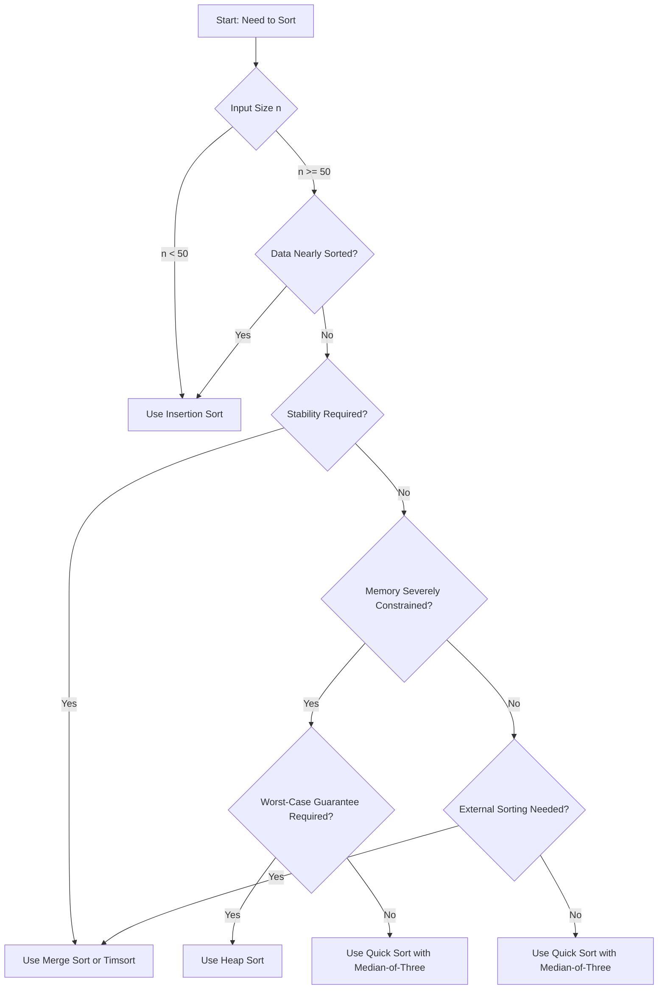

# Heap Sort: Algorithm, Analysis, and Comparative Evaluation

## 1. Introduction

Heap Sort is a comparison-based sorting algorithm that leverages the binary heap data structure to achieve efficient, in-place sorting with guaranteed **O(n log n)** time complexity. Unlike Quick Sort, which may degrade to quadratic time under adverse pivot selections, Heap Sort provides consistent performance across all input distributions. Furthermore, unlike Merge Sort, Heap Sort requires no auxiliary array, operating entirely within the original input array with **O(1)** additional space. These characteristics position Heap Sort as a compelling choice in scenarios demanding both worst-case time guarantees and minimal memory footprint.

## 2. The Binary Heap Data Structure

Heap Sort is built upon the **binary heap**, a specialized tree-based data structure that satisfies the **heap property**. A binary heap can be conceptualized as a nearly complete binary tree stored compactly in an array. The array representation enables efficient navigation between parent and child nodes using simple index arithmetic.

### 2.1 Array Representation of a Heap

Given an array `A` representing a heap, the relationships between a node at index `i` (assuming 0‑based or 1‑based indexing) are as follows (using 1‑based indexing for clarity):

- **Parent:** `parent(i) = ⌊i / 2⌋`
- **Left Child:** `left(i) = 2 * i`
- **Right Child:** `right(i) = 2 * i + 1`

This mapping allows the heap to be traversed without explicit pointers, contributing to its memory efficiency.

### 2.2 Max-Heap and Min-Heap Properties

Two variants of the binary heap exist, distinguished by their ordering invariant:

- **Max-Heap Property:** For every node `i` other than the root, `A[parent(i)] ≥ A[i]`. Consequently, the largest element resides at the root.
- **Min-Heap Property:** For every node `i` other than the root, `A[parent(i)] ≤ A[i]`. Consequently, the smallest element resides at the root.

Heap Sort is typically implemented using a **max-heap** to sort in ascending order. The algorithm first builds a max-heap from the input array, then repeatedly extracts the maximum element (the root) and places it at the end of the array, restoring the heap property after each extraction.

## 3. The Heap Sort Algorithm

Heap Sort consists of two principal phases:

1. **Heap Construction:** Transform the input array into a valid max-heap.
2. **Sort Phase:** Repeatedly remove the maximum element from the heap and place it into the sorted portion of the array.

### 3.1 Heapify Procedure

The fundamental operation for maintaining the heap property is **heapify** (often called `maxHeapify` or `siftDown`). Given an array and an index `i`, `heapify` assumes that the binary trees rooted at `left(i)` and `right(i)` are valid max-heaps, but the element at `i` may violate the max-heap property. The procedure rectifies this by allowing the element at `i` to "sink" down to its correct position.

```
Algorithm: maxHeapify(A, i, heapSize)
Input: Array A, index i, and the current size of the heap
Output: The subtree rooted at i satisfies the max-heap property

1.  left = 2 * i + 1      (using 0‑based indexing)
2.  right = 2 * i + 2
3.  largest = i
4.  if left < heapSize and A[left] > A[largest] then
5.      largest = left
6.  if right < heapSize and A[right] > A[largest] then
7.      largest = right
8.  if largest ≠ i then
9.      swap A[i] and A[largest]
10.     maxHeapify(A, largest, heapSize)
```

### 3.2 Building the Heap

The heap is constructed by calling `maxHeapify` on all non-leaf nodes in a bottom‑up manner. Since leaf nodes trivially satisfy the heap property, processing begins from the last internal node.

```
Algorithm: buildMaxHeap(A)
Input: Array A of length n
Output: A is transformed into a max-heap

1.  heapSize = n
2.  for i = floor(n / 2) - 1 down to 0 do
3.      maxHeapify(A, i, heapSize)
```

### 3.3 Sorting Phase

Once the max-heap is built, the largest element (at `A[0]`) is swapped with the last element of the heap (`A[heapSize - 1]`). The heap size is decremented, effectively removing the maximum element from the heap and placing it into its final sorted position. The `maxHeapify` procedure is then called on the root to restore the heap property for the remaining elements. This process repeats until the heap contains a single element.

```
Algorithm: heapSort(A)
Input: Array A of length n
Output: A is sorted in ascending order

1.  buildMaxHeap(A)
2.  heapSize = n
3.  for i = n - 1 down to 1 do
4.      swap A[0] and A[i]
5.      heapSize = heapSize - 1
6.      maxHeapify(A, 0, heapSize)
```

### 3.4 JavaScript Implementation

The following code implements Heap Sort in JavaScript using 0‑based indexing.

```javascript
/**
 * Maintains the max-heap property for the subtree rooted at index i.
 * Assumes that the subtrees of i are already valid max-heaps.
 *
 * @param {number[]} arr - The array representing the heap.
 * @param {number} i - The index of the root of the subtree to heapify.
 * @param {number} heapSize - The current size of the heap.
 */
function maxHeapify(arr, i, heapSize) {
    const left = 2 * i + 1;
    const right = 2 * i + 2;
    let largest = i;

    if (left < heapSize && arr[left] > arr[largest]) {
        largest = left;
    }
    if (right < heapSize && arr[right] > arr[largest]) {
        largest = right;
    }
    if (largest !== i) {
        // Swap and recursively heapify the affected subtree
        [arr[i], arr[largest]] = [arr[largest], arr[i]];
        maxHeapify(arr, largest, heapSize);
    }
}

/**
 * Builds a max-heap from the given array.
 *
 * @param {number[]} arr - The array to be transformed into a max-heap.
 */
function buildMaxHeap(arr) {
    const n = arr.length;
    // Start from the last non-leaf node and heapify downward
    for (let i = Math.floor(n / 2) - 1; i >= 0; i--) {
        maxHeapify(arr, i, n);
    }
}

/**
 * Sorts an array in place using the Heap Sort algorithm.
 *
 * @param {number[]} arr - The array to be sorted.
 * @returns {number[]} The sorted array (sorted in place).
 */
function heapSort(arr) {
    buildMaxHeap(arr);

    let heapSize = arr.length;
    for (let i = arr.length - 1; i > 0; i--) {
        // Move current root (maximum) to the end
        [arr[0], arr[i]] = [arr[i], arr[0]];
        heapSize--;
        // Restore max-heap property on the reduced heap
        maxHeapify(arr, 0, heapSize);
    }
    return arr;
}

// Example usage
const numbers = [3, 7, 8, 5, 2, 1, 9, 5, 4];
console.log('Original array:', numbers);
heapSort(numbers);
console.log('Sorted array:  ', numbers);
```

**Expected Output:**
```
Original array: [3, 7, 8, 5, 2, 1, 9, 5, 4]
Sorted array:   [1, 2, 3, 4, 5, 5, 7, 8, 9]
```

## 4. Complexity Analysis

Heap Sort exhibits consistent performance characteristics across all input distributions.

### 4.1 Time Complexity

- **Heap Construction:** The `buildMaxHeap` function calls `maxHeapify` on approximately `n/2` nodes. Although an individual `maxHeapify` call takes **O(log n)** time, a tighter bound for the entire construction phase is **O(n)**.
- **Sorting Phase:** The loop executes `n - 1` times. Each iteration performs a swap and calls `maxHeapify` on the root, taking **O(log n)** time. Thus, the sorting phase contributes **O(n log n)**.

**Total Time Complexity:** **O(n log n)** for best, average, and worst cases.

### 4.2 Space Complexity

Heap Sort operates **in place**, requiring only a constant amount of additional memory for loop counters and temporary variables during swapping. The recursive implementation of `maxHeapify` consumes stack space proportional to the height of the heap, which is **O(log n)**. However, an iterative version of `maxHeapify` can eliminate this recursion overhead, reducing auxiliary space to **O(1)**.

### 4.3 Summary Table

| Metric           | Complexity        |
|------------------|-------------------|
| Time (Best)      | O(n log n)        |
| Time (Average)   | O(n log n)        |
| Time (Worst)     | O(n log n)        |
| Space (Auxiliary)| O(1)              |
| Stable           | No                |
| In-Place         | Yes               |
| Adaptive         | No                |

## 5. Comparison: Quick Sort vs. Heap Sort

Both Quick Sort and Heap Sort are efficient, in-place sorting algorithms with **O(n log n)** average-case time complexity. However, they exhibit distinct performance characteristics in practice, and understanding these differences is essential for informed algorithm selection.

### 5.1 Comparative Analysis

| Feature                | Quick Sort                               | Heap Sort                                 |
|------------------------|------------------------------------------|-------------------------------------------|
| **Worst‑Case Time**    | O(n²) (rare with good pivot selection)   | O(n log n) guaranteed                      |
| **Average‑Case Time**  | O(n log n)                               | O(n log n)                                 |
| **Space Complexity**   | O(log n) (recursion stack)               | O(1)                                       |
| **Stability**          | Unstable                                 | Unstable                                   |
| **Cache Performance**  | Excellent (sequential access)            | Poor (non‑sequential memory access)        |
| **Swap Count**         | Few swaps on average                     | High swap count even on sorted data        |
| **Practical Speed**    | Typically faster                         | Typically slower                           |

### 5.2 Why Quick Sort is Faster in Practice

Despite Heap Sort's superior worst-case guarantee, Quick Sort consistently outperforms Heap Sort in most practical scenarios. The primary reasons for this performance disparity are:

**1. Lower Swap Overhead**

Quick Sort performs significantly fewer element swaps than Heap Sort. In Heap Sort, the heapify procedure involves repeated comparisons and swaps as elements "sink" down the heap, even when the data is already sorted. Quick Sort, by contrast, swaps elements only when necessary during partitioning. When the data is partially or fully sorted, Quick Sort's swap count can be near zero.

**2. Cache Locality**

Quick Sort exhibits excellent **spatial locality** of reference. During partitioning, the algorithm scans contiguous segments of the array, accessing memory locations in a predictable, sequential pattern. This behavior aligns optimally with modern CPU cache hierarchies, minimizing cache misses. Heap Sort, however, accesses memory in a non‑sequential pattern determined by the heap structure (parent‑child relationships), resulting in frequent cache misses and degraded performance.

**3. Lower Constant Factors**

The constant factors associated with Quick Sort's inner loops are smaller than those of Heap Sort's `maxHeapify` procedure. Quick Sort's partitioning loop involves simple comparisons and occasional swaps, whereas Heap Sort's heapify requires more complex index calculations and conditional branches.

**4. Pivot Selection Mitigates Worst‑Case**

While Quick Sort's theoretical worst-case O(n²) is a legitimate concern, practical implementations employ **median‑of‑three** pivot selection or **randomized pivots** to reduce the probability of encountering the worst case to negligible levels. In exchange for this mitigated risk, Quick Sort delivers superior average-case performance.

### 5.3 When to Prefer Heap Sort

Heap Sort remains the algorithm of choice in specific constrained environments:

- **Strict Worst‑Case Guarantees:** Real‑time systems or safety‑critical applications where predictable, bounded latency is non‑negotiable.
- **Severe Memory Constraints:** Embedded systems with extremely limited stack space, where Quick Sort's O(log n) recursion depth could risk stack overflow. (An iterative Quick Sort can mitigate this, but Heap Sort offers O(1) space inherently.)
- **Data with Adversarial Patterns:** Situations where input data may be deliberately crafted to trigger Quick Sort's worst‑case behavior (e.g., in security‑sensitive contexts). Randomized pivots mitigate this, but Heap Sort provides a deterministic guarantee.

## 6. Practical Selection Guidelines

The following decision framework incorporates Heap Sort into the broader algorithm selection process.



### 6.1 Summary of Recommendations

| Scenario | Recommended Algorithm | Justification |
|----------|----------------------|---------------|
| Small array (n < 50) | Insertion Sort | Low overhead, simple |
| Nearly sorted data | Insertion Sort | Adaptive O(n) |
| Stability required | Merge Sort / Timsort | Stable, O(n log n) |
| General‑purpose, in‑memory | Quick Sort | Fastest average case |
| Worst‑case guarantee + tight memory | Heap Sort | O(n log n) worst‑case, O(1) space |
| External sorting | Merge Sort | Natural fit for merge phases |

## 7. Conclusion

Heap Sort is a robust, comparison-based sorting algorithm that offers the rare combination of **guaranteed O(n log n) worst-case time complexity** and **O(1) auxiliary space**. These attributes make it a valuable tool in scenarios where both predictable performance and minimal memory footprint are paramount. However, its practical speed is often eclipsed by Quick Sort due to Quick Sort's lower swap overhead and superior cache locality.

Understanding the tradeoffs between Heap Sort and Quick Sort—and, more broadly, among all major sorting algorithms—empowers the engineer to make contextually appropriate decisions. Quick Sort remains the default choice for general‑purpose in‑memory sorting, while Heap Sort serves as a reliable alternative when worst‑case guarantees or extreme memory constraints dominate the design criteria.