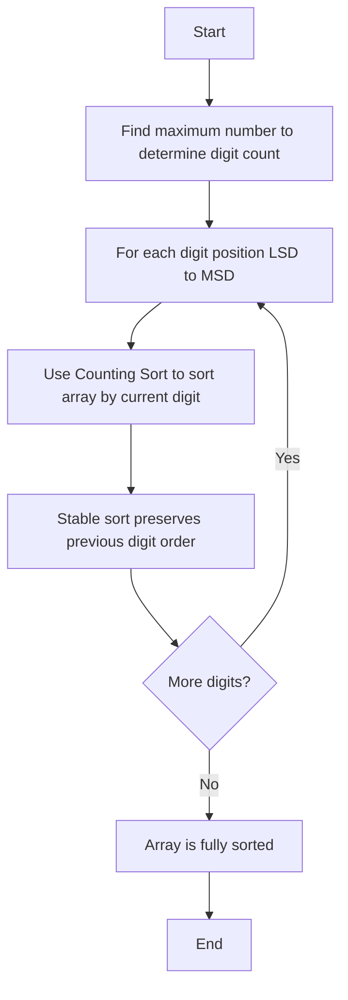

# Resources: Non‑Comparison Sorting Algorithms

## 1. Introduction

The study of sorting algorithms is incomplete without examining techniques that transcend the fundamental **Ω(n log n)** lower bound governing comparison‑based methods. Counting Sort and Radix Sort are exemplary non‑comparison algorithms that achieve linear time complexity by exploiting the inherent structure of integer keys. This document serves as a consolidated reference for these algorithms, providing explanations, complexity analyses, JavaScript implementations, and links to authoritative external resources, including detailed expositions and interactive visualizations.

## 2. Radix Sort

Radix Sort is a non‑comparative integer sorting algorithm that processes individual digits of the keys. It groups keys by the digits that share the same significant position and value, employing a stable subroutine—typically Counting Sort—to order the elements at each digit position. The algorithm operates from the least significant digit (LSD) to the most significant digit (MSD), ensuring that the final ordering respects the entire key.

### 2.1 Algorithm Description

Radix Sort processes an array of integers by repeatedly performing a stable sort on each digit position, beginning with the least significant digit. The stability of the underlying sort is crucial: after sorting by a less significant digit, the relative order established is preserved when sorting by the next more significant digit. This cascading effect yields a fully sorted array.

For a list of `n` integers in base `b` (the radix), each number has at most `d` digits. Radix Sort calls Counting Sort `d` times, once for each digit position. Because the range of each digit is limited to `[0, b‑1]`, each Counting Sort pass takes **O(n + b)** time. The total running time is therefore **O(d · (n + b))**.

### 2.2 Visual Representation

The following flowchart outlines the LSD Radix Sort procedure:



### 2.3 JavaScript Implementation

The following implementation of LSD Radix Sort utilizes Counting Sort as a stable subroutine for each digit position.

```javascript
/**
 * Returns the digit at the specified place value for a given number.
 * @param {number} num - The number to extract the digit from.
 * @param {number} place - The place value (1 for units, 10 for tens, etc.).
 * @returns {number} The digit (0-9).
 */
function getDigit(num, place) {
    return Math.floor(Math.abs(num) / place) % 10;
}

/**
 * Counts the number of digits in a given number.
 * @param {number} num - The number.
 * @returns {number} The count of digits.
 */
function digitCount(num) {
    if (num === 0) return 1;
    return Math.floor(Math.log10(Math.abs(num))) + 1;
}

/**
 * Determines the maximum number of digits among all numbers in an array.
 * @param {number[]} arr - The array of numbers.
 * @returns {number} The maximum digit count.
 */
function mostDigits(arr) {
    let maxDigits = 0;
    for (let num of arr) {
        maxDigits = Math.max(maxDigits, digitCount(num));
    }
    return maxDigits;
}

/**
 * Sorts an array of non‑negative integers using LSD Radix Sort.
 * @param {number[]} arr - The array to be sorted.
 * @returns {number[]} A new sorted array.
 */
function radixSort(arr) {
    if (arr.length === 0) return [];

    const maxDigitCount = mostDigits(arr);

    // Process each digit position from LSD to MSD
    for (let k = 0; k < maxDigitCount; k++) {
        // Create 10 buckets (0-9) for each possible digit
        const buckets = Array.from({ length: 10 }, () => []);

        // Distribute numbers into buckets based on the k‑th digit
        const place = Math.pow(10, k);
        for (let num of arr) {
            const digit = getDigit(num, place);
            buckets[digit].push(num);
        }

        // Flatten buckets back into the array, preserving stability
        arr = [].concat(...buckets);
    }

    return arr;
}

// Example usage
const numbers = [170, 45, 75, 90, 802, 24, 2, 66];
console.log('Radix Sort:', radixSort(numbers));
// Expected output: [2, 24, 45, 66, 75, 90, 170, 802]
```

### 2.4 Complexity Analysis

- **Time Complexity:** **O(d · (n + b))**, where `d` is the maximum number of digits, `n` is the number of elements, and `b` is the base (typically 10 for decimal numbers). When `d` is constant and `b` is fixed, the complexity approaches **O(n)**—linear time.
- **Space Complexity:** **O(n + b)** due to the bucket arrays allocated during each digit pass.

### 2.5 Characteristics and Limitations

- **Stability:** Radix Sort is stable because it relies on a stable subroutine (Counting Sort) for digit‑wise sorting.
- **Data Type Restriction:** Designed for integer keys (or data that can be mapped to integers, such as fixed‑length strings). It is not a general‑purpose sorting algorithm.
- **Overhead:** For small arrays or those with a small number of digits, the constant‑factor overhead of multiple passes may make Radix Sort slower in practice than optimized comparison sorts like Quick Sort.

### 2.6 External Resources

- **Brilliant Wiki: Radix Sort:** A comprehensive textual explanation covering the algorithm's mechanics, mathematical underpinnings, and complexity analysis.  
  [https://brilliant.org/wiki/radix-sort/](https://brilliant.org/wiki/radix-sort/)

- **Radix Sort Animation (USFCA):** An interactive visualization that demonstrates the digit‑by‑digit sorting process in real time.  
  [https://www.cs.usfca.edu/~galles/visualization/RadixSort.html](https://www.cs.usfca.edu/~galles/visualization/RadixSort.html)

## 3. Counting Sort

Counting Sort is a non‑comparison integer sorting algorithm that determines the final position of each element by counting the number of elements with lesser keys. It operates under the assumption that the input consists of non‑negative integers within a known, limited range `[0, k]`. Unlike comparison‑based algorithms, Counting Sort achieves linear time complexity **O(n + k)**.

### 3.1 Algorithm Description

Counting Sort proceeds in three distinct phases:

1. **Count Occurrences:** Traverse the input array and record the frequency of each distinct key value in a **count array** of size `k + 1`.
2. **Compute Cumulative Counts:** Transform the count array into a cumulative frequency array, where each element at index `i` stores the number of keys less than or equal to `i`. This directly yields the final sorted position of each element.
3. **Build Output Array:** Traverse the input array in reverse order (to ensure stability), placing each element into its correct position in an output array using the cumulative counts, and decrementing the count after each placement.

### 3.2 Visual Representation

A simplified flowchart of the Counting Sort algorithm is shown below:

```mermaid
graph TD
    A[Start] --> B[Determine max value k in array]
    B --> C[Create count array of size k+1, initialized to 0]
    C --> D[Traverse input, increment count for each element]
    D --> E[Compute cumulative counts: count[i] += count[i-1]]
    E --> F[Create output array of size n]
    F --> G[Traverse input in reverse order]
    G --> H[Place element at position count[element] - 1]
    H --> I[Decrement count[element]]
    I --> J{All elements processed?}
    J -->|No| G
    J -->|Yes| K[Return output array]
    K --> L[End]
```

### 3.3 JavaScript Implementation

The code below provides a stable, in‑place variant of Counting Sort that returns a new sorted array without modifying the original input.

```javascript
/**
 * Sorts an array of non‑negative integers using Counting Sort.
 * @param {number[]} arr - The array to be sorted.
 * @param {number} maxValue - The maximum value present in the array (optional; computed if omitted).
 * @returns {number[]} A new sorted array.
 */
function countingSort(arr, maxValue = null) {
    if (arr.length === 0) return [];

    // Determine the maximum value if not provided
    const max = maxValue !== null ? maxValue : Math.max(...arr);

    // Step 1: Create and populate the count array
    const count = new Array(max + 1).fill(0);
    for (let num of arr) {
        count[num]++;
    }

    // Step 2: Compute cumulative counts (running sum)
    for (let i = 1; i <= max; i++) {
        count[i] += count[i - 1];
    }

    // Step 3: Build the output array (stable, by iterating backwards)
    const output = new Array(arr.length);
    for (let i = arr.length - 1; i >= 0; i--) {
        const num = arr[i];
        output[count[num] - 1] = num;
        count[num]--;
    }

    return output;
}

// Example usage
const numbers = [4, 2, 2, 8, 3, 3, 1, 0];
console.log('Counting Sort:', countingSort(numbers));
// Expected output: [0, 1, 2, 2, 3, 3, 4, 8]
```

### 3.4 Complexity Analysis

- **Time Complexity:** **O(n + k)**, where `n` is the number of elements and `k` is the range of input values. When `k = O(n)`, the complexity reduces to linear time **O(n)**.
- **Space Complexity:** **O(n + k)** due to the output array and the count array.

### 3.5 Characteristics and Limitations

- **Stability:** Counting Sort is stable when implemented with reverse traversal during the output construction phase.
- **Integer Keys Only:** The algorithm requires non‑negative integer keys. Arbitrary objects cannot be sorted directly without an integer mapping.
- **Range Sensitivity:** Performance degrades significantly if `k` is much larger than `n`. Counting Sort is not suitable for sorting a few elements with a vast range of possible values.

### 3.6 External Resources

- **Brilliant Wiki: Counting Sort:** A detailed explanation of the algorithm, including step‑by‑step examples and complexity derivations.  
  [https://brilliant.org/wiki/counting-sort/](https://brilliant.org/wiki/counting-sort/)

- **Counting Sort Animation (USFCA):** An interactive visualization that illustrates the counting and placement phases of the algorithm.  
  [https://www.cs.usfca.edu/~galles/visualization/CountingSort.html](https://www.cs.usfca.edu/~galles/visualization/CountingSort.html)

## 4. Comparison of Non‑Comparison and Comparison Sorts

The following table summarizes key distinctions between non‑comparison algorithms and traditional comparison‑based sorts.

| Criterion               | Counting Sort / Radix Sort          | Merge Sort / Quick Sort / Heap Sort |
|-------------------------|-------------------------------------|-------------------------------------|
| **Sorting Paradigm**    | Non‑comparison (exploits key structure) | Comparison‑based                    |
| **Data Type**           | Integers (or mappable) with bounded range | Any type with a total order         |
| **Average Time**        | O(n + k) or O(d · (n + b))          | O(n log n)                          |
| **Worst‑Case Time**     | O(n + k) or O(d · (n + b))          | O(n log n) or O(n²) (Quick)         |
| **Space Complexity**    | O(n + k) or O(n + b)                | O(1) to O(n)                        |
| **Stability**           | Stable                              | Varies (Merge: stable; Quick: unstable) |
| **Practical Use**       | Specialized (integer keys, known range) | General‑purpose                     |

## 5. When to Use Non‑Comparison Sorts

Non‑comparison sorting algorithms are not universal replacements for comparison sorts. They are optimally employed under the following conditions:

- The data consists of **integers** (or can be mapped to integers, e.g., characters via ASCII codes).
- The **range of possible values is limited** and known in advance.
- **Stability** is required (both Counting Sort and Radix Sort are stable).
- **Linear time performance** is critical and the dataset is sufficiently large to justify the specialized implementation.

**Example Applications:**

- Sorting exam scores (0–100) for thousands of students.
- Ordering zip codes, area codes, or fixed‑length identification numbers.
- Preprocessing categorical features in machine learning pipelines.
- Sorting fixed‑length strings lexicographically using Radix Sort.

## 6. Further Reading and References

- **MIT OpenCourseWare – Lecture 7: Counting Sort, Radix Sort, Lower Bounds for Sorting:** A rigorous academic lecture covering the theoretical lower bounds for comparison sorting and the linear‑time non‑comparison algorithms.  
  [https://ocw.mit.edu/courses/6-006-introduction-to-algorithms-fall-2011/resources/lecture-7-counting-sort-radix-sort-lower-bounds-for-sorting/](https://ocw.mit.edu/courses/6-006-introduction-to-algorithms-fall-2011/resources/lecture-7-counting-sort-radix-sort-lower-bounds-for-sorting/)

- **Kent State University – Radix Sort Analysis:** A concise analysis of Radix Sort's running time and its relationship to Counting Sort.  
  [http://personal.kent.edu/~rmuhamma/Algorithms/MyAlgorithms/Sorting/radixSort.htm](http://personal.kent.edu/~rmuhamma/Algorithms/MyAlgorithms/Sorting/radixSort.htm)

## 7. Conclusion

Counting Sort and Radix Sort represent a distinct class of sorting algorithms that achieve linear time complexity by abandoning pairwise comparisons in favor of exploiting key properties. While their applicability is constrained to integer keys within bounded ranges, they offer unparalleled speed under these conditions and serve as essential subroutines in more complex sorting tasks. The resources and implementations provided in this document are intended to support both academic study and practical application, equipping the learner with a comprehensive understanding of these specialized algorithms.