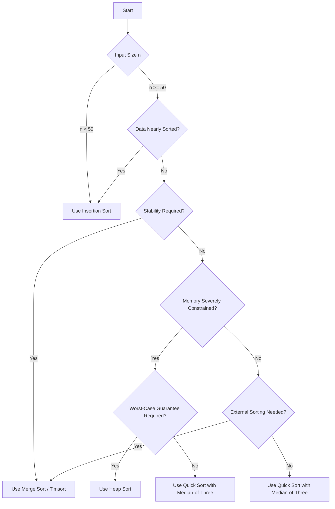

# Section Conclusion: Sorting Algorithms

## 1. Overview

The study of sorting algorithms constitutes a foundational pillar of computer science education and technical interview preparation. This section has systematically examined a spectrum of sorting techniques, ranging from elementary quadratic methods to advanced divide-and-conquer approaches and specialized non-comparison sorts. The overarching theme has been the critical evaluation of tradeoffs—time complexity, space complexity, stability, adaptivity, and implementation complexity—that inform algorithm selection in diverse computational contexts.

## 2. Summary of Key Sorting Algorithms

### 2.1 Elementary Sorts: Bubble Sort, Selection Sort, Insertion Sort

| Algorithm      | Time (Average) | Space | Stable | Practical Use |
|----------------|----------------|-------|--------|---------------|
| Bubble Sort    | O(n²)          | O(1)  | Yes    | Educational only; rarely used in production |
| Selection Sort | O(n²)          | O(1)  | No     | Educational; minimal swaps but poor performance |
| Insertion Sort | O(n²)          | O(1)  | Yes    | Small datasets (`n < 50`), nearly sorted data, online insertion |

**Key Takeaways:**

- Bubble Sort and Selection Sort serve primarily as pedagogical tools to introduce algorithmic concepts such as nested loops, swapping, and complexity analysis.
- Insertion Sort, despite its quadratic average-case complexity, is exceptionally efficient for small or nearly sorted inputs due to its adaptivity and low constant-factor overhead. It is frequently employed as a subroutine within hybrid algorithms.

### 2.2 Advanced Comparison Sorts: Merge Sort and Quick Sort

| Algorithm      | Time (Average) | Time (Worst) | Space        | Stable | In‑Place |
|----------------|----------------|--------------|--------------|--------|----------|
| Merge Sort     | O(n log n)     | O(n log n)   | O(n)         | Yes    | No       |
| Quick Sort     | O(n log n)     | O(n²)        | O(log n)     | No     | Yes      |

**Merge Sort:**

- **Strengths:** Guaranteed O(n log n) performance in all cases; inherently stable; well‑suited for external sorting of data that exceeds main memory.
- **Weaknesses:** Requires O(n) auxiliary space, which may be prohibitive in memory‑constrained environments.

**Quick Sort:**

- **Strengths:** Excellent average‑case performance with low constant factors; in‑place operation yields O(log n) space complexity; superior cache locality makes it the fastest comparison sort in practice.
- **Weaknesses:** Worst‑case O(n²) time complexity if pivot selection is poor (mitigated by median‑of‑three or randomized pivots); unstable.

**Decision Guideline:**

- Prefer **Merge Sort** when stability is required, worst‑case guarantees are paramount, or external sorting is necessary.
- Prefer **Quick Sort** for general‑purpose in‑memory sorting where average‑case speed and memory efficiency are prioritized.

### 2.3 Non‑Comparison Sorts: Counting Sort and Radix Sort

| Algorithm      | Time Complexity | Space Complexity | Data Type Requirement            |
|----------------|-----------------|------------------|----------------------------------|
| Counting Sort  | O(n + k)        | O(n + k)         | Non‑negative integers, known range |
| Radix Sort     | O(d·(n + b))    | O(n + b)         | Integers or fixed‑length strings   |

**Key Takeaways:**

- Non‑comparison sorts circumvent the Ω(n log n) lower bound by exploiting the digital structure of integer keys.
- They achieve linear time complexity when the key range (`k`) is small relative to `n`.
- Applicability is limited to specific data types and bounded ranges; they are not general‑purpose replacements for comparison sorts.

## 3. Algorithm Selection Framework

The choice of sorting algorithm is contextual. The following decision tree encapsulates the primary considerations.

## 4. Practical Guidance for Technical Interviews

In interview settings, the ability to articulate tradeoffs often outweighs the rote implementation of a complex algorithm. The following strategies are recommended:

### 4.1 Acknowledging Time Constraints

When asked to implement a sorting algorithm under time pressure, it is prudent to propose a simpler, albeit less efficient, algorithm while demonstrating awareness of more optimal solutions.

**Sample Response:**

> "Given the time constraints of this interview, I would implement **Bubble Sort** for its simplicity and ease of coding. However, I recognize that Bubble Sort has O(n²) time complexity and is not suitable for production systems. In a real‑world scenario, I would leverage the language's built‑in `sort()` method, which typically implements a highly optimized hybrid algorithm such as Timsort or Introsort. If a custom implementation were required, I would advocate for **Merge Sort** due to its guaranteed O(n log n) performance and stability, or **Quick Sort** for its average‑case efficiency and memory frugality."

### 4.2 Demonstrating Knowledge of Divide and Conquer

Even without writing the full code, referencing divide‑and‑conquer strategies signals deeper algorithmic understanding.

**Sample Response:**

> "To sort this dataset efficiently, we can apply a **divide‑and‑conquer** approach. By recursively splitting the array into halves, sorting each half independently, and then merging the sorted halves, we achieve O(n log n) time complexity. This is the essence of **Merge Sort**, which provides consistent performance regardless of input ordering."

### 4.3 Discussing Built‑In Sort Functions

Highlighting awareness of language‑specific sorting implementations demonstrates practical engineering knowledge.

**Sample Response:**

> "In practice, I would use the language's built‑in sorting function. For example, JavaScript's `Array.prototype.sort()` is implemented using **Timsort** in modern engines like V8, which is stable and adaptive. In Java, `Arrays.sort()` uses a dual‑pivot Quick Sort for primitives and Timsort for objects. Understanding these underlying implementations helps in selecting the appropriate method and anticipating performance characteristics."

## 5. Conclusion

The sorting algorithms section has equipped learners with a comprehensive understanding of the principal sorting techniques and their associated tradeoffs. The key takeaways are:

- **O(n log n)** is the theoretical optimum for comparison‑based sorting; algorithms achieving this bound—Merge Sort, Quick Sort, and Heap Sort—are the workhorses of practical software development.
- **Insertion Sort** excels in niche scenarios involving small or nearly ordered data.
- **Non‑comparison sorts** offer linear time complexity for integer data within bounded ranges but lack generality.
- **Algorithm selection** is a nuanced decision informed by input size, initial ordering, stability requirements, and memory constraints.

In professional practice, developers rarely implement sorting algorithms from scratch, relying instead on battle‑tested library functions. Nevertheless, a deep understanding of these algorithms fosters better design decisions, enables effective debugging, and proves invaluable in technical interviews. The principles internalized in this section form a durable foundation for continued growth in computer science and software engineering.