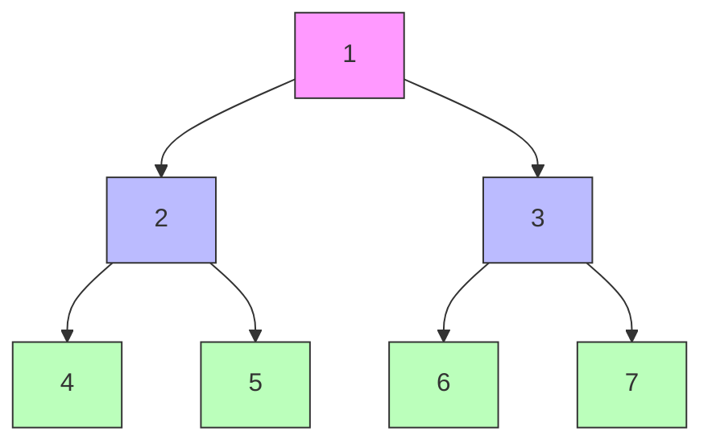

# Searching and Traversal Algorithms

## 1. Introduction to Searching and Traversal

Searching is a fundamental operation in computer science that involves locating a specific element within a data structure or determining whether an element exists. Traversal refers to the systematic process of visiting each node in a data structure, such as a tree or graph, exactly once.

The ubiquity of search operations in modern computing cannot be overstated. Users perform search operations daily through activities such as:

- Locating files within a computer file system
- Searching for specific text within documents
- Querying web search engines like Google
- Filtering content using hashtags on social media platforms

As global data volumes continue to expand exponentially, the efficiency of search algorithms becomes critically important. Understanding the foundational algorithms that power these operations provides essential insight into how large-scale systems maintain rapid response times despite operating on massive datasets.

---

## 2. Foundational Concepts

### 2.1 Data Structures for Searching

Before examining specific search algorithms, it is essential to understand the data structures upon which they operate. The two primary structures discussed in this context are:

- **Trees**: Hierarchical structures consisting of nodes connected by edges, with a single root node and no cycles.
- **Graphs**: Collections of vertices (nodes) and edges that may contain cycles and need not be hierarchical.

### 2.2 Traversal vs. Searching

| Operation | Purpose | Outcome |
|-----------|---------|---------|
| **Traversal** | Visit every node in a data structure | Complete visitation sequence |
| **Searching** | Locate a specific target node | Boolean result or node location |

Traversal algorithms form the basis for many search operations, as they define the order in which nodes are examined when seeking a particular value.

---

## 3. Breadth-First Search (BFS)

### 3.1 Definition and Characteristics

Breadth-First Search is a graph traversal algorithm that explores all vertices at the current depth level before proceeding to vertices at the next depth level. This approach is analogous to the ripples created when a stone is dropped into water.

**Key Properties:**

- Explores nodes in order of increasing distance from the source
- Guarantees finding the shortest path in unweighted graphs
- Utilizes a queue data structure for node management
- Suitable for scenarios where proximity matters

### 3.2 Algorithm Steps

1. Enqueue the starting node and mark it as visited
2. While the queue is not empty:
   - Dequeue the front node
   - Process the node (examine its value)
   - Enqueue all unvisited adjacent nodes and mark them as visited
3. Continue until the queue becomes empty

### 3.3 Implementation in JavaScript

```javascript
/**
 * Breadth-First Search implementation for a tree structure
 * @param {Object} root - The root node of the tree
 * @param {any} target - The value being searched for
 * @returns {boolean} - True if target is found, false otherwise
 */
function breadthFirstSearch(root, target) {
    // Initialize queue with the root node
    const queue = [root];
    
    while (queue.length > 0) {
        // Remove the first element from the queue
        const currentNode = queue.shift();
        
        // Process current node - check for target
        console.log(`Visiting: ${currentNode.value}`);
        
        if (currentNode.value === target) {
            return true;  // Target found
        }
        
        // Add all child nodes to the queue (explore level by level)
        if (currentNode.left) {
            queue.push(currentNode.left);
        }
        if (currentNode.right) {
            queue.push(currentNode.right);
        }
    }
    
    return false;  // Target not found after complete traversal
}
```

### 3.4 Visual Representation

The following Mermaid diagram illustrates the BFS traversal order on a simple binary tree:



**Traversal Order:** 1 → 2 → 3 → 4 → 5 → 6 → 7

---

## 4. Depth-First Search (DFS)

### 4.1 Definition and Characteristics

Depth-First Search explores a graph by traversing as far as possible along each branch before backtracking. This approach is comparable to navigating through a maze by following each path to its conclusion before trying alternative routes.

**Key Properties:**

- Explores complete paths before backtracking
- Does not guarantee shortest path discovery
- Uses a stack (or recursion) for node management
- Memory efficient for deep structures

### 4.2 Types of DFS Traversal

For tree structures, DFS can be implemented in three distinct orders:

| Traversal Type | Order of Visiting Nodes |
|----------------|-------------------------|
| **Pre-order** | Root → Left Subtree → Right Subtree |
| **In-order** | Left Subtree → Root → Right Subtree |
| **Post-order** | Left Subtree → Right Subtree → Root |

### 4.3 Implementation in JavaScript

```javascript
/**
 * Depth-First Search (Pre-order) implementation using recursion
 * @param {Object} node - Current node being examined
 * @param {any} target - The value being searched for
 * @returns {boolean} - True if target is found, false otherwise
 */
function depthFirstSearch(node, target) {
    // Base case: reached a null node (end of branch)
    if (node === null) {
        return false;
    }
    
    // Process current node (Pre-order: Root first)
    console.log(`Visiting: ${node.value}`);
    
    if (node.value === target) {
        return true;  // Target found at current node
    }
    
    // Recursively search left subtree
    // Short-circuit evaluation: return true if found in left subtree
    if (depthFirstSearch(node.left, target)) {
        return true;
    }
    
    // Recursively search right subtree
    return depthFirstSearch(node.right, target);
}
```

### 4.4 Iterative DFS Using Stack

```javascript
/**
 * Iterative Depth-First Search using explicit stack
 * @param {Object} root - Root node of the tree
 * @param {any} target - Value being searched for
 * @returns {boolean} - True if target found
 */
function iterativeDFS(root, target) {
    if (root === null) return false;
    
    const stack = [root];
    
    while (stack.length > 0) {
        // Pop the top element (LIFO behavior)
        const currentNode = stack.pop();
        
        console.log(`Visiting: ${currentNode.value}`);
        
        if (currentNode.value === target) {
            return true;
        }
        
        // Push right child first so left child is processed first
        if (currentNode.right) {
            stack.push(currentNode.right);
        }
        if (currentNode.left) {
            stack.push(currentNode.left);
        }
    }
    
    return false;
}
```

---

## 5. Comparison of BFS and DFS

### 5.1 Algorithmic Differences

| Aspect | Breadth-First Search | Depth-First Search |
|--------|---------------------|-------------------|
| **Data Structure** | Queue (FIFO) | Stack (LIFO) or Recursion |
| **Memory Usage** | Higher for wide graphs | Lower for deep graphs |
| **Shortest Path** | Guaranteed in unweighted graphs | Not guaranteed |
| **Traversal Pattern** | Level by level | Branch by branch |

### 5.2 Use Case Scenarios

**BFS is Preferred When:**
- Finding the shortest path between two nodes
- Searching in graphs where the target is likely near the source
- Web crawling for indexing nearby pages first
- Social network friend recommendation (closest connections)

**DFS is Preferred When:**
- Memory constraints exist
- The target is likely deep in the structure
- Topological sorting is required
- Solving maze puzzles or pathfinding with backtracking
- Detecting cycles in a graph

---

## 6. Real-World Applications

### 6.1 Web Search Engines

Search engines like Google employ sophisticated versions of graph traversal algorithms to crawl and index the World Wide Web. The web can be modeled as a massive directed graph where pages are nodes and hyperlinks are edges. Crawlers use BFS-like approaches to systematically discover and index new content.

### 6.2 Social Networks

Platforms like Facebook and LinkedIn use graph traversal algorithms for:
- Friend recommendation (finding connections of connections)
- Determining degrees of separation between users
- Content feed generation based on relationship proximity

### 6.3 Navigation and Mapping

GPS and mapping applications like Google Maps utilize:
- BFS for finding shortest routes in terms of number of turns
- Advanced variations like Dijkstra's algorithm and A* for weighted pathfinding

---

## 7. Summary

Searching and traversal algorithms form the backbone of modern computing applications that handle large-scale data retrieval operations. Breadth-First Search provides systematic level-by-level exploration ideal for proximity-based searches, while Depth-First Search offers memory-efficient deep exploration suitable for exhaustive path analysis.

Understanding these foundational algorithms provides essential insight into how complex systems manage to deliver rapid search results despite operating on increasingly massive datasets. The principles learned here serve as building blocks for more advanced algorithms encountered in advanced data structures and algorithm design courses.