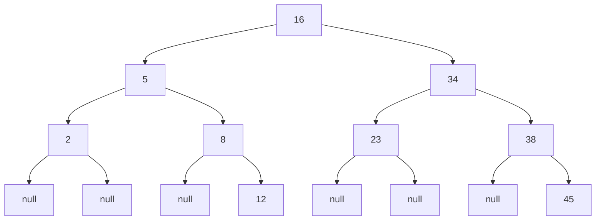

# Binary Search

## 1. Introduction to Binary Search

Binary search is an efficient algorithm for locating a target value within a sorted collection. Unlike linear search, which examines elements sequentially, binary search leverages the ordered nature of the data to eliminate half of the remaining elements at each step. This divide-and-conquer strategy dramatically reduces the number of comparisons required, making binary search significantly faster for large datasets.

The fundamental prerequisite for binary search is that the collection must be sorted. Without ordering, the algorithm cannot reliably determine which half of the collection to discard during each iteration.

---

## 2. Algorithm Principle

Binary search operates on the principle of repeatedly dividing the search interval in half. The procedure can be summarized as follows:

1. Identify the middle element of the current search interval.
2. Compare the middle element with the target value.
3. If the middle element equals the target, the search concludes successfully.
4. If the target is less than the middle element, discard the right half and restrict the search to the left half.
5. If the target is greater than the middle element, discard the left half and restrict the search to the right half.
6. Repeat steps 1 through 5 until either the target is found or the search interval becomes empty.

This systematic reduction of the search space ensures that at most O(log n) comparisons are performed, where n represents the number of elements in the collection.

---

## 3. Visual Illustration

Consider a sorted array of integers:

```
Array: [2, 5, 8, 12, 16, 23, 34, 38, 45]
Indices: 0   1   2   3   4   5   6   7   8
```

Searching for the target value **34** proceeds as follows:

```
Step 1:
Search range: indices 0 to 8
Middle index = floor((0 + 8) / 2) = 4
Value at index 4 = 16
Comparison: 34 > 16 → Discard left half (indices 0–4)

Step 2:
Search range: indices 5 to 8
Middle index = floor((5 + 8) / 2) = 6
Value at index 6 = 34
Comparison: 34 == 34 → Match found at index 6
```

Only two comparisons were required to locate the target, whereas linear search would have needed seven comparisons.

---

## 4. Relationship with Binary Search Trees

The decision-making process in binary search mirrors the traversal of a binary search tree (BST). In a BST, each node contains a value, and the left subtree holds smaller values while the right subtree holds larger values. Searching in a BST involves comparing the target with the current node and deciding to move left or right accordingly.

A sorted array can be conceptually mapped to a balanced binary search tree as shown below:



Searching for 34 in this tree follows the path: 16 → 34, requiring only two decisions. This illustrates why binary search achieves logarithmic time complexity: at each step, half of the remaining nodes are eliminated from consideration.

---

## 5. Time Complexity Analysis

Binary search exhibits the following performance characteristics:

| Case | Description | Number of Comparisons | Big-O Notation |
|------|-------------|----------------------|----------------|
| **Best Case** | Target is the middle element of the initial search | 1 | O(1) |
| **Worst Case** | Target is not present or is at one of the ends | log₂(n) + 1 | O(log n) |
| **Average Case** | Target is equally likely to be any element | ≈ log₂(n) | O(log n) |

The logarithmic complexity arises from the halving of the search space with each iteration. For a collection of size n, the maximum number of steps required is approximately log₂(n). For instance:

- n = 1,000 → at most 10 comparisons
- n = 1,000,000 → at most 20 comparisons

This efficiency makes binary search highly suitable for large sorted datasets.

---

## 6. Implementation in JavaScript

### 6.1 Iterative Binary Search

```javascript
/**
 * Performs binary search on a sorted array to find the index of a target value.
 * @param {Array} sortedArray - A sorted array of numbers (ascending order).
 * @param {number} target - The value to search for.
 * @returns {number} - The index of the target if found; otherwise -1.
 */
function binarySearch(sortedArray, target) {
    let left = 0;
    let right = sortedArray.length - 1;
    
    // Continue searching while the interval is valid
    while (left <= right) {
        // Calculate middle index using Math.floor to avoid floating point
        const mid = Math.floor((left + right) / 2);
        const midValue = sortedArray[mid];
        
        // Check if middle element is the target
        if (midValue === target) {
            return mid;  // Target found, return its index
        }
        
        // If target is greater, discard left half
        if (target > midValue) {
            left = mid + 1;
        } 
        // If target is smaller, discard right half
        else {
            right = mid - 1;
        }
    }
    
    // Search interval exhausted, target not present
    return -1;
}

// Example usage
const numbers = [2, 5, 8, 12, 16, 23, 34, 38, 45];
const targetIndex = binarySearch(numbers, 34);
console.log(targetIndex); // Output: 6
```

### 6.2 Recursive Binary Search

```javascript
/**
 * Recursive implementation of binary search.
 * @param {Array} sortedArray - Sorted array to search.
 * @param {number} target - Value to find.
 * @param {number} left - Starting index of search interval.
 * @param {number} right - Ending index of search interval.
 * @returns {number} - Index of target or -1 if not found.
 */
function binarySearchRecursive(sortedArray, target, left = 0, right = sortedArray.length - 1) {
    // Base case: search interval is empty
    if (left > right) {
        return -1;
    }
    
    const mid = Math.floor((left + right) / 2);
    const midValue = sortedArray[mid];
    
    if (midValue === target) {
        return mid;
    }
    
    if (target > midValue) {
        // Search right half
        return binarySearchRecursive(sortedArray, target, mid + 1, right);
    } else {
        // Search left half
        return binarySearchRecursive(sortedArray, target, left, mid - 1);
    }
}
```

---

## 7. Precondition: Sorted Data

Binary search mandates that the data be sorted. Sorting a collection incurs its own computational cost, typically O(n log n) for efficient algorithms like merge sort or quicksort. Consequently, binary search is most advantageous in scenarios where:

- The collection is already maintained in sorted order (e.g., balanced trees).
- Multiple searches will be performed on the same dataset, amortizing the initial sorting cost.
- The dataset is static and can be sorted once for many subsequent queries.

In contrast, if only a single search is needed on unsorted data, linear search may be more practical, as sorting would introduce unnecessary overhead.

---

## 8. Comparison: Linear Search vs. Binary Search

| Aspect | Linear Search | Binary Search |
|--------|---------------|---------------|
| **Data Requirement** | Works on unsorted data | Requires sorted data |
| **Time Complexity** | O(n) | O(log n) |
| **Space Complexity** | O(1) | O(1) iterative, O(log n) recursive (call stack) |
| **Implementation** | Simple loop | Slightly more complex logic |
| **Suitable For** | Small datasets, unsorted lists | Large sorted datasets, frequent searches |

---

## 9. Traversal Versus Searching

The discussion of search algorithms naturally leads to the concept of **traversal**. While searching aims to locate a specific element, traversal involves visiting every node in a data structure. Traversal operations are essential for tasks such as:

- Applying a function to all elements (e.g., doubling each value).
- Collecting all elements into a different structure.
- Validating properties across the entire dataset.

Traversal algorithms, such as breadth-first search (BFS) and depth-first search (DFS), are distinct from search algorithms like binary search because they do not leverage ordering to skip elements. They are necessary when the operation requires touching each element exactly once.

---

## 10. Summary

Binary search is a highly efficient algorithm for locating elements within sorted collections, achieving logarithmic time complexity through repeated halving of the search space. Its underlying principle of divide and conquer is shared with efficient sorting algorithms and tree-based data structures. Understanding binary search is fundamental for appreciating the performance gains possible when data is organized appropriately, and it serves as a gateway to more advanced topics in searching and traversal.