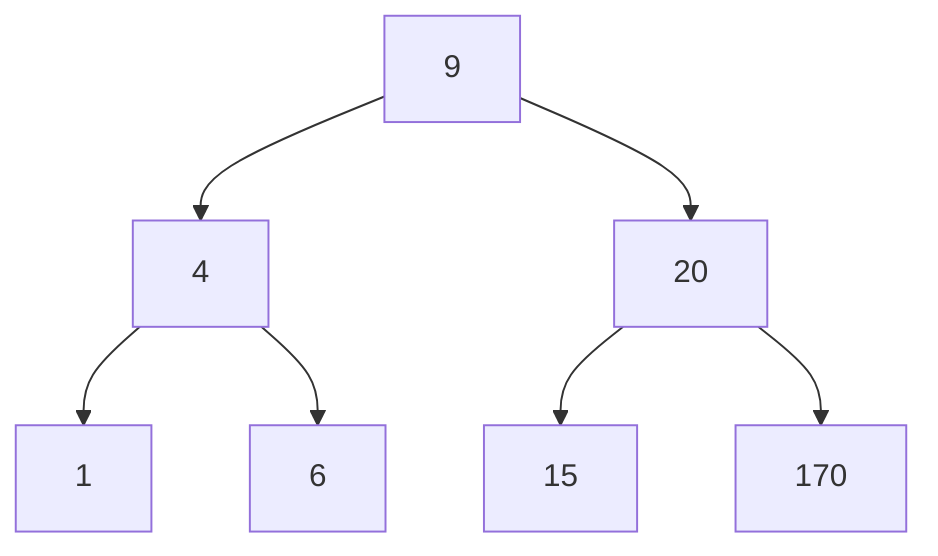

# Tree and Graph Traversal

## 1. Introduction to Traversal

Traversal refers to the systematic process of visiting each node in a data structure exactly once. The terms **traversal** and **search** are frequently used interchangeably in algorithmic contexts, though they carry distinct connotations. Searching typically implies a goal-oriented operation aimed at locating a specific element, whereas traversal encompasses any operation that requires examining every node within a structure.

Common scenarios necessitating traversal include:

- Applying a uniform update to all nodes (e.g., adding a property to every user object).
- Validating structural integrity (e.g., confirming that a binary search tree satisfies ordering invariants).
- Collecting all elements for further processing or transformation.
- Exploring graph-based data where no inherent ordering exists.

Because traversal mandates visiting every node, the time complexity of any traversal algorithm is O(n), where n represents the total number of nodes in the structure.

---

## 2. Motivation for Using Trees and Graphs

While linear data structures such as arrays and linked lists are conceptually simpler, trees and graphs offer compelling advantages for specific use cases:

| Data Structure | Search Efficiency | Ordered Data | Insertion/Deletion | Use Case |
|----------------|-------------------|--------------|---------------------|----------|
| **Sorted Array** | O(log n) (binary search) | Maintains order | O(n) (shifting required) | Static datasets with frequent searches |
| **Hash Table** | O(1) average | No inherent order | O(1) average | Fast key-based lookups |
| **Binary Search Tree** | O(log n) (balanced) | Maintains order | O(log n) (balanced) | Dynamic datasets requiring ordered traversal |
| **Graph** | Depends on algorithm | Flexible relationships | Depends on representation | Modeling real-world networks |

Trees and graphs provide a balance between efficient search operations and the ability to represent hierarchical or interconnected relationships that mirror real-world structures such as file systems, organizational charts, social networks, and navigation maps.

---

## 3. Categories of Traversal

Two primary traversal strategies are employed for both tree and graph structures:

- **Breadth-First Search (BFS)** / **Breadth-First Traversal**
- **Depth-First Search (DFS)** / **Depth-First Traversal**

Both techniques are applicable to trees and graphs with minimal modification. In tree traversal, the absence of cycles simplifies implementation, whereas graph traversal requires additional mechanisms to track visited nodes and prevent infinite loops.

---

## 4. Breadth-First Traversal

### 4.1 Definition and Characteristics

Breadth-First Traversal explores nodes level by level, beginning at the root (or a specified start node) and progressing outward. All nodes at distance k from the starting point are visited before any node at distance k+1.

**Key Properties:**

- Employs a queue (First-In-First-Out) to manage the visitation order.
- Guarantees that nodes are processed in increasing order of depth.
- Suitable for operations requiring proximity-based processing.

### 4.2 Algorithm Steps

1. Enqueue the starting node and mark it as visited.
2. While the queue is not empty:
   - Dequeue the front node.
   - Process the node (perform required operation).
   - Enqueue all unvisited adjacent nodes and mark them as visited.
3. Terminate when the queue becomes empty.

### 4.3 Implementation in JavaScript

```javascript
/**
 * Performs breadth-first traversal on a binary tree.
 * @param {Object} root - The root node of the tree.
 * @param {Function} callback - Function to execute on each node's value.
 */
function breadthFirstTraversal(root, callback) {
    if (root === null) return;
    
    const queue = [root];
    
    while (queue.length > 0) {
        const currentNode = queue.shift();
        
        // Process the current node
        callback(currentNode.value);
        
        // Enqueue child nodes (left then right)
        if (currentNode.left) {
            queue.push(currentNode.left);
        }
        if (currentNode.right) {
            queue.push(currentNode.right);
        }
    }
}

// Example usage: Multiply each node's value by 2
const tree = {
    value: 9,
    left: { value: 4, left: { value: 1 }, right: { value: 6 } },
    right: { value: 20, left: { value: 15 }, right: { value: 170 } }
};

breadthFirstTraversal(tree, (val) => console.log(val * 2));
```

### 4.4 Visual Representation



**BFS Traversal Order:** 9 → 4 → 20 → 1 → 6 → 15 → 170

---

## 5. Depth-First Traversal

### 5.1 Definition and Characteristics

Depth-First Traversal explores as far down a branch as possible before backtracking to explore alternative paths. This approach is analogous to navigating a maze by following each corridor to its conclusion before retracing steps.

**Key Properties:**

- Utilizes a stack (Last-In-First-Out) or recursion for node management.
- Memory usage is proportional to the depth of the tree or graph.
- Offers three distinct visitation orders for tree structures.

### 5.2 Traversal Orders for Trees

| Order | Visitation Sequence | Common Application |
|-------|---------------------|---------------------|
| **Pre-order** | Node → Left Subtree → Right Subtree | Creating a copy of the tree |
| **In-order** | Left Subtree → Node → Right Subtree | Retrieving sorted sequence from BST |
| **Post-order** | Left Subtree → Right Subtree → Node | Deleting a tree (bottom-up cleanup) |

### 5.3 Implementation in JavaScript

```javascript
/**
 * Performs in-order depth-first traversal on a binary tree.
 * @param {Object} node - Current node being visited.
 * @param {Function} callback - Function to execute on each node's value.
 */
function inOrderTraversal(node, callback) {
    if (node === null) return;
    
    // Traverse left subtree
    inOrderTraversal(node.left, callback);
    
    // Process current node
    callback(node.value);
    
    // Traverse right subtree
    inOrderTraversal(node.right, callback);
}

/**
 * Performs pre-order depth-first traversal.
 */
function preOrderTraversal(node, callback) {
    if (node === null) return;
    
    callback(node.value);
    preOrderTraversal(node.left, callback);
    preOrderTraversal(node.right, callback);
}

/**
 * Performs post-order depth-first traversal.
 */
function postOrderTraversal(node, callback) {
    if (node === null) return;
    
    postOrderTraversal(node.left, callback);
    postOrderTraversal(node.right, callback);
    callback(node.value);
}
```

### 5.4 Visual Representation of Orders

Using the tree diagram from Section 4.4:

- **In-order:** 1 → 4 → 6 → 9 → 15 → 20 → 170 (sorted order for BST)
- **Pre-order:** 9 → 4 → 1 → 6 → 20 → 15 → 170
- **Post-order:** 1 → 6 → 4 → 15 → 170 → 20 → 9

---

## 6. Graph Traversal Considerations

Graph traversal employs the same BFS and DFS algorithms but requires additional safeguards due to the presence of cycles and disconnected components.

### 6.1 Handling Cycles

A `visited` set (or boolean flag on nodes) must be maintained to prevent revisiting nodes and entering infinite loops.

```javascript
/**
 * Breadth-First Search for a graph represented as an adjacency list.
 * @param {Object} graph - Adjacency list: { node: [neighbors] }
 * @param {string} start - Starting node identifier.
 */
function bfsGraph(graph, start) {
    const visited = new Set();
    const queue = [start];
    visited.add(start);
    
    while (queue.length > 0) {
        const current = queue.shift();
        console.log(current);
        
        for (const neighbor of graph[current]) {
            if (!visited.has(neighbor)) {
                visited.add(neighbor);
                queue.push(neighbor);
            }
        }
    }
}
```

### 6.2 Disconnected Graphs

In graphs with multiple connected components, traversal must be initiated from each unvisited node to ensure complete coverage.

```javascript
function bfsDisconnected(graph) {
    const visited = new Set();
    
    for (const node in graph) {
        if (!visited.has(node)) {
            // Process new component starting from 'node'
            const queue = [node];
            visited.add(node);
            
            while (queue.length > 0) {
                const current = queue.shift();
                console.log(current);
                
                for (const neighbor of graph[current]) {
                    if (!visited.has(neighbor)) {
                        visited.add(neighbor);
                        queue.push(neighbor);
                    }
                }
            }
        }
    }
}
```

---

## 7. Comparison of BFS and DFS Traversal

| Criteria | Breadth-First Traversal | Depth-First Traversal |
|----------|-------------------------|------------------------|
| **Data Structure** | Queue | Stack (explicit or call stack) |
| **Memory Requirement** | Stores all nodes at current level (can be large for wide structures) | Stores path from root to current node (proportional to depth) |
| **Order of Visitation** | Level by level | Branch by branch |
| **Suitability** | Finding shortest path, nearest neighbors | Topological sorting, exhaustive path exploration |

---

## 8. Practical Applications of Traversal

### 8.1 Tree Validation

Ensuring that a binary search tree adheres to the ordering property requires in-order traversal and verification that values are strictly increasing.

### 8.2 Bulk Updates

Applying a transformation to every node, such as converting all string values to uppercase or multiplying numeric attributes, necessitates full traversal.

### 8.3 Serialization and Deserialization

Converting a tree or graph to a linear format (e.g., JSON) for storage or transmission relies on traversal to capture all nodes in a defined order.

### 8.4 Pathfinding and Connectivity

Graph traversal algorithms determine whether a path exists between two nodes and identify connected components within a network.

---

## 9. Summary

Traversal is a fundamental operation performed on tree and graph data structures to visit every node systematically. The two primary traversal techniques, Breadth-First Traversal and Depth-First Traversal, offer different visitation orders and memory characteristics, making each suitable for distinct problem domains. Despite their O(n) time complexity, traversal algorithms are indispensable for operations ranging from bulk updates to validation and pathfinding. Understanding these techniques provides essential insight into the management and manipulation of hierarchical and interconnected data representations commonly encountered in real-world applications.