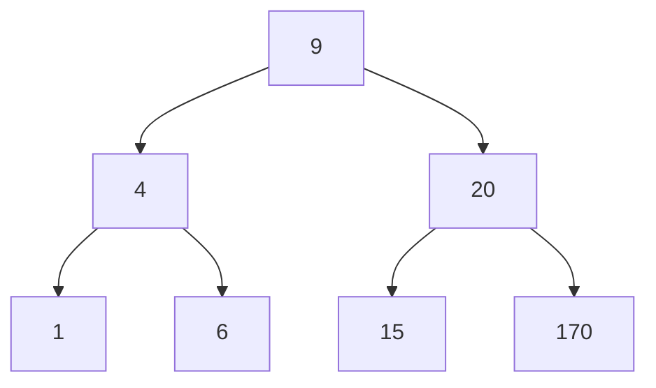

# Breadth-First Search (BFS) for Trees and Graphs

## 1. Introduction

Breadth-First Search (BFS) is a fundamental algorithm for traversing or searching tree and graph data structures. It explores all nodes at the present depth level before moving on to nodes at the next depth level. This level-by-level, left-to-right progression distinguishes BFS from other traversal strategies and makes it particularly suitable for applications involving shortest path discovery and proximity-based operations.

The algorithm derives its name from the manner in which it expands the frontier of exploration: it broadens the search horizontally across the current level before descending deeper into the structure.

---

## 2. Algorithm Description

### 2.1 Core Principle

BFS begins at a designated starting node (the root in a tree, or any specified vertex in a graph) and systematically visits all neighboring nodes. Once all immediate neighbors have been examined, the algorithm proceeds to the neighbors of those neighbors, continuing outward in concentric levels.

### 2.2 Step-by-Step Procedure

1. **Initialization:** Enqueue the starting node and mark it as visited.
2. **Processing Loop:** While the queue is not empty:
   - Dequeue the front node from the queue.
   - Process the node (e.g., record its value, perform an operation).
   - Enqueue all adjacent (child) nodes that have not yet been visited.
   - Mark each newly enqueued node as visited.
3. **Termination:** The algorithm concludes when the queue becomes empty, signifying that all reachable nodes have been visited.

### 2.3 Data Structure Utilization

BFS relies on a **queue** (First-In-First-Out) to manage the order of node visitation. The queue ensures that nodes are processed in the exact sequence they are discovered, preserving the level-order property.

```
Queue Operation:  Enqueue → [ A, B, C ] → Dequeue
                  (Add to rear)          (Remove from front)
```

---

## 3. Visual Representation

Consider the following binary search tree:



### 3.1 BFS Traversal Sequence

The visitation order produced by Breadth-First Search on this tree is:

| Level | Nodes Visited |
|-------|---------------|
| 1 | 9 |
| 2 | 4, 20 |
| 3 | 1, 6, 15, 170 |

**Complete Traversal Order:** 9 → 4 → 20 → 1 → 6 → 15 → 170

### 3.2 Step-by-Step Queue Simulation

| Step | Queue Contents (Front → Rear) | Dequeued Node | Enqueued Children |
|------|-------------------------------|---------------|-------------------|
| 1 | [9] | 9 | 4, 20 |
| 2 | [4, 20] | 4 | 1, 6 |
| 3 | [20, 1, 6] | 20 | 15, 170 |
| 4 | [1, 6, 15, 170] | 1 | — |
| 5 | [6, 15, 170] | 6 | — |
| 6 | [15, 170] | 15 | — |
| 7 | [170] | 170 | — |
| 8 | [] | — | — |

---

## 4. Implementation in JavaScript

### 4.1 Tree Node Structure

```javascript
class Node {
    constructor(value) {
        this.value = value;
        this.left = null;
        this.right = null;
    }
}
```

### 4.2 Breadth-First Search Implementation

```javascript
/**
 * Performs Breadth-First Search (Level-Order Traversal) on a binary tree.
 * @param {Node} root - The root node of the binary tree.
 * @returns {Array} - An array containing node values in BFS order.
 */
function breadthFirstSearch(root) {
    // Handle empty tree case
    if (root === null) {
        return [];
    }
    
    const result = [];
    const queue = [root];  // Initialize queue with root node
    
    while (queue.length > 0) {
        // Dequeue the front node
        const currentNode = queue.shift();
        
        // Process current node
        result.push(currentNode.value);
        
        // Enqueue left child if it exists
        if (currentNode.left !== null) {
            queue.push(currentNode.left);
        }
        
        // Enqueue right child if it exists
        if (currentNode.right !== null) {
            queue.push(currentNode.right);
        }
    }
    
    return result;
}

// Example Usage
const root = new Node(9);
root.left = new Node(4);
root.right = new Node(20);
root.left.left = new Node(1);
root.left.right = new Node(6);
root.right.left = new Node(15);
root.right.right = new Node(170);

const bfsOrder = breadthFirstSearch(root);
console.log(bfsOrder);  // Output: [9, 4, 20, 1, 6, 15, 170]
```

### 4.3 BFS with Callback Function

```javascript
/**
 * Performs BFS and executes a callback on each node.
 * @param {Node} root - Root of the tree.
 * @param {Function} callback - Function to invoke with each node's value.
 */
function breadthFirstTraversal(root, callback) {
    if (root === null) return;
    
    const queue = [root];
    
    while (queue.length > 0) {
        const currentNode = queue.shift();
        callback(currentNode.value);
        
        if (currentNode.left) queue.push(currentNode.left);
        if (currentNode.right) queue.push(currentNode.right);
    }
}

// Example: Double each value and print
breadthFirstTraversal(root, (val) => console.log(val * 2));
// Output: 18, 8, 40, 2, 12, 30, 340
```

---

## 5. Memory Considerations

BFS requires additional memory to store the child nodes of all nodes at the current level. The queue data structure grows in proportion to the maximum width of the tree or graph.

### 5.1 Space Complexity

- **Trees:** In the worst case (a perfect binary tree), the maximum queue size equals the number of nodes at the widest level, which is approximately **n/2** for a balanced tree. Thus, space complexity is **O(w)** where w is the maximum width, which is bounded by **O(n)**.
- **Graphs:** The queue may hold up to **O(V)** vertices in the worst case, where V is the total number of vertices.

### 5.2 Time Complexity

Every node and every edge is examined exactly once. For a graph with V vertices and E edges:

- **Time Complexity:** O(V + E)

For a tree with n nodes and n-1 edges, this simplifies to **O(n)**.

---

## 6. BFS for Graph Traversal

When applying BFS to graphs, additional considerations are necessary to handle cycles and disconnected components.

### 6.1 Handling Cycles

A `visited` set or boolean array prevents infinite loops by ensuring each vertex is processed only once.

```javascript
/**
 * BFS for a graph represented as an adjacency list.
 * @param {Object} graph - Adjacency list: { vertex: [neighbors] }
 * @param {string} start - Starting vertex.
 * @returns {Array} - Vertices in BFS order.
 */
function bfsGraph(graph, start) {
    const visited = new Set();
    const queue = [start];
    const result = [];
    
    visited.add(start);
    
    while (queue.length > 0) {
        const current = queue.shift();
        result.push(current);
        
        for (const neighbor of graph[current]) {
            if (!visited.has(neighbor)) {
                visited.add(neighbor);
                queue.push(neighbor);
            }
        }
    }
    
    return result;
}
```

### 6.2 Disconnected Graphs

To traverse all vertices in a disconnected graph, BFS must be initiated from each unvisited vertex.

```javascript
function bfsDisconnected(graph) {
    const visited = new Set();
    const components = [];
    
    for (const vertex in graph) {
        if (!visited.has(vertex)) {
            const component = [];
            const queue = [vertex];
            visited.add(vertex);
            
            while (queue.length > 0) {
                const current = queue.shift();
                component.push(current);
                
                for (const neighbor of graph[current]) {
                    if (!visited.has(neighbor)) {
                        visited.add(neighbor);
                        queue.push(neighbor);
                    }
                }
            }
            components.push(component);
        }
    }
    
    return components;
}
```

---

## 7. Advantages and Disadvantages

### 7.1 Advantages

- **Shortest Path Guarantee:** In unweighted graphs, BFS finds the shortest path (in terms of number of edges) between the start node and any reachable node.
- **Level-Order Information:** BFS naturally groups nodes by their distance from the source, which is useful in social network analysis and web crawling.
- **Completeness:** BFS will always find a solution if one exists within the search space.

### 7.2 Disadvantages

- **High Memory Usage:** BFS may require storing a large number of nodes simultaneously, particularly in wide structures.
- **Not Suitable for Deep Searches:** In very deep but narrow trees, BFS consumes more memory than DFS, which only stores the current path.

---

## 8. Applications of Breadth-First Search

- **Shortest Path in Unweighted Graphs:** Navigation systems and network routing protocols.
- **Web Crawling:** Search engines index web pages level by level from seed URLs.
- **Social Network Analysis:** Finding the degree of connection between individuals.
- **Peer-to-Peer Networks:** Locating resources in distributed systems.
- **Garbage Collection:** Marking reachable objects in memory management.
- **Puzzle Solving:** Solving problems like the 15-puzzle or Rubik's Cube with minimal moves.

---

## 9. Comparison with Depth-First Search

| Aspect | Breadth-First Search | Depth-First Search |
|--------|----------------------|---------------------|
| **Traversal Order** | Level by level (horizontal) | Branch by branch (vertical) |
| **Data Structure** | Queue | Stack (or recursion) |
| **Memory Usage** | Stores width of tree | Stores depth of tree |
| **Shortest Path** | Guaranteed in unweighted graphs | Not guaranteed |
| **Suitable For** | Proximity-based searches | Exhaustive path exploration |

---

## 10. Summary

Breadth-First Search is a foundational graph and tree traversal algorithm characterized by its level-order visitation pattern. It employs a queue to manage node exploration, ensuring that all nodes at distance d from the source are visited before any node at distance d+1. With a time complexity of O(V+E) and space complexity proportional to the width of the structure, BFS is indispensable for applications requiring shortest path discovery, systematic level-wise processing, and complete exploration of reachable nodes. Understanding BFS provides essential groundwork for studying more advanced graph algorithms and their real-world implementations.