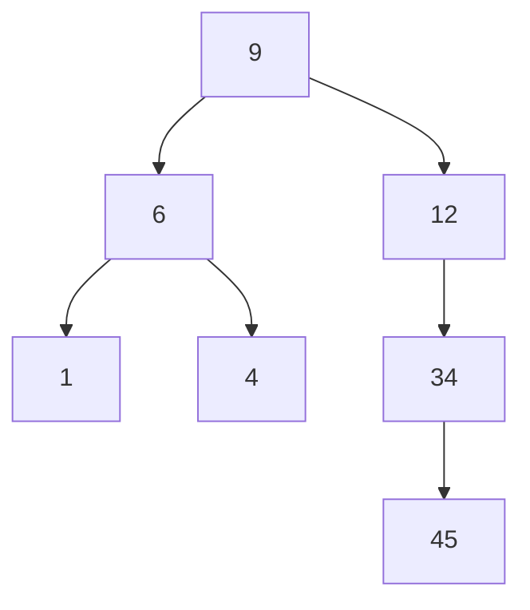

# Depth-First Search (DFS) for Trees and Graphs

## 1. Introduction

Depth-First Search (DFS) is a fundamental algorithm for traversing or searching tree and graph data structures. Unlike Breadth-First Search (BFS), which explores nodes level by level horizontally, DFS adopts a vertical strategy: it follows a single branch downward as far as possible before backtracking to explore alternative paths. This depth-prioritizing approach yields distinct traversal orders, lower memory consumption in many scenarios, and suitability for applications such as topological sorting, cycle detection, and exhaustive path exploration.

The algorithm's operational philosophy mirrors navigating a complex maze: one advances along a chosen corridor until reaching a dead end, then retraces steps to the last junction where an alternative route remains unexplored.

---

## 2. Algorithm Description

### 2.1 Core Principle

DFS explores a graph or tree by starting at a designated root (or an arbitrary node in a graph) and traversing as deeply as possible along one branch. When a node with no unvisited adjacent nodes is encountered (a leaf in a tree, or a dead-end in a graph), the algorithm **backtracks** to the nearest ancestor that still possesses unexplored children and resumes the deep traversal from that point.

### 2.2 Step-by-Step Procedure

1. **Initialization:** Begin at the starting node and mark it as visited.
2. **Recursive Descent:** From the current node, select an unvisited adjacent node (typically the leftmost child in trees) and recursively apply DFS to that node.
3. **Terminal Condition:** If the current node has no unvisited adjacent nodes, return to the caller (backtrack).
4. **Exploration Continuation:** Upon backtracking to an ancestor, if that ancestor has additional unvisited adjacent nodes, repeat Step 2 for each unexplored branch.
5. **Completion:** The algorithm terminates when all nodes reachable from the start have been visited.

### 2.3 Data Structure Utilization

DFS can be implemented using two equivalent mechanisms:

- **Recursion:** The function call stack implicitly maintains the backtracking state.
- **Explicit Stack:** An iterative approach using a LIFO (Last-In-First-Out) stack data structure to simulate recursion.

Both methods ensure that nodes are processed in a depth-first order.

---

## 3. Visual Representation

Consider the following tree structure used to illustrate DFS traversal:



**Node Relationships:**
- 9 is the root node.
- 9 has left child 6 and right child 12.
- 6 has left child 1 and right child 4.
- 12 has no left child; its right child is 34.
- 34 has no left child; its right child is 45.

### 3.1 DFS Traversal Sequence (Pre-order)

The traversal order for a pre-order DFS (visit node, then left subtree, then right subtree) on this tree is:

| Step | Action | Current Node | Visited Sequence So Far |
|------|--------|--------------|-------------------------|
| 1 | Start at root | 9 | [9] |
| 2 | Go left to 6 | 6 | [9, 6] |
| 3 | Go left to 1 | 1 | [9, 6, 1] |
| 4 | 1 has no children, backtrack to 6 | 6 | — |
| 5 | Explore right child of 6 → 4 | 4 | [9, 6, 1, 4] |
| 6 | 4 has no children, backtrack to 6, then to 9 | 9 | — |
| 7 | Explore right child of 9 → 12 | 12 | [9, 6, 1, 4, 12] |
| 8 | 12 has no left child, go right to 34 | 34 | [9, 6, 1, 4, 12, 34] |
| 9 | 34 has no left child, go right to 45 | 45 | [9, 6, 1, 4, 12, 34, 45] |
| 10 | 45 is a leaf, backtrack all the way to root and finish | — | — |

**Final DFS Order:** 9 → 6 → 1 → 4 → 12 → 34 → 45

---

## 4. Memory Considerations

### 4.1 Space Complexity Advantage

DFS exhibits a lower memory footprint compared to BFS in many practical scenarios. This advantage stems from the fact that DFS does not need to maintain a queue containing all nodes at the current level. Instead, DFS stores only the path from the root to the current node being explored, plus the yet-to-be-explored sibling branches at each ancestor level.

- **Recursive Implementation:** The call stack grows proportionally to the **depth** of the tree or graph. In a balanced tree with n nodes, the maximum stack depth is O(log n). In the worst-case skewed tree (like a linked list), the depth is O(n).
- **Iterative Implementation with Explicit Stack:** The stack holds at most O(d) nodes, where d is the maximum depth.

### 4.2 Comparison with BFS Memory

| Traversal | Memory Requirement | Reason |
|-----------|-------------------|--------|
| **BFS** | O(w) where w is the maximum width of the tree (can be up to n/2 in a complete binary tree). | Stores all nodes at the current level. |
| **DFS** | O(h) where h is the height (depth) of the tree. | Stores only the current path and sibling pointers for backtracking. |

Thus, for deep, narrow structures, DFS is substantially more memory-efficient than BFS.

---

## 5. Implementation in JavaScript

### 5.1 Tree Node Definition

```javascript
/**
 * Node class representing an element in a binary tree.
 * @property {number} value - The data stored in the node.
 * @property {Node|null} left - Reference to the left child node, or null.
 * @property {Node|null} right - Reference to the right child node, or null.
 */
class Node {
    constructor(value) {
        this.value = value;
        this.left = null;
        this.right = null;
    }
}
```

### 5.2 Recursive Depth-First Search (Pre-order Traversal)

```javascript
/**
 * Performs a recursive Depth-First Search (pre-order traversal) on a binary tree.
 * Pre-order means: Process current node, then left subtree, then right subtree.
 *
 * @param {Node|null} node - The current node being visited. Null indicates an empty subtree.
 * @param {Array<number>} result - An array that accumulates the values of visited nodes in DFS order.
 * @returns {Array<number>} - The array containing node values in pre-order DFS sequence.
 *
 * @description
 * The function uses the system call stack to manage backtracking implicitly.
 * When a leaf node is reached (both children are null), the recursive calls return
 * without further action, causing the program to backtrack to the previous level.
 */
function depthFirstSearchRecursive(node, result = []) {
    // Base case: if the node is null, we have reached beyond a leaf.
    // Return the result array unchanged; this triggers backtracking.
    if (node === null) {
        return result;
    }

    // Step 1: Process the current node by recording its value.
    // In pre-order, the node is visited before its children.
    result.push(node.value);

    // Step 2: Recursively traverse the left subtree.
    // The function calls itself with the left child. If left child is null,
    // the base case will immediately return, effectively skipping this branch.
    depthFirstSearchRecursive(node.left, result);

    // Step 3: Recursively traverse the right subtree.
    // After the left subtree is fully explored (including all its descendants),
    // the algorithm proceeds to the right subtree.
    depthFirstSearchRecursive(node.right, result);

    // Return the accumulated result for convenience in chaining.
    return result;
}
```

**Example Usage of Recursive DFS:**

```javascript
// Construct the tree from the visual representation (Section 3)
const root = new Node(9);
root.left = new Node(6);
root.right = new Node(12);
root.left.left = new Node(1);
root.left.right = new Node(4);
root.right.right = new Node(34);
root.right.right.right = new Node(45);

const dfsOrder = depthFirstSearchRecursive(root);
console.log('DFS Pre-order Traversal:', dfsOrder);
// Expected Output: [9, 6, 1, 4, 12, 34, 45]
```

### 5.3 Iterative Depth-First Search Using Explicit Stack

```javascript
/**
 * Performs an iterative Depth-First Search (pre-order traversal) using an explicit stack.
 * This approach avoids recursion and its associated call stack limit.
 *
 * @param {Node|null} root - The root node of the binary tree.
 * @returns {Array<number>} - An array containing node values in pre-order DFS sequence.
 *
 * @description
 * The iterative method simulates the recursive process by manually managing a stack.
 * The algorithm:
 *  1. Push the root node onto the stack.
 *  2. While the stack is not empty:
 *       a. Pop the top node from the stack.
 *       b. Process the node (record its value).
 *       c. Push the right child first, then the left child.
 *          (Pushing right before left ensures left child is processed next,
 *           because the stack is LIFO: left will be on top.)
 *  3. When the stack is empty, all nodes have been visited.
 */
function depthFirstSearchIterative(root) {
    // Handle edge case: empty tree.
    if (root === null) {
        return [];
    }

    const result = [];           // Array to store traversal order.
    const stack = [];            // Stack to manage nodes to be visited.
    
    // Initialize the stack with the root node.
    stack.push(root);

    // Continue processing until the stack is exhausted.
    while (stack.length > 0) {
        // Pop the most recently added node (LIFO behavior).
        // This ensures we go deep along one path before switching branches.
        const currentNode = stack.pop();

        // Process the current node: record its value.
        result.push(currentNode.value);

        // Important: Push right child BEFORE left child.
        // Since the stack is LIFO, the left child will be popped next.
        // This achieves the pre-order (root -> left -> right) sequence.
        if (currentNode.right !== null) {
            stack.push(currentNode.right);
        }
        if (currentNode.left !== null) {
            stack.push(currentNode.left);
        }
    }

    return result;
}
```

**Example Usage of Iterative DFS:**

```javascript
const dfsIterativeOrder = depthFirstSearchIterative(root);
console.log('Iterative DFS Pre-order:', dfsIterativeOrder);
// Expected Output: [9, 6, 1, 4, 12, 34, 45]
```

### 5.4 In-order and Post-order Variations (Recursive)

While the transcript focuses on the basic DFS traversal (which typically refers to pre-order when discussing "going deep first from the left"), DFS also encompasses in-order and post-order traversals for trees.

```javascript
/**
 * In-order DFS: Left subtree → Current node → Right subtree.
 * For a Binary Search Tree (BST), this yields values in ascending order.
 */
function inOrderDFS(node, result = []) {
    if (node === null) return result;
    inOrderDFS(node.left, result);
    result.push(node.value);   // Process node between children.
    inOrderDFS(node.right, result);
    return result;
}

/**
 * Post-order DFS: Left subtree → Right subtree → Current node.
 * Useful for deleting a tree (process children before parent).
 */
function postOrderDFS(node, result = []) {
    if (node === null) return result;
    postOrderDFS(node.left, result);
    postOrderDFS(node.right, result);
    result.push(node.value);   // Process node after children.
    return result;
}
```

**Example Outputs for the Given Tree:**
- **In-order:** [1, 6, 4, 9, 12, 34, 45]  (Note: This tree is not a BST, so order is not sorted.)
- **Post-order:** [1, 4, 6, 45, 34, 12, 9]

---

## 6. Characteristics and Applications

### 6.1 Key Properties of DFS

- **Traversal Order:** Follows a deep path first; the exact sequence depends on the order of child exploration (e.g., left-to-right or right-to-left).
- **Memory Efficiency:** Requires less memory for deep, narrow structures compared to BFS.
- **Not Guaranteed Shortest Path:** In graphs, DFS does not guarantee the shortest path between two nodes; it may traverse a long detour before finding a target.
- **Completeness:** DFS will visit every node reachable from the start, but for infinite graphs, it may get trapped in an infinite branch if not bounded.

### 6.2 Common Applications

- **Topological Sorting:** Ordering vertices in a directed acyclic graph (DAG) based on dependencies.
- **Cycle Detection:** Determining whether a graph contains cycles by checking for back edges during traversal.
- **Path Finding (Exhaustive):** Exploring all possible paths in puzzles, mazes, or game trees (e.g., chess move evaluation).
- **Connected Components:** Identifying groups of connected nodes in an undirected graph.
- **Tree Serialization/Deserialization:** Converting a tree structure to a string and reconstructing it.
- **Generating Permutations and Combinations:** DFS-based backtracking algorithms.

---

## 7. Summary

Depth-First Search is a foundational traversal technique that prioritizes exploring a single branch to its full depth before backtracking. Its recursive nature aligns naturally with the call stack, and its lower memory footprint for deep structures makes it a preferred choice in many algorithmic scenarios. By understanding the core mechanism of DFS—plunging deep, backtracking upon dead ends, and systematically covering all branches—students gain insight into a versatile algorithm with widespread applications in tree and graph processing.

The traversal order illustrated (9 → 6 → 1 → 4 → 12 → 34 → 45) exemplifies the depth-first philosophy. Variations such as in-order and post-order extend DFS to specific use cases like binary search tree validation and tree deletion. Mastery of DFS is essential for advanced study in data structures, algorithm design, and computational problem-solving.