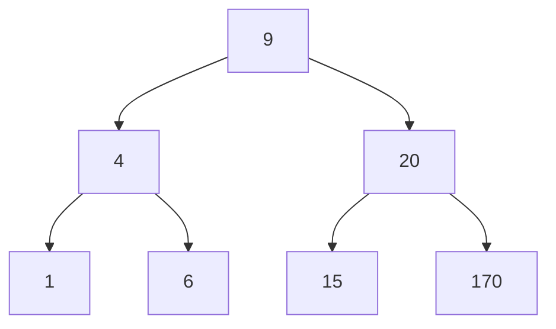

# Implementation of Breadth-First Search (BFS) on a Binary Search Tree

## 1. Introduction

Breadth-First Search (BFS) is a traversal algorithm that explores nodes level by level, starting from the root and moving horizontally across each depth before descending further. This document provides a detailed, step-by-step implementation of BFS on a Binary Search Tree (BST) using JavaScript. The implementation highlights the use of a queue data structure to manage node visitation order and discusses the associated memory considerations.

The code presented herein builds upon the BST class developed in prior sections, which includes methods for insertion, lookup, and removal. The focus of this document is exclusively on the BFS traversal method.

---

## 2. Algorithm Overview

The BFS algorithm operates as follows:

1. Initialize a queue with the root node.
2. While the queue is not empty:
   - Dequeue the front node.
   - Process the node (e.g., record its value).
   - Enqueue its left child (if exists).
   - Enqueue its right child (if exists).
3. Repeat until all nodes have been visited.

The queue ensures that nodes are processed in the order they are encountered, preserving the level-by-level visitation sequence.

---

## 3. Implementation in JavaScript

### 3.1 Binary Search Tree Node Structure

```javascript
/**
 * Node class representing an element in a Binary Search Tree.
 * @property {number} value - The data stored in the node.
 * @property {Node|null} left - Reference to the left child node.
 * @property {Node|null} right - Reference to the right child node.
 */
class Node {
    constructor(value) {
        this.value = value;
        this.left = null;
        this.right = null;
    }
}
```

### 3.2 Binary Search Tree Class with BFS Method

The following code extends the BST class with a `breadthFirstSearch` method that returns an array of node values in BFS order.

```javascript
/**
 * Binary Search Tree class containing insertion, lookup, and BFS traversal.
 */
class BinarySearchTree {
    constructor() {
        this.root = null;  // Root node of the BST
    }

    /**
     * Inserts a new value into the BST.
     * @param {number} value - The value to insert.
     */
    insert(value) {
        const newNode = new Node(value);
        if (this.root === null) {
            this.root = newNode;
            return;
        }
        let currentNode = this.root;
        while (true) {
            if (value < currentNode.value) {
                if (currentNode.left === null) {
                    currentNode.left = newNode;
                    return;
                }
                currentNode = currentNode.left;
            } else {
                if (currentNode.right === null) {
                    currentNode.right = newNode;
                    return;
                }
                currentNode = currentNode.right;
            }
        }
    }

    /**
     * Performs Breadth-First Search (Level-Order Traversal) on the BST.
     * @returns {Array<number>} - An array of node values in BFS order.
     *
     * Algorithm Steps:
     * 1. Initialize an empty queue and an empty result list.
     * 2. Enqueue the root node to start traversal.
     * 3. While the queue is not empty:
     *    a. Dequeue the front node (using shift() for FIFO behavior).
     *    b. Add the node's value to the result list.
     *    c. If the node has a left child, enqueue it.
     *    d. If the node has a right child, enqueue it.
     * 4. Return the result list containing values in BFS order.
     *
     * Time Complexity: O(n) where n is the number of nodes.
     * Space Complexity: O(w) where w is the maximum width of the tree.
     */
    breadthFirstSearch() {
        // Handle empty tree case
        if (this.root === null) {
            return [];
        }

        const result = [];          // Stores the final BFS traversal order
        const queue = [];           // FIFO queue to manage nodes to be processed

        // Step 1: Enqueue the root node to begin traversal
        queue.push(this.root);

        // Step 2: Continue processing while there are nodes in the queue
        while (queue.length > 0) {
            // Dequeue the front node - shift() removes and returns the first element
            // This ensures we process nodes in the order they were discovered (level by level)
            const currentNode = queue.shift();

            // Process the current node: record its value in the result array
            result.push(currentNode.value);

            // Enqueue left child if it exists
            // The left child is added first to maintain left-to-right order within a level
            if (currentNode.left !== null) {
                queue.push(currentNode.left);
            }

            // Enqueue right child if it exists
            if (currentNode.right !== null) {
                queue.push(currentNode.right);
            }

            // Note: The queue now contains the children of the current node.
            // These children will be processed in subsequent iterations of the while loop.
            // Because of FIFO ordering, all nodes at the current level will be processed
            // before any nodes from the next level are dequeued.
        }

        // Step 3: Return the accumulated traversal order
        return result;
    }
}
```

### 3.3 Example Usage

```javascript
// Instantiate a Binary Search Tree
const bst = new BinarySearchTree();

// Insert values to construct the tree shown in the visual example
bst.insert(9);
bst.insert(4);
bst.insert(6);
bst.insert(20);
bst.insert(170);
bst.insert(15);
bst.insert(1);

// Perform Breadth-First Search
const bfsOrder = bst.breadthFirstSearch();
console.log('BFS Traversal Order:', bfsOrder);
// Expected Output: [9, 4, 20, 1, 6, 15, 170]
```

**Visual Representation of the BST:**



**Traversal Sequence:** The BFS algorithm visits nodes in the order: 9 → 4 → 20 → 1 → 6 → 15 → 170.

---

## 4. Step-by-Step Execution Trace

The following table illustrates the state of the queue and the result array during each iteration of the while loop for the example tree.

| Iteration | Queue Contents (Front → Rear) | Dequeued Node | Result Array After Processing |
|-----------|-------------------------------|---------------|-------------------------------|
| 0 | [9] | — | [] |
| 1 | [4, 20] | 9 | [9] |
| 2 | [20, 1, 6] | 4 | [9, 4] |
| 3 | [1, 6, 15, 170] | 20 | [9, 4, 20] |
| 4 | [6, 15, 170] | 1 | [9, 4, 20, 1] |
| 5 | [15, 170] | 6 | [9, 4, 20, 1, 6] |
| 6 | [170] | 15 | [9, 4, 20, 1, 6, 15] |
| 7 | [] | 170 | [9, 4, 20, 1, 6, 15, 170] |

**Observation:** The queue temporarily stores child nodes from the current level, enabling the algorithm to backtrack and process them in the correct sequence.

---

## 5. Memory Considerations

The primary memory overhead in BFS stems from the queue used to store references to child nodes.

- **Queue Growth:** At any point, the queue holds all nodes from the current level that have been discovered but not yet processed, along with nodes from the next level as they are enqueued.
- **Worst-Case Space Complexity:** O(w), where w is the maximum width of the tree. For a perfect binary tree, the number of nodes at the lowest level is approximately n/2, making w = n/2, which is O(n).
- **Implication:** In trees with a high branching factor (wide trees), the queue can become very large, leading to significant memory consumption. This is the principal drawback of BFS compared to Depth-First Search (DFS), which typically uses O(h) space where h is the tree height.

**Example:** If the tree were not binary but had, for instance, ten children per node, the queue size could rapidly escalate, potentially causing performance degradation or memory exhaustion in resource-constrained environments.

---

## 6. Complexity Analysis

| Metric | Complexity | Explanation |
|--------|------------|-------------|
| **Time Complexity** | O(n) | Each node is enqueued and dequeued exactly once, and its children are examined. Constant work per node yields linear time. |
| **Space Complexity** | O(w) | The queue stores at most the nodes of the widest level. In the worst case, w ≈ n, giving O(n) space. |

---

## 7. Summary

The Breadth-First Search implementation on a Binary Search Tree is straightforward and leverages a queue to achieve level-order traversal. The algorithm guarantees that nodes are visited in order of increasing depth, making it suitable for applications such as shortest path finding in unweighted structures and level-wise processing. However, the memory requirement can be substantial for wide trees, a trade-off that must be considered when selecting traversal strategies. The provided JavaScript code, with detailed comments, serves as a practical reference for understanding and applying BFS in both academic and professional contexts.