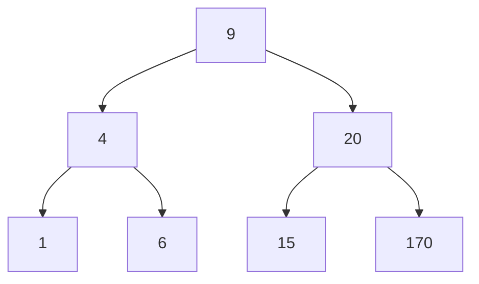

# Depth-First Search (DFS) Traversal Orders on Binary Trees

## 1. Introduction

Depth-First Search (DFS) is a fundamental traversal algorithm for tree and graph structures that prioritizes exploring a single branch to its maximum depth before backtracking to examine alternative paths. In the context of binary trees, DFS can be systematically categorized into three distinct visitation orders: **In-order**, **Pre-order**, and **Post-order**. Each order serves specific purposes and yields a unique sequence of node values.

This document provides a comprehensive exploration of these three DFS traversal techniques, their algorithmic definitions, practical applications, and JavaScript implementations. The content is structured to facilitate both conceptual understanding and practical coding reference.

---

## 2. Foundational Concepts

### 2.1 Depth-First Search Principle

DFS on a binary tree begins at the root and recursively traverses as far down the left subtree as possible before backtracking to explore the right subtree. This process ensures that nodes are visited in a manner that reflects the recursive structure of the tree.

### 2.2 Importance of Traversal Order

Unlike Breadth-First Search (BFS), which produces a single, level-based order, DFS offers multiple visitation sequences. The choice of order—In-order, Pre-order, or Post-order—dictates the relative timing of processing the current node with respect to its children. This flexibility enables DFS to be adapted for tasks ranging from sorted output generation to tree reconstruction.

---

## 3. Visual Representation of the Example Binary Search Tree

Throughout this document, the following Binary Search Tree (BST) serves as the working example:



**Node Values:** Root = 9; Left subtree: 4, 1, 6; Right subtree: 20, 15, 170.

---

## 4. In-Order Traversal

### 4.1 Definition and Algorithm

**In-order traversal** visits nodes in the following sequence:

1. Recursively traverse the left subtree.
2. Visit the current node (process its value).
3. Recursively traverse the right subtree.

For a Binary Search Tree, this order yields node values in strictly ascending (sorted) order.

### 4.2 Traversal Sequence for the Example BST

Applying in-order traversal to the example tree produces the sequence:

- Leftmost: 1 → then parent 4 → then right child 6 → then root 9 → then leftmost of right subtree 15 → then 20 → then 170.

**Complete In-Order List:** [1, 4, 6, 9, 15, 20, 170]

### 4.3 Applications

- Retrieving elements of a BST in sorted order.
- Validating whether a binary tree satisfies the BST property (values must appear in ascending order).
- Performing operations that require processing nodes in natural order.

### 4.4 JavaScript Implementation

```javascript
/**
 * Performs In-Order Depth-First Traversal on a binary tree.
 *
 * In-Order Algorithm:
 *   1. Traverse left subtree recursively.
 *   2. Visit current node (record value).
 *   3. Traverse right subtree recursively.
 *
 * @param {Node|null} node - The current node being visited.
 * @param {Array<number>} result - Array accumulating node values in traversal order.
 * @returns {Array<number>} - The result array containing values in in-order sequence.
 */
function inOrderTraversal(node, result = []) {
    // Base case: if node is null, we have reached beyond a leaf.
    if (node === null) {
        return result;
    }

    // Step 1: Process entire left subtree
    inOrderTraversal(node.left, result);

    // Step 2: Process current node (visit)
    result.push(node.value);

    // Step 3: Process entire right subtree
    inOrderTraversal(node.right, result);

    return result;
}
```

**Expected Output for Example BST:** `[1, 4, 6, 9, 15, 20, 170]`

---

## 5. Pre-Order Traversal

### 5.1 Definition and Algorithm

**Pre-order traversal** adheres to the sequence:

1. Visit the current node.
2. Recursively traverse the left subtree.
3. Recursively traverse the right subtree.

This order ensures that the root node is processed first, followed by all nodes in the left subtree, and then all nodes in the right subtree.

### 5.2 Traversal Sequence for the Example BST

Following pre-order:

- Start at root: 9.
- Go left: 4, then its left child 1, then backtrack to 4's right child 6.
- Return to root's right child: 20, then its left child 15, then its right child 170.

**Complete Pre-Order List:** [9, 4, 1, 6, 20, 15, 170]

### 5.3 Applications

- **Tree Serialization/Reconstruction:** Pre-order sequence (when combined with in-order) allows exact reconstruction of the original tree structure.
- **Creating a Copy of a Tree:** By visiting the root first and then recursively copying children, a new tree can be built.
- **Prefix Expression Generation:** In expression trees, pre-order yields prefix notation.

### 5.4 JavaScript Implementation

```javascript
/**
 * Performs Pre-Order Depth-First Traversal on a binary tree.
 *
 * Pre-Order Algorithm:
 *   1. Visit current node.
 *   2. Traverse left subtree recursively.
 *   3. Traverse right subtree recursively.
 *
 * @param {Node|null} node - Current node.
 * @param {Array<number>} result - Accumulator for values.
 * @returns {Array<number>} - Values in pre-order sequence.
 */
function preOrderTraversal(node, result = []) {
    if (node === null) {
        return result;
    }

    // Step 1: Visit current node first
    result.push(node.value);

    // Step 2: Process left subtree
    preOrderTraversal(node.left, result);

    // Step 3: Process right subtree
    preOrderTraversal(node.right, result);

    return result;
}
```

**Expected Output for Example BST:** `[9, 4, 1, 6, 20, 15, 170]`

---

## 6. Post-Order Traversal

### 6.1 Definition and Algorithm

**Post-order traversal** processes nodes in the order:

1. Recursively traverse the left subtree.
2. Recursively traverse the right subtree.
3. Visit the current node.

Children are always processed before their parent node.

### 6.2 Traversal Sequence for the Example BST

Executing post-order:

- Deepest left: 1 → then its sibling 6 → then parent 4.
- Deepest right: 15 → then 170 → then parent 20.
- Finally root: 9.

**Complete Post-Order List:** [1, 6, 4, 15, 170, 20, 9]

### 6.3 Applications

- **Tree Deletion:** Safely delete a tree by deleting children before the parent, preventing dangling references.
- **Directory Size Calculation:** Compute size of a folder by summing sizes of subdirectories first.
- **Postfix Expression Generation:** In expression trees, post-order yields postfix (Reverse Polish) notation.

### 6.4 JavaScript Implementation

```javascript
/**
 * Performs Post-Order Depth-First Traversal on a binary tree.
 *
 * Post-Order Algorithm:
 *   1. Traverse left subtree recursively.
 *   2. Traverse right subtree recursively.
 *   3. Visit current node.
 *
 * @param {Node|null} node - Current node.
 * @param {Array<number>} result - Accumulator.
 * @returns {Array<number>} - Values in post-order sequence.
 */
function postOrderTraversal(node, result = []) {
    if (node === null) {
        return result;
    }

    // Step 1: Process left subtree
    postOrderTraversal(node.left, result);

    // Step 2: Process right subtree
    postOrderTraversal(node.right, result);

    // Step 3: Visit current node after children
    result.push(node.value);

    return result;
}
```

**Expected Output for Example BST:** `[1, 6, 4, 15, 170, 20, 9]`

---

## 7. Comparative Summary of DFS Orders

| Traversal Order | Visit Sequence | Example Output | Primary Use Case |
|-----------------|----------------|----------------|------------------|
| **In-Order** | Left → Root → Right | [1, 4, 6, 9, 15, 20, 170] | Sorted retrieval from BST |
| **Pre-Order** | Root → Left → Right | [9, 4, 1, 6, 20, 15, 170] | Tree serialization / reconstruction |
| **Post-Order** | Left → Right → Root | [1, 6, 4, 15, 170, 20, 9] | Safe deletion / bottom-up computation |

---

## 8. Implementation within a BST Class

The following JavaScript code integrates the three traversal methods as part of a `BinarySearchTree` class, providing a cohesive interface.

```javascript
class Node {
    constructor(value) {
        this.value = value;
        this.left = null;
        this.right = null;
    }
}

class BinarySearchTree {
    constructor() {
        this.root = null;
    }

    // Standard BST insert method (omitted for brevity; assume it builds the example tree)

    /**
     * Public method to perform in-order traversal.
     * @returns {Array<number>} Sorted array of node values.
     */
    inOrder() {
        const result = [];
        this._inOrderHelper(this.root, result);
        return result;
    }

    _inOrderHelper(node, result) {
        if (node !== null) {
            this._inOrderHelper(node.left, result);
            result.push(node.value);
            this._inOrderHelper(node.right, result);
        }
    }

    /**
     * Public method to perform pre-order traversal.
     * @returns {Array<number>} Pre-order sequence.
     */
    preOrder() {
        const result = [];
        this._preOrderHelper(this.root, result);
        return result;
    }

    _preOrderHelper(node, result) {
        if (node !== null) {
            result.push(node.value);
            this._preOrderHelper(node.left, result);
            this._preOrderHelper(node.right, result);
        }
    }

    /**
     * Public method to perform post-order traversal.
     * @returns {Array<number>} Post-order sequence.
     */
    postOrder() {
        const result = [];
        this._postOrderHelper(this.root, result);
        return result;
    }

    _postOrderHelper(node, result) {
        if (node !== null) {
            this._postOrderHelper(node.left, result);
            this._postOrderHelper(node.right, result);
            result.push(node.value);
        }
    }
}

// Example usage:
const bst = new BinarySearchTree();
// Insert values: 9, 4, 6, 20, 170, 15, 1 (implementation assumed)
console.log(bst.inOrder());   // [1, 4, 6, 9, 15, 20, 170]
console.log(bst.preOrder());  // [9, 4, 1, 6, 20, 15, 170]
console.log(bst.postOrder()); // [1, 6, 4, 15, 170, 20, 9]
```

---

## 9. Conclusion

Depth-First Search provides three powerful traversal orders—In-order, Pre-order, and Post-order—each tailored to specific computational requirements. In-order traversal yields sorted output for BSTs, pre-order facilitates tree reconstruction, and post-order supports safe bottom-up operations. Understanding these distinctions is essential for effective algorithm design and implementation in both academic and professional settings. The provided JavaScript implementations, enriched with explanatory comments, serve as practical references for applying these concepts to real-world binary tree problems.