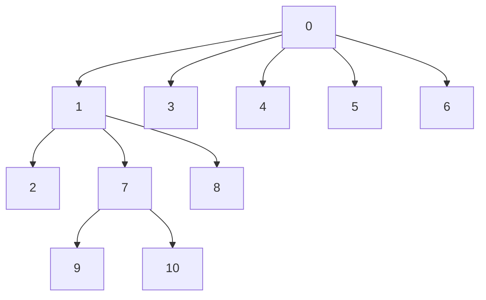

# Graph Traversal: Breadth-First Search and Depth-First Search

## 1. Introduction to Graph Traversal

Graph traversal is the systematic process of visiting every vertex in a graph exactly once. Since trees are a specialized form of graph (acyclic, connected, hierarchical), the traversal algorithms learned for trees—Breadth-First Search (BFS) and Depth-First Search (DFS)—extend naturally to general graphs with minor modifications to handle cycles and potentially disconnected components.

Graphs serve as powerful abstractions for modeling real-world networks and relationships:

- **Social Networks:** Vertices represent users; edges represent friendships or connections.
- **E-commerce Recommendation Engines:** Vertices represent products; edges represent co-purchase relationships.
- **Web Crawling:** Vertices represent web pages; directed edges represent hyperlinks.
- **Mapping and Navigation:** Vertices represent locations; edges represent roads or paths.
- **Peer-to-Peer Networks:** Vertices represent nodes; edges represent connections.

Understanding BFS and DFS on graphs is fundamental for implementing features like shortest path discovery, connectivity analysis, and recommendation algorithms.

---

## 2. Graph Representation

Before discussing traversal algorithms, it is essential to define how a graph is represented in code. The two most common representations are:

- **Adjacency Matrix:** A 2D array where `matrix[i][j] = 1` if an edge exists from vertex `i` to vertex `j`.
- **Adjacency List:** An object or array where each vertex maps to a list of its adjacent vertices.

For traversal algorithms, the adjacency list is typically more space-efficient for sparse graphs and simplifies iteration over neighbors.

### 2.1 Adjacency List Representation in JavaScript

```javascript
/**
 * Graph representation using an adjacency list.
 * Each key in the object is a vertex identifier (number or string).
 * The value is an array of adjacent vertex identifiers.
 */
const graph = {
    0: [1, 3, 4, 5, 6],
    1: [0, 2, 7, 8],
    2: [1],
    3: [0],
    4: [0],
    5: [0],
    6: [0],
    7: [1, 9, 10],
    8: [1],
    9: [7],
    10: [7]
};
```

This representation allows O(1) access to the list of neighbors for any vertex, making traversal efficient.

---

## 3. Breadth-First Search (BFS) for Graphs

### 3.1 Definition and Characteristics

BFS explores a graph level by level, starting from a source vertex. It visits all vertices at distance `k` before visiting any vertex at distance `k+1`. This behavior makes BFS ideal for:

- Finding the shortest path (in terms of number of edges) in an unweighted graph.
- Discovering all vertices within a given radius.
- Recommending "closest" items or connections.

### 3.2 Algorithm Steps

1. Initialize a queue and enqueue the starting vertex.
2. Mark the starting vertex as visited (using a Set or boolean array).
3. While the queue is not empty:
   - Dequeue a vertex `v`.
   - Process `v` (e.g., record it).
   - For each neighbor `w` of `v`:
     - If `w` is not visited, mark it visited and enqueue `w`.
4. Repeat until the queue is empty.

### 3.3 Handling Disconnected Graphs

To traverse an entire graph that may have multiple connected components, the BFS function should be invoked for every unvisited vertex.

### 3.4 JavaScript Implementation with Detailed Comments

```javascript
/**
 * Performs Breadth-First Search (BFS) on a graph starting from a given vertex.
 *
 * @param {Object} graph - The adjacency list representation of the graph.
 * @param {string|number} start - The starting vertex identifier.
 * @returns {Array} - An array of vertices in BFS traversal order.
 *
 * Time Complexity: O(V + E) where V is the number of vertices and E is the number of edges.
 * Space Complexity: O(V) for the queue and visited set.
 */
function bfsTraversal(graph, start) {
    // Edge case: graph is empty or start vertex does not exist
    if (!graph || !graph.hasOwnProperty(start)) {
        return [];
    }

    const visited = new Set();      // Tracks vertices that have been visited to prevent cycles
    const queue = [];               // FIFO queue to manage the order of visitation
    const result = [];              // Stores the final traversal order

    // Initialize BFS with the start vertex
    queue.push(start);
    visited.add(start);

    // Continue until there are no more vertices to process
    while (queue.length > 0) {
        // Dequeue the vertex at the front of the queue (FIFO behavior)
        const currentVertex = queue.shift();

        // Process the current vertex
        result.push(currentVertex);

        // Examine all neighbors of the current vertex
        // graph[currentVertex] returns an array of adjacent vertices
        for (const neighbor of graph[currentVertex]) {
            // Only enqueue unvisited neighbors to avoid infinite loops
            if (!visited.has(neighbor)) {
                visited.add(neighbor);   // Mark as visited immediately upon discovery
                queue.push(neighbor);    // Enqueue for future processing
            }
        }
    }

    return result;
}

/**
 * Performs BFS on all connected components of a possibly disconnected graph.
 *
 * @param {Object} graph - The adjacency list.
 * @returns {Array} - Array of all vertices in BFS order across components.
 */
function bfsFullTraversal(graph) {
    const visited = new Set();
    const fullResult = [];

    // Iterate over all vertices in the graph
    for (const vertex in graph) {
        // Convert string key to number if needed (or keep as string)
        const v = isNaN(vertex) ? vertex : Number(vertex);
        if (!visited.has(v)) {
            // Start BFS from this unvisited vertex (new component)
            const queue = [v];
            visited.add(v);

            while (queue.length > 0) {
                const current = queue.shift();
                fullResult.push(current);

                for (const neighbor of graph[current]) {
                    if (!visited.has(neighbor)) {
                        visited.add(neighbor);
                        queue.push(neighbor);
                    }
                }
            }
        }
    }

    return fullResult;
}
```

### 3.5 Visual Representation of BFS on an Example Graph

Consider the graph described by the following adjacency list:

```
0: [1, 3, 4, 5, 6]
1: [0, 2, 7, 8]
2: [1]
3: [0]
4: [0]
5: [0]
6: [0]
7: [1, 9, 10]
8: [1]
9: [7]
10: [7]
```

**BFS Traversal starting from vertex 0:**



**Traversal Order:** 0 → 1 → 3 → 4 → 5 → 6 → 2 → 7 → 8 → 9 → 10

**Observation:** BFS visits all neighbors of 0 (distance 1) before moving to distance 2 vertices (2,7,8) and then distance 3 (9,10). This proximity-based exploration is why BFS is used for shortest path in unweighted graphs and for "closest connections" in social networks.

---

## 4. Depth-First Search (DFS) for Graphs

### 4.1 Definition and Characteristics

DFS explores a graph by going as deep as possible along a branch before backtracking. It uses a stack (either implicitly via recursion or explicitly) to remember the path. DFS is particularly useful for:

- Determining if a path exists between two vertices.
- Detecting cycles in a graph.
- Topological sorting of directed acyclic graphs (DAGs).
- Finding connected components.

### 4.2 Algorithm Steps (Recursive)

1. Mark the starting vertex as visited.
2. Process the vertex (e.g., add to result).
3. For each unvisited neighbor of the current vertex:
   - Recursively apply DFS to that neighbor.
4. Backtrack when no unvisited neighbors remain.

### 4.3 Handling Cycles and Disconnected Graphs

A `visited` set prevents infinite loops due to cycles. To traverse all vertices in a disconnected graph, initiate DFS from each unvisited vertex.

### 4.4 JavaScript Implementation with Detailed Comments

```javascript
/**
 * Performs Depth-First Search (DFS) recursively on a graph.
 *
 * @param {Object} graph - The adjacency list.
 * @param {string|number} start - The starting vertex.
 * @returns {Array} - Vertices in DFS pre-order traversal order.
 *
 * Time Complexity: O(V + E)
 * Space Complexity: O(V) for the visited set and recursion stack.
 */
function dfsTraversal(graph, start) {
    const visited = new Set();
    const result = [];

    /**
     * Recursive helper function that visits a vertex and explores its neighbors deeply.
     *
     * @param {string|number} vertex - The vertex currently being visited.
     */
    function dfs(vertex) {
        // Mark the vertex as visited to avoid revisiting
        visited.add(vertex);

        // Process the vertex (pre-order)
        result.push(vertex);

        // Explore all neighbors
        for (const neighbor of graph[vertex]) {
            if (!visited.has(neighbor)) {
                // Recursively visit the unvisited neighbor
                dfs(neighbor);
            }
        }
        // Implicit backtrack: when loop finishes, function returns to previous call
    }

    // Start DFS from the given start vertex if it exists
    if (graph.hasOwnProperty(start)) {
        dfs(start);
    }

    return result;
}

/**
 * Iterative DFS using an explicit stack.
 * This avoids recursion depth limits and demonstrates stack usage.
 *
 * @param {Object} graph - The adjacency list.
 * @param {string|number} start - The starting vertex.
 * @returns {Array} - Vertices in DFS order.
 */
function dfsIterative(graph, start) {
    if (!graph.hasOwnProperty(start)) return [];

    const visited = new Set();
    const stack = [start];
    const result = [];

    // Mark the start vertex as visited immediately upon pushing
    visited.add(start);

    while (stack.length > 0) {
        // Pop the top vertex (LIFO behavior)
        const current = stack.pop();
        result.push(current);

        // Push unvisited neighbors onto the stack.
        // Note: Order of pushing affects traversal order but not DFS nature.
        // To mimic recursion (leftmost first), we can reverse the neighbor list.
        const neighbors = graph[current];
        for (let i = neighbors.length - 1; i >= 0; i--) {
            const neighbor = neighbors[i];
            if (!visited.has(neighbor)) {
                visited.add(neighbor);
                stack.push(neighbor);
            }
        }
    }

    return result;
}
```

### 4.5 Visual Representation of DFS on the Example Graph

Starting DFS from vertex 0 with the recursive implementation:

**Traversal Order (one possible order depending on neighbor iteration sequence):** 0 → 1 → 2 → 7 → 9 → 10 → 8 → 3 → 4 → 5 → 6

**Explanation:** DFS from 0 goes to neighbor 1, then immediately to 2 (deep), backtracks to 1, then goes to 7, then 9, 10, back to 1, then 8, then back to 0, then explores 3,4,5,6.

This deep exploration is efficient for checking if a specific vertex exists deep in the graph (e.g., finding a distant connection in a social network).

---

## 5. Comparison of BFS and DFS in Graph Context

| Aspect | Breadth-First Search (BFS) | Depth-First Search (DFS) |
|--------|----------------------------|--------------------------|
| **Data Structure** | Queue (FIFO) | Stack (LIFO) or Recursion |
| **Traversal Order** | Level by level (closest first) | Deep branch first |
| **Shortest Path** | Guaranteed in unweighted graphs | Not guaranteed |
| **Memory Usage** | O(V) (can be high for wide graphs) | O(h) where h is recursion depth (can be O(V) in worst case) |
| **Use Cases** | Shortest path, closest recommendations, web crawling | Path existence, cycle detection, topological sort |

---

## 6. Real-World Applications

### 6.1 BFS Applications

- **Amazon Recommendation Engine:** BFS can identify products frequently bought together (closest neighbors in a co-purchase graph).
- **Facebook Friend Suggestions:** BFS discovers friends-of-friends at increasing degrees of separation.
- **Google Maps (Unweighted Shortest Path):** BFS finds the route with the fewest turns or segments.
- **Web Crawlers:** BFS is used to index web pages starting from seed URLs and expanding outward.

### 6.2 DFS Applications

- **LinkedIn Connection Path:** DFS can determine if a path exists to a particular person and find that path (though not necessarily the shortest).
- **Maze Solving:** DFS explores all possible routes until it finds an exit.
- **Cycle Detection in Dependency Graphs:** DFS identifies circular dependencies in build systems.
- **Peer-to-Peer Network Search:** DFS can locate a file in a distributed network by probing deep branches.

---

## 7. Summary

Breadth-First Search and Depth-First Search are foundational graph traversal algorithms that extend seamlessly from tree traversal concepts. BFS explores neighbors in concentric waves, making it ideal for proximity-based queries and shortest path problems in unweighted graphs. DFS plunges deeply along branches, excelling at exhaustive search and path existence verification. Both algorithms operate in O(V + E) time and require O(V) auxiliary space, though their memory profiles differ based on graph shape. Mastering these techniques is crucial for solving a wide array of computational problems in social networks, recommendation systems, navigation, and beyond. The JavaScript implementations provided, with extensive comments, serve as practical references for both academic study and real-world software development.