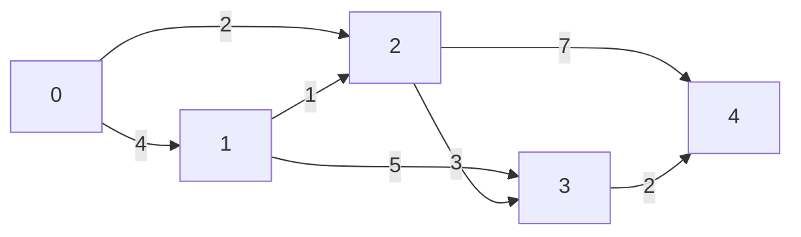

# Shortest Path Algorithms for Weighted Graphs: Bellman-Ford and Dijkstra

## 1. Introduction

Breadth-First Search (BFS) and Depth-First Search (DFS) are foundational graph traversal algorithms that operate effectively on unweighted graphs—graphs where all edges are considered equivalent in cost or distance. However, many real-world systems involve **weighted graphs**, where each edge carries a numerical weight representing factors such as distance, time, cost, or traffic congestion. In such scenarios, BFS is insufficient for determining the optimal path, as it does not account for varying edge weights.

This document introduces two classical algorithms designed to solve the **single-source shortest path problem** on weighted graphs: **Bellman-Ford Algorithm** and **Dijkstra's Algorithm**. Understanding their characteristics, trade-offs, and appropriate use cases is essential for advanced graph problem-solving and is frequently expected knowledge in technical interviews.

---

## 2. The Shortest Path Problem in Weighted Graphs

### 2.1 Definition

Given a weighted graph G = (V, E) where V is a set of vertices and E is a set of edges with associated numeric weights w(u, v), and a source vertex s, the **single-source shortest path problem** asks for the minimum-weight path from s to every other vertex in V (or to a specific target vertex).

### 2.2 Limitations of BFS and DFS

| Algorithm | Weight Awareness | Shortest Path in Weighted Graphs |
|-----------|-----------------|----------------------------------|
| **BFS** | No (treats all edges as unit weight) | Incorrect if weights differ |
| **DFS** | No | Not designed for shortest path; may find a path but not optimal |

**Conclusion:** Weighted graphs require specialized algorithms that incorporate edge weights into path cost calculations.

### 2.3 Real-World Examples

- **Google Maps Navigation:** Roads have varying travel times due to distance, traffic, and speed limits.
- **Network Routing Protocols:** Data packets traverse links with different latencies or bandwidth costs.
- **Flight Booking Systems:** Flights have different durations and ticket prices.

---

## 3. Bellman-Ford Algorithm

### 3.1 Overview

The Bellman-Ford algorithm computes the shortest paths from a single source vertex to all other vertices in a weighted graph, even when the graph contains **negative edge weights**. It is capable of detecting negative-weight cycles—cycles whose total weight sum is negative—which indicate that no bounded shortest path exists.

**Historical Note:** The algorithm is named after Richard Bellman, who also made foundational contributions to dynamic programming, and Lester Ford Jr.

### 3.2 Algorithmic Principle

Bellman-Ford relies on the principle of **relaxation**: progressively updating the estimated shortest distance to each vertex by considering whether a newly discovered path via an adjacent vertex offers a shorter route.

**Procedure:**
1. Initialize the distance to the source vertex as 0, and to all other vertices as infinity.
2. Repeat |V| - 1 times:
   - For each edge (u, v) with weight w, if `distance[u] + w < distance[v]`, update `distance[v] = distance[u] + w`.
3. After |V| - 1 iterations, perform one additional pass over all edges to check for negative-weight cycles. If any distance can still be reduced, a negative cycle exists.

### 3.3 Key Characteristics

| Property | Value |
|----------|-------|
| **Handles Negative Weights** | Yes |
| **Detects Negative Cycles** | Yes |
| **Time Complexity** | O(V · E) |
| **Space Complexity** | O(V) |

### 3.4 Advantages and Disadvantages

| Advantages | Disadvantages |
|------------|---------------|
| Can process graphs with negative edge weights. | Slower than Dijkstra for graphs with non-negative weights. |
| Simpler to implement for small graphs. | Quadratic time in worst case (e.g., dense graphs where E ≈ V²). |
| Detects negative cycles, preventing infinite loops. | Not suitable for very large graphs due to O(VE) complexity. |

### 3.5 JavaScript Implementation with Detailed Comments

```javascript
/**
 * Implements the Bellman-Ford algorithm to find shortest paths from a source vertex.
 *
 * @param {Array<Array<number>>} edges - List of edges, each represented as [u, v, weight].
 * @param {number} vertices - Total number of vertices in the graph.
 * @param {number} source - The starting vertex index.
 * @returns {Object} - Object containing distances array and a boolean indicating negative cycle.
 *
 * Time Complexity: O(V * E)
 * Space Complexity: O(V)
 */
function bellmanFord(edges, vertices, source) {
    // Step 1: Initialize distances from source to all vertices as Infinity
    const distances = new Array(vertices).fill(Infinity);
    distances[source] = 0;

    // Step 2: Relax all edges |V| - 1 times
    // The longest simple path can have at most |V| - 1 edges.
    for (let i = 0; i < vertices - 1; i++) {
        let updated = false; // Optimization: track if any distance changed

        for (const [u, v, weight] of edges) {
            // If the current distance to u is not Infinity and we found a shorter path to v
            if (distances[u] !== Infinity && distances[u] + weight < distances[v]) {
                distances[v] = distances[u] + weight;
                updated = true;
            }
        }

        // If no updates occurred in this iteration, we can terminate early
        if (!updated) break;
    }

    // Step 3: Check for negative-weight cycles
    // If we can still relax an edge, then a negative cycle exists.
    let hasNegativeCycle = false;
    for (const [u, v, weight] of edges) {
        if (distances[u] !== Infinity && distances[u] + weight < distances[v]) {
            hasNegativeCycle = true;
            break;
        }
    }

    return { distances, hasNegativeCycle };
}

// Example usage:
const edges = [
    [0, 1, 4],
    [0, 2, 2],
    [1, 2, -3],
    [1, 3, 2],
    [2, 3, 3]
];
const result = bellmanFord(edges, 4, 0);
console.log(result.distances); // e.g., [0, 4, 2, 4]
console.log('Negative cycle?', result.hasNegativeCycle);
```

---

## 4. Dijkstra's Algorithm

### 4.1 Overview

Dijkstra's algorithm is a widely used method for finding the shortest paths from a single source vertex to all other vertices in a graph with **non-negative edge weights**. It employs a greedy strategy, always expanding the vertex with the smallest known distance from the source.

**Historical Note:** The algorithm was conceived by Dutch computer scientist Edsger W. Dijkstra in 1956.

### 4.2 Algorithmic Principle

Dijkstra's algorithm maintains a set of vertices whose final shortest distance has been determined. At each step, it selects the unvisited vertex with the smallest tentative distance, marks it as visited, and updates the distances to its neighbors.

**Procedure:**
1. Initialize `distance[source] = 0` and all others as Infinity.
2. Use a priority queue (min-heap) to efficiently fetch the vertex with minimum distance.
3. While the priority queue is not empty:
   - Extract the vertex `u` with the smallest distance.
   - For each neighbor `v` of `u` with edge weight `w`:
     - If `distance[u] + w < distance[v]`, update `distance[v]` and enqueue `v`.
4. Terminate when all reachable vertices are processed.

### 4.3 Key Characteristics

| Property | Value |
|----------|-------|
| **Handles Negative Weights** | No (requires non-negative edges) |
| **Detects Negative Cycles** | Not applicable (negative weights invalidate algorithm) |
| **Time Complexity** | O((V + E) log V) with binary heap |
| **Space Complexity** | O(V) |

### 4.4 Advantages and Disadvantages

| Advantages | Disadvantages |
|------------|---------------|
| Faster than Bellman-Ford for non-negative weights. | Cannot handle negative edge weights. |
| Efficient for sparse and dense graphs with priority queue optimization. | Incorrect results if negative weights are present. |
| Widely used in real-world applications like GPS navigation. | Priority queue adds implementation complexity. |

### 4.5 JavaScript Implementation with Detailed Comments

```javascript
/**
 * Implements Dijkstra's algorithm using a min-priority queue (simulated with an array and sort).
 * For production, a binary heap would be more efficient.
 *
 * @param {Array<Array<Array<number>>>} graph - Adjacency list: graph[u] = [[v, weight], ...]
 * @param {number} source - Starting vertex index.
 * @returns {Array<number>} - Shortest distances from source to all vertices.
 *
 * Time Complexity: O((V + E) log V) with binary heap; this simple version is O(V^2) due to array operations.
 */
function dijkstra(graph, source) {
    const n = graph.length;
    const distances = new Array(n).fill(Infinity);
    const visited = new Array(n).fill(false);
    
    distances[source] = 0;

    // Priority queue entries: [vertex, distance]
    const pq = [[source, 0]];

    while (pq.length > 0) {
        // Sort to simulate min-heap extraction (inefficient but clear for demonstration)
        pq.sort((a, b) => a[1] - b[1]);
        const [u, distU] = pq.shift();

        // If we've already processed this vertex, skip
        if (visited[u]) continue;
        visited[u] = true;

        // If the popped distance is greater than current known distance, skip (lazy deletion)
        if (distU > distances[u]) continue;

        // Examine all neighbors
        for (const [v, weight] of graph[u]) {
            if (visited[v]) continue;

            const newDist = distances[u] + weight;
            if (newDist < distances[v]) {
                distances[v] = newDist;
                pq.push([v, newDist]);
            }
        }
    }

    return distances;
}

// Example usage:
const graph = [
    [[1, 4], [2, 2]],          // neighbors of 0
    [[2, 1], [3, 5]],          // neighbors of 1
    [[3, 3]],                  // neighbors of 2
    []                         // neighbors of 3
];
console.log(dijkstra(graph, 0)); // Output: [0, 4, 2, 5]
```

---

## 5. Comparison: Bellman-Ford vs. Dijkstra

| Criterion | Bellman-Ford | Dijkstra |
|-----------|--------------|----------|
| **Edge Weight Constraint** | Allows negative weights | Requires non-negative weights |
| **Negative Cycle Detection** | Yes | No |
| **Time Complexity** | O(V · E) | O((V + E) log V) with heap |
| **Typical Use Case** | Graphs with negative edges or when negative cycles must be detected | Road networks, routing with positive costs |
| **Algorithmic Approach** | Dynamic Programming (relaxation over all edges repeatedly) | Greedy (always expand closest vertex) |

---

## 6. Interview Context and Practical Usage

### 6.1 When to Mention These Algorithms

In technical interviews, implementing Bellman-Ford or Dijkstra from scratch is rare due to time constraints. However, candidates are expected to:

- **Identify** that a problem involves a weighted graph and shortest path.
- **Distinguish** between BFS (unweighted) and weighted algorithms.
- **Select** the appropriate algorithm based on the presence of negative weights.
- **Describe** the trade-offs in complexity and constraints.

### 6.2 Example Interview Question

**Scenario:** *"Find the shortest path from vertex 0 to vertex 4 in the given weighted graph."*

```
Vertices: 0, 1, 2, 3, 4
Edges with weights:
0 → 1 (4)
0 → 2 (2)
1 → 2 (1)
1 → 3 (5)
2 → 3 (3)
2 → 4 (7)
3 → 4 (2)
```

**Visual Representation (Mermaid):**



**Analysis:**
- The graph has no negative edge weights.
- **Appropriate Algorithm:** Dijkstra's Algorithm.

**Candidate Response:**
*"Since all edge weights are non-negative, Dijkstra's algorithm is the optimal choice due to its O((V+E) log V) time complexity, which is more efficient than Bellman-Ford's O(VE) for this graph."*

### 6.3 When to Use Bellman-Ford Over Dijkstra

- The graph contains edges with negative weights.
- There is a need to detect negative-weight cycles (e.g., arbitrage detection in currency exchange graphs).

---

## 7. Further Learning Resources

Due to the complexity of fully implementing these algorithms with optimal data structures (e.g., binary heaps for Dijkstra), the following resources are recommended for deeper study:

- **Introduction to Algorithms (CLRS):** Chapters 24 (Single-Source Shortest Paths) and 25 (All-Pairs Shortest Paths).
- **Visualgo.net:** Interactive visualization of Dijkstra and Bellman-Ford.
- **LeetCode Problems:** "Network Delay Time" (Dijkstra), "Cheapest Flights Within K Stops" (Bellman-Ford variation).

---

## 8. Summary

Breadth-First Search is a powerful tool for shortest path problems in unweighted graphs, but it fails when edges carry different weights. For weighted graphs, Bellman-Ford and Dijkstra's algorithms provide robust solutions. Bellman-Ford accommodates negative weights and detects negative cycles at the cost of higher time complexity O(VE), while Dijkstra offers superior efficiency O((V+E) log V) but requires non-negative edge weights. Understanding the appropriate context for each algorithm is crucial for solving real-world optimization problems and performing confidently in technical interviews.