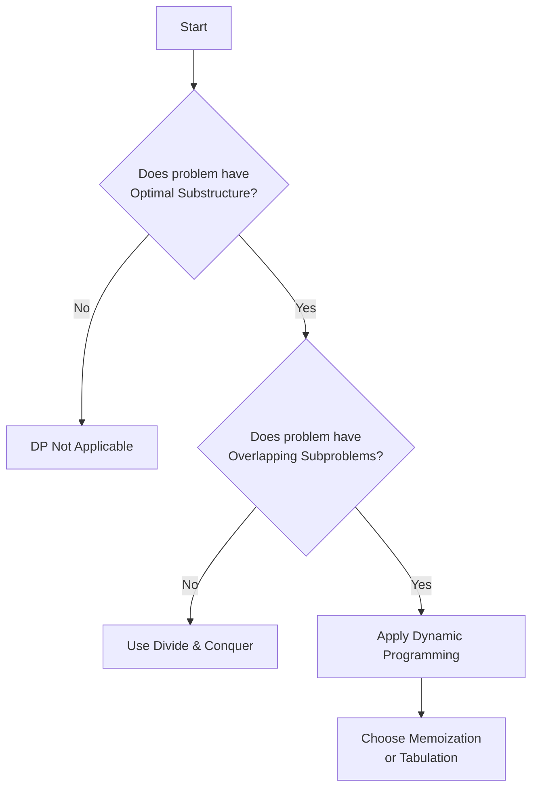

# Dynamic Programming: An Optimization Technique

## 1. Introduction

Dynamic Programming (DP) is a powerful algorithmic paradigm used to solve complex computational problems by decomposing them into simpler, overlapping subproblems. Rather than being a specific algorithm, dynamic programming is an **optimization technique** that leverages **caching** (storing intermediate results) to avoid redundant computations. It is particularly effective for problems exhibiting **optimal substructure** and **overlapping subproblems**.

The core idea behind dynamic programming is elegantly simple:

- Break down a problem into a collection of smaller subproblems.
- Solve each subproblem exactly **once**.
- Store the solution in a data structure (cache).
- Retrieve the cached result whenever the same subproblem reoccurs.

This approach transforms algorithms that would otherwise run in exponential time into polynomial time solutions, making DP indispensable for tackling optimization problems in computer science and engineering interviews.

## 2. Etymology and Misconception

The term "Dynamic Programming" was coined by Richard Bellman in the 1950s. Despite its imposing name, it carries no inherent semantic meaning related to the technique itself. Bellman selected the phrase as a deliberate buzzword, partly to shield his research from bureaucratic scrutiny in an era when "mathematical research" faced funding hurdles. The word **dynamic** suggested multi-stage, time-varying processes, while **programming** referred to planning or decision-making (akin to linear programming), not coding.

> **Note:** Dynamic programming is simply an optimization method built upon **caching**. The name itself is a historical artifact; understanding the underlying principle of reusing computed results is far more critical than the nomenclature.

## 3. Core Principles of Dynamic Programming

A problem must satisfy two fundamental properties to be amenable to dynamic programming:

### 3.1 Overlapping Subproblems

A problem possesses overlapping subproblems if solving the main problem involves solving the same subproblem multiple times. Instead of recomputing the solution every time, DP stores the result after its first computation. Subsequent occurrences of the same subproblem are resolved in constant time via a lookup.

**Example:** Calculating the Fibonacci sequence recursively without optimization involves recomputing `fib(2)` and `fib(1)` exponentially many times. DP caches these values, eliminating redundancy.

### 3.2 Optimal Substructure

A problem exhibits optimal substructure if an optimal solution to the overall problem can be constructed efficiently from the optimal solutions of its subproblems. In other words, the globally optimal solution depends on the locally optimal solutions.

**Example:** In finding the shortest path between two nodes in a graph, if the path passes through an intermediate node, the segment from the start to that intermediate node must itself be the shortest path.

## 4. Approaches to Dynamic Programming

Dynamic programming can be implemented using two primary strategies: **Memoization** (Top-Down) and **Tabulation** (Bottom-Up).

| Feature | Memoization (Top-Down) | Tabulation (Bottom-Up) |
| :--- | :--- | :--- |
| **Direction** | Starts from the main problem and recurses downward. | Starts from the base cases and iterates upward. |
| **Storage** | Uses a cache (object/array) filled on demand. | Uses a table (array) filled iteratively. |
| **Execution** | Lazy evaluation; computes only required subproblems. | Eager evaluation; computes all subproblems in order. |
| **Implementation** | Typically recursive function with cache. | Typically iterative loop. |
| **Stack Safety** | Prone to stack overflow for deep recursion. | No recursion stack; memory efficient. |

Both approaches yield identical time complexity improvements; the choice depends on problem constraints and ease of implementation.

## 5. Simple Flowchart Representation

The following Mermaid diagram illustrates the decision process for applying dynamic programming:



## 6. Code Examples in JavaScript

The classic illustration of dynamic programming is the computation of the **n-th Fibonacci number**. The naive recursive solution has an exponential time complexity of **O(2<sup>n</sup>)** due to redundant calculations.

### 6.1 Naive Recursive Approach (Suboptimal)

```javascript
/**
 * Naive recursive Fibonacci implementation.
 * Time Complexity: O(2^n) - Exponential
 * Space Complexity: O(n) - Recursion stack depth
 *
 * This approach recalculates fib(2) and fib(1) multiple times,
 * leading to severe performance degradation for n > 40.
 */
function fibNaive(n) {
    // Base case: The first two numbers in the sequence are fixed.
    // F(0) = 0, F(1) = 1
    if (n < 2) {
        return n;
    }
    // Recursive step: Each call spawns two more calls.
    // This creates a binary tree of recursive calls.
    return fibNaive(n - 1) + fibNaive(n - 2);
}

// Example usage (Caution: fibNaive(50) will likely freeze the browser/tab)
console.log(fibNaive(10)); // Output: 55
```

### 6.2 Memoization (Top-Down DP)

Memoization transforms the recursive solution by caching previously computed results in an object or array. The cache is checked before performing any recursive computation.

```javascript
/**
 * Memoized Fibonacci (Top-Down Dynamic Programming).
 * Time Complexity: O(n) - Each subproblem computed once.
 * Space Complexity: O(n) - Cache storage + recursion stack.
 *
 * @param {number} n - The index in Fibonacci sequence (0-indexed).
 * @param {Object} cache - Optional cache object to store results.
 * @returns {number} The nth Fibonacci number.
 */
function fibMemoization(n, cache = {}) {
    // If the value has already been computed, retrieve it from cache.
    // This check eliminates redundant recursive calls (overlapping subproblems).
    if (n in cache) {
        return cache[n];
    }

    // Base cases: Define the terminating conditions for recursion.
    // When n is 0 or 1, the sequence value is n itself.
    if (n < 2) {
        return n;
    }

    // Recursive step with caching:
    // Compute the result for the current 'n', but first ensure the
    // subproblems are solved (and cached).
    const result = fibMemoization(n - 1, cache) + fibMemoization(n - 2, cache);

    // Store the computed result in the cache object before returning.
    // This ensures future calls with the same 'n' are O(1) lookups.
    cache[n] = result;

    return result;
}

// Example usage
console.log(fibMemoization(50)); // Efficiently outputs 12586269025
```

### 6.3 Tabulation (Bottom-Up DP)

Tabulation constructs the solution iteratively from the base cases up to the desired input. It eliminates the recursion overhead entirely.

```javascript
/**
 * Tabulated Fibonacci (Bottom-Up Dynamic Programming).
 * Time Complexity: O(n) - Single loop iteration.
 * Space Complexity: O(n) - Array storage for DP table.
 *
 * This method fills an array `dp` where dp[i] represents F(i).
 * It is safe from stack overflow errors and often slightly faster
 * than memoization due to lack of function call overhead.
 *
 * @param {number} n - The index in Fibonacci sequence.
 * @returns {number} The nth Fibonacci number.
 */
function fibTabulation(n) {
    // Handle edge case for n = 0 to prevent array allocation issues.
    if (n === 0) return 0;

    // Initialize a DP table (array) of size n+1.
    // The index directly maps to the Fibonacci sequence index.
    const dp = new Array(n + 1);

    // Define the base cases (bottom of the table).
    dp[0] = 0;
    dp[1] = 1;

    // Iterate from 2 up to n, building the solution iteratively.
    // This is the "bottom-up" construction.
    for (let i = 2; i <= n; i++) {
        // dp[i] is constructed using the optimal substructure property:
        // The optimal solution for i depends on solutions for i-1 and i-2.
        dp[i] = dp[i - 1] + dp[i - 2];
    }

    // The final answer resides at the top of the table (index n).
    return dp[n];
}

// Example usage
console.log(fibTabulation(50)); // Output: 12586269025
```

### 6.4 Space-Optimized Tabulation

Often, DP problems can be further optimized by observing that we only need a limited history of previous states to compute the next one. For Fibonacci, we only need the last two values, reducing space complexity to **O(1)**.

```javascript
/**
 * Space-Optimized Fibonacci.
 * Time Complexity: O(n)
 * Space Complexity: O(1) - Only two variables maintained.
 *
 * This is the most efficient implementation for Fibonacci,
 * demonstrating that full DP tables are not always required.
 */
function fibOptimized(n) {
    if (n < 2) return n;

    let prev = 0; // Represents F(i-2)
    let curr = 1; // Represents F(i-1)

    // Iterate, updating pointers to the last two values.
    for (let i = 2; i <= n; i++) {
        const next = prev + curr; // Compute F(i)
        prev = curr;              // Shift window: old F(i-1) becomes new F(i-2)
        curr = next;              // New F(i) becomes current value for next iteration
    }

    return curr;
}

console.log(fibOptimized(50)); // Output: 12586269025
```

## 7. Conclusion

Dynamic Programming is not a specific algorithm but a strategic optimization technique rooted in **caching** (Memoization) and **iterative table filling** (Tabulation). By ensuring that each unique subproblem is solved only once, DP dramatically reduces the computational complexity of problems with overlapping subproblems and optimal substructure.

Mastering this paradigm is essential for solving a wide array of classic problems including:

- Knapsack Problem (0/1 and Unbounded)
- Longest Common Subsequence (LCS)
- Edit Distance (Levenshtein Distance)
- Coin Change Problem
- Matrix Chain Multiplication

The key to applying DP effectively lies in identifying the recurrence relation that defines the optimal substructure and choosing the appropriate caching strategy to avoid redundant work.

> **Reference:** For a deeper dive into the historical naming of "Dynamic Programming", refer to Richard Bellman's autobiography *"Eye of the Hurricane"* or the article *"How 'Dynamic Programming' Got Its Name"* available at relevant computer science history archives.