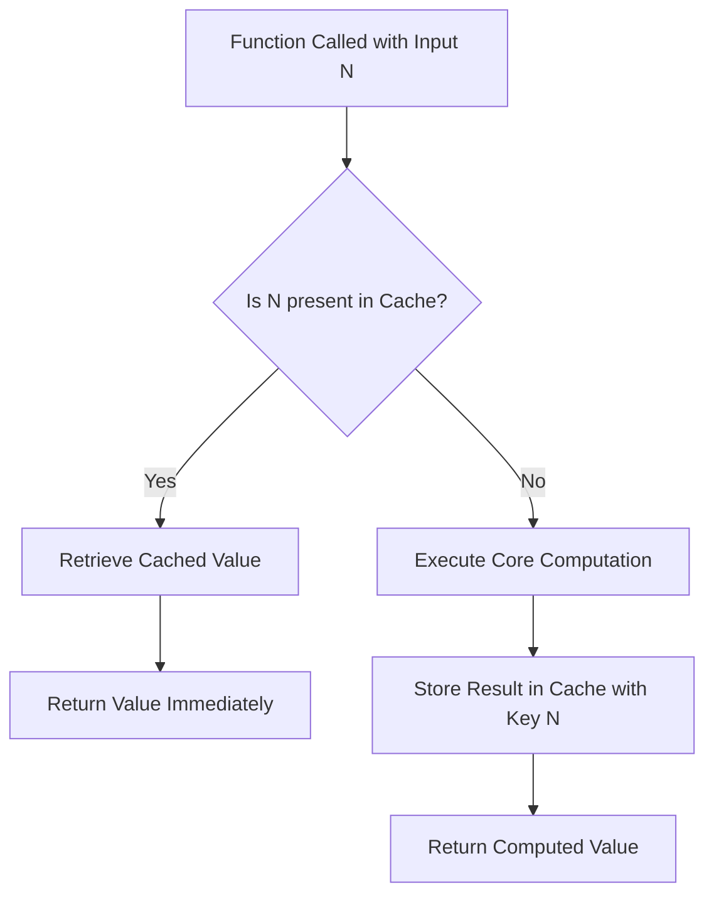

# Caching and Memoization in Dynamic Programming

## 1. Introduction

Dynamic Programming (DP) derives its efficiency from a fundamental computer science concept known as **caching**. Without a solid understanding of caching and its specialized form called **memoization**, the mechanics of dynamic programming remain opaque. This document establishes the foundational knowledge of caching and memoization, demonstrating how these techniques transform inefficient, redundant computations into highly optimized solutions.

## 2. The Concept of Caching

### 2.1 Definition

Caching is the process of storing copies of data or computational results in a temporary storage layer (the **cache**) to enable faster retrieval for subsequent requests. The primary objective is to avoid re-executing expensive operations when the same input is encountered repeatedly.

### 2.2 Analogy: The School Backpack

Consider a student who requires a pencil multiple times throughout the school day. Without a backpack, the student would be compelled to walk home each time a pencil is needed—a time-consuming and inefficient process. A backpack functions as a **local cache**: it holds frequently needed items in an easily accessible location, allowing the student to retrieve a pencil rapidly without the overhead of returning home.

In computational terms:
- **Home**: The original data source or expensive computation.
- **Backpack**: The cache storage (memory).
- **Pencil**: The computed value or data item.
- **Walking home**: Executing the time-intensive operation.

### 2.3 Characteristics of an Effective Cache

| Property | Description |
| :--- | :--- |
| **Proximity** | Stored in fast-access memory (e.g., RAM, CPU registers). |
| **Associativity** | Data is indexed by a unique key (e.g., input parameters). |
| **Limited Size** | May employ eviction policies (LRU, FIFO) when full. |
| **Transparency** | Retrieval logic abstracts away the underlying computation. |

## 3. Memoization: A Specific Form of Caching

### 3.1 Definition

**Memoization** is a specialized caching technique applied to **deterministic functions**. It involves storing the return value of a function keyed by its input parameters. When the function is invoked with identical arguments, the cached result is returned immediately, bypassing the function's internal logic entirely.

The term "memoization" is derived from the Latin word *memorandum* (to be remembered). It should not be confused with *memorization* (learning by heart), though both share etymological roots.

### 3.2 Key Properties

- **Deterministic Requirement**: The function must consistently produce the same output for a given input. Non-deterministic functions (e.g., those relying on `Math.random()` or external APIs) are unsuitable for memoization.
- **Parameter as Key**: The combination of argument values serves as the unique identifier for cache lookup.
- **Transparent Optimization**: The external interface of the function remains unchanged; only its internal implementation is augmented with a cache.

### 3.3 Memoization vs. General Caching

| Aspect | General Caching | Memoization |
| :--- | :--- | :--- |
| **Scope** | Broad; caches any data (DB queries, HTTP responses, file reads). | Narrow; caches function return values specifically. |
| **Granularity** | Coarse; may cache large objects or entire pages. | Fine-grained; tied to function parameters. |
| **Lifecycle** | Often persistent or session-based. | Typically in-memory for the duration of program execution. |
| **Implementation** | External cache services (Redis, Memcached). | In-code data structures (Object, Map). |

## 4. Implementation of Memoization in JavaScript

The following examples illustrate the transformation of a computationally expensive function using memoization. For clarity, the example uses an addition operation; however, the principle applies identically to complex algorithms such as recursive Fibonacci calculations, graph traversals, or matrix operations.

### 4.1 Naive Implementation (No Caching)

```javascript
/**
 * A function that simulates a time-consuming operation.
 * In a real scenario, this could be a recursive call, large loop, or DB query.
 *
 * @param {number} n - The input number to be processed.
 * @returns {number} The result of adding 80 to the input.
 */
function addTo80Naive(n) {
    // Simulate a heavy computation that consumes significant time/resources.
    // In actual applications, this line might represent O(n^2) calculations.
    console.log("Executing long computation...");

    // The core operation: add 80 to the input parameter.
    return n + 80;
}

// Example usage - Each call triggers the full computation.
console.log("First call:", addTo80Naive(5));  // Logs "Executing long computation..." then 85
console.log("Second call:", addTo80Naive(5)); // Logs "Executing long computation..." then 85 (redundant)
console.log("Third call:", addTo80Naive(5));  // Logs "Executing long computation..." then 85 (redundant)

/**
 * Problem Analysis:
 * For identical input (5), the "long computation" is executed three times.
 * This violates the DRY (Don't Repeat Yourself) principle and wastes CPU cycles.
 * In dynamic programming problems like Fibonacci, this redundancy causes exponential time complexity.
 */
```

### 4.2 Memoized Implementation (With Cache Object)

```javascript
/**
 * Memoized version of addTo80.
 * Utilizes a closure-scoped cache object to store previously computed results.
 *
 * The cache object uses the input number as a property key.
 * JavaScript objects provide O(1) average-time property access, ensuring rapid lookups.
 */
function createMemoizedAddTo80() {
    // The cache resides in the closure scope.
    // It persists across multiple invocations of the returned function.
    // Initially empty; populated as new computations occur.
    const cache = {};

    // Return the memoized function.
    // This function closure retains access to the 'cache' variable.
    return function memoizedAddTo80(n) {
        // Step 1: Check if the result for input 'n' already exists in the cache.
        // The 'in' operator checks for property existence, returning true even for falsy values (e.g., 0).
        // Using 'cache[n] !== undefined' is also acceptable but fails if stored value is undefined.
        if (n in cache) {
            console.log(`[Cache Hit] Returning cached value for n = ${n}`);
            // If cached, return immediately. No computation performed.
            return cache[n];
        } else {
            // Step 2: Cache miss. The result must be computed.
            console.log(`[Cache Miss] Computing value for n = ${n} ...`);

            // Simulate the time-consuming operation.
            // In a real scenario, this is the core logic of the function.
            console.log("Executing long computation...");
            const result = n + 80;

            // Step 3: Store the newly computed result in the cache before returning.
            // Future calls with the same 'n' will hit the cache.
            cache[n] = result;

            // Step 4: Return the computed result.
            return result;
        }
    };
}

// Instantiate the memoized function.
const memoizedAddTo80 = createMemoizedAddTo80();

// Example usage demonstrating cache hits and misses.
console.log("First call (n=5):", memoizedAddTo80(5));
// Output:
// [Cache Miss] Computing value for n = 5 ...
// Executing long computation...
// First call (n=5): 85

console.log("Second call (n=5):", memoizedAddTo80(5));
// Output:
// [Cache Hit] Returning cached value for n = 5
// Second call (n=5): 85   (No "Executing long computation..." logged)

console.log("Third call (n=10):", memoizedAddTo80(10));
// Output:
// [Cache Miss] Computing value for n = 10 ...
// Executing long computation...
// Third call (n=10): 90   (New input, new computation)

console.log("Fourth call (n=5):", memoizedAddTo80(5));
// Output:
// [Cache Hit] Returning cached value for n = 5
// Fourth call (n=5): 85   (Cache still contains value for n=5)

/**
 * Performance Observation:
 * - Input 5 is computed only once despite multiple calls.
 * - The cache eliminates redundant "long computation" executions.
 * - For n distinct inputs, the function performs exactly n computations.
 * - Each subsequent call for a known input executes in O(1) time.
 */
```

### 4.3 Memoization Using JavaScript Map Object

For scenarios involving non-string keys or larger cache sizes, the `Map` data structure offers advantages over plain objects.

```javascript
/**
 * Memoization using ES6 Map.
 * Map maintains insertion order and accepts any data type as key.
 */
function createMemoizedWithMap() {
    // Initialize an empty Map to serve as the cache.
    const cache = new Map();

    return function memoizedAdd(n) {
        // Map.prototype.has() checks for existence of the key.
        if (cache.has(n)) {
            console.log(`[Cache Hit] Key ${n} found in Map.`);
            // Map.prototype.get() retrieves the stored value.
            return cache.get(n);
        }

        console.log(`[Cache Miss] Computing for ${n}...`);
        const result = n + 80;

        // Map.prototype.set() stores the key-value pair.
        cache.set(n, result);
        return result;
    };
}

const memoizedWithMap = createMemoizedWithMap();
console.log(memoizedWithMap(5));  // Computation
console.log(memoizedWithMap(5));  // Cache hit
```

## 5. Memoization Process Flowchart

The following simplified Mermaid diagram visualizes the decision logic within a memoized function.



## 6. Memoization in the Context of Dynamic Programming

### 6.1 The Bridge Between Caching and DP

Memoization serves as the **top-down** implementation strategy for dynamic programming. DP problems are characterized by **overlapping subproblems**—the same subproblem is encountered multiple times during recursion. Memoization ensures each unique subproblem is solved exactly once, transforming an exponential recursive algorithm into a polynomial one.

### 6.2 Example: Fibonacci Sequence with Memoization

The Fibonacci sequence is a canonical DP problem. The naive recursive approach recomputes `fib(2)` exponentially many times. By wrapping the recursive function with a memoization cache, each `fib(k)` is calculated only once.

```javascript
/**
 * Memoized Fibonacci using top-down DP approach.
 * This is identical in spirit to the addTo80 example, but applied to recursion.
 */
function createMemoizedFib() {
    const cache = {};

    function fib(n) {
        // Base cases: fib(0) = 0, fib(1) = 1
        if (n < 2) return n;

        // Check cache to avoid redundant recursive calls.
        if (n in cache) {
            return cache[n];
        }

        // Recursive step with caching.
        // The result of fib(n) depends on fib(n-1) and fib(n-2).
        // By caching intermediate results, the recursion tree collapses to a linear chain.
        const result = fib(n - 1) + fib(n - 2);
        cache[n] = result;
        return result;
    }

    return fib;
}

const memoizedFib = createMemoizedFib();
console.log(memoizedFib(40)); // Computes efficiently without exponential blowup.
```

### 6.3 Comparison: Top-Down (Memoization) vs. Bottom-Up (Tabulation)

| Feature | Top-Down with Memoization | Bottom-Up with Tabulation |
| :--- | :--- | :--- |
| **Implementation** | Recursive function augmented with cache. | Iterative array/table filling. |
| **Cache Population** | On-demand (lazy). | Pre-computed in order (eager). |
| **Solves** | Only necessary subproblems. | All subproblems in the state space. |
| **Stack Usage** | Uses call stack; risk of overflow for deep recursion. | No recursion; stack-safe. |
| **Use Case** | When state space is sparse or recursion is intuitive. | When iteration is natural and stack depth is a concern. |

## 7. Summary

- **Caching** is a general-purpose optimization that stores data for rapid reuse.
- **Memoization** is a specific caching strategy applied to deterministic functions, storing return values keyed by input arguments.
- In JavaScript, memoization is typically implemented using a closure-scoped `Object` or `Map` that persists across function calls.
- The cache-check logic eliminates redundant computations, converting repeated calls into constant-time property lookups.
- Memoization is the cornerstone of the **top-down** dynamic programming approach, directly addressing the **overlapping subproblems** property.
- Understanding memoization provides a clear mental model for how dynamic programming algorithms achieve their dramatic performance gains over naive recursive implementations.