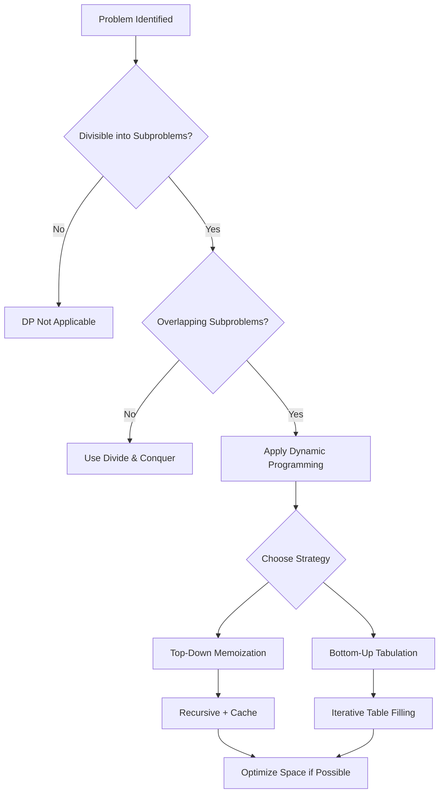

# Dynamic Programming: Comprehensive Summary and Alternative Approaches

## 1. Introduction

Dynamic Programming (DP) represents the final component in the algorithmic knowledge framework essential for technical interviews and efficient software design. This document consolidates the core principles of DP, revisits the systematic methodology for problem identification, and introduces the **bottom-up (tabulation)** approach as an alternative to the previously emphasized top-down memoization technique. Mastery of both perspectives equips engineers with a versatile toolkit for tackling optimization and combinatorial problems.

## 2. Recap: The Dynamic Programming Mindset

### 2.1 The DP Identification Checklist

The process of determining whether a problem is amenable to dynamic programming follows a structured inquiry:

| Step | Question | Implication |
| :--- | :--- | :--- |
| **1** | Can the problem be divided into smaller subproblems? | The problem must exhibit **optimal substructure**, often leading to a recursive formulation. |
| **2** | Does the recursive decomposition produce **repetitive** subproblems? | If the same subproblem is encountered multiple times, naive recursion wastes computation. |
| **3** | Can the results of subproblems be stored (cached) for reuse? | Memoization or tabulation can eliminate redundant work. |
| **4** | Does applying DP yield a significant performance improvement? | Typically transforms exponential time complexity to polynomial or linear time. |

### 2.2 Core Concept: Memoization (Top-Down DP)

Memoization is the process of caching the return values of a function keyed by its input parameters. When a function is invoked, the cache is consulted first:

- **Cache Hit**: The stored result is returned immediately.
- **Cache Miss**: The result is computed, stored in the cache, and then returned.

This approach preserves the natural recursive structure of the problem while achieving dramatic efficiency gains. The Fibonacci sequence exemplifies this: the naive **O(2ⁿ)** implementation becomes **O(n)** with memoization.

### 2.3 Performance Impact Summary

| Problem | Naive Complexity | DP Complexity | Improvement |
| :--- | :--- | :--- | :--- |
| Fibonacci | O(2ⁿ) | O(n) | Exponential → Linear |
| House Robber | O(2ⁿ) | O(n) | Exponential → Linear |
| Climbing Stairs | O(2ⁿ) | O(n) | Exponential → Linear |

## 3. Alternative Approach: Bottom-Up Dynamic Programming (Tabulation)

While memoization solves problems from the top down (starting with the desired result and recursively breaking it into subproblems), **tabulation** constructs the solution **iteratively** from the base cases upward. This method eliminates recursion entirely, thereby avoiding call stack overhead and potential stack overflow errors.

### 3.1 Conceptual Comparison

| Feature | Top-Down (Memoization) | Bottom-Up (Tabulation) |
| :--- | :--- | :--- |
| **Direction** | From main problem down to base cases. | From base cases up to the main problem. |
| **Implementation** | Recursive function with cache. | Iterative loop with an array/table. |
| **Subproblem Evaluation** | Lazy (only computes required subproblems). | Eager (computes all subproblems in order). |
| **Stack Safety** | Vulnerable to stack overflow for deep recursion. | No recursion stack; safe for large inputs. |
| **Intuitiveness** | Often closer to problem definition. | May require more planning to set up loops. |

### 3.2 Bottom-Up Fibonacci Implementation

The bottom-up approach for Fibonacci leverages the fact that each term depends only on the two preceding terms. An array (or two variables) can be used to build the sequence iteratively.

```javascript
/**
 * Fibonacci Master 2 - Bottom-Up Dynamic Programming (Tabulation)
 * Time Complexity: O(n) - Single loop from 2 to n.
 * Space Complexity: O(n) - Array to store all Fibonacci numbers up to n.
 *
 * This approach constructs the solution iteratively, starting from the base cases
 * and accumulating results until the desired index is reached.
 *
 * @param {number} n - The zero-based index in the Fibonacci sequence.
 * @returns {number} The nth Fibonacci number.
 */
function fibonacciMaster2(n) {
    // Handle base cases explicitly.
    // For n = 0, return 0; for n = 1, return 1.
    if (n < 2) {
        return n;
    }

    // Initialize an array to hold the Fibonacci sequence values.
    // Pre-fill the first two indices with the base case values.
    // Index 0 corresponds to F(0), index 1 corresponds to F(1).
    const answer = [0, 1];

    // Iterate from index 2 up to n (inclusive).
    // At each step, compute the next Fibonacci number by summing the two previous numbers.
    for (let i = 2; i <= n; i++) {
        // The value at index i is the sum of the values at indices i-2 and i-1.
        // This directly implements the recurrence relation: F(i) = F(i-2) + F(i-1).
        const nextFib = answer[i - 2] + answer[i - 1];

        // Append the newly computed value to the array.
        answer.push(nextFib);
    }

    // The desired Fibonacci number is the last element in the array.
    // Using pop() retrieves and removes the last element, returning F(n).
    return answer.pop();

    // Alternative: return answer[answer.length - 1];
}

// Example usage:
console.log('Bottom-Up F(10):', fibonacciMaster2(10)); // Output: 55
console.log('Bottom-Up F(50):', fibonacciMaster2(50)); // Output: 12586269025
```

### 3.3 Space-Optimized Bottom-Up Fibonacci

A key observation is that only the last two computed values are necessary to generate the next one. The full array can be replaced with two variables, reducing space complexity to **O(1)**.

```javascript
/**
 * Fibonacci - Bottom-Up with O(1) Space
 * Time Complexity: O(n)
 * Space Complexity: O(1)
 *
 * This is the most efficient iterative solution for Fibonacci,
 * demonstrating that DP tables can often be compressed to a few variables.
 *
 * @param {number} n
 * @returns {number}
 */
function fibonacciOptimized(n) {
    if (n < 2) return n;

    // Initialize the first two Fibonacci numbers.
    let prev2 = 0; // Represents F(i-2)
    let prev1 = 1; // Represents F(i-1)

    // Iterate from index 2 to n, updating variables.
    for (let i = 2; i <= n; i++) {
        const current = prev2 + prev1; // Compute F(i)
        prev2 = prev1;                 // Shift: F(i-1) becomes F(i-2)
        prev1 = current;               // New F(i) becomes F(i-1) for next iteration
    }

    // After the loop, prev1 holds F(n).
    return prev1;
}

console.log(fibonacciOptimized(100)); // Output: 354224848179262000000 (approx, may exceed Number limit)
```

### 3.4 Comparison of Fibonacci Implementations

| Implementation | Time Complexity | Space Complexity | Recursive | Use Case |
| :--- | :--- | :--- | :--- | :--- |
| Naive Recursive | O(2ⁿ) | O(n) (stack) | Yes | Educational only |
| Memoized (Top-Down) | O(n) | O(n) (cache + stack) | Yes | Intuitive DP |
| Tabulation (Bottom-Up Array) | O(n) | O(n) (array) | No | Clear iterative logic |
| Tabulation (Space Optimized) | O(n) | O(1) | No | Production-ready |

## 4. Choosing Between Top-Down and Bottom-Up

Both approaches are valid implementations of dynamic programming. The choice often depends on:

- **Problem Structure**: If the state space is sparse or the recursion depth is manageable, top-down memoization may be simpler to implement.
- **Stack Limitations**: In environments with limited stack size (e.g., JavaScript in browsers), bottom-up avoids stack overflow for large inputs.
- **Interview Context**: Interviewers may ask for a specific approach or expect the candidate to discuss trade-offs. Being familiar with both demonstrates depth of understanding.
- **Personal Preference**: Some engineers find recursion more natural; others prefer iteration. Competence in both is beneficial.

## 5. Visualizing the DP Landscape

The following Mermaid diagram summarizes the decision flow for applying dynamic programming.



## 6. Conclusion

Dynamic Programming completes the algorithmic toolkit required for mastering technical interviews and building efficient software. The core insight—avoiding redundant computation by caching intermediate results—is elegantly simple yet profoundly powerful.

- **Memoization** (top-down) offers an intuitive, recursive solution that mirrors the problem's natural decomposition.
- **Tabulation** (bottom-up) provides an iterative, stack-safe alternative that often allows further space optimization.
- The Fibonacci sequence serves as a canonical example, demonstrating a reduction from **O(2ⁿ)** to **O(n)** time complexity.
- The DP identification checklist (subproblems, overlap, caching) is a reliable heuristic for recognizing DP-suitable problems.

By internalizing these patterns and practicing with classic problems such as House Robber, Best Time to Buy and Sell Stock, and Climbing Stairs, engineers can confidently approach algorithmic challenges and deliver optimized, scalable solutions. The ability to recognize and apply dynamic programming is a hallmark of a proficient software engineer, leading to both technical success and professional recognition.

> **Final Reflection:** Dynamic Programming is not an arcane mathematical construct but a disciplined application of caching and reuse. Understanding this demystifies the topic and empowers engineers to write code that is both elegant and efficient.