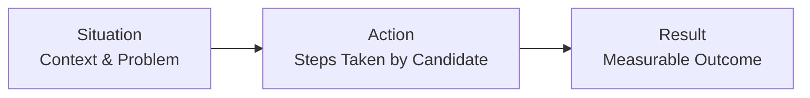

# Exercise: Constructing a Response to "Tell Me About a Problem You Solved"

## 1. Exercise Overview

### 1.1 Purpose

This exercise is designed to transform theoretical knowledge of the SAR (Situation-Action-Result) framework into a concrete, interview-ready narrative. The candidate will develop a detailed response to the common behavioral prompt: **"Tell me about a problem you solved."**

### 1.2 Time Allocation

Allocate a focused block of **30 minutes** for the initial drafting of this response. This timeframe allows for thoughtful recall of project details, structuring of the narrative, and preliminary self-evaluation.

### 1.3 Source Material

The candidate is expected to draw upon **1 to 2 significant projects** from their portfolio. Examples include:
- A full-stack web application (e.g., an image recognition platform like SmartBrain).
- A complex data structure or algorithm implementation.
- A contribution to an open-source repository.
- A capstone or final-year academic project involving non-trivial engineering challenges.

---

## 2. Foundational Framework: The SAR Method

### 2.1 Structural Recap

The response must adhere strictly to the three-part SAR structure to ensure clarity and logical progression.

### 2.2 Component Definitions

| Component | Definition | Key Question to Answer |
| :--- | :--- | :--- |
| **Situation** | Describe the project environment and the specific technical or logistical hurdle encountered. | *What was broken, slow, insecure, or missing?* |
| **Action** | Detail the specific, personal contributions made to analyze and resolve the problem. | *What did I specifically do, code, or architect?* |
| **Result** | Conclude with the quantifiable or qualitative impact of the action taken. | *How much did performance improve? How many users were affected?* |

### 2.3 Quality Criteria

The narrative must meet the following standards to be considered interview-ready:
- **Technical Depth**: The problem should involve Performance, Scaling, or Security concerns.
- **Quantifiable Impact**: A metric or number must be included in the Result phase.
- **Relevance**: The technologies used in the story should align with common job requirements (e.g., JavaScript, APIs, Databases).

---

## 3. Exercise Protocol

### 3.1 Step 1: Project Selection (5 minutes)

Review your project history. Select the project that best demonstrates your ability to overcome a significant technical obstacle.

**Selection Heuristic:**
- Choose a project where **you** were the primary architect or debugger of the solution.
- Prefer projects with **observable outcomes** (e.g., "the page loaded faster," "the crash stopped occurring").

### 3.2 Step 2: Draft the SAR Narrative (20 minutes)

Using the template provided in Section 4, write a complete narrative for the selected project. Focus on content accuracy and flow rather than perfect prose in the first iteration.

### 3.3 Step 3: Self-Assessment and Refinement (5 minutes)

After drafting, review the response against the checklist in Section 5. Refine wording to ensure the response can be delivered comfortably within a **60 to 90 second** spoken timeframe.

---

## 4. Response Template

Candidates may use the following structured template to organize their thoughts. Replace bracketed text with specific, verifiable details from the chosen project.

### Project Title: [Insert Project Name]

**Situation:**
> *Describe the initial state. What was the problem? Why was it important to solve?*
>
> **Example Start:** "While building the **[Project Name]** application, a **[describe functionality, e.g., real-time dashboard]**, I noticed that **[describe specific issue, e.g., the API response time was exceeding 2 seconds]**. This was impacting **[mention user or system impact, e.g., the user experience and causing frequent timeout errors]**."

**Action:**
> *Detail the specific steps taken. Use "I" statements.*
>
> **Example Start:** "To address this, I first **[mention analysis step, e.g., profiled the database queries and identified a missing index]**. Following the analysis, I **[mention implementation step, e.g., implemented a Redis caching layer for frequently accessed data]**. Additionally, I **[mention another action, e.g., refactored the frontend JavaScript to batch API requests using Promise.all]**."

**Result:**
> *Quantify the outcome.*
>
> **Example Start:** "As a result of these changes, the average API response time decreased from **[Old Value]ms** to **[New Value]ms**, representing a **[X]%** improvement. The frequency of timeout errors dropped to zero, and the application was able to handle a concurrent user load **[mention specific capacity, e.g., of 500 simulated users]** without performance degradation."

---

## 5. Self-Assessment Checklist

After completing the draft, verify the response against the following criteria. All items should be checked before considering the exercise complete.

| Criteria | Verification Question | Status |
| :--- | :--- | :---: |
| **SAR Adherence** | Is the story clearly divided into a Situation, Action, and Result segment? | ☐ |
| **Personal Ownership** | Does the "Action" section primarily use "I" (indicating personal contribution) rather than "We" (vague team credit)? | ☐ |
| **Technical Merit** | Does the problem described involve more than a simple syntax error or configuration change? (Hint: It should involve logic, architecture, or performance). | ☐ |
| **Metric Inclusion** | Is there at least one specific number or percentage mentioned in the "Result" section? | ☐ |
| **Positivity** | Does the narrative avoid complaining about teammates, previous employers, or technology choices? | ☐ |
| **Relevance** | Do the technologies mentioned (e.g., JavaScript, Node.js, React) align with the types of roles you are targeting? | ☐ |

---

## 6. Post-Exercise Actions

### 6.1 Iterative Improvement

The drafted response serves as a living document. As you encounter new technical challenges in future projects or work, update this narrative with more impressive or recent examples.

### 6.2 Community Review and Peer Feedback

To validate the effectiveness of the story and to gain exposure to alternative structuring methods, consider sharing the draft (excluding any confidential or proprietary information) in the designated community channel.

- **Platform**: Private Discord Community
- **Channel**: `#job-hunting`
- **Access**: Refer to Lecture 3 resources on the course dashboard for the invitation link.

Reviewing peer submissions provides insight into what constitutes a compelling technical narrative and helps calibrate expectations for interview delivery.