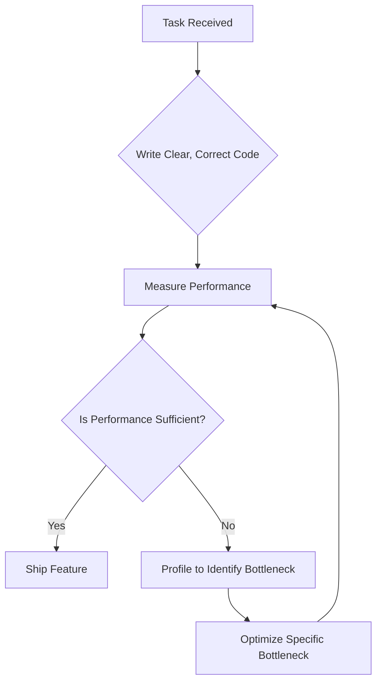

# Advanced Professional Attributes: Differentiating Factors for Technical Interviews

## 1. Introduction

### 1.1 The Competitive Landscape

Technical interviews assess not only algorithmic proficiency and coding capability but also the candidate's alignment with professional software engineering values. While many candidates demonstrate adequate technical skills, a smaller subset distinguishes themselves through the demonstration of **senior-level mindset attributes**. These attributes, often cultivated through experience, can be consciously articulated to create a lasting positive impression.

### 1.2 The Concept of "Secret Weapons"

The term "secret weapons" refers to a set of professional principles and behavioral tendencies that address common pain points observed in software development teams. By explicitly or implicitly demonstrating an understanding of these principles during an interview, a candidate signals a level of maturity and team-orientation that is highly valued by engineering managers and technical leads.

### 1.3 Objective

This document enumerates and explicates these differentiating attributes, providing the candidate with a framework for integrating them into conversational responses and behavioral narratives.

---

## 2. Principle 1: Simplicity Over Complexity

### 2.1 The Inherent Bias Toward Complexity

Software engineers often possess a natural inclination to design intricate, clever solutions. While intellectual rigor is valuable, this tendency can lead to systems that are difficult to understand, maintain, and debug by other team members. The resulting **technical debt** and **knowledge silos** represent a significant operational cost to organizations.

### 2.2 The Value Proposition of Simplicity

Prioritizing simplicity is a hallmark of mature engineering practice. It reflects an understanding that code is read far more often than it is written and that the primary consumer of code is another human developer, not the compiler.

**Demonstration in an Interview Context:**
- **Verbal Cue:** *"In a recent team project, I advocated for a simpler, more verbose solution over a highly compressed one-liner. My reasoning was that the next developer—who might be debugging this at 3:00 AM—would appreciate the clarity over the cleverness."*
- **Behavioral Story Alignment:** This principle can be integrated into the **Leadership Hero** or **Technical Hero** narrative, showcasing a focus on team productivity rather than individual brilliance.

### 2.3 Code Illustration: Readability vs. Cleverness

The following JavaScript example contrasts a complex, condensed implementation with a simpler, more maintainable alternative. This illustrates the practical application of the simplicity principle.

```javascript
/**
 * SCENARIO: A function to calculate the total price of items in a cart,
 * applying a discount if a promotional code is valid.
 */

// COMPLEX APPROACH (Clever but Opaque)
// This implementation uses nested ternary operators and implicit type coercion.
// While concise, it requires significant mental parsing to understand the logic.
// This is difficult to debug or extend with new discount rules.
function calculateTotalComplex(cartItems, promoCode) {
    // Nested ternary: Hard to read and prone to logic errors during modification.
    const discount = promoCode === 'SAVE10' ? 0.10 : (promoCode === 'SAVE20' ? 0.20 : 0);
    // Single reduce statement with complex logic embedded.
    return cartItems.reduce((total, item) => total + item.price * (1 - discount), 0);
}

// SIMPLE APPROACH (Readable and Maintainable)
// This implementation separates concerns into discrete, named steps.
// The logic is self-documenting, making it accessible to junior developers
// and easy to modify when business requirements change (e.g., adding a new promo code).
function calculateTotalSimple(cartItems, promoCode) {
    // Step 1: Calculate the subtotal (clear, single responsibility)
    const subtotal = cartItems.reduce((sum, item) => sum + item.price, 0);

    // Step 2: Determine the discount rate based on promo code (explicit mapping)
    let discountRate = 0;
    if (promoCode === 'SAVE10') {
        discountRate = 0.10;
    } else if (promoCode === 'SAVE20') {
        discountRate = 0.20;
    }
    // Additional discount rules can be added here cleanly.

    // Step 3: Apply discount and return final total
    const finalTotal = subtotal * (1 - discountRate);
    return finalTotal;
}

// INTERVIEW IMPLICATION:
// Stating a preference for the second approach demonstrates consideration for
// team velocity, code review efficiency, and long-term maintainability.
```

---

## 3. Principle 2: Awareness of Premature Optimization

### 3.1 The Classic Adage

The phrase **"Premature optimization is the root of all evil"** (attributed to Donald Knuth) is widely cited but often poorly applied. In an interview context, demonstrating a nuanced understanding of this principle is a strong signal of practical engineering judgment.

### 3.2 Balancing Performance and Delivery

The principle does not advocate for writing inefficient code. Rather, it warns against sacrificing **delivery timelines** and **code clarity** for speculative performance gains that may never materialize as bottlenecks.

**Interview Application:**
A candidate should articulate an understanding of the **Measure-First** methodology.
- **Poor Signal:** *"I always write the fastest code possible from the start."*
- **Strong Signal:** *"I prioritize writing clear, correct code first. If performance becomes a concern, I rely on profiling tools to identify actual hotspots before investing time in optimization. For example, I once spent an hour optimizing a loop that, according to the profiler, accounted for only 0.5% of total execution time. That was a valuable lesson in focusing on what matters."*

### 3.3 Practical Framework for Discussion

The following flowchart illustrates the decision-making process that a mature developer employs regarding optimization efforts.



---

## 4. Principle 3: Focus on the Holistic Goal (Avoiding Myopia)

### 4.1 Defining Myopic Development

"Myopic" development refers to an excessive and exclusive focus on the technical task at hand, divorced from the broader business or project context. This manifests as:
- Over-engineering a feature that the client needed only as a temporary placeholder.
- Delaying a critical launch to refactor code that, while imperfect, was functional.
- Ignoring explicit stakeholder deadlines in pursuit of personal technical ideals.

### 4.2 The Business-Aware Engineer

Organizations value engineers who understand that code is a **means to an end**. The end is typically customer value, revenue generation, or operational efficiency.

**Demonstration Strategy:**
- **Narrative Example:** *"We had a client who needed a feature demo for an upcoming investor pitch. The deadline was non-negotiable. I made the conscious decision to prioritize a functional, 'good enough' implementation over a perfectly architected microservice. I documented the known technical shortcuts and scheduled a refactoring sprint for the week immediately following the pitch. The client secured the funding, and we were able to pay down the technical debt in a controlled manner."*
- **Key Vocabulary:** Use terms like **"trade-offs,"** **"MVP (Minimum Viable Product),**" and **"stakeholder alignment."** 

### 4.3 Balancing Technical Excellence with Pragmatism

This principle does not condone sloppy work. It emphasizes **intentional technical debt**. The distinction is critical:
- **Unintentional Debt:** Poorly written code due to lack of skill.
- **Intentional Debt:** Consciously accepted sub-optimal code with a documented plan for repayment, taken on to meet a higher-priority business objective.

---

## 5. Principle 4: Positivity and Constructive Communication

### 5.1 The Toxicity of Chronic Complaining

Software development involves inherent frustrations: legacy codebases, changing requirements, and interpersonal friction. However, a developer who habitually complains about clients, managers, or colleagues creates a **negative feedback loop** that erodes team morale and productivity.

### 5.2 Positioning as a Solution-Oriented Collaborator

Interviewers actively screen for candidates who will positively contribute to the work environment. A candidate can differentiate themselves by framing past challenges through a lens of **solutions and empathy** rather than blame.

**Contrasting Frames:**

| Negative Frame (Avoid) | Positive/Solution-Oriented Frame (Recommended) |
| :--- | :--- |
| *"The client kept changing their mind; it was impossible to work with them."* | *"I worked with a client whose requirements evolved rapidly. I suggested we adopt a more agile sprint cycle with weekly demos, which helped manage expectations and reduced rework."* |
| *"The legacy codebase was a complete mess."* | *"I've worked in established codebases that required careful navigation. I found that writing comprehensive unit tests before refactoring gave me the confidence to make improvements safely."* |
| *"My coworker was slow and held up the project."* | *"On one project, I noticed a teammate was struggling with a specific technology. I offered to pair program for a few sessions, which helped get them unblocked and improved our overall velocity."* |

---

## 6. Principle 5: The Absence of Ego in Code Review

### 6.1 The Psychological Challenge

Code review is a professional practice that can inadvertently trigger personal defensiveness. When a developer's work is critiqued, it is easy to perceive the feedback as an attack on personal competence rather than an objective evaluation of the code artifact.

### 6.2 The Hallmark of Seniority

Senior developers are distinguished by their ability to **separate self-worth from source code**. They actively solicit feedback and view code reviews as a learning mechanism and a quality assurance step, not a judgment.

**Demonstration in an Interview:**
- **Direct Statement:** *"I genuinely appreciate thorough code reviews. I know that I have blind spots, and I'd much rather have a teammate catch an edge case in a pull request than have a user catch it in production. I don't take comments personally; I see them as opportunities to improve the robustness of the system."*
- **Story Example:** *"There was an instance where a senior architect suggested a completely different approach to a problem I had spent a day solving. It was a bit of a gut punch initially, but once I reviewed their reasoning, I realized their approach was far more scalable. I scrapped my branch and learned a new pattern that I still use today."*

### 6.3 Implications for Team Dynamics

A developer with "no ego" is a **force multiplier** for a team. They de-escalate tension, facilitate faster decision-making, and create an environment where junior developers feel safe asking questions and making mistakes.

---

## 7. Summary and Integration Strategy

### 7.1 Core Attributes Summary Table

| Attribute | Interview Signal | Long-Term Value |
| :--- | :--- | :--- |
| **Simplicity over Complexity** | Prefers readable code; prioritizes team maintainability. | Reduces technical debt; accelerates onboarding. |
| **Optimization Awareness** | Understands profiling; balances speed with delivery. | Maximizes engineering ROI; meets deadlines. |
| **Holistic Goal Focus** | Understands business impact; manages stakeholder expectations. | Aligns technical work with company objectives. |
| **Positivity** | Frames challenges as solutions; avoids blame. | Enhances team morale; fosters collaboration. |
| **No Ego** | Welcomes feedback; separates self from code. | Creates a blameless culture; accelerates learning. |

### 7.2 Practical Implementation in Conversation

These principles should not be recited as a list. They are most effective when **woven organically** into the **Four Heroes narratives**. For instance, when telling a **Challenge Hero** story, the candidate can note how they chose a simpler algorithm to ensure the junior developer could maintain it, or how they refrained from premature optimization to hit a critical deadline.

### 7.3 Conclusion

Mastery of these "secret weapon" attributes elevates a candidate from merely "technically competent" to "highly desirable." They address the unspoken needs of engineering organizations—needs for stability, collaboration, and business alignment. By demonstrating these traits, a candidate assures the interviewer not only that they can do the job, but that they will make the entire team better in the process.