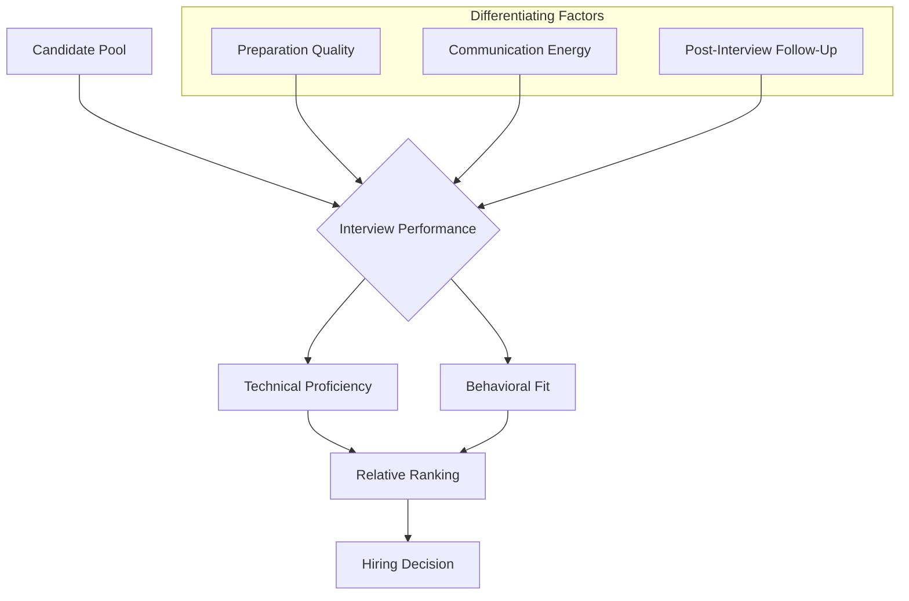

# Section Conclusion: Synthesis of Non-Technical Interview Strategies

## 1. Overview

### 1.1 Purpose of Review

This document serves as a comprehensive summary and consolidation of the principles and techniques presented throughout the non-technical interview preparation module. The objective is to reinforce the core patterns and strategic frameworks that enable consistent success across diverse behavioral interview scenarios.

### 1.2 The Enduring Value of Behavioral Preparation

Unlike technical question banks, which evolve with programming languages and frameworks, the fundamental structure of behavioral interviewing remains remarkably stable over time. Mastery of the techniques outlined in this section constitutes a **durable career asset**, applicable to all future professional transitions and advancement opportunities.

---

## 2. Core Principles: A Consolidated Review

### 2.1 Mindset and Psychological Preparation

The candidate's internal state directly influences external perception. A deliberate approach to psychological framing yields measurable improvements in interview performance.

| Principle | Description | Practical Application |
| :--- | :--- | :--- |
| **Confidence Through Abundance** | The interview is one of many opportunities; the outcome does not define self-worth. | Reframe the interaction as a learning experience and a mutual evaluation. |
| **Relaxed Demeanor** | Nervousness impairs cognitive function and communication clarity. | Employ deep breathing and positive visualization prior to entry. |
| **Respect for Interviewer Time** | Interviewers often conduct assessments alongside regular duties. | Bring energy, enthusiasm, and efficiency to the conversation. |

### 2.2 The Imperative of Conversational Energy

The interview should approximate a **two-way dialogue** rather than a unidirectional interrogation. Candidates who display authentic curiosity and interpersonal warmth are consistently rated more favorably.

**Key Behavioral Markers:**
- Maintain eye contact and engaged body language.
- Respond to interviewer cues with relevant follow-up questions.
- Avoid robotic, rehearsed delivery; allow natural conversational flow.

### 2.3 The Primacy and Recency Effects

Psychological research on memory formation indicates that information presented at the **beginning** (Primacy Effect) and **end** (Recency Effect) of an interaction receives disproportionate weight in recall and evaluation.

**Strategic Implications:**
- **Entry:** Enter with a smile, firm handshake (if in-person), and a clear, confident "Tell me about yourself" narrative.
- **Exit:** Conclude with a prepared **Closing Statement** that synthesizes value proposition and reinforces cultural alignment.

---

## 3. The Four Heroes Framework: Enduring Relevance

### 3.1 Framework Summary

The **Four Heroes Framework** provides a structured repository of professional narratives that address the unspoken questions driving interviewer evaluation.

| Hero Archetype | Interviewer Question Addressed | Narrative Focus |
| :--- | :--- | :--- |
| **Technical Hero** | *Can this person do the job?* | Complex problem-solving, architectural decisions, technical depth. |
| **Success Hero** | *Does this person deliver results?* | Quantifiable achievements, project completions, recognition. |
| **Leadership Hero** | *Can this person drive outcomes?* | Initiative, mentorship, influencing without authority. |
| **Challenge Hero** | *Will this person persevere?* | Resilience, adaptability, learning from failure. |

### 3.2 Narrative Reusability

The prepared stories are designed for **cross-application**. A single well-constructed narrative may be adapted to answer questions regarding:
- A time you solved a difficult problem.
- A project you are proud of.
- A conflict you navigated.
- A failure you learned from.

---

## 4. Competitive Perspective: Relative Performance

### 4.1 The Fallacy of the Perfect Interview

Candidates frequently misinterpret a suboptimal response to a single question as a disqualifying event. This perspective is flawed. The hiring decision is based on **relative comparison** across the candidate pool, not an absolute score against a theoretical ideal.

### 4.2 The Reality of Candidate Pools

Most candidates experience moments of difficulty during technical and behavioral assessments. The differentiating factor is not the absence of struggle, but the **composure and problem-solving approach** demonstrated during those moments.

**Critical Insight:**
> *"You are not competing against a perfect answer. You are competing against other candidates who may struggle just as much as you do."*

### 4.3 Visual Representation of Competitive Dynamics

---

## 5. External Resource: Leveraging Glassdoor for Interview Intelligence

### 5.1 Platform Overview

**Glassdoor** (glassdoor.com) is a publicly accessible platform that aggregates:
- Company reviews from current and former employees.
- Salary data and compensation benchmarks.
- **Interview reviews and question samples** submitted by candidates.

### 5.2 Strategic Application for Interview Preparation

The **Interviews** section for a target company provides actionable intelligence that can inform preparation strategy.

**Information Available:**
- Common technical questions asked during past interviews.
- Format of the interview process (e.g., number of rounds, presence of whiteboarding).
- Perceived difficulty level and overall candidate experience.

### 5.3 The Competitive Advantage of Research

Accessing and studying this information constitutes the **"extra step"** that distinguishes highly prepared candidates from the general applicant pool. A small investment of time in researching company-specific interview patterns yields disproportionate returns in confidence and performance.

---

## 6. The Fundamental Interview Question

### 6.1 Synthesis of All Evaluation Criteria

Regardless of the specific questions posed, every interview process ultimately seeks to answer a single, overarching question:

> **"If I hire this person, will they make my life easier?"**

### 6.2 Decomposition of "Making Life Easier"

This question can be decomposed into observable candidate attributes that contribute positively to team and organizational outcomes.

| Attribute | Manifestation in Interview | Value to Employer |
| :--- | :--- | :--- |
| **Effective Communication** | Clear articulation of ideas; active listening; appropriate questioning. | Reduces misunderstandings; accelerates project velocity. |
| **Prioritization and Focus** | Demonstrated ability to identify critical tasks and avoid tangential distractions. | Ensures resources are allocated to high-impact work. |
| **Autonomy and Self-Sufficiency** | Evidence of independent problem-solving; minimal need for hand-holding. | Frees manager bandwidth for strategic initiatives. |
| **Collaborative Orientation** | Positive framing of team experiences; absence of blame or negativity. | Fosters a healthy, productive work environment. |

### 6.3 The Ultimate Objective

The candidate's overarching goal is to provide compelling evidence—through prepared narratives, professional demeanor, and strategic questioning—that their addition to the team will **reduce friction, enhance productivity, and contribute to business growth**.

---

## 7. Concluding Remarks

### 7.1 The Pattern of Success

The non-technical interview process follows predictable patterns. By internalizing the frameworks presented in this section—the **Four Heroes**, **SAR Method**, **Strategic Questioning**, and **Post-Interview Protocol**—the candidate transforms a potentially stressful experience into a repeatable, manageable, and ultimately successful professional interaction.

### 7.2 Commitment to Continuous Improvement

Mastery of behavioral interviewing, like mastery of data structures and algorithms, requires deliberate practice and iterative refinement. Each interview, regardless of outcome, serves as a data point for improving future performance.

### 7.3 Next Steps

With the non-technical interview strategy now established, attention turns to the subsequent phases of the hiring process, including offer evaluation, negotiation, and professional onboarding.