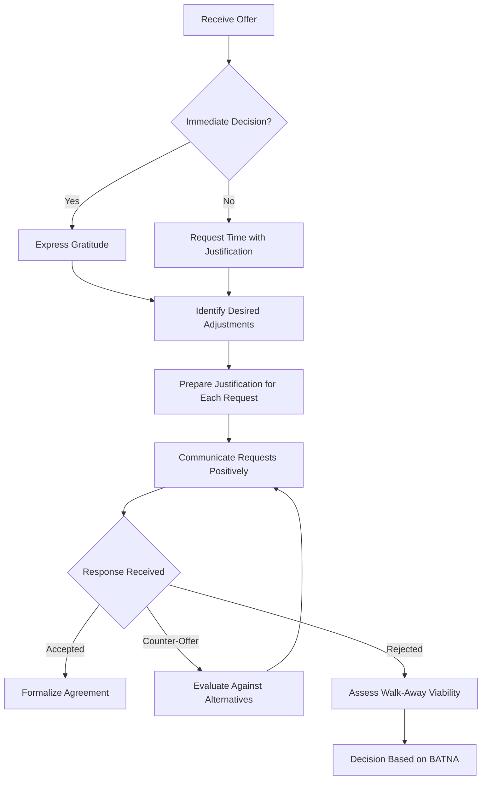

# Principles of Professional Negotiation in Career Advancement

## 1. Introduction to Negotiation

Negotiation is a structured dialogue between parties aimed at reaching a mutually acceptable agreement regarding terms of employment, compensation, or professional engagement. While cultural norms and demographic contexts significantly influence negotiation protocols, certain foundational principles demonstrate consistent efficacy across diverse professional environments. This document presents a systematic examination of core negotiation strategies applicable to employment offer discussions, salary determinations, and professional contract evaluations.

It is essential to acknowledge that the author of this material does not claim expertise as a professional negotiator. The strategies articulated herein represent empirically validated approaches derived from practical application and observational analysis within the technology sector. Readers are advised to calibrate these principles against their specific cultural and organizational contexts.

## 2. Foundational Negotiation Principles

### 2.1 The Imperative of Continued Dialogue

A primary objective in any negotiation is the preservation and extension of the conversational exchange. Premature provision of a specific numeric figure frequently terminates the exploratory phase of negotiation, foreclosing opportunities for value discovery and creative structuring of compensation packages.

**Principle:** Avoid statements that conclusively answer the compensation expectation question. Instead, provide responses that establish reference points while explicitly positioning the discussion at its commencement.

### 2.2 Rational Justification Framework

The perception of avarice or self-interest constitutes a significant psychological barrier to negotiation initiation. Counteract this perception by consistently appending a legitimate, externally-referenced rationale to any request for modification of terms.

**Principle:** Every proposed adjustment to an offer or request for additional consideration must be accompanied by a credible justification that situates the request within a broader context of fairness, market alignment, or shared decision-making responsibility.

### 2.3 Mandatory Engagement in Negotiation

Empirical evidence from compensation analysis demonstrates that failure to negotiate initial compensation packages results in compounding financial disparity over the duration of employment tenure. Organizations do not retroactively adjust compensation to correct for candidate failure to negotiate.

**Principle:** Negotiation engagement is not optional for optimal career financial outcomes. The absence of negotiation constitutes passive acceptance of suboptimal terms.

### 2.4 Positive Sum Orientation

Effective negotiation is not a zero-sum adversarial contest wherein one party's gain necessitates equivalent loss by the counterparty. Rather, it represents a collaborative problem-solving exercise directed at identifying terms that satisfy the core interests of both parties.

**Principle:** Approach negotiation with the explicit objective of achieving a mutually beneficial outcome. Maintain positive, constructive, and professional demeanor throughout the process.

### 2.5 Establishment of Alternative Leverage (Stakes)

Negotiating power is directly proportional to the credibility and desirability of a party's alternatives to the proposed agreement. The capacity to decline an offer without adverse consequence constitutes the foundational source of leverage.

**Principle:** Cultivate and communicate the existence of viable alternatives. The perceived willingness and ability to terminate negotiations materially strengthens the negotiating position.

## 3. Strategic Response to Salary Expectation Inquiries

### 3.1 The Problem of Premature Specificity

During interview processes, candidates are frequently asked to state their salary expectations. A direct numeric response establishes an anchor point that may disadvantage the candidate if the figure falls below the employer's budgeted range or if it prematurely caps the negotiation ceiling.

### 3.2 The Anchoring Technique

The anchoring technique involves introducing a reference figure that is not presented as the candidate's demand but rather as a contextual data point intended to frame the subsequent negotiation range.

**Recommended Response Structure:**

> "Based on available compensation data for software engineering positions in the [Geographic Region] market, the median compensation for roles with comparable responsibility and experience requirements appears to be approximately [Reference Figure]. I believe this represents a reasonable starting point for our discussion regarding appropriate compensation alignment."

**Analysis of Response Components:**

| Component | Function | Strategic Value |
| :--- | :--- | :--- |
| Reference to Market Data | De-personalizes the figure; attributes it to external, objective sources. | Reduces perception of candidate greed or arbitrary demand. |
| Geographic Specification | Acknowledges compensation variation by location. | Demonstrates market awareness and sophistication. |
| "Starting Point" Language | Explicitly frames the figure as initiating rather than concluding the discussion. | Preserves negotiation flexibility for subsequent adjustments. |
| Avoidance of Personal Demand Statement | Candidate does not state "I want [X]". | Prevents creation of a fixed psychological anchor tied to candidate expectations. |

### 3.3 Distinction Between Starting Points and Concluding Figures

Candidates must maintain clear conceptual separation between the initial anchoring figure and the ultimate acceptable compensation. The anchor serves to orient the conversation within a favorable range; it does not represent a commitment to accept that specific amount.

## 4. The Practice of Providing Justifications

### 4.1 Psychological Barriers to Negotiation

The primary inhibitor of negotiation behavior is the fear of being perceived as ungrateful, greedy, or excessively self-interested. This concern is particularly acute in cultures that prioritize humility and indirect communication.

### 4.2 Mitigation Through Attributed Rationale

By attaching a request for additional time, increased compensation, or modified terms to an external justification, the candidate redirects perceived motivation away from personal acquisitiveness and toward legitimate, understandable considerations.

**Example Scenario: Requesting Decision Time Extension**

**Suboptimal Response:**
> "I need more time to think about this."

**Optimized Response with Justification:**
> "Thank you for this generous offer. I am genuinely excited about the possibility of contributing to [Company Name]. Given that this represents a significant career and family decision with long-term implications, I would appreciate [X] business days to discuss this thoroughly with my partner to ensure we are both fully aligned and comfortable with the commitment. I want to be certain that, should I accept, I am positioned to dedicate myself fully to this role for many years."

**Analysis of Optimized Response:**

- **Acknowledgement of Offer Generosity:** Establishes positive frame and appreciation.
- **Enthusiasm Expression:** Reinforces interest in the position.
- **Externalization of Decision Timeline:** The delay is attributed to familial consultation, not personal indecision.
- **Long-Term Commitment Framing:** Positions the deliberation period as an investment in ensuring sustained, dedicated employment, which aligns with employer interests.

### 4.3 Application to Compensation Increase Requests

When requesting an increase in offered compensation, provide a justification grounded in scope of work, market data, or specific value contribution.

**Example Justification:**
> "Based on my review of the responsibilities outlined for this role, particularly the emphasis on [Specific Technical Challenge or Leadership Component], and considering the market compensation data for positions with comparable scope in [Location], I would like to discuss an adjustment to the base salary component to more accurately reflect the anticipated contribution level."

## 5. The Mandate to Negotiate

### 5.1 Empirical Consequences of Negotiation Abstention

Failure to negotiate initial compensation creates a compounding financial disadvantage that persists throughout the tenure with an organization. Subsequent annual percentage increases are calculated against a lower base, and internal equity adjustments rarely correct for initial negotiation deficits.

**Illustrative Case Study:**
Two software developers hired into identical roles with identical responsibilities. Developer A negotiates an initial base salary of ₹12,00,000 per annum. Developer B accepts the initial offer of ₹9,00,000 per annum without negotiation. Assuming both receive identical 5% annual increases, the cumulative compensation differential over a five-year period exceeds ₹18,00,000, exclusive of bonus and equity implications calculated as percentages of base compensation.

### 5.2 Offer Revocation Risk Assessment

A common concern among candidates is that negotiation attempts may result in offer withdrawal. Industry practice and anecdotal evidence indicate that such outcomes are exceptionally rare. Employers anticipate and budget for negotiation within established salary bands. Professional, reasonable negotiation does not damage relationships or trigger adverse action.

**Guideline:** Negotiate professionally, respectfully, and within reasonable bounds. The risk of offer revocation for engaging in good-faith negotiation is negligible.

### 5.3 Organizational Size and Negotiation Flexibility

Larger organizations typically maintain more expansive compensation bands and greater discretionary authority for hiring managers and recruiters. Consequently, the potential for successful negotiation increases with organizational scale, subject to internal equity policies and role leveling guidelines.

## 6. Maintaining Positive Demeanor

### 6.1 Distinguishing Negotiation from Conflict

Negotiation is not synonymous with confrontation or adversarial posturing. Effective negotiators maintain warmth, professionalism, and collaborative orientation throughout the exchange.

### 6.2 Win-Win Orientation

The optimal negotiation outcome satisfies the fundamental interests of both parties: the employer secures the desired talent at a fair market rate, and the candidate receives compensation commensurate with their contribution value. Adopting this perspective reduces psychological friction and facilitates constructive dialogue.

**Key Communication Practices:**

- Maintain appreciative and enthusiastic tone.
- Acknowledge the employer's constraints and processes.
- Frame requests as collaborative problem-solving: "How can we work together to address this gap?"
- Express continued interest in the role independent of compensation discussions.

## 7. The Role of Alternatives in Negotiation Leverage

### 7.1 Definition of Stakes

"Stakes" in negotiation refer to the tangible consequences associated with failure to reach agreement. For the candidate, stakes are embodied in alternative employment opportunities, competing offers, or the capacity to continue a job search without financial distress.

### 7.2 Strategic Communication of Alternatives

Explicitly communicating the existence of competing offers or ongoing interview processes with competitor organizations signals to recruiters that the candidate possesses credible alternatives and is not captive to the current offer.

**Competitive Dynamics in Technology Sector:**
Recruiters at major technology firms (e.g., Google, Amazon, Microsoft, Meta) are acutely aware of talent competition among peer organizations. An offer from a recognized competitor serves as a powerful market validation signal and frequently triggers accelerated processes or compensation improvements.

### 7.3 Walking Away as Negotiation Power

The ultimate leverage in any negotiation is the demonstrated willingness to decline an unsatisfactory agreement and pursue alternatives. This willingness must be authentic; feigned willingness is detectable and undermines credibility.

**Strategic Implication:** Candidates should endeavor to enter salary discussions with at least one viable alternative, whether a competing offer, a current position, or a sustainable job search continuation plan.

## 8. Practical Application: Case Study Analysis

### 8.1 Book Publishing Contract Negotiation

**Scenario:**
A publisher contacted the author with a proposal to co-author a technical book. The initial offer included a specified upfront payment upon contract signing, followed by royalty participation based on sales volume.

**Negotiation Response Applied:**

> "Thank you for this opportunity. I am very enthusiastic about this project and the potential collaboration. However, based on my assessment of the scope, required research depth, and time commitment necessary to deliver a high-quality manuscript, I would like to discuss the possibility of an increased upfront payment component. Given that this project will require me to reduce my involvement in other ongoing professional commitments, I believe an adjustment to the upfront payment would better align the compensation with the anticipated investment of my time and expertise."

**Analysis of Applied Principles:**

| Principle Demonstrated | Application in Response |
| :--- | :--- |
| **Continued Dialogue** | Response does not reject or accept; it proposes further discussion. |
| **Justification Provision** | Cites scope, research requirements, time commitment, and opportunity cost of other projects. |
| **Positive Framing** | Expresses enthusiasm and gratitude before presenting request. |
| **Stakes Communication** | Implicitly references alternative projects that would be displaced, indicating opportunity cost. |

**Outcome:**
The publisher responded with a revised offer containing a higher upfront payment component. The negotiation was resolved favorably through a single email exchange.

### 8.2 Generalizable Framework from Case Study

The case study illustrates that effective negotiation does not require extensive back-and-forth or adversarial confrontation. A single, well-structured communication that incorporates the core principles—anchoring to a reference point, providing legitimate justification, maintaining positive tone, and signaling alternative value—can yield measurable improvements in offered terms.

## 9. Visual Summary of Negotiation Process Flow

The following Mermaid diagram provides a simplified representation of the negotiation decision flow described in this document.

## 10. Conclusion

Negotiation competency represents a critical professional skill with direct and compounding financial implications over the course of a career. The principles articulated in this document—preservation of dialogue, provision of justification, mandatory engagement, positive orientation, and cultivation of alternatives—provide a structured framework applicable across diverse cultural and organizational contexts.

Candidates are encouraged to internalize these principles and adapt their application to specific circumstances. The absence of negotiation represents a voluntary forfeiture of potential compensation and benefits that organizations are prepared to provide. The most effective negotiators combine these strategic principles with authentic professionalism and collaborative intent, achieving outcomes that satisfy both personal objectives and employer interests.