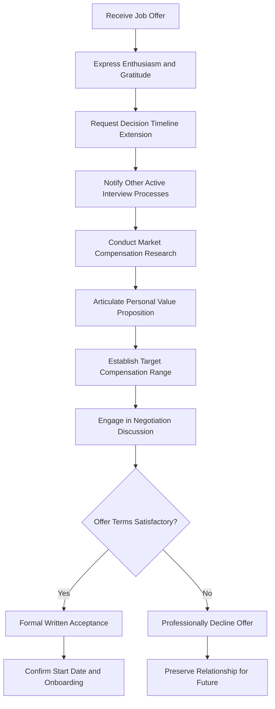

# Handling a Job Offer: Strategic Response and Negotiation Preparation

## 1. Introduction

The receipt of a formal employment offer represents a significant professional milestone, validating the candidate's technical qualifications, interview performance, and overall suitability for the position. However, the immediate post-offer period constitutes a critical decision-making window during which the candidate's actions materially influence both the final terms of employment and the long-term trajectory of the professional relationship.

This document provides a structured framework for managing the offer receipt phase, emphasizing strategic communication, timeline management, cross-company coordination, and foundational preparation for compensation discussions. Adherence to these protocols enables candidates to maximize the value derived from an offer while maintaining positive, professional relationships with all parties involved.

## 2. Immediate Response to an Offer

### 2.1 The Imperative of Delayed Acceptance

Upon receiving a verbal or written offer, the instinctive response may be immediate acceptance, particularly if the opportunity aligns closely with the candidate's objectives. However, immediate acceptance constitutes a premature closure of the negotiation window and forfeits potential adjustments to compensation, benefits, or other employment terms.

**Critical Principle:** Do not accept an offer at the moment of receipt. The appropriate initial response acknowledges the offer positively while deferring a definitive commitment pending comprehensive evaluation.

### 2.2 Recommended Verbal and Written Response Framework

The following response structure achieves three essential objectives: (1) expresses genuine appreciation and enthusiasm, (2) communicates the existence of parallel interview processes, and (3) preserves flexibility for subsequent negotiation.

**Sample Response Script:**

> "Thank you for this offer. I am genuinely excited to hear this news. Throughout the interview process, I felt a strong alignment with the team's mission and the technical challenges ahead, and I am very pleased that the sentiment appears to be mutual.
>
> At this moment, I am in active discussions with a few other organizations and am awaiting final determinations from those processes. Consequently, I am not yet in a position to provide a definitive response regarding the specific details of this offer. However, I want to emphasize that I had an excellent experience interviewing with [Company Name] and I can clearly envision myself contributing meaningfully and building a long-term career here.
>
> I am confident that, given a reasonable timeframe to complete my other conversations, we can arrive at an arrangement that works exceptionally well for both parties."

**Deconstruction of Strategic Elements:**

| Element | Purpose | Desired Effect |
| :--- | :--- | :--- |
| Expression of Enthusiasm | Reinforces genuine interest in the position. | Mitigates perception of candidate as disinterested or shopping for leverage. |
| Disclosure of Parallel Processes | Signals existence of alternatives without appearing boastful. | Establishes competitive context and implies market validation. |
| Deferral of Commitment | Avoids premature acceptance or rejection. | Maintains negotiation optionality. |
| Long-Term Career Framing | Positions the decision as a thoughtful, long-term commitment. | Aligns with employer's interest in retention and reduces pressure for immediate answer. |
| Collaborative Tone | "We can arrive at an arrangement..." | Frames negotiation as joint problem-solving rather than adversarial demand. |

### 2.3 Avoiding Conversation Termination

Any response that conclusively accepts or rejects the offer terminates the negotiation phase. Statements such as "Yes, I accept" or "I'm in" close the dialogue and eliminate the candidate's ability to propose modifications. The objective is to extend the conversational window to allow for full information gathering and cross-offer comparison.

## 3. Requesting Additional Decision Time

### 3.1 Strategic Value of Extended Timeline

Time constitutes the single most valuable resource in a multi-company interview process. An extended decision window enables:

- Completion of ongoing interview processes with other organizations.
- Receipt and comparison of multiple competing offers.
- Thorough analysis of total compensation packages, including equity, benefits, and long-term incentives.
- Consultation with family members, mentors, or trusted advisors.

### 3.2 Justification for Extension Requests

When requesting additional time, provide a legitimate, externally-referenced rationale to avoid the perception of indecisiveness or strategic manipulation.

**Sample Extension Request:**

> "I want to ensure that I make a fully informed and carefully considered decision regarding this opportunity. Given that this represents a significant career transition with long-term implications for my family, I would appreciate the courtesy of [Number] additional business days to complete my outstanding conversations and discuss the opportunity thoroughly with my partner. My goal is to accept this role with complete confidence and commitment, and I believe this brief additional period will enable me to do so."

### 3.3 Handling Employer Pressure for Immediate Response

Some employers may attempt to impose artificially compressed decision timelines. In such circumstances, the candidate must evaluate whether this pressure reflects a legitimate business need (e.g., competing candidate deadlines) or an attempt to limit comparative shopping.

**Consideration:** An organization that refuses a reasonable extension request and demands immediate commitment may be signaling cultural norms that do not prioritize employee autonomy or thoughtful decision-making. The candidate should weigh this signal in the overall evaluation of the opportunity.

## 4. Leveraging an Offer with Other Prospective Employers

### 4.1 Communication Protocol for Competing Organizations

Upon receiving an offer, the candidate should promptly notify all other organizations with which they are engaged in active interview processes. This communication serves to accelerate those processes and to establish the candidate's market value through demonstrated external validation.

**Sample Notification Email to Other Recruiters:**

```
Subject: Interview Process Update - [Candidate Name] - [Position Title]

Dear [Recruiter Name],

I wanted to provide a brief update on my current interviewing status. I have recently received an offer from [Other Company Name], which is quite compelling. The offer includes a response deadline of [Date].

I want to be transparent with you: [Your Company Name] remains a top priority for me based on the excellent conversations I have had with the team and my genuine interest in the work being done there. Given the compressed timeline resulting from this new offer, I wanted to inquire whether there might be any possibility to accelerate the remaining steps in the process so that I may have a complete picture when making my final decision.

I greatly appreciate your time and consideration.

Best regards,
[Candidate Name]
[Contact Information]
```

### 4.2 Psychological Mechanisms Activated by This Communication

This notification triggers two powerful psychological and organizational dynamics that operate to the candidate's advantage.

**Mechanism 1: Social Proof**
The existence of an offer from a recognized organization—particularly a competitor or peer company—provides external validation of the candidate's qualifications and desirability. Hiring managers and recruiters interpret this signal as evidence that the candidate has successfully navigated another rigorous selection process, thereby reducing the perceived risk associated with extending their own offer.

**Mechanism 2: Scarcity and Urgency**
The introduction of a competing offer with an associated deadline creates a condition of perceived scarcity. The organization is now aware that the candidate may become unavailable within a defined timeframe. This awareness frequently accelerates internal approval processes, elevates the priority of the candidate's file, and may prompt preemptive improvements to compensation terms to secure acceptance.

### 4.3 Strategic Disclosure of Competing Company Identity

When the competing offer originates from a recognized industry leader or direct competitor, explicitly disclosing the company name amplifies the social proof effect. For example, a candidate interviewing at Microsoft who has received an offer from Google should state this explicitly. The inter-organizational competitive dynamic enhances the perceived value of the candidate.

**Guideline:** Disclose the competing company name if it is a reputable organization with strong brand recognition in the industry. If the competing offer is from a lesser-known entity, it may be preferable to describe it as "another technology company" or "a firm in a related sector."

## 5. Foundational Principles for Salary Negotiation Preparation

### 5.1 Market Research and Compensation Benchmarking

Prior to engaging in any compensation discussion, the candidate must establish a data-driven understanding of prevailing market rates for the target role, geographic location, and experience level.

**Recommended Research Resources:**

| Resource | Type of Data | Usage |
| :--- | :--- | :--- |
| **Levels.fyi** | Technology company-specific compensation bands by level | Precise benchmarking for major tech employers. |
| **Glassdoor** | User-reported salary data, company reviews | General market ranges and company-specific insights. |
| **Payscale** | Compensation analytics with cost-of-living adjustments | Geographic salary differential analysis. |
| **LinkedIn Salary** | Aggregated salary data from member profiles | Role-specific compensation insights. |
| **AmbitionBox** | India-specific salary data and company reviews | Relevant for Indian market analysis. |

### 5.2 Articulation of Value Proposition

Effective salary negotiation is predicated not on personal financial need but on the demonstrable value the candidate will deliver to the organization. Candidates must prepare a clear, concise articulation of their anticipated contribution.

**Value Proposition Framework:**

1.  **Technical Competency:** Specific skills, technologies, and domain expertise relevant to the role.
2.  **Problem-Solving Orientation:** Examples of complex problems solved in previous roles or projects.
3.  **Team and Cultural Contribution:** Attributes that enhance team dynamics, mentorship capacity, or cross-functional collaboration.
4.  **Business Impact Awareness:** Understanding of how the role contributes to organizational objectives and revenue generation.

**Sample Value Statement for Negotiation:**

> "Based on my experience with [Specific Technology] and my track record of [Specific Achievement], I anticipate being able to contribute immediately to [Specific Company Initiative or Problem]. Given the market data we've discussed and the scope of responsibility outlined for this role, I believe an adjustment to the base compensation would better reflect the anticipated contribution level."

### 5.3 Anchoring High: The Negotiation Range Principle

In any negotiation, the initial figure proposed serves as an anchor that influences the entire subsequent range of discussion. Candidates should therefore establish an initial request that exceeds their target acceptable compensation.

**Principle:** If the candidate's target base salary is ₹15,00,000 per annum, the initial request should be framed at a higher figure, such as ₹17,00,000 to ₹18,00,000, providing room for negotiation while ensuring the eventual midpoint falls at or above the target.

**Rationale:**

- Employers anticipate negotiation and typically do not accept initial candidate demands without adjustment.
- The negotiated settlement will likely fall between the candidate's anchor and the employer's initial offer.
- Setting the anchor higher expands the range and increases the probability of achieving the target outcome.

## 6. Declining an Offer with Professionalism

### 6.1 The Importance of Relationship Preservation

Circumstances may arise in which a candidate must decline an offer—whether due to acceptance of a superior opportunity, misalignment of expectations, or personal considerations. The manner of declination has enduring implications for the candidate's professional network.

**Critical Principle:** Never burn bridges. The recruiting professional, hiring manager, or team members encountered during the process may reappear in future professional contexts, including at different organizations or in different roles.

### 6.2 Template for Professional Offer Declination

**Sample Declination Email:**

```
Subject: Offer Decision - [Candidate Name] - [Position Title]

Dear [Recruiter/Hiring Manager Name],

Thank you very much for the offer to join [Company Name] as a [Position Title]. I sincerely appreciate the time you and the team invested in the interview process and the confidence you have shown in my candidacy.

After careful consideration, I have decided to accept another opportunity that aligns more closely with certain long-term career objectives I am currently prioritizing. This was not an easy decision, as I was genuinely impressed by the [Specific Positive Aspect of Company or Team].

I hope our paths cross again in the future, and I wish [Company Name] continued success.

With gratitude,
[Candidate Name]
```

**Key Characteristics of Effective Declination:**

- **Expresses Gratitude:** Acknowledges the employer's investment and offer.
- **Provides Brief, Non-Specific Rationale:** Avoids detailed critique or comparative disparagement of the declined offer.
- **Identifies Positive Element:** Mentions a specific aspect of the company or team that was appreciated.
- **Leaves Door Open:** Expresses hope for future interaction.
- **Professional Tone:** Maintains formality and respect throughout.

## 7. Process Flow Diagram

The following Mermaid diagram illustrates the recommended decision and communication flow upon receipt of a job offer.



## 8. Conclusion

The receipt of a job offer initiates a critical phase of the career transition process that demands strategic communication, disciplined timeline management, and thorough preparation for compensation discussions. By deferring immediate acceptance, requesting reasonable evaluation periods, and transparently communicating with parallel interview processes, candidates position themselves to make fully informed decisions and to negotiate from a foundation of demonstrated market value.

The principles articulated in this document—positive engagement, justification for requests, leverage through competing alternatives, and data-driven compensation research—provide a structured framework applicable across diverse industries and organizational contexts. Candidates who master these protocols enhance both immediate compensation outcomes and long-term career trajectory.