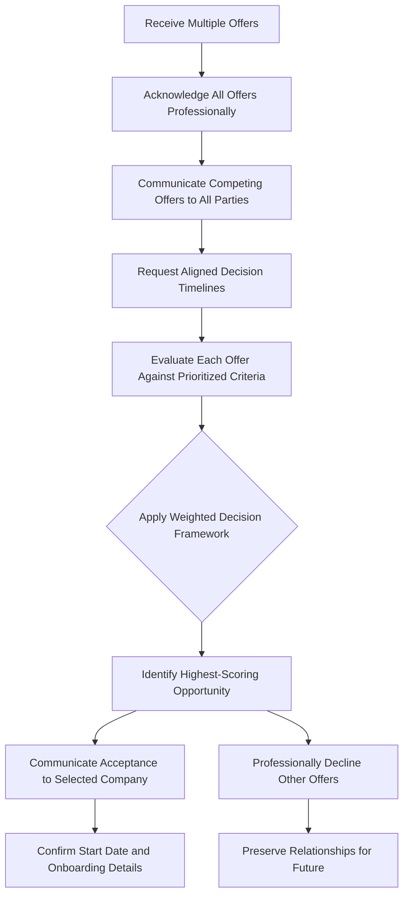

# Managing Multiple Job Offers: Strategic Evaluation and Decision Framework

## 1. Introduction

The receipt of multiple concurrent job offers represents an optimal outcome of a comprehensive job search campaign. This scenario, while advantageous, introduces a distinct set of strategic considerations distinct from single-offer management. Candidates must navigate competing timelines, evaluate disparate compensation structures, and assess qualitative factors that extend beyond immediate financial remuneration.

This document provides a structured framework for evaluating multiple employment offers, prioritizing decision criteria based on long-term career development objectives, and managing professional communications with all involved organizations. The objective is to enable candidates to select the opportunity that maximizes long-term professional growth and satisfaction while maintaining positive relationships with all prospective employers.

## 2. The Strategic Advantage of Multiple Offers

### 2.1 Objective Setting for the Interview Process

Candidates should approach the job search with the explicit goal of generating multiple viable offers. This orientation shifts the psychological posture from one of hopeful supplication to one of active opportunity creation. A singular focus on securing any single offer constrains negotiation leverage and limits comparative evaluation capacity.

**Principle:** The job search is optimally conducted as a portfolio approach wherein multiple parallel interview processes are cultivated simultaneously. This approach maximizes the probability of offer generation and provides the comparative data necessary for informed decision-making.

### 2.2 Benefits of Multiple Offer Scenarios

| Benefit Category | Description |
| :--- | :--- |
| **Enhanced Negotiation Leverage** | Competing offers provide concrete market validation and strengthen the candidate's negotiating position. |
| **Comparative Total Compensation Analysis** | Enables side-by-side evaluation of base salary, equity, benefits, and long-term incentives. |
| **Cultural and Team Fit Assessment** | Provides multiple reference points for evaluating organizational culture and team dynamics. |
| **Reduced Decision Pressure** | Mitigates the risk of accepting a suboptimal offer due to perceived scarcity of alternatives. |
| **Long-Term Career Trajectory Optimization** | Facilitates selection of the opportunity with the greatest growth potential, irrespective of short-term compensation differentials. |

## 3. Prioritized Decision Criteria for Offer Evaluation

The selection among competing offers should be guided by a hierarchical framework that prioritizes long-term professional development over immediate financial gratification. The following criteria are presented in descending order of strategic importance.

### 3.1 Criterion 1: Challenge and Stretch Assignment Potential

**Definition:** The degree to which a position requires the candidate to operate beyond their current comfort zone and existing skill set.

**Evaluation Question:** Does one of the offers present responsibilities or technical challenges for which the candidate feels genuinely underqualified?

**Strategic Rationale:**
Employment is not merely an exchange of labor for compensation; it is a primary mechanism for skill acquisition and professional advancement. A position that demands rapid learning, novel problem-solving, and expansion of technical capabilities accelerates the candidate's long-term career trajectory. Conversely, a position that leverages only existing competencies yields incremental rather than transformational professional growth.

**Decision Guideline:** Prefer the offer that presents the steepest learning curve and the greatest opportunity for skill expansion, even if other factors such as immediate compensation are less favorable.

### 3.2 Criterion 2: Long-Term Growth Potential

**Definition:** The capacity of the organization and the specific role to facilitate sustained career advancement over a multi-year horizon.

**Evaluation Dimensions:**

- **Individual Skill Development:** Will the role provide exposure to new technologies, architectural patterns, or domains that enhance future employability?
- **Organizational Growth Trajectory:** Is the company expanding, entering new markets, or scaling its engineering organization? Growth-stage companies often present accelerated promotion opportunities.
- **Promotion Pathway Visibility:** Is there a defined career ladder with clear expectations for advancement to senior, staff, or leadership roles?
- **Future Optionality:** Will this position enhance the candidate's candidacy for desired future roles, whether within the same organization or elsewhere?

**Decision Guideline:** Evaluate each offer through the lens of a five-year career projection. Select the position that positions the candidate most advantageously for their long-term professional aspirations.

### 3.3 Criterion 3: Quality and Caliber of Colleagues

**Definition:** The technical competency, mentorship capacity, and collaborative disposition of the team members with whom the candidate will work most closely.

**Evaluation Framework:**
Consider the following heuristic question: *In this role, will I be among the most knowledgeable individuals in the room, or among the least?*

| Scenario | Implications |
| :--- | :--- |
| **Candidate is the Smartest/Most Experienced** | Limited opportunity for learning from peers. Candidate primarily provides knowledge rather than receiving it. May be suitable for leadership roles but suboptimal for skill development phases. |
| **Candidate is Among the Least Experienced** | Maximum opportunity for mentorship, skill acquisition, and exposure to advanced practices. Accelerates professional development through osmosis and direct guidance. |

**Additional Considerations:**

- **Respect and Admiration:** Does the candidate respect the technical judgment and professional conduct of the individuals encountered during the interview process?
- **Mentorship Availability:** Are there explicit mentorship structures or informal knowledge-sharing cultures that support junior and mid-level engineers?
- **Collaborative Environment:** Does the team exhibit a culture of constructive code review, knowledge sharing, and collective problem-solving?

**Decision Guideline:** Prioritize offers from teams that include individuals from whom the candidate can meaningfully learn and whose professional standards the candidate aspires to emulate.

### 3.4 Criterion 4: Total Compensation Package

**Definition:** The complete economic value of the employment offer, encompassing base salary, variable compensation, equity instruments, and benefits.

**Components Requiring Comprehensive Evaluation:**

| Component | Description | Evaluation Notes |
| :--- | :--- | :--- |
| **Base Salary** | Fixed annual cash compensation. | Foundation for percentage-based bonuses and future raises. |
| **Performance Bonus** | Variable cash compensation contingent on individual or company performance. | Target percentage and historical payout rates should be assessed. |
| **Equity Compensation** | Stock Options, Restricted Stock Units (RSUs), or Employee Stock Purchase Plans (ESPP). | Valuation depends on company stage (public vs. private), strike price, vesting schedule, and liquidity options. |
| **Sign-On Bonus** | One-time cash payment upon joining. | Often negotiable; useful for bridging compensation gaps or covering relocation costs. |
| **Relocation Assistance** | Reimbursement or direct payment for moving expenses. | Can represent significant value for candidates changing geographic locations. |
| **Health and Insurance Benefits** | Medical, dental, vision, life, and disability insurance coverage. | Premium contributions and coverage quality vary significantly. |
| **Retirement Benefits** | 401(k) matching (US), Provident Fund contributions (India), pension plans. | Employer contributions represent deferred compensation. |
| **Paid Time Off and Leave Policies** | Vacation days, sick leave, parental leave, sabbatical opportunities. | Directly impacts quality of life and work-life integration. |

**Decision Guideline:** Compute the total expected annualized compensation value, including benefits and expected equity value, for each offer. While this criterion is placed fourth in the prioritization hierarchy, it remains a significant factor. However, it should not override the developmental considerations articulated in Criteria 1-3.

### 3.5 Criterion 5: Decision-Making Under Desperation

**Definition:** The influence of perceived scarcity or anxiety regarding future opportunities on the decision-making process.

**Warning Indicators of Desperation-Driven Decision-Making:**

- Belief that "I will never receive another offer like this."
- Fear that rejecting an offer will leave the candidate unemployed indefinitely.
- Acceptance of terms or conditions that the candidate would otherwise find unacceptable.
- Rationalization of significant concerns about role fit or company culture.

**Strategic Perspective:**
The technology job market, while subject to cyclical fluctuations, generally presents recurring opportunities for qualified candidates. Accepting a suboptimal position due to temporary desperation may lead to:

- Premature departure from the role, creating a short-tenure entry on the resume.
- Re-entry into the job search process within 12-24 months.
- Missed opportunity to secure a more suitable position with greater long-term potential.

**Decision Guideline:** Candidates should honestly assess whether their decision is being driven by a scarcity mindset. If so, they should re-evaluate the decision through the lens of the preceding four criteria and consider whether continuing the search may yield superior long-term outcomes.

## 4. Practical Application: A JavaScript-Based Decision Support Tool

The following JavaScript code provides a structured, programmatic implementation of the prioritized decision framework described above. The code is extensively commented for academic understanding and may be adapted for personal use in evaluating multiple offers.

```javascript
/**
 * Offer Evaluation and Decision Support Tool
 * 
 * This module implements a weighted scoring model for evaluating multiple job offers
 * based on the five prioritized criteria discussed in the accompanying documentation.
 * 
 * Academic Context: This implementation demonstrates practical application of
 * multi-criteria decision analysis (MCDA) principles in a career management context.
 */

// -----------------------------------------------------------------------------
// SECTION 1: Offer Class Definition
// -----------------------------------------------------------------------------

/**
 * Class representing a single job offer with associated evaluation scores.
 * 
 * Each offer is characterized by a unique identifier, a company name, and
 * numerical scores (1-5 scale) for each of the five evaluation criteria.
 * Higher scores indicate more favorable evaluation on that criterion.
 */
class JobOffer {
    /**
     * Constructor for JobOffer instances.
     * 
     * @param {string} id - Unique identifier for the offer (e.g., "OFFER_A")
     * @param {string} companyName - Name of the offering organization
     * @param {Object} scores - Object containing criterion scores (1-5 scale)
     * @param {number} scores.challenge - Score for challenge/stretch potential (Criterion 1)
     * @param {number} scores.growth - Score for long-term growth potential (Criterion 2)
     * @param {number} scores.colleagues - Score for colleague quality (Criterion 3)
     * @param {number} scores.compensation - Score for total compensation package (Criterion 4)
     * @param {number} scores.desperationFlag - Inverse score for desperation influence (Criterion 5)
     *                                           Higher score indicates LESS desperation-driven decision
     */
    constructor(id, companyName, scores) {
        this.id = id;
        this.companyName = companyName;
        this.scores = scores;
    }

    /**
     * Retrieves the score for a specific criterion.
     * 
     * @param {string} criterion - The criterion key (e.g., "challenge")
     * @returns {number} The assigned score (1-5)
     */
    getScore(criterion) {
        return this.scores[criterion] || 0;
    }
}

// -----------------------------------------------------------------------------
// SECTION 2: Weight Configuration
// -----------------------------------------------------------------------------

/**
 * Weight configuration object defining the relative importance of each criterion.
 * 
 * The weights are expressed as percentages that sum to 100.
 * These values reflect the prioritized hierarchy discussed in the documentation:
 * Criterion 1 (Challenge): 30%
 * Criterion 2 (Growth):     25%
 * Criterion 3 (Colleagues): 20%
 * Criterion 4 (Comp):       15%
 * Criterion 5 (Desperation):10%
 * 
 * These weights may be adjusted to reflect individual candidate priorities.
 */
const CRITERION_WEIGHTS = {
    challenge: 0.30,      // 30% - Highest priority: skill expansion and stretch assignments
    growth: 0.25,         // 25% - Long-term career trajectory and promotion potential
    colleagues: 0.20,     // 20% - Quality of team and mentorship opportunities
    compensation: 0.15,   // 15% - Total economic package (still significant, but not primary)
    desperationFlag: 0.10 // 10% - Avoidance of scarcity-driven decision-making
};

// -----------------------------------------------------------------------------
// SECTION 3: Scoring Calculation Function
// -----------------------------------------------------------------------------

/**
 * Calculates the weighted total score for a given job offer.
 * 
 * The weighted score is computed as the sum of each criterion's score
 * multiplied by its corresponding weight. This provides a normalized
 * metric for comparing offers across multiple dimensions.
 * 
 * @param {JobOffer} offer - The JobOffer instance to evaluate
 * @returns {number} The weighted total score (range: 1.0 - 5.0)
 */
function calculateWeightedScore(offer) {
    let weightedSum = 0;
    
    // Iterate through each criterion defined in the weights object
    for (const criterion in CRITERION_WEIGHTS) {
        const score = offer.getScore(criterion);
        const weight = CRITERION_WEIGHTS[criterion];
        weightedSum += score * weight;
    }
    
    // Return the computed weighted sum
    // Note: Because all weights sum to 1.0, the result is a direct weighted average
    return weightedSum;
}

// -----------------------------------------------------------------------------
// SECTION 4: Comparative Analysis Function
// -----------------------------------------------------------------------------

/**
 * Compares multiple job offers and returns a ranked ordering with detailed metrics.
 * 
 * This function processes an array of JobOffer instances, calculates the weighted
 * score for each, and sorts the offers in descending order of their computed scores.
 * The output includes both the ranking and the individual weighted scores for
 * transparency and validation.
 * 
 * @param {JobOffer[]} offers - Array of JobOffer instances to compare
 * @returns {Object} Object containing ranked offers array and detailed score mapping
 */
function compareOffers(offers) {
    // Validate input: ensure at least one offer is provided
    if (!offers || offers.length === 0) {
        return {
            rankedOffers: [],
            scores: {},
            message: "No offers provided for comparison."
        };
    }
    
    // Calculate weighted score for each offer and store in a mapping object
    const offerScores = {};
    offers.forEach(offer => {
        offerScores[offer.id] = calculateWeightedScore(offer);
    });
    
    // Create a copy of the offers array and sort by weighted score (descending)
    const rankedOffers = [...offers].sort((a, b) => {
        return offerScores[b.id] - offerScores[a.id];
    });
    
    // Return structured result object
    return {
        rankedOffers: rankedOffers,
        scores: offerScores,
        message: `Top recommendation: ${rankedOffers[0].companyName}`
    };
}

// -----------------------------------------------------------------------------
// SECTION 5: Example Usage and Demonstration
// -----------------------------------------------------------------------------

/**
 * EXAMPLE SCENARIO: Comparison of two hypothetical offers
 * 
 * This example illustrates a realistic scenario where Offer A presents
 * superior compensation but inferior growth and challenge potential,
 * while Offer B offers lower immediate compensation but greater long-term
 * developmental opportunity.
 */

// Instantiate Offer A: Higher compensation, lower challenge/growth
const offerA = new JobOffer(
    "OFFER_A",
    "TechCorp Inc.",
    {
        challenge: 3,        // Moderate challenge - primarily familiar technologies
        growth: 3,           // Moderate growth - established company with defined ladder
        colleagues: 4,       // Strong team - smart individuals
        compensation: 5,     // Excellent compensation package
        desperationFlag: 4   // Not a desperation-driven decision
    }
);

// Instantiate Offer B: Lower compensation, higher challenge/growth
const offerB = new JobOffer(
    "OFFER_B",
    "Startup Innovations LLC",
    {
        challenge: 5,        // Very high challenge - new domain, steep learning curve
        growth: 5,           // Exceptional growth - rapid scaling, promotion potential
        colleagues: 4,       // Strong team - experienced mentors
        compensation: 3,     // Moderate compensation (lower than Offer A)
        desperationFlag: 4   // Not a desperation-driven decision
    }
);

// Perform comparison
const comparisonResult = compareOffers([offerA, offerB]);

// Output results to console (for demonstration purposes)
console.log("=== OFFER COMPARISON RESULTS ===");
console.log(`Recommendation: ${comparisonResult.message}`);
console.log("\nWeighted Scores:");
for (const offerId in comparisonResult.scores) {
    const offer = [offerA, offerB].find(o => o.id === offerId);
    console.log(`  ${offer.companyName}: ${comparisonResult.scores[offerId].toFixed(2)}`);
}
console.log("\nRanked Order:");
comparisonResult.rankedOffers.forEach((offer, index) => {
    console.log(`  ${index + 1}. ${offer.companyName}`);
});

/**
 * EXPECTED OUTPUT ANALYSIS:
 * 
 * Based on the configured weights, Offer B (Startup Innovations LLC) will
 * receive a higher weighted score despite its lower compensation score.
 * This outcome demonstrates the framework's emphasis on long-term
 * developmental criteria over immediate financial gain.
 * 
 * Calculation Verification:
 * Offer A: (3*0.30) + (3*0.25) + (4*0.20) + (5*0.15) + (4*0.10) = 
 *          0.90 + 0.75 + 0.80 + 0.75 + 0.40 = 3.60
 * 
 * Offer B: (5*0.30) + (5*0.25) + (4*0.20) + (3*0.15) + (4*0.10) =
 *          1.50 + 1.25 + 0.80 + 0.45 + 0.40 = 4.40
 * 
 * Result: Offer B is recommended despite lower compensation.
 */

// -----------------------------------------------------------------------------
// SECTION 6: Extensibility Considerations
// -----------------------------------------------------------------------------

/**
 * This implementation may be extended in several ways to accommodate
 * individual candidate preferences:
 * 
 * 1. Weight Adjustment: Modify CRITERION_WEIGHTS to reflect personal priorities.
 * 2. Additional Criteria: Add new criteria (e.g., location, remote policy) by
 *    extending the scores object and updating weights accordingly.
 * 3. Sensitivity Analysis: Iterate over weight ranges to identify robust
 *    recommendations that persist under varying prioritization assumptions.
 * 4. Visualization: Integrate with charting libraries to produce radar/spider
 *    charts for intuitive offer comparison.
 */
```

## 5. Communication Strategy with Multiple Offers

### 5.1 Transparency with All Involved Parties

Maintain transparent, professional communication with all organizations that have extended offers. This includes:

- **Acknowledgment of Receipt:** Promptly acknowledge each offer and express appreciation.
- **Timeline Disclosure:** Inform each organization of the existence of competing offers and associated response deadlines.
- **Status Updates:** Provide periodic updates if decision timelines extend beyond initially communicated expectations.

### 5.2 Declining Offers with Professionalism

When a final decision is reached, promptly notify the organizations whose offers are being declined. The communication should be gracious, appreciative, and non-burning of bridges.

**Sample Declination Script:**

> "Thank you again for the offer to join [Company Name]. After careful consideration and evaluation of multiple opportunities, I have decided to accept a position that aligns most closely with certain long-term career development objectives I am currently prioritizing. I was genuinely impressed by [Specific Positive Aspect] and have great respect for your team. I hope our professional paths cross again in the future."

### 5.3 Maintaining Relationships for Future Opportunities

The technology industry is characterized by high professional mobility. Recruiters and hiring managers frequently transition between organizations. A positive, professional declination preserves relationships that may prove valuable in future job searches, collaborations, or professional networking contexts.

## 6. Case Study: Navigating Competing Offers with Compensation Differentials

### 6.1 Scenario Description

A candidate receives two offers:

- **Company X (Large Public Technology Firm):** Base Salary: ₹18,00,000; Annual Bonus: 15%; RSU Grant: ₹5,00,000 vesting over 4 years. Role involves maintaining and incrementally improving established systems. Team composition includes experienced but not exceptionally distinguished engineers.

- **Company Y (High-Growth Private Startup):** Base Salary: ₹14,00,000; Equity: 0.5% ownership with standard vesting. Role involves building core infrastructure from early stage, requiring rapid acquisition of new technical skills. Team includes several recognized industry experts.

### 6.2 Application of Prioritized Criteria

| Criterion | Company X Assessment | Company Y Assessment |
| :--- | :--- | :--- |
| **Challenge Potential** | Moderate (3/5) - Incremental improvements to mature systems. | High (5/5) - Greenfield development, unfamiliar problem domain. |
| **Long-Term Growth** | Moderate (3/5) - Structured but potentially slower promotion velocity. | High (5/5) - Rapid scaling environment with accelerated advancement potential. |
| **Colleague Quality** | Good (3/5) - Competent professionals. | Excellent (5/5) - Opportunity to learn from industry experts. |
| **Compensation** | Excellent (5/5) - Above market base salary plus liquid RSUs. | Moderate (3/5) - Below market base; equity illiquid but potentially high upside. |
| **Desperation Flag** | Low Desperation (4/5) - Accepting for right reasons. | Low Desperation (4/5) - Accepting for right reasons. |

### 6.3 Outcome Analysis

Applying the weighted scoring framework yields a higher score for Company Y despite the lower immediate cash compensation. The candidate accepts Company Y's offer based on the superior long-term growth and skill development trajectory.

This decision proved consequential in the candidate's subsequent career progression, enabling a transition to senior engineering roles at a major technology firm two years later—a trajectory that would have been less likely had the candidate remained in the maintenance-oriented role at Company X.

## 7. Visual Decision Flow for Multiple Offers

The following Mermaid diagram illustrates the recommended decision flow when managing multiple concurrent job offers.



## 8. Conclusion

The management of multiple job offers requires a disciplined, criteria-driven approach that prioritizes long-term professional development over immediate financial gratification. By systematically evaluating opportunities against the hierarchy of challenge potential, growth trajectory, colleague quality, total compensation, and decision-making clarity, candidates can select the opportunity that maximizes long-term career satisfaction and advancement.

The decision framework presented in this document—including the provided JavaScript implementation—offers a structured, repeatable methodology for navigating this advantageous but complex scenario. Candidates are encouraged to adapt the specific weights and criteria to their individual circumstances while maintaining the fundamental principle of long-term optimization over short-term comfort.

Finally, the maintenance of professional relationships with all organizations throughout the process is non-negotiable. The technology industry operates on networks of trust and reputation; gracious, professional conduct during offer management contributes positively to a candidate's long-term professional brand.