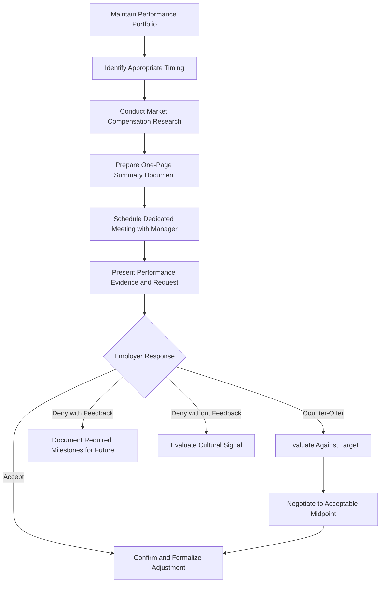

# Securing a Salary Increase: A Structured Approach for Engineering Professionals

## 1. Introduction

Compensation growth within an existing employment relationship is a critical component of long-term career financial planning. While initial salary negotiation establishes baseline compensation, periodic adjustments through formal salary increase requests—commonly termed "raises"—are necessary to align remuneration with evolving skill sets, expanded responsibilities, and demonstrated value contribution.

This document presents a systematic framework for engineering professionals to prepare, present, and successfully secure salary increases. The methodology emphasizes performance documentation, data-driven justification, and professional communication protocols that transform the raise request from an uncomfortable personal appeal into a business case grounded in measurable organizational impact.

## 2. Foundational Prerequisites for Raise Consideration

### 2.1 The Value Proposition Requirement

The foundational prerequisite for any successful salary increase request is sustained, demonstrable value contribution to the organization. Requests predicated solely on tenure, personal financial need, or generalized market comparisons without corresponding performance evidence are unlikely to succeed.

**Core Principle:** The employer's decision to increase compensation is fundamentally an investment decision. The employer must perceive that the incremental cost of the salary adjustment yields a positive return through enhanced retention of a valuable contributor, avoidance of replacement costs, or recognition of expanded contribution scope.

### 2.2 Characteristics of a Raise-Eligible Employee

Candidates for salary increases should possess and demonstrate the following attributes:

- **Consistent High-Quality Output:** Work products meet or exceed established quality standards with minimal required rework.
- **Reliability and Timeliness:** Deliverables are completed within agreed-upon timeframes and communicated proactively when delays are anticipated.
- **Initiative and Self-Direction:** The employee identifies and addresses problems without explicit instruction.
- **Continuous Skill Development:** The employee actively expands technical competencies and applies newly acquired skills to organizational challenges.
- **Positive Team Contribution:** The employee enhances team dynamics through collaboration, mentorship, or knowledge sharing.

### 2.3 Career Trajectory Planning

Prior to the commencement of employment, and periodically throughout tenure, the employee should establish a documented career development plan. This plan serves multiple functions:

- **Goal Articulation:** Defines specific skills, roles, or responsibilities the employee intends to acquire.
- **Progress Tracking:** Provides a benchmark against which professional growth can be measured.
- **Complacency Prevention:** Ensures the employee does not stagnate in a role beyond the point of continued learning and growth.

**Sample Career Planning Horizon:**

| Timeframe | Skill Development Objectives | Responsibility Expansion Goals |
| :--- | :--- | :--- |
| 0-6 Months | Mastery of core codebase and development workflows. | Independent contribution to assigned features. |
| 6-12 Months | Proficiency in adjacent systems and architectural patterns. | Ownership of a small component or module. |
| 1-2 Years | Technical leadership within team; mentorship of junior engineers. | Leading design reviews and technical decision-making for team projects. |
| 2-5 Years | Broader architectural vision; cross-team influence. | Technical lead for significant initiatives; potential management track exploration. |

## 3. Strategic Preparation for the Raise Request

### 3.1 The "Show, Don't Tell" Documentation Principle

The most critical component of a successful raise request is the presentation of objective evidence demonstrating value contribution. Anecdotal claims of being a "hard worker" or "valuable team member" lack persuasive power without substantiating documentation.

**Implementation Strategy: The Performance Portfolio**

From the first day of employment, maintain a dedicated repository—whether a digital folder, a document, or a spreadsheet—containing evidence of contributions and achievements. This portfolio serves as the evidentiary foundation for all future compensation discussions.

**Recommended Documentation Categories:**

| Category | Specific Items to Document | Significance |
| :--- | :--- | :--- |
| **Problem Resolution** | Description of complex bugs resolved, system outages averted, performance bottlenecks eliminated. | Demonstrates technical competency and crisis management. |
| **Quantifiable Impact** | Metrics showing improvement attributable to employee's work (e.g., reduced latency, increased throughput, cost savings). | Provides objective, numerical evidence of value. |
| **Positive Feedback** | Emails or messages from clients, stakeholders, or colleagues acknowledging exceptional work. | Establishes external validation of contribution quality. |
| **Skill Acquisition** | New languages, frameworks, tools, or certifications obtained since hire or last review. | Demonstrates investment in professional growth and expanded capability. |
| **Process Improvement** | Contributions to development workflows, documentation, or team practices that enhance efficiency. | Shows organizational thinking beyond individual task execution. |
| **Mentorship and Knowledge Sharing** | Instances of assisting colleagues, conducting training sessions, or improving onboarding materials. | Demonstrates team-level impact and leadership potential. |

### 3.2 The One-Page Summary Document

Prior to a scheduled raise discussion, synthesize the accumulated performance portfolio into a concise, professionally formatted one-page summary document. This document should be structured to guide the decision-maker through a logical progression of demonstrated value.

**Recommended Document Structure:**

1.  **Header:** Employee name, current position, date of request, period covered.
2.  **Executive Summary (2-3 sentences):** Brief statement of request and overarching justification.
3.  **Key Achievements (Bulleted List):** 3-5 most significant contributions with quantifiable metrics where possible.
4.  **Skills Acquired/Enhanced (Bulleted List):** Specific technical or professional competencies developed.
5.  **Forward-Looking Commitments (Bulleted List):** Planned contributions for the upcoming performance period.
6.  **Compensation Request:** Specific proposed adjustment with brief market or performance-based rationale.

### 3.3 Market Compensation Research

Supplement performance-based justification with external market data. Understanding prevailing compensation ranges for equivalent roles, experience levels, and geographic markets strengthens the business case by contextualizing the request within industry norms.

**Research Resources:**
- Levels.fyi (technology sector specific)
- Glassdoor Salary Tool
- LinkedIn Salary Insights
- AmbitionBox (India market)
- Professional network conversations

## 4. The Raise Request Process

### 4.1 Timing Considerations

The optimal timing for a raise request is a critical strategic variable. The following guidelines are recommended:

- **Preferred Timing:** 2-3 months prior to the annual budget planning cycle, allowing the request to be incorporated into forthcoming financial allocations.
- **Alternative Timing:** At the conclusion of a successfully completed major project or initiative when the employee's contribution is particularly salient.
- **Minimum Tenure:** Generally, requests should not be initiated within the first 6 months of employment unless the role scope has expanded materially beyond initial expectations.
- **Frequency:** Annual or semi-annual reviews are appropriate; requests with greater frequency should be reserved for extraordinary circumstances (e.g., promotion, significant role expansion).

### 4.2 Scheduling the Discussion

Request a dedicated meeting with the appropriate decision-maker—typically the direct manager—specifically to discuss compensation and career development. Ambushing a manager during a routine check-in or hallway conversation is inadvisable and likely to result in deferral.

**Sample Meeting Request Communication:**

> "I would like to schedule 30 minutes to discuss my performance, contributions over the past [period], and my compensation alignment. I have prepared some documentation that I believe will facilitate a productive conversation. Please let me know when your calendar permits."

### 4.3 Anchoring the Request

When presenting the proposed salary adjustment, the initial figure should exceed the employee's actual target. This technique—known as anchoring—establishes a negotiation range favorable to the employee's objectives.

**Guideline:** Propose an increase approximately 10-15% above the desired outcome. For example, if the target increase is ₹1,00,000 per annum, the initial request should be framed at ₹1,10,000 to ₹1,15,000.

**Rationale:**
- Employers anticipate negotiation and rarely accept initial requests without adjustment.
- The negotiated settlement will likely converge toward the midpoint between the initial request and the employer's counter-offer.
- Anchoring higher expands the available negotiation space.

## 5. Conducting the Raise Discussion

### 5.1 Meeting Structure and Protocol

The raise discussion should follow a professional, structured format that positions the employee as a collaborative partner in a business conversation rather than a supplicant seeking favor.

**Recommended Meeting Flow:**

1.  **Opening Statement:** Express appreciation for the opportunity and acknowledge positive aspects of the role and team.
2.  **Presentation of Documentation:** Provide the one-page summary document and briefly highlight key achievements and quantifiable impacts.
3.  **Skill Development Summary:** Articulate how the employee's capabilities have expanded since hire or since the last compensation adjustment.
4.  **Forward-Looking Commitment:** Outline planned contributions for the upcoming period, reinforcing the employee's continued value.
5.  **Compensation Request:** State the proposed adjustment clearly, referencing both performance evidence and market data where applicable.
6.  **Collaborative Closure:** Invite discussion and indicate willingness to work toward a mutually acceptable outcome.

### 5.2 Sample Discussion Script Framework

> "Thank you for taking the time to meet with me today. I want to start by saying that I genuinely enjoy my work here and value the opportunity to contribute to [specific project or team initiative].
>
> Over the past [period], I have focused on [key area of contribution]. I have prepared a brief summary of some specific achievements that I believe demonstrate the value I have been able to deliver. For example, [mention 1-2 quantifiable achievements from documentation].
>
> In addition to these contributions, I have also invested in developing my skills in [new technology or competency], which I believe positions me to contribute even more effectively to upcoming initiatives such as [planned project].
>
> Based on my performance, the expanded scope of my responsibilities, and my research into market compensation for similar roles, I would like to propose an adjustment to my base salary to [proposed figure]. I believe this reflects the value I currently provide and my commitment to continued contribution.
>
> I am open to discussing this and working together to find an arrangement that is fair and sustainable."

### 5.3 Handling Potential Responses

| Employer Response | Suggested Employee Approach |
| :--- | :--- |
| **Immediate Acceptance** | Express gratitude and confirm next steps for formalization. (Rare but possible.) |
| **Request for Time to Consider** | Accept graciously. Inquire about expected timeline for follow-up. |
| **Counter-Offer Below Request** | Evaluate against target. If acceptable, accept. If not, propose a phased approach or alternative compensation elements (e.g., additional equity, bonus, professional development budget). |
| **Denial with Specific Rationale** | Seek clarification on specific performance metrics or milestones required for future consideration. Document these requirements and schedule follow-up discussion. |
| **Denial with Vague/Non-Specific Rationale** | Politely probe for more actionable feedback. If none is forthcoming, consider the signal regarding organizational culture and long-term growth potential. |

## 6. Economic Perspective: The Asymmetric Value of Raises

### 6.1 Relative Utility Analysis

An important cognitive reframing involves comparing the relative economic significance of a salary increase to the employee versus the employer.

**Perspective Comparison:**

| Stakeholder | Impact of ₹1,00,000 Salary Increase |
| :--- | :--- |
| **Individual Employee** | Represents a material improvement to personal finances, potentially affecting housing affordability, savings rate, or discretionary spending capacity. |
| **Mid-to-Large Employer** | Represents a negligible fraction of operating budget. The cost of recruiting, hiring, and training a replacement employee typically ranges from 50% to 200% of annual salary. |

**Conclusion:** Employers possess strong economic incentives to retain proven, productive employees through reasonable compensation adjustments. The cost asymmetry favors the employee in raise negotiations, provided the employee can demonstrate ongoing value contribution.

### 6.2 The Cost of Replacement Calculation

From the employer's perspective, the decision to deny a reasonable raise request carries the implicit risk of employee departure and associated replacement costs. These costs include:

- **Recruitment Costs:** Job advertising, recruiter fees, and hiring team time investment.
- **Interviewing Costs:** Engineering hours diverted from productive work to candidate evaluation.
- **Onboarding and Training Costs:** Reduced productivity during ramp-up period (typically 3-6 months for engineering roles).
- **Knowledge Loss:** Departure of institutional knowledge and context that is not fully transferable.
- **Team Morale Impact:** Disruption to team dynamics and potential cascade of additional departures.

When the requested raise amount is less than the anticipated replacement cost, the economically rational decision for the employer is to approve the increase.

## 7. Process Flow Diagram

The following Mermaid diagram summarizes the raise request workflow described in this document.

## 8. Illustrative Case Study: Semi-Annual Raise Strategy

### 8.1 Scenario Description

An engineering professional employed at a mid-sized technology firm adopted a systematic approach to compensation growth, requesting and receiving salary adjustments at six-month intervals over a multi-year tenure.

### 8.2 Key Success Factors

- **Consistent Performance Documentation:** Maintained a running log of achievements, bug resolutions, and positive feedback.
- **Scheduled Cadence:** Initiated raise discussions predictably every six months, aligning with project milestones.
- **Value Demonstration:** Each request was accompanied by a one-page summary highlighting quantifiable contributions since the previous adjustment.
- **Negotiation Engagement:** When presented with an increase below expectations, the employee professionally challenged the determination with additional evidence, resulting in upward revision.

### 8.3 Outcome

The employee's compensation grew at a rate exceeding standard annual cost-of-living adjustments and typical merit increase percentages. This outcome was attributable not to exceptional favoritism but to systematic application of the principles articulated in this document.

## 9. Conclusion

Securing salary increases is a professional competency that can be developed and refined through deliberate practice and systematic preparation. The framework presented herein—centered on performance documentation, data-driven justification, and professional communication—transforms the raise request from an uncomfortable personal appeal into a structured business case grounded in measurable organizational impact.

Engineering professionals who adopt this methodology position themselves to achieve compensation growth commensurate with their expanding skills and contributions. The key insight remains consistent: organizations possess both the capacity and the economic incentive to retain productive employees through appropriate compensation adjustments. The responsibility for initiating and substantiating that conversation rests with the employee. As articulated throughout this document, the answer to an unasked question is invariably negative; the act of asking, when properly prepared and professionally executed, opens the door to favorable outcomes.