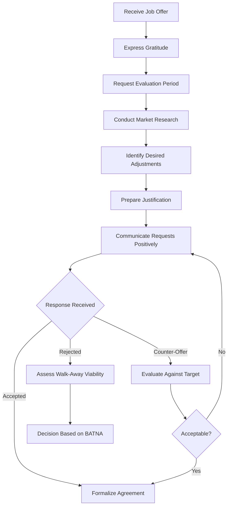
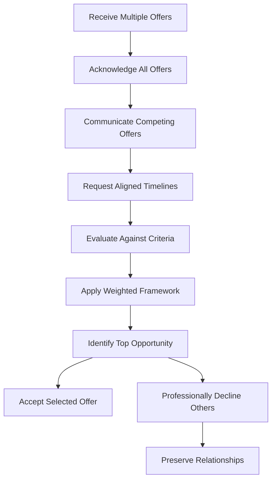
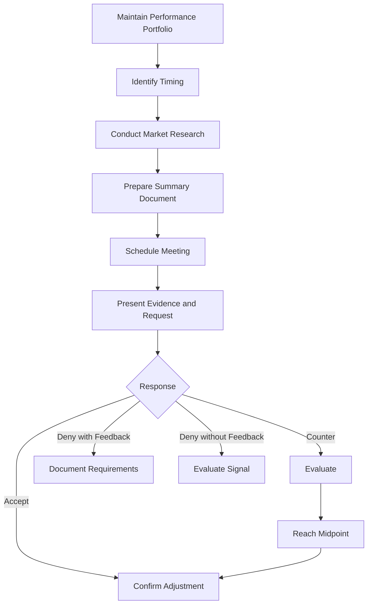

# Comprehensive Guide to Career Negotiation and Compensation Management

## 1. Introduction to Negotiation Fundamentals

### 1.1 The Importance of Negotiation Skills

Negotiation is a structured dialogue between parties aimed at reaching a mutually acceptable agreement regarding terms of employment, compensation, or professional engagement. While cultural norms and demographic contexts significantly influence negotiation protocols, certain foundational principles demonstrate consistent efficacy across diverse professional environments.

Empirical evidence from compensation analysis demonstrates that failure to negotiate initial compensation packages results in compounding financial disparity over the duration of employment tenure. Organizations do not retroactively adjust compensation to correct for candidate failure to negotiate. The absence of negotiation constitutes passive acceptance of suboptimal terms that can result in significant cumulative financial differences over the course of a career.

### 1.2 Core Principles of Effective Negotiation

**Principle 1: Maintain Dialogue and Avoid Premature Closure**

A primary objective in any negotiation is the preservation and extension of the conversational exchange. Premature provision of a specific numeric figure frequently terminates the exploratory phase of negotiation, foreclosing opportunities for value discovery and creative structuring of compensation packages.

**Principle 2: Provide Justification for Every Request**

The perception of avarice or self-interest constitutes a significant psychological barrier to negotiation initiation. Counteract this perception by consistently appending a legitimate, externally-referenced rationale to any request for modification of terms. Each proposed adjustment should be accompanied by a credible justification that situates the request within a broader context of fairness, market alignment, or shared decision-making responsibility.

**Principle 3: Adopt a Positive Sum Orientation**

Effective negotiation is not a zero-sum adversarial contest wherein one party's gain necessitates equivalent loss by the counterparty. Rather, it represents a collaborative problem-solving exercise directed at identifying terms that satisfy the core interests of both parties. Approach negotiation with the explicit objective of achieving a mutually beneficial outcome while maintaining positive, constructive, and professional demeanor throughout the process.

**Principle 4: Establish Alternative Leverage (Stakes)**

Negotiating power is directly proportional to the credibility and desirability of a party's alternatives to the proposed agreement. The capacity to decline an offer without adverse consequence constitutes the foundational source of leverage. Cultivate and communicate the existence of viable alternatives to strengthen negotiating position.

**Principle 5: Always Negotiate**

The most common reason individuals fail to negotiate is the fear of being perceived as ungrateful, greedy, or confrontational. However, organizations anticipate negotiation and typically establish compensation bands with flexibility to accommodate reasonable requests. The act of negotiating, when conducted professionally, does not damage relationships or result in offer revocation.

## 2. Strategic Response to Salary Expectation Inquiries

### 2.1 The Challenge of Premature Specificity

During interview processes, candidates are frequently asked to state their salary expectations. A direct numeric response establishes an anchor point that may disadvantage the candidate if the figure falls below the employer's budgeted range or if it prematurely caps the negotiation ceiling. The candidate's objective is to avoid statements that conclusively answer the compensation expectation question while providing responses that establish reference points and position the discussion at its commencement.

### 2.2 The Anchoring Technique

The anchoring technique involves introducing a reference figure that is not presented as the candidate's demand but rather as a contextual data point intended to frame the subsequent negotiation range.

**Recommended Response Structure:**

> "Based on available compensation data for software engineering positions in the [Geographic Region] market, the median compensation for roles with comparable responsibility and experience requirements appears to be approximately [Reference Figure]. I believe this represents a reasonable starting point for our discussion regarding appropriate compensation alignment."

**Analysis of Response Components:**

| Component | Function | Strategic Value |
| :--- | :--- | :--- |
| Reference to Market Data | De-personalizes the figure; attributes it to external, objective sources. | Reduces perception of candidate greed or arbitrary demand. |
| Geographic Specification | Acknowledges compensation variation by location. | Demonstrates market awareness and sophistication. |
| "Starting Point" Language | Explicitly frames the figure as initiating rather than concluding the discussion. | Preserves negotiation flexibility for subsequent adjustments. |
| Avoidance of Personal Demand Statement | Candidate does not state "I want [X]". | Prevents creation of a fixed psychological anchor tied to candidate expectations. |

Candidates must maintain clear conceptual separation between the initial anchoring figure and the ultimate acceptable compensation. The anchor serves to orient the conversation within a favorable range; it does not represent a commitment to accept that specific amount.

### 2.3 Salary Research Resources

Prior to engaging in any compensation discussion, the candidate must establish a data-driven understanding of prevailing market rates for the target role, geographic location, and experience level. The following resources provide valuable compensation data:

| Resource | Type of Data | Primary Usage |
| :--- | :--- | :--- |
| **Glassdoor** | User-reported salary data, company reviews, interview experiences | General market ranges and company-specific insights |
| **Levels.fyi** | Technology company-specific compensation bands by level | Precise benchmarking for major tech employers |
| **Payscale** | Compensation analytics with cost-of-living adjustments | Geographic salary differential analysis |
| **LinkedIn Salary** | Aggregated salary data from member profiles | Role-specific compensation insights |
| **AmbitionBox** | India-specific salary data and company reviews | Relevant for Indian market analysis |

## 3. Handling a Job Offer

### 3.1 Immediate Response Protocol

Upon receiving a verbal or written job offer, immediate acceptance without due diligence is generally inadvisable. The appropriate initial response should convey gratitude and enthusiasm while formally requesting a reasonable period for evaluation.

**Recommended Verbal Response:**
> "Thank you for this opportunity and for the confidence you have shown in my candidacy. I am very excited about the possibility of joining the team. I would like to request [X] business days to review the complete offer details, including the total compensation package and benefits summary, before providing my formal acceptance."

This response achieves three critical objectives: acknowledges professional courtesy and validates the employer's effort; secures time to analyze the offer against personal benchmarks and compare with other pending opportunities; and preserves negotiating leverage by preventing premature closure of the negotiation window.

### 3.2 Responding to a Low Salary Offer

When presented with an offer that falls below expectations, the candidate should respond with a structured approach that maintains positive tone while clearly indicating the need for adjustment. The response should include:

1. **Expression of Appreciation:** Begin by thanking the employer for the offer and acknowledging positive aspects of the opportunity.
2. **Statement of Enthusiasm:** Reinforce genuine interest in the position and organization.
3. **Presentation of Counter-Proposal:** Provide a specific, justified alternative figure based on market data and value proposition.
4. **Collaborative Framing:** Position the request as a joint problem-solving exercise rather than an adversarial demand.

**Sample Response Framework:**

> "Thank you for extending this offer. I am genuinely excited about the opportunity to contribute to [Company Name] and believe there is strong alignment between my skills and the team's needs. Based on my research into market compensation for similar roles in this geography, and considering the specific value I anticipate bringing through [specific skill or experience], I would like to discuss an adjustment to the base salary component to [proposed figure]. I am confident we can find terms that work well for both parties."

### 3.3 Requesting Additional Decision Time

When requiring additional time to evaluate an offer, provide a legitimate, externally-referenced rationale:

> "I want to ensure that I make a fully informed and carefully considered decision regarding this opportunity. Given that this represents a significant career transition with long-term implications, I would appreciate the courtesy of [Number] additional business days to complete my evaluation. My goal is to accept this role with complete confidence and commitment, and I believe this brief additional period will enable me to do so."

### 3.4 Negotiating Beyond Base Salary

Effective negotiation encompasses the total compensation package, not merely base salary. When base salary flexibility is constrained due to internal equity bands or budget limitations, pivot the negotiation to items with perceived high value but potentially lower direct cost to the employer:

- **Sign-on Bonus:** One-time payment that can bridge compensation gaps
- **Equity Compensation:** Stock options, Restricted Stock Units (RSUs), or Employee Stock Purchase Plans
- **Performance Bonus:** Target percentage and guarantee provisions
- **Paid Time Off:** Additional vacation days or flexible leave policies
- **Professional Development Budget:** Funding for conferences, certifications, or continuing education
- **Relocation Assistance:** Enhanced moving expense coverage
- **Remote Work Flexibility:** Formalized work-from-home arrangements

### 3.5 Offer Evaluation Criteria

An offer should not be evaluated solely on base salary. A comprehensive assessment must include a holistic review of the Total Compensation Package and qualitative factors.

| Category | Components | Significance |
| :--- | :--- | :--- |
| **Direct Compensation** | Base Salary, Sign-on Bonus, Annual Performance Bonus (Target %) | Core financial remuneration. |
| **Equity Compensation** | Stock Options (ISO/NSO), Restricted Stock Units (RSUs), Employee Stock Purchase Plan (ESPP) | Long-term wealth generation and alignment with company performance. |
| **Benefits & Insurance** | Health Insurance (Medical, Dental, Vision), Life Insurance, Disability Insurance | Risk mitigation and healthcare cost management. |
| **Retirement Planning** | Provident Fund (PF), Gratuity, 401(k) Match (US context) / NPS (India context) | Long-term financial security. |
| **Work-Life Integration** | Paid Time Off (PTO), Sick Leave, Parental Leave, Remote/Hybrid Policy | Quality of life and personal sustainability. |

## 4. Managing Multiple Offers

### 4.1 Strategic Management of Timelines

The primary challenge in managing multiple offers is the misalignment of offer expiration dates and interview schedules. Upon receiving Offer A, immediately notify Company B (if in final stages) of the impending deadline:

> "I have received an offer with a response deadline of [Date]. However, I remain highly interested in the opportunity with [Company B]. Is it possible to expedite the final stages of the process to allow me to make a fully informed decision?"

### 4.2 Leveraging Offers to Improve Compensation

A competing written offer serves as market validation of a candidate's value. When leveraging competing offers, identify the preferred company and engage with the recruiter:

> "I have received another compelling offer. While [Preferred Company] remains my top choice due to [Specific Reason], the current compensation differential makes the decision difficult. Is there flexibility to revisit the base salary or equity component to bridge this gap?"

**Critical Note:** Use this tactic only if genuinely willing to accept the competing offer. Bluffing can result in the withdrawal of the original offer.

### 4.3 Communicating Competing Offers

When notifying other prospective employers of a received offer:

```
Subject: Interview Process Update - [Candidate Name] - [Position Title]

Dear [Recruiter Name],

I wanted to provide a brief update on my current interviewing status. I have recently received an offer from [Other Company Name], which includes a response deadline of [Date].

[Your Company Name] remains a top priority for me based on the excellent conversations I have had with the team. Given the compressed timeline resulting from this new offer, I wanted to inquire whether there might be any possibility to accelerate the remaining steps in the process.

I greatly appreciate your time and consideration.

Best regards,
[Candidate Name]
```

### 4.4 Prioritized Decision Criteria for Multiple Offers

When evaluating competing offers, the following hierarchical framework prioritizes long-term professional development over immediate financial gratification:

**Criterion 1: Challenge and Stretch Assignment Potential**
Prefer the offer that presents the steepest learning curve and greatest opportunity for skill expansion, even if other factors such as immediate compensation are less favorable.

**Criterion 2: Long-Term Growth Potential**
Evaluate each offer through the lens of a five-year career projection. Consider individual skill development, organizational growth trajectory, promotion pathway visibility, and future optionality.

**Criterion 3: Quality and Caliber of Colleagues**
Prioritize offers from teams that include individuals from whom the candidate can meaningfully learn and whose professional standards the candidate aspires to emulate. The optimal scenario for skill development is being among the least experienced members of a highly competent team.

**Criterion 4: Total Compensation Package**
Compute the total expected annualized compensation value, including benefits and expected equity value. While significant, this criterion should not override developmental considerations.

**Criterion 5: Decision-Making Under Desperation**
Candidates should honestly assess whether their decision is being driven by a scarcity mindset. Accepting a suboptimal position due to temporary desperation may lead to premature departure and missed superior opportunities.

### 4.5 JavaScript-Based Decision Support Tool

The following code provides a structured, programmatic implementation of the prioritized decision framework for evaluating multiple offers:

```javascript
/**
 * Offer Evaluation and Decision Support Tool
 * 
 * This module implements a weighted scoring model for evaluating multiple job offers
 * based on the five prioritized criteria discussed in the accompanying documentation.
 * 
 * Academic Context: This implementation demonstrates practical application of
 * multi-criteria decision analysis (MCDA) principles in a career management context.
 */

// -----------------------------------------------------------------------------
// SECTION 1: Offer Class Definition
// -----------------------------------------------------------------------------

/**
 * Class representing a single job offer with associated evaluation scores.
 * 
 * Each offer is characterized by a unique identifier, a company name, and
 * numerical scores (1-5 scale) for each of the five evaluation criteria.
 * Higher scores indicate more favorable evaluation on that criterion.
 */
class JobOffer {
    /**
     * Constructor for JobOffer instances.
     * 
     * @param {string} id - Unique identifier for the offer (e.g., "OFFER_A")
     * @param {string} companyName - Name of the offering organization
     * @param {Object} scores - Object containing criterion scores (1-5 scale)
     * @param {number} scores.challenge - Score for challenge/stretch potential (Criterion 1)
     * @param {number} scores.growth - Score for long-term growth potential (Criterion 2)
     * @param {number} scores.colleagues - Score for colleague quality (Criterion 3)
     * @param {number} scores.compensation - Score for total compensation package (Criterion 4)
     * @param {number} scores.desperationFlag - Inverse score for desperation influence (Criterion 5)
     *                                           Higher score indicates LESS desperation-driven decision
     */
    constructor(id, companyName, scores) {
        this.id = id;
        this.companyName = companyName;
        this.scores = scores;
    }

    /**
     * Retrieves the score for a specific criterion.
     * 
     * @param {string} criterion - The criterion key (e.g., "challenge")
     * @returns {number} The assigned score (1-5)
     */
    getScore(criterion) {
        return this.scores[criterion] || 0;
    }
}

// -----------------------------------------------------------------------------
// SECTION 2: Weight Configuration
// -----------------------------------------------------------------------------

/**
 * Weight configuration object defining the relative importance of each criterion.
 * 
 * The weights are expressed as percentages that sum to 100.
 * These values reflect the prioritized hierarchy:
 * Criterion 1 (Challenge): 30%
 * Criterion 2 (Growth):     25%
 * Criterion 3 (Colleagues): 20%
 * Criterion 4 (Comp):       15%
 * Criterion 5 (Desperation):10%
 * 
 * These weights may be adjusted to reflect individual candidate priorities.
 */
const CRITERION_WEIGHTS = {
    challenge: 0.30,      // 30% - Highest priority: skill expansion and stretch assignments
    growth: 0.25,         // 25% - Long-term career trajectory and promotion potential
    colleagues: 0.20,     // 20% - Quality of team and mentorship opportunities
    compensation: 0.15,   // 15% - Total economic package (still significant, but not primary)
    desperationFlag: 0.10 // 10% - Avoidance of scarcity-driven decision-making
};

// -----------------------------------------------------------------------------
// SECTION 3: Scoring Calculation Function
// -----------------------------------------------------------------------------

/**
 * Calculates the weighted total score for a given job offer.
 * 
 * The weighted score is computed as the sum of each criterion's score
 * multiplied by its corresponding weight. This provides a normalized
 * metric for comparing offers across multiple dimensions.
 * 
 * @param {JobOffer} offer - The JobOffer instance to evaluate
 * @returns {number} The weighted total score (range: 1.0 - 5.0)
 */
function calculateWeightedScore(offer) {
    let weightedSum = 0;
    
    // Iterate through each criterion defined in the weights object
    // This loop accumulates the product of each criterion's score and its weight
    for (const criterion in CRITERION_WEIGHTS) {
        const score = offer.getScore(criterion);
        const weight = CRITERION_WEIGHTS[criterion];
        weightedSum += score * weight;
    }
    
    // Return the computed weighted sum
    // Note: Because all weights sum to 1.0, the result is a direct weighted average
    return weightedSum;
}

// -----------------------------------------------------------------------------
// SECTION 4: Comparative Analysis Function
// -----------------------------------------------------------------------------

/**
 * Compares multiple job offers and returns a ranked ordering with detailed metrics.
 * 
 * This function processes an array of JobOffer instances, calculates the weighted
 * score for each, and sorts the offers in descending order of their computed scores.
 * The output includes both the ranking and the individual weighted scores for
 * transparency and validation.
 * 
 * @param {JobOffer[]} offers - Array of JobOffer instances to compare
 * @returns {Object} Object containing ranked offers array and detailed score mapping
 */
function compareOffers(offers) {
    // Validate input: ensure at least one offer is provided
    if (!offers || offers.length === 0) {
        return {
            rankedOffers: [],
            scores: {},
            message: "No offers provided for comparison."
        };
    }
    
    // Calculate weighted score for each offer and store in a mapping object
    const offerScores = {};
    offers.forEach(offer => {
        offerScores[offer.id] = calculateWeightedScore(offer);
    });
    
    // Create a copy of the offers array and sort by weighted score (descending)
    // This ensures the highest-scoring offer appears first in the ranked list
    const rankedOffers = [...offers].sort((a, b) => {
        return offerScores[b.id] - offerScores[a.id];
    });
    
    // Return structured result object containing all evaluation data
    return {
        rankedOffers: rankedOffers,
        scores: offerScores,
        message: `Top recommendation: ${rankedOffers[0].companyName}`
    };
}

// -----------------------------------------------------------------------------
// SECTION 5: Example Usage and Demonstration
// -----------------------------------------------------------------------------

/**
 * EXAMPLE SCENARIO: Comparison of two hypothetical offers
 * 
 * This example illustrates a realistic scenario where Offer A presents
 * superior compensation but inferior growth and challenge potential,
 * while Offer B offers lower immediate compensation but greater long-term
 * developmental opportunity.
 */

// Instantiate Offer A: Higher compensation, lower challenge/growth
const offerA = new JobOffer(
    "OFFER_A",
    "Established Tech Corporation",
    {
        challenge: 3,        // Moderate challenge - primarily familiar technologies
        growth: 3,           // Moderate growth - established company with defined ladder
        colleagues: 4,       // Strong team - competent professionals
        compensation: 5,     // Excellent compensation package
        desperationFlag: 4   // Not a desperation-driven decision
    }
);

// Instantiate Offer B: Lower compensation, higher challenge/growth
const offerB = new JobOffer(
    "OFFER_B",
    "High-Growth Startup",
    {
        challenge: 5,        // Very high challenge - new domain, steep learning curve
        growth: 5,           // Exceptional growth - rapid scaling, promotion potential
        colleagues: 4,       // Strong team - experienced mentors
        compensation: 3,     // Moderate compensation (lower than Offer A)
        desperationFlag: 4   // Not a desperation-driven decision
    }
);

// Perform comparison
const comparisonResult = compareOffers([offerA, offerB]);

// Output results to console (for demonstration purposes)
console.log("=== OFFER COMPARISON RESULTS ===");
console.log(`Recommendation: ${comparisonResult.message}`);
console.log("\nWeighted Scores:");
for (const offerId in comparisonResult.scores) {
    const offer = [offerA, offerB].find(o => o.id === offerId);
    console.log(`  ${offer.companyName}: ${comparisonResult.scores[offerId].toFixed(2)}`);
}
console.log("\nRanked Order:");
comparisonResult.rankedOffers.forEach((offer, index) => {
    console.log(`  ${index + 1}. ${offer.companyName}`);
});

/**
 * EXPECTED OUTPUT ANALYSIS:
 * 
 * Based on the configured weights, Offer B (High-Growth Startup) will
 * receive a higher weighted score despite its lower compensation score.
 * This outcome demonstrates the framework's emphasis on long-term
 * developmental criteria over immediate financial gain.
 * 
 * Calculation Verification:
 * Offer A: (3*0.30) + (3*0.25) + (4*0.20) + (5*0.15) + (4*0.10) = 
 *          0.90 + 0.75 + 0.80 + 0.75 + 0.40 = 3.60
 * 
 * Offer B: (5*0.30) + (5*0.25) + (4*0.20) + (3*0.15) + (4*0.10) =
 *          1.50 + 1.25 + 0.80 + 0.45 + 0.40 = 4.40
 * 
 * Result: Offer B is recommended despite lower compensation.
 */
```

## 5. Securing a Salary Raise

### 5.1 Foundational Requirements

The foundational prerequisite for any successful salary increase request is sustained, demonstrable value contribution to the organization. Requests predicated solely on tenure, personal financial need, or generalized market comparisons without corresponding performance evidence are unlikely to succeed.

Candidates for salary increases should possess: consistent high-quality output; reliability and timeliness; initiative and self-direction; continuous skill development; and positive team contribution.

### 5.2 The Performance Portfolio

From the first day of employment, maintain a dedicated repository containing evidence of contributions and achievements. This portfolio serves as the evidentiary foundation for all future compensation discussions.

**Recommended Documentation Categories:**

| Category | Specific Items to Document | Significance |
| :--- | :--- | :--- |
| **Problem Resolution** | Complex bugs resolved, system outages averted, performance bottlenecks eliminated. | Demonstrates technical competency and crisis management. |
| **Quantifiable Impact** | Metrics showing improvement attributable to employee's work (e.g., reduced latency, increased throughput, cost savings). | Provides objective, numerical evidence of value. |
| **Positive Feedback** | Emails or messages from clients, stakeholders, or colleagues acknowledging exceptional work. | Establishes external validation of contribution quality. |
| **Skill Acquisition** | New languages, frameworks, tools, or certifications obtained. | Demonstrates investment in professional growth and expanded capability. |
| **Process Improvement** | Contributions to development workflows, documentation, or team practices that enhance efficiency. | Shows organizational thinking beyond individual task execution. |

### 5.3 The One-Page Summary Document

Prior to a scheduled raise discussion, synthesize the accumulated performance portfolio into a concise, professionally formatted one-page summary document:

1. **Header:** Employee name, current position, date of request, period covered.
2. **Executive Summary:** Brief statement of request and overarching justification.
3. **Key Achievements:** 3-5 most significant contributions with quantifiable metrics.
4. **Skills Acquired/Enhanced:** Specific technical or professional competencies developed.
5. **Forward-Looking Commitments:** Planned contributions for the upcoming performance period.
6. **Compensation Request:** Specific proposed adjustment with brief market or performance-based rationale.

### 5.4 Timing Considerations

The optimal timing for a raise request is 2-3 months prior to the annual budget planning cycle, allowing the request to be incorporated into forthcoming financial allocations. Alternative timing includes the conclusion of a successfully completed major project when the employee's contribution is particularly salient. Requests should generally not be initiated within the first 6 months of employment unless the role scope has expanded materially.

### 5.5 Conducting the Raise Discussion

Request a dedicated meeting specifically to discuss compensation and career development. The discussion should follow a professional, structured format:

> "Thank you for taking the time to meet with me today. Over the past [period], I have focused on [key area of contribution]. I have prepared a brief summary of some specific achievements that demonstrate the value I have been able to deliver. For example, [mention 1-2 quantifiable achievements].
>
> In addition to these contributions, I have also invested in developing my skills in [new technology or competency], which positions me to contribute even more effectively to upcoming initiatives.
>
> Based on my performance, the expanded scope of my responsibilities, and my research into market compensation for similar roles, I would like to propose an adjustment to my base salary to [proposed figure]. I believe this reflects the value I currently provide and my commitment to continued contribution.
>
> I am open to discussing this and working together to find an arrangement that is fair and sustainable."

### 5.6 Anchoring the Raise Request

When presenting the proposed salary adjustment, the initial figure should exceed the employee's actual target. Propose an increase approximately 10-15% above the desired outcome. Employers anticipate negotiation and rarely accept initial requests without adjustment; the negotiated settlement will likely converge toward the midpoint between the initial request and the employer's counter-offer.

### 5.7 Handling Potential Responses

| Employer Response | Suggested Employee Approach |
| :--- | :--- |
| **Immediate Acceptance** | Express gratitude and confirm next steps for formalization. |
| **Request for Time to Consider** | Accept graciously. Inquire about expected timeline for follow-up. |
| **Counter-Offer Below Request** | Evaluate against target. If acceptable, accept. If not, propose a phased approach or alternative compensation elements. |
| **Denial with Specific Rationale** | Seek clarification on specific performance metrics or milestones required for future consideration. Document these requirements. |
| **Denial with Vague/Non-Specific Rationale** | Politely probe for more actionable feedback. Consider the signal regarding organizational culture. |

### 5.8 Economic Perspective: The Asymmetric Value of Raises

An important cognitive reframing involves comparing the relative economic significance of a salary increase to the employee versus the employer. A salary increase represents a material improvement to personal finances for the individual, while representing a negligible fraction of operating budget for a mid-to-large employer. The cost of recruiting, hiring, and training a replacement employee typically ranges from 50% to 200% of annual salary. Employers possess strong economic incentives to retain proven, productive employees through reasonable compensation adjustments.

## 6. Handling Professional Rejection

### 6.1 The Nature of Rejection in Technical Hiring

Rejection is an unavoidable and statistically probable outcome within any comprehensive job search campaign. A fundamental error in candidate self-assessment is the establishment of a direct causal relationship between a specific rejection event and overall professional capability. Hiring decisions are influenced by a multivariate set of factors that often operate independently of a candidate's coding proficiency or engineering acumen, including team-candidate chemistry mismatch, role specificity constraints, internal organizational dynamics, and interviewer calibration variance.

### 6.2 Post-Rejection Protocol

Upon receiving formal notification of rejection, the candidate's immediate objective shifts from pursuing the specific opportunity to extracting maximum informational value from the concluded process.

**Sample Feedback Request:**

```
Subject: Feedback Request - [Full Name] - [Position Title] Interview Process

Dear [Recruiter/Hiring Manager Name],

Thank you for notifying me of the decision regarding the [Position Title] position. While this outcome was not what I had hoped for, I sincerely appreciate the time and consideration extended by the [Company Name] engineering team throughout the interview process.

I am actively committed to continuous professional development and would be extremely grateful for any brief, constructive feedback you might be able to share regarding areas where my candidacy could be strengthened for future opportunities.

Additionally, should my profile become a better match for [Company Name] in the future, I would appreciate guidance on the appropriate reapplication timeline.

Thank you again for your time and consideration.

Respectfully,
[Full Name]
```

### 6.3 Interpreting and Acting Upon Feedback

| Feedback Category | Example | Recommended Action |
| :--- | :--- | :--- |
| **Specific Technical Gap** | "Candidate demonstrated insufficient depth in distributed systems design patterns." | Prioritize targeted study of the identified domain. Develop a practical project demonstrating competency. |
| **Communication Clarity** | "Solution explanations during coding exercises were difficult to follow." | Practice articulating problem-solving approaches aloud during mock interviews. |
| **Non-Specific or Policy-Based** | "We have decided to proceed with candidates whose experience more closely aligns with current team needs." | Recognize as standard corporate language. Extract no negative inference. Maintain professional relationship. |

### 6.4 The Statistical Framework of Job Search Success

The job search process is fundamentally governed by probabilistic outcomes rather than deterministic skill-to-hire mappings. The candidate requires a singular positive outcome (an accepted offer) to achieve success, while any number of negative outcomes preceding that singular success are rendered functionally irrelevant to the final career trajectory. The absolute count of rejections bears no predictive relationship to eventual success; only the continued generation of opportunities and execution within those opportunities matters.

### 6.5 Reapplication Strategy

Rejection from a company does not constitute a permanent barrier to future employment. General guidelines for reapplication intervals:
- **Early-Stage Rejection:** 3-6 months
- **Mid-Stage Rejection:** 6-12 months
- **Late-Stage Rejection:** 12-18 months

When requesting feedback, explicitly inquire about the organization's reapplication policy. Many companies maintain formal "cooling-off" periods after which a candidate may re-enter the hiring pipeline without prejudice.

### 6.6 Psychological Resilience and Long-Term Perspective

A useful cognitive reframing involves examining the proportional allocation of a professional career to job search activities versus active employment. A typical engineering career spans approximately 30-40 years. The cumulative time invested in job searching represents a negligible fraction of total career duration, yet the quality of the eventual employment outcome exerts disproportionate influence on long-term professional satisfaction and financial trajectory.

## 7. Professional Communication Templates

### 7.1 Offer Acceptance Template

```
Subject: Offer Acceptance - [Candidate Name] - [Position Title]

Dear [Recruiter/Hiring Manager Name],

Thank you for extending the offer to join [Company Name] as a [Position Title]. I am delighted to accept this opportunity and am eager to begin contributing to the team.

As we discussed, my start date will be [Start Date], and I understand the compensation package to include [summarize key terms].

Please let me know if there are any additional steps I need to complete prior to my first day. I look forward to joining the team.

Best regards,
[Candidate Name]
```

### 7.2 Offer Declination Template

```
Subject: Offer Decision - [Candidate Name] - [Position Title]

Dear [Recruiter/Hiring Manager Name],

Thank you very much for the offer to join [Company Name] as a [Position Title]. I sincerely appreciate the time you and the team invested in the interview process and the confidence you have shown in my candidacy.

After careful consideration, I have decided to accept another opportunity that aligns more closely with certain long-term career objectives I am currently prioritizing. This was not an easy decision, as I was genuinely impressed by [Specific Positive Aspect].

I hope our paths cross again in the future, and I wish [Company Name] continued success.

With gratitude,
[Candidate Name]
```

## 8. Summary of Key Principles

The following principles encapsulate the core lessons from the comprehensive negotiation curriculum:

1. **Never accept an offer immediately.** Always request time to evaluate and maintain negotiation optionality.

2. **Always negotiate.** The absence of negotiation represents voluntary forfeiture of potential compensation and benefits.

3. **Anchor high.** Establish initial requests above target outcomes to create favorable negotiation ranges.

4. **Provide justification for every request.** Externalize rationale to market data, scope of work, or value contribution.

5. **Maintain positive, collaborative tone.** Negotiation is problem-solving, not confrontation.

6. **Cultivate alternatives.** Competing offers and viable alternatives constitute the foundation of negotiation leverage.

7. **Document performance continuously.** Maintain a portfolio of achievements for raise discussions.

8. **Prioritize long-term growth over immediate compensation.** Select opportunities that maximize skill development and career trajectory.

9. **Preserve professional relationships.** Never burn bridges; the technology industry operates on networks of trust.

10. **Extract value from rejection.** Seek feedback, identify skill gaps, and maintain reapplication awareness.

## 9. Process Flow Diagrams

### 9.1 Offer Receipt and Negotiation Flow



### 9.2 Multiple Offer Evaluation Flow



### 9.3 Raise Request Workflow



## 10. Conclusion

Mastery of negotiation, offer management, and compensation advocacy represents a critical professional competency with direct and compounding financial implications over the course of a career. The principles and frameworks articulated in this document provide a structured approach applicable across diverse industries and organizational contexts.

Candidates who internalize these principles and adapt their application to specific circumstances position themselves to achieve compensation growth commensurate with their expanding skills and contributions. The act of negotiating, when properly prepared and professionally executed, opens the door to favorable outcomes that compound over the duration of a professional career.

The resources referenced throughout this document—including compensation research tools and negotiation demonstration videos—provide additional context and practical examples for continued skill development in this essential professional domain.