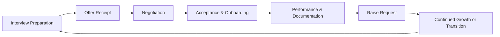

# Section Summary: Professional Career Management and Negotiation Competency

## 1. Introduction

The successful completion of technical interviews and receipt of employment offers represents a significant achievement in the professional development trajectory of an engineering candidate. However, the post-interview phase—encompassing offer evaluation, negotiation, management of multiple opportunities, and ongoing compensation advocacy—constitutes a distinct and equally critical competency domain. Mastery of these skills yields compounding financial and career satisfaction benefits over the duration of professional practice.

This document provides a consolidated summary of the core principles, frameworks, and strategic considerations presented throughout the section on career management and negotiation. The material is structured to serve as both a revision reference and a long-term professional resource.

## 2. Core Competency Areas Addressed

The section encompasses five primary competency domains essential for sustained career advancement:

| Competency Area | Description | Primary Outcomes |
| :--- | :--- | :--- |
| **Handling a Single Job Offer** | Strategic response to offer receipt, timeline management, and initial negotiation positioning. | Maximized initial compensation; preserved negotiation optionality. |
| **Managing Multiple Concurrent Offers** | Evaluation frameworks, cross-company communication, and leveraging competing opportunities. | Optimal selection based on long-term criteria; enhanced negotiation leverage. |
| **Processing Professional Rejection** | Psychological resilience, feedback extraction, and reapplication strategy. | Continuous improvement; preserved professional relationships. |
| **Negotiation Fundamentals** | Core principles applicable to offer discussions, raise requests, and professional contracts. | Consistent achievement of favorable terms across career events. |
| **Securing Salary Increases** | Performance documentation, business case preparation, and structured raise discussions. | Compensation growth aligned with expanding contribution value. |

## 3. Foundational Principles Governing All Interactions

### 3.1 The Primacy of Professional Relationship Preservation

A unifying theme across all career management activities is the imperative to maintain positive, professional relationships with all parties encountered throughout the hiring and employment lifecycle. This principle manifests in several specific practices:

- **Gracious Communication:** Expressing genuine appreciation for opportunities, regardless of outcome.
- **Avoidance of Bridge-Burning:** Declining offers or leaving positions without disparagement or negativity.
- **Long-Term Network Perspective:** Recognizing that recruiters, hiring managers, and colleagues frequently transition between organizations, and that today's rejected opportunity may become tomorrow's ideal fit.

### 3.2 The Collaborative Nature of Negotiation

Negotiation is fundamentally a collaborative dialogue directed at achieving mutually acceptable terms, not an adversarial contest. Approaching compensation discussions with a positive-sum orientation reduces psychological friction and enhances the probability of favorable outcomes.

**Key Attributes of Collaborative Negotiation:**

- Maintaining appreciative and enthusiastic tone.
- Framing requests as joint problem-solving exercises.
- Acknowledging employer constraints while advocating for fair alignment.
- Expressing continued interest independent of specific compensation discussions.

### 3.3 The Imperative of Preparation and Documentation

Successful outcomes in offer management and raise requests are directly correlated with the quality of advance preparation. Impromptu or emotionally-driven negotiations rarely achieve optimal results.

**Essential Preparation Activities:**

- Market compensation research using reliable data sources.
- Maintenance of a performance portfolio documenting achievements and quantifiable impacts.
- Preparation of structured, one-page summary documents for raise discussions.
- Articulation of value proposition tied to specific organizational objectives.

## 4. Summary of Key Strategic Frameworks

### 4.1 Offer Receipt Protocol

Upon receiving a job offer, the candidate should execute the following sequence:

1. **Express Enthusiasm and Gratitude:** Acknowledge the offer positively and convey genuine appreciation.
2. **Request Decision Timeline:** Secure a reasonable evaluation period, typically 3-5 business days, citing the need for comprehensive consideration of a significant career decision.
3. **Notify Parallel Processes:** Inform other active interview processes of the offer receipt and associated deadline to accelerate their timelines.
4. **Conduct Comprehensive Evaluation:** Assess total compensation package, including base salary, equity, benefits, and qualitative factors.
5. **Engage in Collaborative Negotiation:** Present justified requests for adjustments anchored in market data and value contribution.
6. **Communicate Final Decision Promptly:** Accept or decline with professionalism, preserving relationships in either case.

### 4.2 Multiple Offer Evaluation Hierarchy

When selecting among competing offers, the following prioritized criteria should guide decision-making:

| Priority Rank | Criterion | Rationale |
| :---: | :--- | :--- |
| 1 | Challenge and Stretch Assignment Potential | Maximizes skill acquisition and accelerates professional development. |
| 2 | Long-Term Growth Potential | Optimizes career trajectory over multi-year horizon. |
| 3 | Quality and Caliber of Colleagues | Facilitates learning through mentorship and exposure to advanced practices. |
| 4 | Total Compensation Package | Ensures fair market remuneration; significant but secondary to developmental factors. |
| 5 | Decision-Making Clarity (Non-Desperation) | Avoids suboptimal choices driven by scarcity mindset. |

### 4.3 Raise Request Methodology

The successful pursuit of a salary increase follows a structured, evidence-based approach:

1. **Maintain Continuous Performance Portfolio:** Document achievements, quantifiable impacts, positive feedback, and skill acquisitions from the first day of employment.
2. **Conduct Market Compensation Research:** Establish external benchmarks for the role and experience level.
3. **Identify Optimal Timing:** Initiate discussions 2-3 months prior to budget planning cycles or at the conclusion of significant project milestones.
4. **Prepare One-Page Summary Document:** Synthesize performance evidence into a concise, professional format suitable for manager review.
5. **Schedule Dedicated Meeting:** Request a specific conversation focused on compensation and career development.
6. **Anchor Request Above Target:** Propose an adjustment 10-15% above the desired outcome to create favorable negotiation space.
7. **Present Evidence-Based Justification:** Lead with documented contributions and value delivery, not personal financial need.
8. **Navigate Response Professionally:** Accept, counter, or document requirements for future consideration based on employer feedback.

### 4.4 Rejection Processing Framework

Rejection is reframed as an information-gathering opportunity rather than a personal indictment:

1. **Allow Brief Cooling Period:** Avoid immediate reactive communication.
2. **Request Constructive Feedback:** Send a professional inquiry seeking actionable improvement areas.
3. **Analyze Feedback for Skill Gaps:** Translate specific feedback into targeted learning objectives.
4. **Inquire About Reapplication Policy:** Maintain awareness of future opportunity windows.
5. **Continue Opportunity Generation:** Recognize the statistical nature of job search success; persist in interview activities.

## 5. The Skill Development Analogy

The competencies addressed in this section—negotiation, offer management, and compensation advocacy—are analogous to technical skills in that they improve with deliberate practice and iterative refinement. Each professional interaction involving these competencies provides experiential learning that enhances future performance.

**Practice Recommendations:**

- Role-play negotiation scenarios with trusted peers or mentors.
- Review and refine communication templates for offer responses and raise requests.
- Analyze outcomes (both favorable and unfavorable) to identify improvement areas.
- Maintain awareness of evolving market compensation data.

## 6. Visual Summary: Career Management Lifecycle

The following Mermaid diagram provides a simplified representation of the recurring career management activities addressed in this section.

## 7. Conclusion

The skills of handling offers, managing multiple opportunities, navigating rejection, negotiating effectively, and securing raises constitute a critical professional competency set that complements technical expertise. These skills are not innate; they are developed through study, practice, and reflective application.

The overarching theme emphasized throughout this section is the importance of treating all parties with professionalism, positivity, and respect. Negotiation conducted collaboratively does not damage relationships; rather, it establishes a foundation of mutual respect and clear communication that benefits both employee and employer over the long term.

Candidates and professionals who invest in developing these competencies position themselves for enhanced financial outcomes, accelerated career progression, and sustained job satisfaction. The principles and frameworks presented provide a structured foundation for navigating the recurring career management events that characterize a successful engineering career.