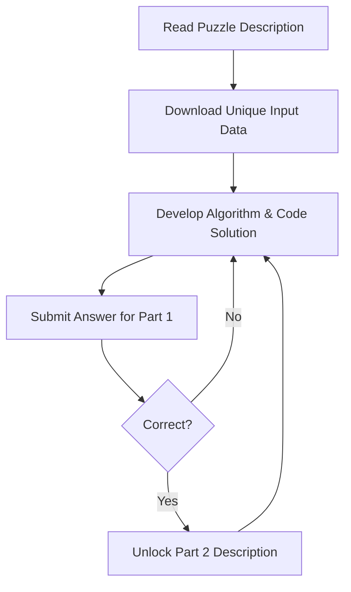

# Advent of Code: Annual Programming Challenge and Community Collaboration

## 1. Overview

Advent of Code is an annual online coding event that takes place every December. It presents participants with a series of progressively challenging programming problems released daily over a 25-day period, mirroring the structure of an Advent calendar.

The event is designed to test and enhance logical reasoning, algorithmic thinking, and programming proficiency. It is widely recognized within developer communities as an excellent platform for skill refinement and collaborative problem-solving.

## 2. Structure and Format

The challenge adheres to a consistent and predictable schedule throughout the month of December.

- **Duration:** December 1st through December 25th.
- **Frequency:** One new coding puzzle is released each day at midnight Eastern Time (UTC-5).
- **Progression:** Problems are divided into two distinct parts per day.
    - **Part 1:** Establishes the core problem statement and initial input processing requirements.
    - **Part 2:** Introduces a twist or complication that requires modification of the Part 1 solution, often testing the scalability or adaptability of the initial approach.

### 2.1. Difficulty Curve

The difficulty of the challenges increases gradually but significantly throughout the event.

| Phase | Days | Typical Challenge Focus |
| :--- | :--- | :--- |
| **Introductory** | 1 - 5 | Basic string parsing, arithmetic operations, simple iteration. |
| **Intermediate** | 6 - 15 | Data structure manipulation (Arrays, Hash Maps), pathfinding basics, recursion. |
| **Advanced** | 16 - 25 | Graph algorithms (BFS/DFS), Dynamic Programming, Bitwise operations, complex state machines. |

## 3. Educational and Professional Value

Participation in Advent of Code aligns directly with the objectives of academic and professional software development training.

### 3.1. Algorithmic Practice
The problems serve as practical applications of core Computer Science concepts taught in B.Tech curricula.
- **Parsing Irregular Input:** Challenges require robust handling of text files with varying delimiters and data formats.
- **Optimization:** Solutions that function for the sample test case often fail on the full puzzle input due to exponential time complexity, necessitating **Big O Analysis** and optimization.
- **State Management:** Later problems demand precise management of object state and simulation environments.

### 3.2. Code Architecture and Extensibility
Because Part 2 of each day's puzzle is hidden until Part 1 is solved, participants learn to write **extensible and modular code**. A rigid, one-off script for Part 1 often requires a complete rewrite for Part 2, whereas well-architected components allow for simple refactoring.

## 4. Community and Collaborative Learning

A distinctive feature of Advent of Code is the surrounding ecosystem of community support and discussion.

### 4.1. Official and Unofficial Platforms
Participants frequently engage with peers on various platforms to compare approaches and learn alternative methodologies.
- **Reddit (r/adventofcode):** A central hub for daily solution megathreads and visualization sharing.
- **Discord Communities:** Real-time discussion channels, including dedicated groups within larger learning platforms like the Zero to Mastery community.
- **GitHub:** Many developers maintain public repositories showcasing their solutions in various programming languages (Python, JavaScript, C++, Go, Rust).

### 4.2. Benefits of Peer Review
Reviewing community solutions after completing a challenge is a critical component of the learning loop.
- **Exposure to Multiple Paradigms:** Observing how a functional programmer solves a problem versus an object-oriented approach.
- **Performance Benchmarking:** Comparing runtime efficiency and memory footprint of different algorithms.
- **Language Agnostic Learning:** Understanding the logic independent of syntax facilitates the transfer of knowledge across technology stacks.

## 5. Access and Longevity

The platform maintains a permanent archive of past events.

### 5.1. Historical Archives
While the event is seasonal, the challenges are **not time-limited**. Participants can navigate to previous years (e.g., 2015, 2016, 2017, etc.) via the official website. This allows individuals to practice at their own pace year-round, using older puzzles as preparation for the upcoming December event.

### 5.2. Participation Workflow
A simplified workflow for engaging with a puzzle is illustrated below.

## 6. Conclusion

Advent of Code represents an intersection of recreational coding and rigorous technical education. For students and professionals alike, it provides a structured, low-stakes environment to strengthen problem-solving muscles. The annual recurrence of the event, combined with the permanent accessibility of its archives, ensures that it remains a valuable, evergreen resource for continuous improvement in the field of software engineering.