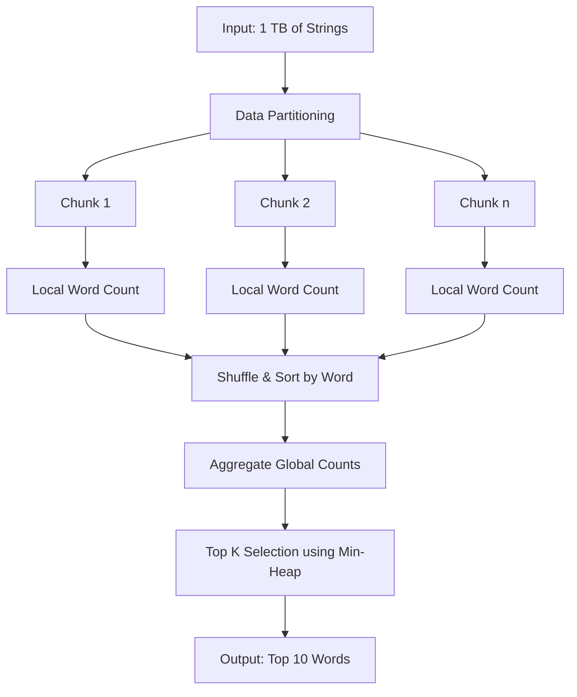

# Facebook Technical Interview Questions: A Comprehensive Study Guide

## 1. Introduction

This document compiles authentic technical interview questions derived from Facebook's (Meta) recruitment process. The selected problems emphasize proficiency in fundamental data structures, algorithmic efficiency, and large-scale data processing techniques. Mastery of these concepts is essential for candidates targeting software engineering roles at Facebook and peer organizations.

The compilation includes a curated set of LeetCode problems frequently cited in interview experiences, followed by a detailed analysis of a bonus problem that tests distributed systems thinking and streaming algorithms.

## 2. Curated LeetCode Problem Set

The following problems represent core algorithmic challenges encountered in Facebook technical screenings and on-site interviews. Each entry includes a direct hyperlink to the LeetCode platform for immediate practice.

| # | Title | Core Data Structure / Algorithm | Difficulty |
| :--- | :--- | :--- | :--- |
| [1](https://leetcode.com/problems/two-sum/) | Two Sum | Hash Map | Easy |
| [200](https://leetcode.com/problems/number-of-islands/) | Number of Islands | Graph BFS/DFS, Union-Find | Medium |
| [20](https://leetcode.com/problems/valid-parentheses/) | Valid Parentheses | Stack | Easy |
| [121](https://leetcode.com/problems/best-time-to-buy-and-sell-stock/) | Best Time to Buy and Sell Stock | Array, Greedy | Easy |
| [56](https://leetcode.com/problems/merge-intervals/) | Merge Intervals | Sorting, Array Traversal | Medium |
| [206](https://leetcode.com/problems/reverse-linked-list/) | Reverse Linked List | Linked List, Iteration/Recursion | Easy |

### 2.1. Detailed Solution: Merge Intervals (#56)

**Problem Synopsis:** Given an array of `intervals` where `intervals[i] = [start_i, end_i]`, merge all overlapping intervals and return an array of the non-overlapping intervals that cover all the intervals in the input.

**Approach:** Sort the intervals by their start time. Then iterate through the sorted list, comparing the current interval with the last merged interval. If they overlap (current start ≤ last end), merge them by updating the end to the maximum of both ends. Otherwise, add the current interval as a new non-overlapping entry.

**Time Complexity:** O(n log n) due to sorting  
**Space Complexity:** O(n) for output storage

```javascript
/**
 * #56 Merge Intervals
 * Merges overlapping intervals in an array and returns the merged result.
 *
 * @param {number[][]} intervals - Array of intervals where each interval is [start, end].
 * @return {number[][]} - Array of merged non-overlapping intervals.
 */
function merge(intervals) {
    // Edge case: If there are no intervals or only one, return as is.
    if (intervals.length <= 1) {
        return intervals;
    }

    // Step 1: Sort the intervals based on their start time in ascending order.
    // The comparison function (a, b) => a[0] - b[0] ensures numeric sorting.
    // Sorting is crucial for the greedy merging approach to work correctly.
    intervals.sort((a, b) => a[0] - b[0]);

    // Initialize the result array with the first interval as the starting merged interval.
    const merged = [intervals[0]];

    // Step 2: Iterate through the remaining intervals starting from index 1.
    for (let i = 1; i < intervals.length; i++) {
        // Get a reference to the last interval currently in the merged list.
        // This is the interval we will compare against for potential overlap.
        const lastMerged = merged[merged.length - 1];
        const currentInterval = intervals[i];

        // Check for overlap condition:
        // Overlap occurs if the start of the current interval is less than or equal
        // to the end of the last merged interval.
        if (currentInterval[0] <= lastMerged[1]) {
            // Overlap detected: Merge the two intervals by updating the end time
            // of the last merged interval to the maximum of both ends.
            // Math.max ensures we handle cases where one interval fully contains another.
            lastMerged[1] = Math.max(lastMerged[1], currentInterval[1]);
        } else {
            // No overlap: The current interval is disjoint from the last merged one.
            // Add it as a new separate interval to the merged list.
            merged.push(currentInterval);
        }
    }

    // Return the array containing all merged intervals.
    return merged;
}
```

### 2.2. Detailed Solution: Reverse Linked List (#206)

**Problem Synopsis:** Reverse a singly linked list. The reversal must be performed in-place.

**Approach:** Use three pointers: `prev` (initially null), `current` (head), and `next` (temporary). Iterate through the list, reversing the `next` pointer of each node to point to `prev`, then advance pointers forward.

**Time Complexity:** O(n)  
**Space Complexity:** O(1)

```javascript
/**
 * Definition for singly-linked list node.
 * function ListNode(val, next) {
 *     this.val = (val===undefined ? 0 : val)
 *     this.next = (next===undefined ? null : next)
 * }
 */

/**
 * #206 Reverse Linked List
 * Reverses a singly linked list iteratively using three pointers.
 *
 * @param {ListNode} head - The head node of the linked list.
 * @return {ListNode} - The new head node of the reversed list.
 */
function reverseList(head) {
    // Initialize 'prev' to null. In the reversed list, the original head
    // will become the tail, and its next pointer must point to null.
    let prev = null;
    // 'current' starts at the head and traverses the original list.
    let current = head;

    // Continue until all nodes have been processed (current becomes null).
    while (current !== null) {
        // CRITICAL: Temporarily store the reference to the next node.
        // We need this because we are about to overwrite current.next.
        let nextTemp = current.next;

        // Reverse the link: Make the current node point to the previous node.
        // This is the core operation that changes the direction of the list.
        current.next = prev;

        // Advance 'prev' to the current node. For the next iteration, this
        // current node becomes the "previous" node.
        prev = current;
        // Advance 'current' to the stored next node to continue traversal.
        current = nextTemp;
    }

    // After the loop, 'prev' holds the original tail node, which is now the
    // new head of the reversed list.
    return prev;
}
```

## 3. Bonus Problem: Top 10 Most Frequent Words from a Terabyte of Strings

### 3.1. Problem Statement

Given a dataset comprising one terabyte (1 TB) of string data, determine the **10 most frequently occurring words**. The solution must account for memory constraints—the entire dataset cannot be loaded into the main memory of a typical machine simultaneously.

### 3.2. Challenges and Constraints

| Constraint | Implication |
| :--- | :--- |
| **Data Volume** | 1 TB exceeds standard RAM capacity (typically 8-64 GB). |
| **Word Frequency Counting** | A naive in-memory hash map would exhaust memory. |
| **I/O Bottleneck** | Disk read speed becomes the limiting factor. |
| **Scalability** | The solution must scale horizontally across multiple machines if necessary. |

### 3.3. Solution Architecture Overview

The problem requires a **MapReduce** or **streaming data processing** paradigm. The following high-level workflow addresses the memory constraint:



### 3.4. Detailed Algorithmic Steps

#### Step 1: Data Partitioning and Local Counting

The 1 TB file is divided into manageable chunks (e.g., 64 MB or 128 MB blocks). For each chunk:

- Read the chunk sequentially.
- Tokenize the text into words (case-insensitive, removing punctuation).
- Maintain an **in-memory hash map** (dictionary) to count word frequencies within that chunk.
- Upon chunk exhaustion, write the `(word, count)` pairs to an intermediate file on disk.

```javascript
/**
 * Pseudocode representation of local word count on a single data chunk.
 * In a real distributed environment, this would execute on individual worker nodes.
 *
 * @param {string} chunkData - A portion of the input text data.
 * @return {Map<string, number>} - Frequency map for words in this chunk.
 */
function countWordsInChunk(chunkData) {
    const frequencyMap = new Map();

    // Tokenize: split by non-alphabetic characters and convert to lowercase.
    // A more robust implementation would handle Unicode and contractions.
    const words = chunkData.toLowerCase().split(/[^a-z0-9]+/);

    for (const word of words) {
        // Skip empty strings that may result from split boundaries.
        if (word.length === 0) continue;

        // Increment the count for the word.
        // Using Map's set and get for efficient O(1) updates.
        frequencyMap.set(word, (frequencyMap.get(word) || 0) + 1);
    }

    return frequencyMap;
}
```

#### Step 2: Shuffling and Aggregation (MapReduce Shuffle Phase)

The intermediate files from all chunks contain `(word, count)` pairs. To compute global frequencies, all counts for the same word must be brought together. This is achieved through **hashing**:

- Hash each word to determine a partition (reducer) index.
- Send all occurrences of a specific word to the same reducer.
- Each reducer sums the partial counts for its assigned words.

#### Step 3: Top-K Selection Using Min-Heap

After global aggregation, we have a massive list of `(word, global_frequency)` pairs. To find the top 10 without sorting the entire list (which would be O(m log m) where m is the number of unique words), a **min-heap** of fixed size 10 is employed.

**Min-Heap Algorithm:**
1. Initialize an empty min-heap of capacity 10 (storing `{word, frequency}` based on frequency).
2. Iterate through each word-frequency pair.
3. If the heap size is less than 10, insert the pair.
4. If the heap size is 10, compare the current frequency with the heap's root (minimum frequency).
   - If current frequency > root frequency, remove the root and insert the current pair.
   - Otherwise, discard the current pair.
5. After processing all pairs, the heap contains the top 10 most frequent words.

```javascript
/**
 * Min-Heap implementation for Top-K frequent words selection.
 * This is a simplified version using an array and binary heap operations.
 */
class MinHeap {
    constructor(capacity) {
        this.heap = [];
        this.capacity = capacity;
    }

    /**
     * Returns the root element (minimum frequency) without removal.
     */
    peek() {
        return this.heap[0];
    }

    /**
     * Returns the current number of elements in the heap.
     */
    size() {
        return this.heap.length;
    }

    /**
     * Inserts a word-frequency pair into the heap.
     * Maintains the min-heap property: parent frequency <= child frequencies.
     * @param {Object} item - { word: string, freq: number }
     */
    insert(item) {
        // If heap is not yet at capacity, simply add and bubble up.
        if (this.heap.length < this.capacity) {
            this.heap.push(item);
            this._bubbleUp(this.heap.length - 1);
            return;
        }

        // If heap is full and new item has higher frequency than the minimum,
        // replace the root and heapify down.
        if (item.freq > this.heap[0].freq) {
            this.heap[0] = item;
            this._bubbleDown(0);
        }
        // Otherwise, ignore the item.
    }

    /**
     * Extracts all items from the heap (in arbitrary order).
     * For final output, sorting the result provides descending frequency order.
     */
    getAll() {
        return [...this.heap];
    }

    /**
     * Internal: Moves an element up the heap to maintain min-heap property.
     * @param {number} index - Index of the element to bubble up.
     */
    _bubbleUp(index) {
        while (index > 0) {
            const parentIndex = Math.floor((index - 1) / 2);
            if (this.heap[parentIndex].freq > this.heap[index].freq) {
                // Swap parent and child
                [this.heap[parentIndex], this.heap[index]] = [this.heap[index], this.heap[parentIndex]];
                index = parentIndex;
            } else {
                break;
            }
        }
    }

    /**
     * Internal: Moves an element down the heap to maintain min-heap property.
     * @param {number} index - Index of the element to bubble down.
     */
    _bubbleDown(index) {
        const lastIndex = this.heap.length - 1;
        while (true) {
            let leftChildIndex = 2 * index + 1;
            let rightChildIndex = 2 * index + 2;
            let smallestIndex = index;

            if (leftChildIndex <= lastIndex && this.heap[leftChildIndex].freq < this.heap[smallestIndex].freq) {
                smallestIndex = leftChildIndex;
            }
            if (rightChildIndex <= lastIndex && this.heap[rightChildIndex].freq < this.heap[smallestIndex].freq) {
                smallestIndex = rightChildIndex;
            }

            if (smallestIndex !== index) {
                [this.heap[index], this.heap[smallestIndex]] = [this.heap[smallestIndex], this.heap[index]];
                index = smallestIndex;
            } else {
                break;
            }
        }
    }
}

/**
 * Finds the top K most frequent words from a stream of word-frequency pairs.
 *
 * @param {Iterable<{word: string, freq: number}>} globalFrequencies - Iterable of word-frequency objects.
 * @param {number} k - The number of top frequent words to return.
 * @return {Array<{word: string, freq: number}>} - Top K words sorted descending by frequency.
 */
function findTopKFrequent(globalFrequencies, k) {
    // Initialize a min-heap with capacity K.
    const minHeap = new MinHeap(k);

    // Process each word-frequency pair exactly once.
    for (const item of globalFrequencies) {
        minHeap.insert(item);
    }

    // Retrieve all elements from the heap.
    const topK = minHeap.getAll();

    // Sort the result in descending order of frequency for final presentation.
    // Since K is small (10), this sort is negligible in cost.
    topK.sort((a, b) => b.freq - a.freq);

    return topK;
}
```

### 3.5. Complexity Analysis

| Phase | Time Complexity | Space Complexity | Notes |
| :--- | :--- | :--- | :--- |
| Chunk Reading & Local Count | O(N) total I/O | O(M_chunk) | M_chunk is unique words per chunk (bounded). |
| Shuffle & Global Aggregation | O(N) network/disk transfer | O(M_global) per reducer | Distributed across machines. |
| Top-K Selection | O(M_global * log K) | O(K) | K = 10, thus effectively O(M_global). |
| **Overall** | **O(N)** linear with data size | **O(M_global)** + O(K) | Highly scalable for large N. |

### 3.6. Alternative: Streaming Algorithm for Single Machine with Limited Memory

If the dataset is on a single machine but memory is constrained, an **external sorting** approach combined with a **priority queue** can be employed without a full MapReduce framework:

1. **External Sort:** Sort the 1 TB file using disk-based merge sort. This groups identical words together.
2. **Sequential Scan:** Read the sorted file sequentially, computing frequencies for consecutive identical words.
3. **Top-K Tracking:** Maintain a min-heap of size 10 during the sequential scan, as described above.

This approach requires O(N log N) disk operations but works within a single-node environment.

## 4. Conclusion

The Facebook interview question set emphasizes both foundational algorithmic skills and the ability to architect scalable solutions for massive datasets. The top frequent words problem, in particular, evaluates a candidate's understanding of distributed computing paradigms and memory-efficient data structures.

Consistent practice with the curated LeetCode problems, coupled with a deep comprehension of the bonus problem's underlying principles, will substantially strengthen a candidate's readiness for technical evaluations at Facebook and analogous technology companies. Engagement with peer learning communities is encouraged to broaden exposure to diverse problem-solving methodologies.