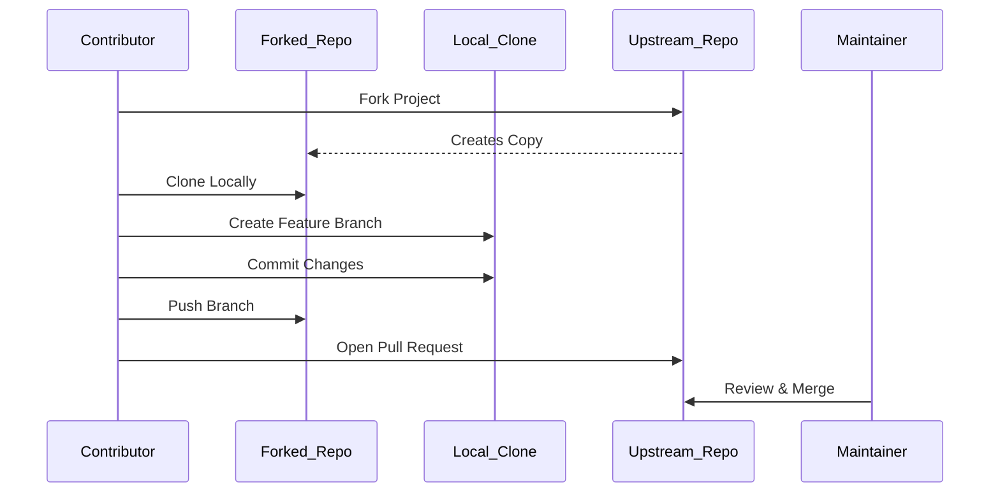

# Contributing to Open Source: A Practical Guide for Beginners

## 1. Introduction to Open Source

### 1.1 Definition and Core Philosophy

Open source refers to software whose source code is made available to the public under a license that grants users the rights to view, inspect, modify, and distribute the code. The foundational principle of open source is **collaborative transparency**: by sharing code openly, developers from around the world can collectively identify bugs, propose enhancements, and build upon existing work. This model leverages the collective intelligence of a global community to improve software quality, security, and innovation.

### 1.2 Significance in Modern Computing

A substantial portion of contemporary internet infrastructure and development tooling is built upon open source technologies. Notable examples include:

- **Linux Operating System**: A community-developed kernel that powers the majority of cloud servers, including platforms such as Amazon Web Services (AWS), Google Cloud Platform (GCP), and Microsoft Azure.
- **Web Frameworks and Libraries**: Projects like React, Angular, and Vue.js, which form the backbone of modern frontend development.
- **Programming Languages and Runtimes**: Python, Node.js, and Go, which are maintained through open governance models.

### 1.3 Benefits of Contribution

Engaging with open source projects offers multiple advantages for students and early-career professionals:

| Benefit Category | Description |
| :--- | :--- |
| **Skill Development** | Hands-on experience with collaborative tools (Git, GitHub), code review processes, and team communication protocols. |
| **Professional Portfolio** | Demonstrates initiative, technical competence, and ability to work in distributed teams. Contributions are publicly verifiable. |
| **Community Networking** | Exposure to experienced developers, maintainers, and potential mentors within a global ecosystem. |
| **Career Advancement** | Many employers regard open source contributions as a strong indicator of practical experience, especially for candidates lacking formal work history. |

## 2. The Contribution Workflow

### 2.1 Overview of Git and GitHub

Contributions are typically managed through the **Git** version control system and hosted on platforms like **GitHub**. The standard workflow involves creating a personal copy of a repository, making changes in an isolated branch, and proposing those changes to the original project maintainers.

The following sequence diagram illustrates the high-level flow of a typical open source contribution:



### 2.2 Environment Setup: Forking and Cloning

Before modifying any code, you must create an independent copy of the target repository. This is achieved through the **Fork** operation.

1.  Navigate to the repository on GitHub (e.g., `zero-to-mastery/start-here-guidelines`).
2.  Click the **Fork** button located in the upper-right corner of the page.
3.  Select your personal GitHub account as the destination. This creates a copy of the repository under your profile namespace.

Once forked, clone the repository to your local development environment using SSH (recommended) or HTTPS:

```bash
git clone git@github.com:<your-username>/start-here-guidelines.git
cd start-here-guidelines
```

### 2.3 Branching Strategy

It is considered best practice to avoid making changes directly on the `master` (or `main`) branch. Instead, create a dedicated feature or topic branch to isolate your modifications.

```bash
git checkout -b feature/add-contributor-name
```

This command creates a new branch named `feature/add-contributor-name` and switches to it. Descriptive branch names help maintainers understand the purpose of the change.

### 2.4 Making and Committing Changes

For illustrative purposes, this guide demonstrates adding a name to a `CONTRIBUTORS.md` file using **Markdown** syntax.

1.  Open the `CONTRIBUTORS.md` file in a text editor.
2.  Navigate to the end of the list.
3.  Add a new entry using the following Markdown format:
    ```markdown
    - [YourGitHubUsername](https://github.com/YourGitHubUsername)
    ```
    *Replace `YourGitHubUsername` with your actual GitHub handle.*
4.  Save the file.

Return to the terminal to stage and commit the change:

```bash
git status                    # Verify modified file
git add CONTRIBUTORS.md       # Stage the specific file (or use 'git add .')
git commit -m "docs: add GitHub username to contributors list"
```

**Note on Commit Messages:** Adhering to a conventional format (e.g., `docs: <message>`) improves project readability. Common prefixes include `feat`, `fix`, `docs`, and `style`.

### 2.5 Pushing and Creating a Pull Request

Push the new branch to your forked repository (origin):

```bash
git push origin feature/add-contributor-name
```

After pushing, navigate back to the original **upstream repository** on GitHub (not your fork). GitHub will display a banner prompting you to create a **Pull Request (PR)** based on the recently pushed branch.

1.  Click **Compare & pull request**.
2.  Provide a clear title and description of your change.
3.  If project guidelines suggest tagging maintainers, do so in the description.
4.  Click **Create pull request**.

## 3. Post-Contribution Process

### 3.1 Review and Merge

Maintainers will review the pull request. They may provide feedback, request changes, or approve the merge. Once approved, the maintainer (or an automated bot) will merge the PR into the upstream `master` branch.

### 3.2 Recognition

Upon successful merging, several visible changes occur on your GitHub profile:

- Your name appears in the `CONTRIBUTORS.md` file of the main repository.
- The contributing organization (e.g., **Zero to Mastery**) will appear in the "Organizations" section of your profile sidebar. This serves as a public badge of participation.

## 4. Next Steps: Engaging with Projects

After completing an introductory contribution, the following steps are recommended to deepen engagement:

1.  **Explore Project Repositories**: Navigate to the parent organization page to view active projects.
2.  **Review Contribution Guidelines**: Most projects contain a `CONTRIBUTING.md` or `README.md` file outlining specific setup instructions, coding standards, and issue labeling conventions.
3.  **Filter by "Good First Issue"**: Many repositories tag beginner-friendly tasks with labels such as `good first issue` or `help wanted`.
4.  **Engage with the Community**: Join relevant Discord servers or discussion forums to ask questions and coordinate with other contributors.

This structured approach provides a safe, guided entry point into the broader open source ecosystem, enabling students to build both technical proficiency and a professional network.