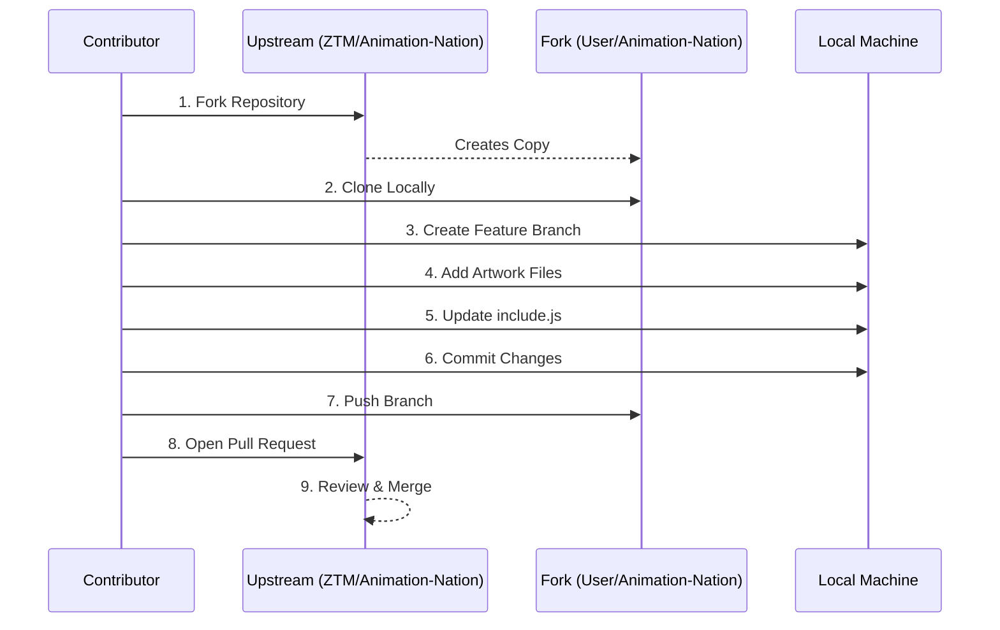

# Contributing to an Open Source Project: A Practical Walkthrough

## 1. Introduction to Themed Contribution Events

Open source communities frequently organize time-bound events to encourage participation and provide structured pathways for new contributors. These events often align with global initiatives or seasonal themes.

### 1.1 Monthly Coding Challenges

Within collaborative learning environments, monthly coding challenges serve as a recurring opportunity for members to engage with projects aligned to a specific theme or technology stack. These challenges lower the barrier to entry by providing clear, curated tasks.

### 1.2 Hacktoberfest

**Hacktoberfest** is an annual, month-long celebration of open source software hosted by DigitalOcean in partnership with GitHub and other sponsors. During October, participants are encouraged to submit a minimum number of quality pull requests to participating repositories. Many open source organizations prepare dedicated projects with "good first issue" labels to accommodate the influx of new contributors.

### 1.3 Project Showcase

The following projects are representative of the types of beginner-friendly repositories available during such events:

| Project Name | Description | Primary Technologies |
| :--- | :--- | :--- |
| **Animation Nation** | A gallery of user-submitted CSS animations. Contributors add a self-contained animation to the project. | HTML, CSS |
| **Sanctified** | A holiday-themed web application where contributors build components for a Santa-themed interactive website. | HTML, CSS, JavaScript |
| **Python Art** | A utility that converts standard images into ASCII art representations. | Python |

This document details the contribution process using **Animation Nation** as the reference implementation.

## 2. Contribution Workflow for Animation Nation

The following sequence diagram illustrates the standardized fork-and-branch workflow employed for contributing to the Animation Nation repository.



### 2.1 Prerequisites and Initial Setup

Before modifying any code, ensure you have:
- A GitHub account.
- Git installed and configured locally.
- A text editor or Integrated Development Environment (IDE).

**Step 1: Fork the Repository**
Navigate to the target project (e.g., `zero-to-mastery/Animation-Nation`) on GitHub. Click the **Fork** button to create a personal copy under your account namespace.

**Step 2: Clone the Forked Repository**
Use the `git clone` command to download the repository to your local file system.

```bash
git clone git@github.com:<your-username>/Animation-Nation.git
cd Animation-Nation
```

### 2.2 Branch Creation

Adhere to best practices by creating a dedicated branch for your contribution. This isolates your work and simplifies the pull request review process.

```bash
git checkout -b feature/add-my-animation
```

*Replace `feature/add-my-animation` with a descriptive branch name, such as `add-animatron-art`.*

### 2.3 Implementing the Contribution: Adding a CSS Animation

The project structure requires contributors to add a self-contained directory containing an HTML file and a CSS file. The primary project interface is populated via a JavaScript configuration file.

**Step 1: Create a Personal Directory**
Navigate to the `art/` directory located in the project root. Create a new subdirectory named after your project or GitHub username.

```bash
mkdir art/your-project-name
```

**Step 2: Create Required Files**
Within your new directory, create the following two files:
- `index.html`: Contains the markup for the animation.
- `style.css`: Contains the CSS rules defining the animation.

**Example Directory Structure:**
```
Animation-Nation/
├── art/
│   ├── your-project-name/
│   │   ├── index.html
│   │   └── style.css
│   └── ...
├── include.js
└── ...
```

**Step 3: Write HTML and CSS Code**
The `index.html` file must correctly link to the CSS file. A minimal valid template is shown below.

*index.html:*
```html
<!DOCTYPE html>
<html lang="en">
<head>
    <meta charset="UTF-8">
    <meta name="viewport" content="width=device-width, initial-scale=1.0">
    <title>Your Animation Title</title>
    <link rel="stylesheet" href="style.css">
</head>
<body>
    <div class="container">
        <!-- Animation elements go here -->
        <div class="animated-element"></div>
    </div>
</body>
</html>
```

*style.css:*
```css
body {
    margin: 0;
    padding: 0;
    display: flex;
    justify-content: center;
    align-items: center;
    min-height: 100vh;
    background: #f0f0f0;
}

.animated-element {
    width: 100px;
    height: 100px;
    background: linear-gradient(45deg, #ff6b6b, #4ecdc4);
    animation: rotateScale 2s infinite alternate;
}

@keyframes rotateScale {
    0% {
        transform: rotate(0deg) scale(1);
    }
    100% {
        transform: rotate(360deg) scale(1.5);
    }
}
```

**Step 4: Register the Animation in `include.js`**
The `include.js` file acts as a manifest for the gallery application. Locate the file in the project root and add a new entry to the array.

*Syntax:*
```javascript
{
    name: "Your Project Display Name",
    pageLink: "./art/your-project-name/index.html",
    gifLink: "./art/your-project-name/preview.gif",
    author: "Your Name or GitHub Handle",
    githubLink: "https://github.com/your-username"
}
```

*Note:* The `gifLink` field expects a relative path to an animated GIF preview of your work. Create and place this file in your project directory to complete the entry.

### 2.4 Committing and Pushing Changes

**Step 1: Stage and Commit**
```bash
git add .
git commit -m "feat: add [Your Project Name] CSS animation"
```

**Step 2: Push the Feature Branch**
```bash
git push origin feature/add-my-animation
```

### 2.5 Creating a Pull Request

1. Navigate to the **upstream repository** (`zero-to-mastery/Animation-Nation`).
2. GitHub will display a banner indicating a recently pushed branch. Click **Compare & pull request**.
3. Provide a descriptive title and a brief summary of the changes.
4. Optionally, mention a project maintainer if specified in the contribution guidelines.
5. Click **Create pull request**.

### 2.6 Review and Merge Process

Project maintainers will review the pull request for adherence to style guidelines, functionality, and code quality. Feedback may be provided in the PR comments section. Once approved, the maintainer will merge the PR into the main branch.

### 2.7 Verification

After the merge is complete, the Animation Nation gallery will include the new submission. Due to the project's random selection logic, multiple page refreshes may be required to view the specific animation.

## 3. Significance of Practice Environments

Contribution platforms designed as **playgrounds** or **sandboxes** serve a critical educational function. They provide a low-stakes environment where contributors can:

- Familiarize themselves with the Git/GitHub workflow without the pressure of production-level consequences.
- Experiment with code review processes and collaborative etiquette.
- Build confidence before engaging with larger, more complex open source projects.

Engaging in such practice repositories simulates real-world team dynamics and version control operations, thereby preparing individuals for professional software development roles.

## 4. Conclusion

Contributing to open source projects, even through structured beginner-friendly repositories, yields substantial professional and educational benefits. The process reinforces practical skills in version control, web development fundamentals, and remote collaboration. Participation in community events like Hacktoberfest provides a defined pathway for entering the global open source ecosystem and serves as verifiable evidence of applied technical competency.