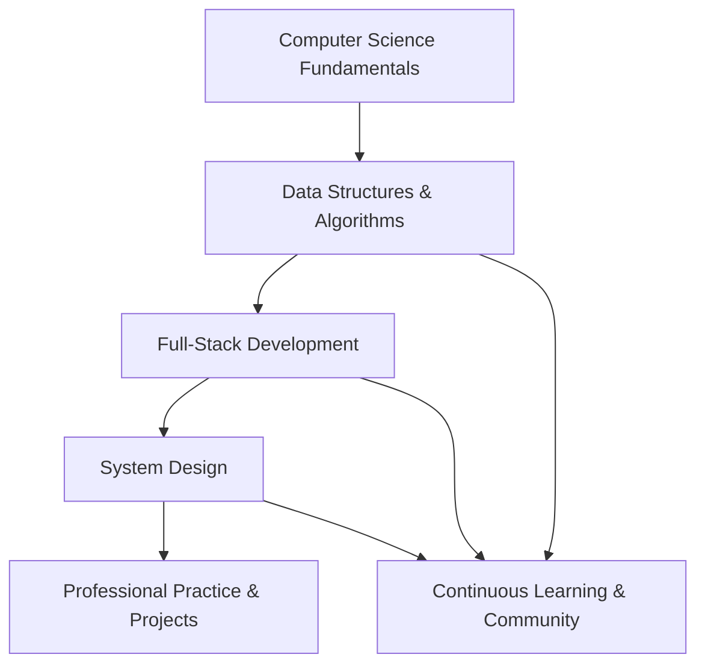
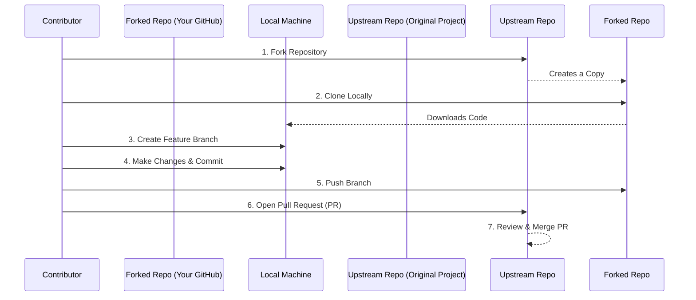

# Comprehensive Learning Guideline: From Data Structures and Algorithms to System Design

## 1. Introduction

This document presents a structured, comprehensive learning pathway designed for aspiring software engineers and computer science students. The curriculum integrates foundational theoretical knowledge with practical, project-based application, covering the entire spectrum from core Data Structures and Algorithms (DSA) to advanced System Design principles. The objective is to provide a clear, actionable roadmap that transforms a novice programmer into a well-rounded, industry-ready software developer.

The modern software landscape demands a dual proficiency: the ability to solve algorithmic problems efficiently (DSA) and the capacity to architect scalable, resilient systems (System Design). This guideline bridges these two critical domains, supplemented by essential software engineering practices and professional development strategies.

### 1.1 Learning Pathway Overview

The following diagram illustrates the high-level progression through the core learning domains:

## 2. Foundational Knowledge: Computer Science Fundamentals

A robust understanding of core computer science concepts is the bedrock upon which all advanced technical skills are built. This phase establishes the theoretical underpinnings necessary for efficient coding and system architecture.

### 2.1 Core Topics

The following subjects constitute the essential foundation for any software engineering career:

- **Programming Fundamentals**: Mastery of syntax, variables, data types, operators, conditional statements, loops, arrays, strings, functions, and basic input/output operations in at least one language.
- **Computer Architecture**: Basic understanding of how hardware components (CPU, memory, storage) interact and execute instructions.
- **Operating Systems (OS)**: Concepts including process management, memory management, file systems, and concurrency.
- **Computer Networks**: Fundamentals of the OSI and TCP/IP models, protocols (HTTP, DNS, TCP/UDP), and how data traverses the internet.
- **Database Management Systems (DBMS)**: Relational database concepts, SQL, normalization, and an introduction to NoSQL databases.

### 2.2 Recommended Learning Path (0–3 Months)

1.  **Select a Primary Language**: Choose one language to learn deeply. Python is recommended for beginners due to its readability; Java or C++ are also excellent choices for a more rigorous understanding of types and memory.
2.  **Follow a Structured Curriculum**: Utilize free, high-quality resources such as the **Open Source Society University (OSSU) Computer Science curriculum** for a comprehensive, self-taught education.
3.  **Build Simple Programs**: Create small applications like a calculator, a to-do list manager, or a basic number-guessing game to cement syntax and logic.

### 2.3 Key Resources

| Resource | Description | Primary Focus |
| :--- | :--- | :--- |
| **W3Schools / freeCodeCamp** | Interactive tutorials for syntax and basic concepts. | Programming Languages |
| **OSSU CS Curriculum** | A complete, free, self-taught CS education using top-tier online courses. | Comprehensive CS Fundamentals |
| **CS50 (Harvard)** | A renowned introductory computer science course available online. | Broad CS Overview |
| **MDN Web Docs** | Definitive resource for web technologies (HTML, CSS, JavaScript). | Web Fundamentals |
| **GeeksforGeeks** | Extensive articles and tutorials on all core CS subjects. | DSA, DBMS, OS, Networks |

## 3. Core Technical Competencies

This phase involves an in-depth exploration of the two pillars of technical problem-solving: Data Structures & Algorithms and System Design.

### 3.1 Data Structures and Algorithms (DSA)

Proficiency in DSA is paramount for writing efficient code, solving complex problems, and succeeding in technical interviews. This section provides a phased approach to mastery.

#### 3.1.1 Phase 1: Data Structures and Algorithm Foundation (Months 3–6)

The goal of this phase is to build the essential algorithmic toolkit.

**Core Data Structures:**
- Arrays and Strings
- Linked Lists (Singly, Doubly)
- Stacks and Queues
- Hash Tables (HashMaps)
- Trees (Binary Trees, Binary Search Trees, Heaps)
- Graphs

**Core Algorithms:**
- Sorting Algorithms (Bubble, Selection, Insertion, Merge, Quick)
- Searching Algorithms (Linear, Binary Search)
- Recursion and Backtracking
- Divide and Conquer Strategy
- Dynamic Programming (basic concepts)

**Complexity Analysis:**
- Understanding Big O notation (O(1), O(log n), O(n), O(n log n), O(n²), O(2ⁿ)) for both time and space complexity.

**Practice Strategy:**
- Solve 5-7 problems per week on topics you are currently studying.
- Utilize platforms like LeetCode (Easy/Medium problems) and the CSES Problem Set.
- Rewrite solutions in your own words to reinforce understanding.

#### 3.1.2 Phase 2: Competitive Programming and Advanced Practice (Months 6–12)

This phase focuses on applying DSA knowledge under time pressure and mastering advanced topics.

**Advanced Topics:**
- Graph Algorithms (Dijkstra, Bellman-Ford, Floyd-Warshall, Minimum Spanning Trees)
- Advanced Dynamic Programming (Multidimensional, Bitmask, DP on Trees)
- String Algorithms (KMP, Z-algorithm)
- Number Theory (Modular Arithmetic, Sieve of Eratosthenes)

**Practice Platforms:**
- **Codeforces & AtCoder**: Participate in regular contests to build speed and strategy.
- **LeetCode (Hard problems)**: Focus on company-specific question sets for interview preparation.
- **VNOJ / Kattis**: Practice on problems from international programming competitions.

**Key Resources for DSA:**

| Resource | Description |
| :--- | :--- |
| **CP-Algorithms** | Clear theory and implementation examples for a wide range of algorithms. |
| **"Competitive Programmer’s Handbook"** | A comprehensive free guide by Antti Laaksonen. |
| **"Introduction to Algorithms" (CLRS)** | The definitive textbook for in-depth algorithmic study. |
| **Visualgo** | Interactive visualizations of data structures and algorithms. |

### 3.2 System Design

System Design is the process of defining a system's architecture, components, modules, interfaces, and data to satisfy specified requirements. It is a critical skill for senior engineering roles.

#### 3.2.1 Phase 1: Low-Level Design (LLD)

LLD focuses on the internal design of individual modules or components, often at the class and function level. It is the practical application of Object-Oriented Programming (OOP) principles.

**Core LLD Concepts:**
- **Object-Oriented Programming (OOP)**: Encapsulation, Inheritance, Polymorphism, Abstraction.
- **SOLID Principles**: A set of five design principles intended to make software designs more understandable, flexible, and maintainable.
- **UML (Unified Modeling Language)**: Standardized modeling language for visualizing system design (Class, Sequence, Component diagrams).
- **Design Patterns**: Reusable solutions to commonly occurring problems in software design. Essential patterns include:
    - **Creational**: Singleton, Factory, Builder.
    - **Structural**: Adapter, Decorator, Facade.
    - **Behavioral**: Observer, Strategy, Command.

#### 3.2.2 Phase 2: High-Level Design (HLD)

HLD deals with the architecture of an entire system, focusing on scalability, reliability, and performance across distributed components.

**Core HLD Concepts:**
- **Networking & Web Basics**: Understanding DNS, HTTP/HTTPS, TCP/IP, WebSockets, and how the internet works.
- **API Design**: RESTful principles, GraphQL, gRPC, and effective API communication strategies.
- **Databases**:
    - **SQL vs NoSQL**: Understanding the trade-offs between relational and non-relational databases.
    - **Scaling Databases**: Indexing, Replication, Sharding/Partitioning, and Denormalization.
- **Scaling Applications**:
    - **Vertical vs Horizontal Scaling**.
    - **Load Balancing**: Distributing traffic across multiple servers.
    - **Caching**: Improving read performance using CDNs and in-memory data stores like Redis.
    - **Message Queues**: Enabling asynchronous communication (Kafka, RabbitMQ).
- **Architectural Patterns**:
    - Monolithic vs. Microservices Architecture.
    - Event-Driven Architecture.
    - **CAP Theorem**: Understanding the trade-offs between Consistency, Availability, and Partition Tolerance in distributed systems.

#### 3.2.3 A 10-Week Structured HLD Roadmap

For learners with some backend experience, a focused 10-week plan can effectively cover HLD fundamentals:

| Week | Topic | Key Activities |
| :--- | :--- | :--- |
| 1 | Networking & Web Basics | Learn DNS, HTTP, TCP/IP fundamentals |
| 2 | API Design & Communication | Study REST, GraphQL, Webhooks, WebSockets |
| 3 | Databases Deep Dive | Compare SQL vs NoSQL; learn about indexing |
| 4 | Scaling 101 | Understand vertical/horizontal scaling, load balancers, CAP theorem |
| 5 | Advanced Data Storage | Study replication, sharding, and blob storage |
| 6 | Caching & Performance | Implement caching strategies with Redis |
| 7 | Microservices Architecture | Analyze monolithic vs. microservices trade-offs |
| 8 | Asynchronous Communication | Learn message queues (Kafka, RabbitMQ) |
| 9 | Security & API Gateway | Implement authentication, authorization, and rate limiting |
| 10 | Observability & Final Project | Design a system (e.g., URL Shortener) end-to-end |

#### 3.2.4 Practice: Real-World System Design Case Studies

The best way to master HLD is to design systems from scratch. Recommended projects include:
- **URL Shortener**: Focus on hashing, database design, and redirection.
- **Social Media Feed**: Design a scalable news feed with considerations for fan-out and caching.
- **Chat Application**: Implement real-time messaging with WebSockets and message queuing.
- **Ride-Booking System**: Focus on geospatial indexing, matching algorithms, and state management.
- **Video Streaming Platform**: Learn about CDN, transcoding, and adaptive bitrate streaming.

**Key Resources for System Design:**

| Resource | Description |
| :--- | :--- |
| **"System Design Interview – An Insider’s Guide" (Alex Xu)** | The quintessential guide for system design interview preparation. |
| **"Designing Data-Intensive Applications" (Martin Kleppmann)** | A deep dive into the principles behind scalable, reliable, and maintainable systems. |
| **System Design Masterclass (Udemy)** | A popular, comprehensive video course. |
| **High Scalability Blog** | Real-world architecture case studies from companies like Netflix, Amazon, and Twitter. |
| **GitHub: System Design Primer** | A curated list of resources to help you learn how to design large-scale systems. |

### 3.3 Full-Stack Development

While DSA and System Design provide the "how," full-stack development provides the "what" and "where" of building complete, functional applications. This section outlines a practical, project-driven path.

#### 3.3.1 A 12-Month Full-Stack + AI Roadmap

Modern full-stack development increasingly integrates AI capabilities. A 12-month plan can take a learner from zero to job-ready.

| Phase | Timeline | Focus | Key Projects & Skills |
| :--- | :--- | :--- | :--- |
| **Phase 1** | Months 1–3 | Front-End & AI Basics | Build a Netflix UI clone, portfolio site. Learn React/Next.js and use GitHub Copilot. |
| **Phase 2** | Months 4–6 | Back-End & AI Integration | Build REST APIs with FastAPI/Express. Learn Docker and cloud basics (AWS/Azure). Create a sentiment analysis API. |
| **Phase 3** | Months 7–9 | Specialize in AI/ML | Learn scikit-learn and TensorFlow. Understand AI ethics and bias detection. |
| **Phase 4** | Months 10–12 | Monetize & Land Roles | Build a SaaS product (e.g., AI writing assistant). Network in AI communities and prepare for senior roles. |

#### 3.3.2 Recommended Tech Stacks

- **MERN Stack**: MongoDB, Express.js, React, Node.js.
- **Java Full Stack**: Core Java, Spring Boot, MySQL/PostgreSQL, React/Angular.
- **Python Full Stack**: Django or FastAPI for backend, React/Vue.js for frontend.

## 4. Practical Application: Projects and Open Source

Theory must be complemented by practice. Building projects and contributing to open-source software are the most effective ways to solidify knowledge and demonstrate competence.

### 4.1 DSA and System Design Project Ideas

Integrate DSA concepts into tangible projects to understand their real-world utility.

#### 4.1.1 Beginner-Friendly DSA Projects

- **Snake Game**: Implements arrays and game loop logic.
- **Sorting Visualizer**: Visualizes sorting algorithms in real-time.
- **Library Management System**: Utilizes data structures like AVL trees or hash maps for efficient book management.
- **Maze Solver**: Applies graph traversal algorithms (BFS, DFS).
- **GPS Navigator**: Implements Dijkstra's algorithm to find the shortest path.

#### 4.1.2 System Design Projects for Portfolio

- **Ride-Booking System**: Design a system like Uber, focusing on location services and matching.
- **Inventory Management System**: Design a scalable inventory for an e-commerce platform.
- **Job Portal**: Implement efficient search and filtering using DSA solutions.
- **E-commerce Platform**: Build a microservices-based system with product catalog, cart, and order services.

### 4.2 Contributing to Open Source

Engaging with open-source projects provides invaluable experience in collaborative development, code review, and real-world workflows.

#### 4.2.1 Getting Started: A Step-by-Step Workflow

The following diagram illustrates the standard Git and GitHub workflow for contributing to open-source projects:

#### 4.2.2 Where to Find Beginner-Friendly Projects

- **GitHub Explore**: Browse trending repositories and topics.
- **Good First Issue**: A website curating projects with issues labeled `good first issue`.
- **Up For Grabs**: A list of projects with tasks explicitly reserved for new contributors.
- **Zero to Mastery (ZTM) Playground Repositories**: A suite of practice repositories (e.g., `start-here-guidelines`, `Animation-Nation`) designed for learners to make their first contributions.

## 5. Professional Development and Continuous Improvement

Technical skills are only one dimension of a successful career. Continuous learning and professional habits distinguish good programmers from great ones.

### 5.1 Cultivating a Growth Mindset

- **Focus on Problem-Solving, Not Syntax**: Understand that languages and frameworks are tools. The core skill is the ability to deconstruct problems and design efficient solutions.
- **Read Code Written by Others**: Study open-source repositories and well-written projects to learn design patterns, naming conventions, and efficient approaches.
- **Master Debugging and Testing**: Learn to use debugging tools effectively. Embrace unit testing and, where appropriate, Test-Driven Development (TDD) to write reliable, maintainable code.
- **Build Consistency with Daily Practice**: Dedicate at least 30 minutes daily to solving problems on platforms like LeetCode or HackerRank. Small, consistent efforts yield significant long-term gains.

### 5.2 Building a Strong Portfolio and Presence

- **Create a GitHub Portfolio**: Host all projects and contributions on GitHub. A well-maintained profile serves as a living resume.
- **Write Technical Content**: Share knowledge through blog posts, tutorials, or internal documentation. This reinforces learning and establishes expertise.
- **Network and Engage**: Join developer communities on LinkedIn, Discord, and local meetups. Participate in hackathons and coding events like Hacktoberfest.
- **Develop Soft Skills**: Effective communication, teamwork, and the ability to explain complex ideas simply are highly valued in any engineering role.

### 5.3 Staying Current

- **Follow Industry Leaders**: Subscribe to blogs and newsletters from thought leaders in software engineering and architecture.
- **Learn about Emerging Technologies**: Develop a foundational understanding of AI/ML, Cloud Computing, and DevOps practices, as these are becoming integral to modern software development.
- **Never Stop Learning**: Technology evolves rapidly. Maintain a beginner's mindset and continuously seek new knowledge.

## 6. Conclusion

The journey from a novice programmer to a proficient software engineer is a marathon, not a sprint. This comprehensive guideline provides a structured, phase-by-phase roadmap that integrates the essential pillars of Computer Science Fundamentals, Data Structures and Algorithms, System Design, and Full-Stack Development. By combining theoretical study with practical application through projects and open-source contributions, and by cultivating habits of continuous learning and professional development, one can build a strong foundation for a successful and fulfilling career in software engineering. Consistency, curiosity, and collaboration are the keys to unlocking your full potential in this dynamic field.