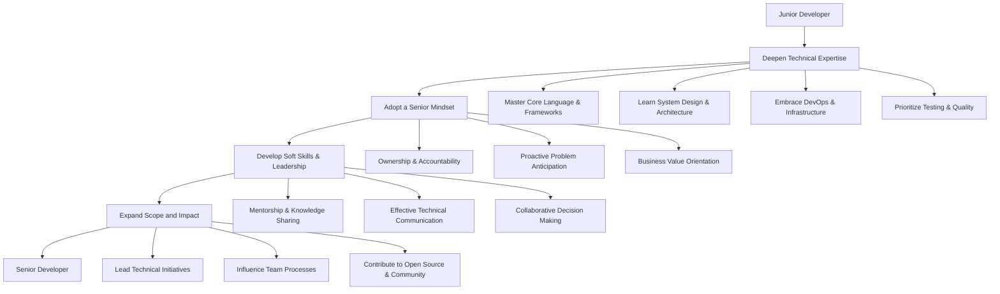

# A Step-by-Step Tutorial: Transitioning from Junior to Senior Developer

## 1. Introduction

The progression from a Junior Developer to a Senior Developer represents a significant career milestone. This transition is characterized not merely by an increase in years of experience, but by a fundamental shift in mindset, responsibility, and technical breadth. A Senior Developer is expected to operate with greater autonomy, mentor peers, architect robust solutions, and consider the broader business context of technical decisions.

This tutorial provides a structured, actionable roadmap designed to accelerate this professional evolution. The content is tailored for software engineers seeking to understand the specific competencies and behaviors that define senior-level performance.

### 1.1 The Junior-Senior Distinction

| Attribute | Junior Developer | Senior Developer |
| :--- | :--- | :--- |
| **Primary Focus** | Completing assigned tasks and tickets. | Solving business problems and delivering value. |
| **Code Perspective** | Writing code that works. | Writing code that is maintainable, scalable, and testable. |
| **Problem Solving** | Requires guidance to break down complex issues. | Independently decomposes ambiguous problems into actionable steps. |
| **Collaboration** | Receives feedback and direction. | Provides feedback, mentors others, and leads technical discussions. |
| **Scope of Impact** | Affects a single component or module. | Affects the entire system, team productivity, and project direction. |
| **Learning Source** | Learns from tutorials, documentation, and seniors. | Learns from system design, debugging complex issues, and mentoring others. |

### 1.2 High-Level Roadmap

The following diagram illustrates the key phases and focus areas involved in this career transition:

## 2. Step 1: Deepen Technical Expertise

The foundation of seniority is technical mastery that extends beyond writing functional code. A senior developer possesses deep knowledge of their primary tech stack and a broad understanding of adjacent technologies.

### 2.1 Mastery of Core Language and Frameworks

Moving beyond surface-level syntax to understanding the internals of the language and its runtime environment.

**Actionable Steps:**
- **Read the Language Specification**: Understand how the language is designed. For JavaScript, this means reading the ECMAScript specification; for Java, the JLS.
- **Explore Framework Internals**: Instead of just using a framework (e.g., React, Spring, Django), study its source code. Understand its lifecycle, rendering/reconciliation mechanisms, or dependency injection containers.
- **Understand Concurrency and Memory Models**: Learn how the language handles multi-threading, asynchronous operations, and memory management (garbage collection, stack vs. heap).
- **Become Proficient with Developer Tools**: Master debugging tools, profilers, and memory analyzers specific to your technology stack.

### 2.2 System Design and Architecture

The ability to design scalable, reliable, and maintainable systems is a hallmark of senior engineers.

**Actionable Steps:**
- **Study Foundational Concepts**: Gain proficiency in topics covered in dedicated system design resources (refer to Section 3.2 of the comprehensive learning guideline). Key areas include load balancing, caching, database sharding, message queues, and microservices.
- **Analyze Existing Architectures**: Examine the architecture of products you use daily (e.g., how does Uber match riders, how does Netflix stream video). Read engineering blogs from major tech companies.
- **Practice Designing Systems**: Regularly engage in system design exercises. Start with classic problems like designing a URL shortener, a chat application, or a social media news feed. Use a whiteboard or diagramming tool.
- **Understand Trade-offs**: Learn to articulate the pros and cons of different architectural decisions (e.g., SQL vs. NoSQL, monolithic vs. microservices). A senior engineer chooses the *appropriate* solution for the context, not the most trendy one.

### 2.3 Embrace DevOps and Infrastructure

Understanding how code is built, deployed, and operated in production is essential for end-to-end ownership.

**Actionable Steps:**
- **Learn Containerization**: Achieve proficiency with Docker. Understand how to create images, manage containers, and use Docker Compose for local development environments.
- **Understand CI/CD Pipelines**: Familiarize yourself with tools like GitHub Actions, GitLab CI, or Jenkins. Be able to write and maintain pipeline configurations for automated testing and deployment.
- **Explore Cloud Platforms**: Gain practical experience with at least one major cloud provider (AWS, Azure, GCP). Understand core services like compute instances (EC2), object storage (S3), and managed databases (RDS).
- **Learn Infrastructure as Code (IaC)**: Understand tools like Terraform or AWS CloudFormation for declaratively managing cloud resources.

### 2.4 Prioritize Testing and Code Quality

Senior developers are guardians of code quality and long-term maintainability.

**Actionable Steps:**
- **Write Different Types of Tests**: Go beyond simple unit tests. Learn to write effective integration tests, end-to-end tests, and performance tests.
- **Practice Test-Driven Development (TDD)**: Even if not adopted strictly, understanding the TDD cycle (Red-Green-Refactor) improves design and testability.
- **Lead by Example in Code Reviews**: When reviewing others' code, provide constructive, specific feedback focused on design patterns, readability, and potential edge cases.
- **Champion Coding Standards**: Advocate for and contribute to the team's style guides, linting rules, and code formatting standards.

## 3. Step 2: Adopt a Senior Mindset

Technical skills alone are insufficient. The mindset with which one approaches work fundamentally distinguishes senior contributors.

### 3.1 Ownership and Accountability

A senior developer acts as if they own the product, not just the code they write.

**Actionable Steps:**
- **Volunteer for Ambiguous Tasks**: Step up to investigate vague bug reports or unclear feature requests. Take the lead in clarifying requirements.
- **See Projects Through to Completion**: Ensure that your work is not just "code complete" but fully deployed, monitored, and documented.
- **Be On-Call and Learn from Incidents**: Volunteer for on-call rotations. Participate in post-mortems and blameless retrospectives to understand system failures and prevent recurrence.

### 3.2 Proactive Problem Anticipation

Senior developers foresee potential issues and address them before they become crises.

**Actionable Steps:**
- **Question Requirements**: When receiving a feature request, ask "Why?" Understand the underlying user need or business goal. Suggest simpler or more effective alternatives if they exist.
- **Identify Technical Debt**: Proactively point out areas of the codebase that are becoming difficult to maintain. Propose and lead refactoring efforts.
- **Plan for Failure**: When designing a feature, consider failure scenarios. What happens if the database is slow? What if an external API is down? Implement graceful degradation and fallback mechanisms.

### 3.3 Business Value Orientation

Understanding how technical work translates to business outcomes is crucial for strategic influence.

**Actionable Steps:**
- **Learn the Business Domain**: Take time to understand the company's business model, key metrics, and customer pain points.
- **Link Technical Work to Business Goals**: In status updates and planning meetings, articulate how a refactoring will improve developer velocity (saving cost/time) or how a performance improvement will increase user retention.
- **Communicate with Non-Technical Stakeholders**: Practice explaining complex technical concepts in simple, relatable terms.

## 4. Step 3: Develop Soft Skills and Leadership

Senior developers are technical leaders and force multipliers within their teams.

### 4.1 Mentorship and Knowledge Sharing

Elevating the skills of those around you is a core responsibility.

**Actionable Steps:**
- **Onboard New Team Members**: Volunteer to be the primary point of contact for new hires, helping them set up their environment and understand the codebase.
- **Pair Program Regularly**: Offer to pair with junior developers on challenging tasks. Use it as an opportunity to teach design principles and debugging techniques.
- **Write and Maintain Documentation**: Improve the team's onboarding guide, API documentation, and runbooks. A culture of good documentation reduces tribal knowledge.
- **Give Technical Presentations**: Present a lunch-and-learn session on a new technology, a design pattern, or a lesson learned from a recent project.

### 4.2 Effective Technical Communication

The ability to convey complex ideas clearly in writing and speech is non-negotiable.

**Actionable Steps:**
- **Write Clear Design Documents**: Before starting a major project, write a Request for Comments (RFC) or a technical design document. This forces clear thinking and invites collaboration.
- **Structure Code Reviews Thoughtfully**: Use a framework for code review comments (e.g., distinguish between nitpicks, suggestions, and blocking issues). Explain the "why" behind a suggestion.
- **Facilitate Productive Meetings**: Learn to lead technical discussions, keep conversations on track, and ensure all voices are heard.

### 4.3 Collaborative Decision Making

Senior developers know they are not always right. They value diverse perspectives and build consensus.

**Actionable Steps:**
- **Listen More Than You Speak**: In discussions, first seek to understand others' points of view before advocating for your own.
- **Disagree and Commit**: When a decision goes against your preference, support the team's direction fully.
- **Be Open to Feedback**: Actively solicit feedback on your code, your designs, and your communication style. Respond graciously and use it for growth.

## 5. Step 4: Expand Scope and Impact

To be recognized as a senior developer, your contributions must demonstrably extend beyond individual tasks.

### 5.1 Lead Technical Initiatives

Identify opportunities for improvement and drive them to completion.

**Actionable Steps:**
- **Propose and Lead a Refactoring**: Identify a painful part of the codebase and propose a plan to clean it up. Estimate the effort and benefits, and lead the implementation.
- **Champion a New Tool or Process**: If you see an opportunity to improve the development workflow (e.g., a new linter, a better CI script), advocate for it and manage the rollout.
- **Take Point on Cross-Team Collaboration**: Volunteer to be the technical liaison when your team's work needs to integrate with another team's systems.

### 5.2 Influence Team Processes and Culture

Shape how the team works to improve overall effectiveness and morale.

**Actionable Steps:**
- **Improve the Sprint Retrospective**: Go beyond generic comments. Propose concrete, actionable experiments to improve team velocity or happiness.
- **Refine the Hiring Process**: Participate in technical interviews. Provide feedback on how to make the interview process more effective and inclusive.
- **Cultivate a Culture of Psychological Safety**: Model vulnerability by admitting mistakes openly. Encourage questions and create an environment where it's safe to be wrong.

### 5.3 External Contributions and Visibility

Demonstrate expertise beyond the boundaries of your current employer.

**Actionable Steps:**
- **Contribute to Open Source**: Make meaningful contributions (even small ones) to open-source projects used by your team or the wider community. This demonstrates collaboration and real-world impact.
- **Write Technical Blog Posts**: Share your knowledge on a company blog or personal platform. Explain how you solved a tricky bug or implemented a new pattern.
- **Attend and Speak at Meetups/Conferences**: Participate in the local tech community. Presenting a topic solidifies your own understanding and builds a professional reputation.

## 6. Step 5: Navigating the Promotion and Interview Process

The final step is effectively demonstrating your senior-level capabilities.

### 6.1 Building a Case for Promotion

If seeking a promotion within your current organization:

- **Document Your Impact**: Maintain a "brag document" or a running list of your accomplishments, with specific metrics where possible (e.g., "Reduced API latency by 40%," "Mentored 3 junior engineers who are now independent contributors").
- **Align with Promotion Criteria**: Request a clear rubric for the senior role. Map your documented accomplishments to the specific criteria.
- **Proactively Discuss Growth**: In one-on-one meetings with your manager, explicitly discuss your goal of reaching the senior level and ask for feedback on gaps.

### 6.2 Preparing for Senior-Level Interviews

When interviewing externally for a senior role, expect a higher bar across all areas.

- **Coding Interviews**: Expect to solve harder algorithmic problems (LeetCode Medium/Hard) with an emphasis on clean, extensible code and strong communication.
- **System Design Interviews**: This is the most critical differentiator. You will be expected to lead a 45-60 minute discussion, designing a scalable system from scratch.
- **Behavioral Interviews**: Be prepared to answer questions about conflict resolution, project failures, mentoring, and influencing without authority. Use the **STAR method** (Situation, Task, Action, Result) to structure compelling stories.
- **Project Deep-Dive**: Be ready to discuss a complex project from your past in great technical detail, explaining your specific contributions and the architectural decisions made.

## 7. Conclusion

The journey from Junior to Senior Developer is a deliberate and multifaceted process of growth. It demands a shift from a task-oriented execution mindset to one of holistic problem-solving, technical leadership, and business awareness. By systematically strengthening technical expertise across the stack, cultivating a proactive and ownership-driven mindset, and honing communication and mentorship skills, a developer positions themselves for advancement. Consistent, focused effort across the steps outlined in this tutorial will not only prepare an individual for a senior title but, more importantly, equip them with the enduring skills and perspective required for a long and impactful career in software engineering.