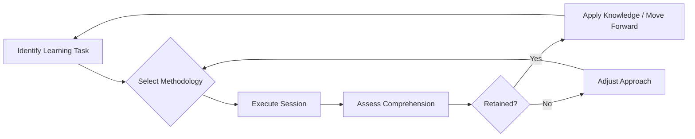

# Mastering the Art of Learning: A Foundational Skill for Software Developers

## 1. Introduction

In the rapidly evolving landscape of software engineering, technical proficiency in specific programming languages or frameworks is transient. The single most enduring and transferable skill that distinguishes consistently high-performing professionals is the ability to learn efficiently and effectively. This document examines the concept of **meta-learning**—learning how to learn—as a critical competency for career longevity and success in the field of computing.

The finite nature of time necessitates an optimized approach to knowledge acquisition. All individuals operate within the same temporal constraints, yet observable disparities exist in the output and adaptability of professionals. This variance is frequently attributable not to innate intellectual capacity, but to the deliberate cultivation of personalized, efficient learning methodologies.

## 2. The Imperative of Efficient Learning in Technology

### 2.1 The Finite Time Constraint

The human experience is bounded by a constant temporal framework. Each day comprises a fixed duration, commonly approximated as 24 hours. Recognizing this limitation underscores the importance of efficiency. If an individual can reduce the time required to comprehend a new concept or master a new tool, the cumulative advantage over the span of a career is substantial. This principle aligns with the concept of **compound growth**, where marginal gains in learning velocity yield exponential returns in knowledge capital over time.

### 2.2 The Continuous Evolution of Technology

Unlike static professional disciplines, software development is characterized by perpetual and accelerating change. Frameworks, libraries, architectural patterns, and even foundational languages undergo continuous iteration. Consequently, a developer's education does not conclude upon graduation or initial employment; it is a lifelong endeavor.

- **Technology Stack Obsolescence**: Skills relevant today may be deprecated within a decade.
- **Emergent Paradigms**: Developers must routinely assimilate new concepts such as serverless computing, edge functions, or novel AI integration patterns.

Therefore, the ability to onboard new information rapidly is not merely advantageous; it is essential for maintaining professional relevance and avoiding technical stagnation.

## 3. Intrapersonal Benchmarking and Self-Awareness

### 3.1 Internal Competition vs. External Comparison

A common pitfall in skill development is the tendency to benchmark progress against peers. Given the diversity in cognitive wiring, prior experience, and educational background, external comparison is an unreliable and often demotivating metric. The effective practitioner focuses on **intrapersonal benchmarking**: comparing today's performance against yesterday's capabilities.

The objective is to refine one's own process iteratively. The central question shifts from "Am I learning faster than Person X?" to "Am I learning faster and deeper than I did last month?"

### 3.2 Identification of Personal Learning Modalities

The concept of learning styles—visual, auditory, kinesthetic, and reading/writing—provides a useful framework for self-diagnosis. However, modern educational psychology suggests that while distinct preferences exist, rigid adherence to a single modality may be limiting. A more practical approach involves identifying the specific environmental and cognitive conditions that maximize individual retention and comprehension.

**Common Variables to Assess:**

| Variable | Considerations |
| :--- | :--- |
| **Pacing** | Can information be consumed at accelerated speeds (e.g., 1.5x–2x playback) without loss of nuance, or does optimal retention require pausing and reflection every 30–45 minutes? |
| **Modality Mix** | Does comprehension improve when text documentation supplements video instruction? Are diagrams and flowcharts essential for grokking abstract logic? |
| **Active vs. Passive** | Is passive listening sufficient, or is retention contingent upon active engagement such as note-taking, code-along exercises, or verbal explanation to a peer? |
| **Environment** | Is deep focus achieved in complete silence, with ambient noise, or through structured breaks using techniques like the Pomodoro Method? |

## 4. Strategies for Optimized Knowledge Acquisition

Developing a systematic approach to learning transforms an unconscious process into a deliberate, improvable skill.

### 4.1 Avoidance of Passive Consumption

A common inefficiency in modern technical education is **passive over-consumption**. Watching hours of video tutorials at high speed without active engagement creates an **illusion of competence**. The brain recognizes the content but fails to encode it for long-term retrieval or application.

**Active Learning Countermeasures:**
- **Implementation Pause**: After a discrete concept is explained, pause the instruction and attempt to implement it from memory.
- **Feynman Technique**: Attempt to explain the newly learned concept in simple, plain language as if teaching a novice. Gaps in explanation reveal gaps in understanding.
- **Spaced Repetition**: Revisit challenging concepts after intervals of 1 day, 3 days, and 1 week to strengthen neural pathways.

### 4.2 Iterative Refinement of Process

Treat the learning process itself as a system under development. Apply the principles of software engineering—**Build, Measure, Learn**—to personal education.

1.  **Build**: Design a study session with a specific hypothesis (e.g., "I will retain more if I write code after every 10 minutes of video").
2.  **Measure**: Assess the outcome. Was the concept applied successfully in a project a week later?
3.  **Learn**: Adjust the methodology based on the outcome. Discard inefficient habits and double down on effective tactics.

### 4.3 The Lifelong Application of Meta-Learning

The effort invested in refining one's learning methodology yields dividends across the entirety of a professional lifespan. The junior developer who learns *how* to learn effectively will navigate the mid-career shift to new technologies more gracefully than the senior developer who relies solely on outdated rote knowledge.

*Figure 1: A Feedback Loop for Continuous Improvement in Personal Learning Systems.*

## 5. Conclusion

Technical expertise in a specific programming language is a depreciating asset. The skill of **learning how to learn** is an appreciating asset. In an industry defined by relentless change, the most resilient and successful developers are those who have invested time in understanding their own cognitive processes. By shifting focus from external comparison to internal optimization, and by replacing passive consumption with active, iterative practice, an individual can compound their knowledge and effectiveness throughout their career. The journey begins not with mastering the latest framework, but with mastering the self.