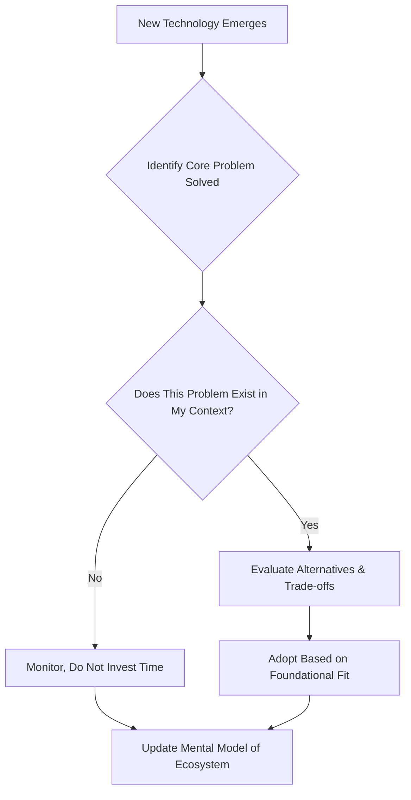

# The Importance of Foundational Knowledge and Strategic Learning in Software Development

## 1. Introduction

In the domain of software engineering, practitioners are confronted with a continuous influx of novel tools, frameworks, libraries, and paradigms. The velocity of change within the developer ecosystem often creates a reactive learning environment wherein individuals expend substantial effort to remain current with the latest technological trends. This document articulates a countervailing perspective: that enduring professional competence and career longevity are predicated not upon the mastery of ephemeral tools, but upon a deep comprehension of foundational computer science principles and the contextual rationale behind technological innovations.

The central thesis posits that by prioritizing an understanding of *why* a solution exists over *how* to merely operate it, developers transition from perpetual novices chasing trends to strategic practitioners capable of informed decision-making.

## 2. The Transience of Tools and Frameworks

### 2.1 The Cyclical Nature of Developer Tooling

The software development landscape is characterized by a high rate of churn. Tools, libraries, and build systems that command widespread attention and adoption today are frequently supplanted by superior or more fashionable alternatives within a compressed timeframe.

**Illustrative Example:**
A developer who invests exhaustive effort into mastering the intricate configuration nuances of a specific module bundler (e.g., Webpack) may find that specialized knowledge depreciates in market value as newer, zero-configuration alternatives (e.g., Vite, esbuild) gain prominence. While the tool itself may become legacy, the underlying concepts—dependency graph resolution, asset optimization, and code splitting—persist.

### 2.2 The Hamster Wheel Analogy

The perpetual pursuit of the "newest and shiniest" technology can be analogized to a **hamster running on a wheel**. The activity is constant and exhausting, yet the practitioner remains in a state of professional stasis, never achieving a position of strategic oversight. This mode of learning is reactive and characterized by:

- **High Cognitive Load**: Constant context switching between learning new APIs and syntax.
- **Low Knowledge Retention**: Surface-level familiarity that fades as tools become obsolete.
- **Dependency on External Direction**: Relying on industry hype to dictate learning priorities rather than internal engineering principles.

## 3. The Permanence of Foundational Principles

### 3.1 Core Computer Science Topics

In contrast to transient tooling, the corpus of fundamental computer science knowledge exhibits a high degree of stability and slow, evolutionary change. Mastery of these subjects provides an invariant core of understanding applicable across decades of technological shifts.

**Persistent Core Topics Include:**
- **Data Structures and Algorithms**: The efficiency characteristics (Big O notation) of algorithms and data organization methods remain unchanged regardless of programming language.
- **Operating Systems Concepts**: Process scheduling, memory management, and concurrency models form the bedrock of all application performance optimization.
- **Computer Networking**: The principles of the OSI model, TCP/IP protocol suite, and latency/bandwidth trade-offs are ageless.
- **Database Theory**: ACID properties, normalization, and indexing strategies underpin data persistence layers regardless of whether one uses SQL or NoSQL.
- **Software Design Principles**: Concepts such as Separation of Concerns, SOLID principles, and Design Patterns provide a vocabulary for constructing maintainable systems irrespective of framework.

### 3.2 The Evolution of Software Development Practices

While the specific implementation details of software development practices evolve, the underlying *problems* they address remain remarkably consistent. For instance:
- The need to manage **state** in a user interface has existed since the advent of graphical clients, addressed first by manual DOM manipulation, then by MVC frameworks, and later by reactive state management libraries.
- The need for **concurrency** has driven solutions from multi-threading to event loops and asynchronous coroutines.

Understanding the problem domain allows a developer to evaluate a new tool not as a magical black box, but as a specific trade-off in the solution space.

## 4. Adopting the Observer's Mindset: The Strategic Shift

### 4.1 From Participant to Observer

The transition from a junior to a senior mindset is largely defined by a shift in perspective. Instead of being *inside* the ecosystem, reacting to every new release, the effective professional positions themselves as an **observer of the ecosystem**.

This observer's mindset is characterized by the following behavioral shifts:

| Aspect | Hamster (Reactive Learner) | Observer (Strategic Learner) |
| :--- | :--- | :--- |
| **Primary Question** | "How do I use this new tool?" | "What problem does this tool solve?" |
| **Learning Focus** | Syntax and Configuration Files | Architecture and Conceptual Models |
| **Reaction to Change** | Stress and Fear of Missing Out (FOMO) | Curiosity and Pattern Recognition |
| **Career Trajectory** | Task Execution | System Design and Leadership |

### 4.2 The "Start With Why" Methodology

Before dedicating limited time and cognitive resources to a new technology, the following heuristic framework should be applied:

1.  **Identify the Genesis**: What specific friction or limitation in existing workflows prompted the creation of this solution?
2.  **Define the Problem Statement**: Articulate precisely what issue the tool addresses. Is it build performance? Developer experience? Bundle size optimization?
3.  **Evaluate Contextual Relevance**: Does this specific problem exist within the developer's current or anticipated project scope? If the problem is not present, the solution is likely an unnecessary abstraction.

**Diagram: Strategic Technology Evaluation Workflow**

*Figure 1: A high-level decision flow for managing exposure to new tools in the developer ecosystem.*

## 5. Implications for Career Development and Leadership

### 5.1 Characteristics of Senior and Lead Roles

The distinction between junior and senior personnel is rarely a function of typing speed or syntax memorization. It is a function of **vision and decision-making capacity**.

- **Big Picture Vision**: Senior developers and architects perceive the system as a whole. They understand how a change in one component affects the stability, scalability, and maintainability of the entire application portfolio.
- **Informed Decision Making**: Leaders do not select tools based on popularity metrics (e.g., GitHub stars). They select tools based on alignment with organizational constraints (team skill set, long-term maintenance burden, performance requirements).
- **Reduced Cognitive Debt**: By filtering out the noise of fleeting trends, the strategic developer preserves mental bandwidth for deep work and complex problem-solving.

### 5.2 Long-Term Career Sustainability

Pursuing a career strategy focused on foundational understanding over transient tool mastery leads to greater professional satisfaction and sustainability. The individual is no longer subjected to the Sisyphean task of re-learning the entire ecosystem every two years. Instead, they recognize new tools as incremental variations on well-understood themes. This perspective reduces burnout and cultivates a calm, analytical approach to the inevitable evolution of technology.

## 6. Conclusion

The software industry's fascination with novelty is a double-edged sword. While innovation drives progress, an uncalibrated response to new technologies results in wasted effort and professional anxiety. The path to becoming an effective, senior-level contributor lies in deliberately de-prioritizing the ephemeral "how" of specific tools in favor of the enduring "why" of underlying problems. By establishing a foundation in timeless computer science principles and adopting the cognitive stance of an ecosystem observer, a developer can navigate a long and productive career with clarity, confidence, and strategic foresight. Always start with the question: **Why?**